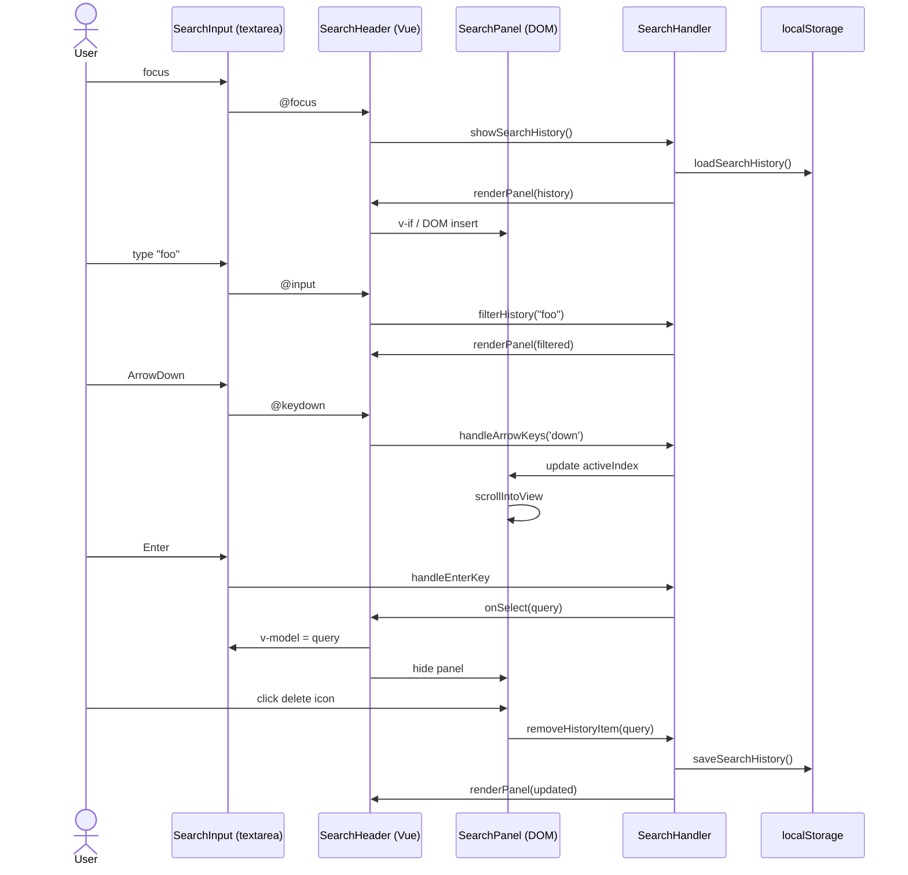

# 03-前端技术评审 — YiWeb-search-history-suggestions

## 架构设计

### 组件交互图



### 状态管理

| 状态 | 归属 | 类型 | 说明 |
|------|------|------|------|
| `searchHistory` | SearchHandler | `string[]` | 内存中的历史记录，上限 10 |
| `activeIndex` | SearchHandler | `number` | 当前键盘高亮索引，-1 表示无高亮 |
| `isPanelVisible` | SearchHeader | `Vue.ref(boolean)` | 面板显隐，受 focus / blur / Escape 控制 |
| `filteredHistory` | SearchHeader | `Vue.computed` | 根据输入过滤后的历史列表 |

### 接口契约

**SearchHandler 新增方法**

```javascript
// 渲染面板（由 SearchHeader 提供 DOM 容器）
showSearchHistory(containerEl, { onSelect, onDelete, onClear })

// 隐藏面板
hideSearchHistory()

// 键盘导航
handleArrowKeys(direction: 'up' | 'down')

// 从历史删除单条
removeHistoryItem(query: string)

// 清空全部
clearHistory()

// 根据输入过滤历史
filterHistory(query: string): string[]
```

## 关键实现决策

### D1: 面板渲染方式 — Vue 模板 vs DOM 操作

**决策**：使用 Vue 模板（template.html）渲染面板，SearchHandler 负责数据与键盘逻辑。

**理由**：
- SearchHeader 已是 Vue 组件，利用响应式系统自动处理 DOM 更新
- 避免在 SearchHandler 中裸 `document.createElement`，保持与组件体系一致
- 样式隔离在组件 CSS 中，避免全局污染

### D2: 搜索建议来源 — 仅历史 vs 历史+内容

**决策**：仅从历史记录过滤（客户端）。

**理由**：
- 当前无服务端搜索建议 API（源码确认）
- 历史记录已能覆盖大部分用户复搜场景
- 后续如需扩展，可在 `filterHistory` 中追加异步 API 调用

### D3: 样式方案 — 复用 theme.css 变量

**决策**：新增 `--search-panel-*` 系列变量到 theme.css，组件 CSS 引用。

新增变量：
```css
--search-panel-bg: var(--surface-elevated);
--search-panel-border: var(--border-default);
--search-panel-shadow: var(--shadow-lg);
--search-panel-item-hover: var(--surface-hover);
--search-panel-item-active: var(--primary-soft);
--search-panel-max-height: 320px;
```

## 安全考量

| 风险 | 措施 |
|------|------|
| XSS via 历史记录 | 历史项文本使用 Vue `{{ }}` 插值（默认 HTML 转义），禁止 `v-html` |
| localStorage 溢出 | 单条查询限制 2000 字符（与 textarea maxlength 一致），总数组上限 10 |
| 键盘事件冒泡 | 面板开启时阻止 `ArrowUp`/`ArrowDown` 继续冒泡到页面滚动 |

## 退化对策

| 场景 | 对策 |
|------|------|
| localStorage 不可用 | `safeGetItem` / `safeSetItem` 已包 try/catch；降级为仅内存历史 |
| 无历史记录 | 聚焦时不显示面板，保持现有行为 |
| 小屏幕（< 640px） | 面板宽度适配为 `calc(100vw - 2 * var(--space-md))`，最大宽度不变 |
| prefers-reduced-motion | 面板展开/收起动画禁用，直接切换显隐 |

## 文件变更详单

### cdn/utils/browser/events.js

- 补全 `handleArrowKeys`：更新 `activeIndex`，触发 `onActiveIndexChange` 回调
- 补全 `showSearchHistory`：接受容器与回调参数，渲染列表
- 补全 `hideSearchHistory`：清理 activeIndex，回调通知
- 新增 `removeHistoryItem` / `clearHistory` / `filterHistory`

### cdn/components/business/SearchHeader/index.js

- setup 中初始化 `SearchHandler` 实例
- 新增 `isPanelVisible`、`filteredHistory`、`activeIndex` 响应式状态
- 新增面板操作方法：`showPanel`、`hidePanel`、`onPanelSelect`、`onPanelDelete`、`onPanelClear`
- 在 `handleFocus`、`handleBlur`、`handleKeydown`、`handleInput` 中集成面板逻辑

### cdn/components/business/SearchHeader/template.html

- search-box 下方新增 `.search-panel` 结构：
  - `role="listbox"`、`aria-expanded`
  - 历史项列表 `.search-panel-item`：`role="option"`、`:aria-selected`
  - 每项含查询文本 + 删除按钮
  - 空态提示 `.search-panel-empty`
  - 底部 `.search-panel-footer` 含「清空全部」

### cdn/components/business/SearchHeader/index.css

- `.search-panel`：绝对定位、圆角、阴影、最大高度、滚动条
- `.search-panel-item`：flex 布局、hover/active 状态
- `.search-panel-delete`：仅在 hover 时显示，避免误触
- 暗色模式媒体查询适配

### cdn/styles/theme.css

- 追加 `--search-panel-*` 变量（见 D3）
