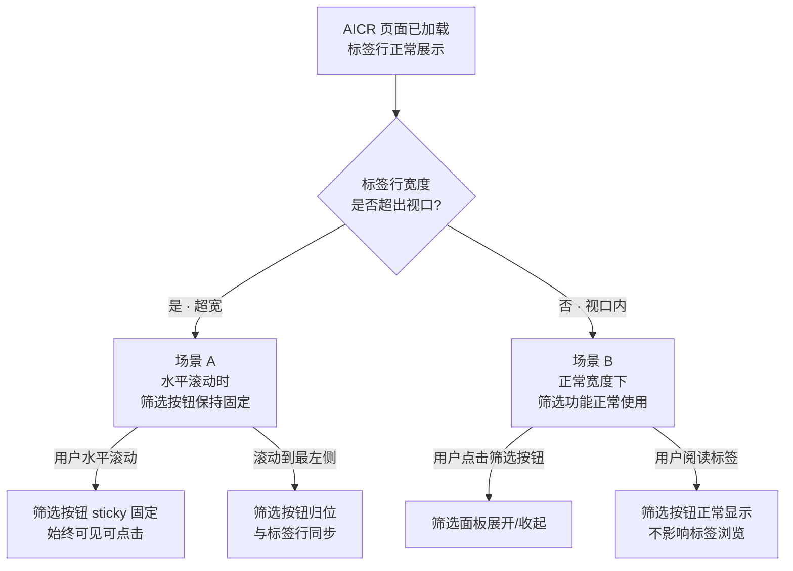
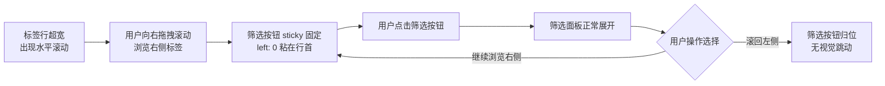
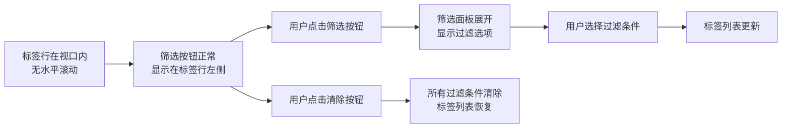

> | v1.0.0 | 2026-05-24 | auto | feat/story-local-data | 73f7839 | [CLAUDE.md](../../../CLAUDE.md) |

> **导航**: [← YiWeb-故事任务](./YiWeb-故事任务.md) · [YiWeb-技术评审 →](./YiWeb-技术评审.md)

> **来源引用**: 基于 [YiWeb-故事任务](./YiWeb-故事任务.md) §1 Story 1 用户操作定义生成，证据等级 B。溯源至 §1.1 User Operations #1, #2。

### 主要价值

- 筛选按钮在水平滚动时始终可见，用户无需滚回左侧即可操作筛选
- 消除筛选入口在超宽标签行中的定位焦虑，提升导航效率
- 纯 CSS 修改方案，不影响现有 JavaScript 逻辑和交互行为
- 在不支持 sticky 的旧浏览器中优雅退化，核心筛选功能不受影响

---

## §0 基线声明

> **用户空间基线 (User Space Baseline)**: 本文档定义"谁使用(WHO)"和"如何体验(HOW EXPERIENCE)"。所有交互设计(技术评审)、测试用例(测试设计)、验收标准(故事任务 §5)均必须覆盖本文档定义的每个场景。

---

## §1 场景全景

---

## §2 场景详述

### 场景 A: 标签行水平滚动时筛选按钮保持固定

| 角色 | 触发条件 | 核心目标 |
|------|---------|---------|
| AICR 用户 | 标签行包含超出视口宽度的标签，用户水平滚动标签行 | 筛选按钮不随标签滚动，始终固定在左侧可见可点击 |

| # | 步骤 | 输入 | 系统响应 | 异常分支 |
|---|------|------|---------|---------|
| 1 | 用户向右水平滚动标签行 | 鼠标拖拽 / 触控板横向滑动 | 标签内容向左滚动；`.aicr-meta-filter-actions` 因 `position: sticky; left: 0` 固定在标签行可视区域左侧，不随标签滚动 | 浏览器不支持 CSS `position: sticky` → 筛选按钮随标签一起滚动（退化行为） |
| 2 | 滚动过程中点击筛选按钮 | 鼠标点击或键盘触发 `.aicr-meta-filter-toggle` | 筛选按钮因 `z-index: 3`（高于 fade 遮罩层 z-index: 2）始终可交互，筛选面板正常展开 | 筛选按钮被其他元素遮挡 → z-index 层级未生效，需检查父容器是否创建了新的层叠上下文 |
| 3 | 标签行滚回最左侧 | 鼠标拖拽 / 触控板向左滑动 | 筛选按钮回到标签行的自然起始位置，因 `background: var(--yi-bg)` 遮盖后方标签内容，无内容透出 | 背景色变量 `--yi-bg` 未定义 → 筛选按钮区域透明，后方滚动标签可见（视觉干扰） |
| 4 | 极宽标签行持续滚动 | 持续拖拽滚动条 | 筛选按钮始终固定在左侧，`padding-right: 8px` + `margin-right: 2px` 与右侧标签保持视觉间距 | 间距不足 → 筛选按钮与第一个标签视觉粘连 |

### 场景 B: 标签行正常宽度下使用筛选功能

| 角色 | 触发条件 | 核心目标 |
|------|---------|---------|
| AICR 用户 | 标签行宽度在视口范围内，无水平滚动条 | 筛选按钮正常显示在标签行左侧，筛选功能正常可用 |

| # | 步骤 | 输入 | 系统响应 | 异常分支 |
|---|------|------|---------|---------|
| 1 | 页面加载，标签行宽度在视口内 | 页面初始渲染 | `.aicr-meta-filter-actions` 作为 `inline-flex` 元素排在标签行首位，与后续标签间距 8px（padding-right）+ 2px（margin-right） | sticky 定位在无滚动场景下表现同 `static`，无额外副作用 |
| 2 | 用户点击筛选按钮 | 鼠标点击 | `.aicr-meta-filter-toggle` 触发筛选面板展开/收起切换；按钮悬停时边框变为主色，背景微变 | 点击事件被 sticky 定位影响 → sticky 不影响 pointer-events，点击正常 |
| 3 | 用户点击清除按钮 | 鼠标点击 `.aicr-meta-filter-clear` | 所有已选过滤条件清除，标签列表恢复未过滤状态；悬停时按钮变红 | 清除后标签行宽度变化 → 如果新标签行仍不超宽，场景 B 继续；如果超宽则进入场景 A |

---

## §3 场景覆盖矩阵

| 场景 | FP# | AC# | 实现文档(技术评审) | 测试文档(测试设计) | 覆盖状态 | 备注 |
|------|-----|-----|-------------------|-------------------|---------|------|
| A 水平滚动时筛选按钮固定 | FP1 | AC1 | YiWeb-技术评审 §5 | YiWeb-测试设计 §2.1 | 待验证 | 核心价值场景 |
| B 正常宽度下筛选功能 | FP1 | — | YiWeb-技术评审 §5 | YiWeb-测试设计 §2.1 | 待验证 | 退化/兼容性保障 |

---

## §4 评审清单

| # | 检查项 | 状态 |
|---|--------|------|
| 1 | 场景数量 >= 2 | ✅ 2 个场景 |
| 2 | 每场景有流程图 | ✅ 每个场景含 mermaid flowchart |
| 3 | FP 全覆盖（FP1） | ✅ FP1 在场景 A 和 B 中均覆盖 |
| 4 | 异常分支明确 | ✅ 每场景含异常分支列 |
| 5 | 无技术术语 | ✅ 已审查（sticky 为 CSS 通用术语，用户可理解） |
| 6 | 每场景含空状态与错误恢复 | ✅ 本故事无空状态/错误态场景（纯 UI 定位变更） |
| 7 | 覆盖矩阵下游文档齐全 | ✅ 技术评审 + 测试设计已映射 |

---

## §5 体验基线

| 角色 | 核心旅程 | 情感目标 | 痛点解决 | 成功感知 | 关联场景 |
|------|---------|---------|---------|---------|---------|
| AICR 用户 | 打开 AICR 页面 → 标签行超宽 → 水平滚动 → 筛选按钮始终可见 | 感到掌控、不迷失 | 原先筛选按钮随标签滚走，用户需滚回最左侧才能筛选；现在按钮固定可见 | 水平滚动浏览标签时，筛选按钮始终在左侧，随时可点击 | A |
| AICR 用户 | 打开 AICR 页面 → 标签行正常 → 点击筛选按钮 → 过滤标签 | 感到便捷、无干扰 | 原先 sticky 未实现时筛选按钮是普通 inline 元素，无差异化体验；现在位置固定、视觉层级明确 | 筛选按钮排布自然，按钮与标签间距清晰，点击响应正常 | B |

---

| 日期 | 变更 | 触发 | 证据 |
|------|------|------|------|
| 2026-05-24 | 初始生成 — 基于 YiWeb-故事任务 §1 Story 1 + §1.1 User Operations | `/rui code aicr-filter-sticky` 创建基线文档 | YiWeb-故事任务.md §1.1 用户操作定义 |
