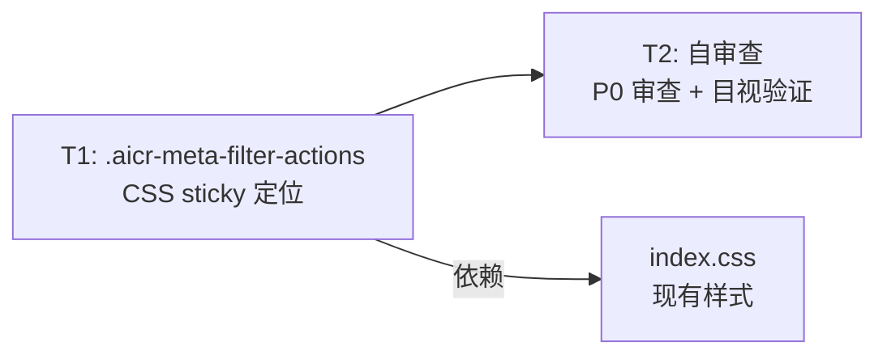
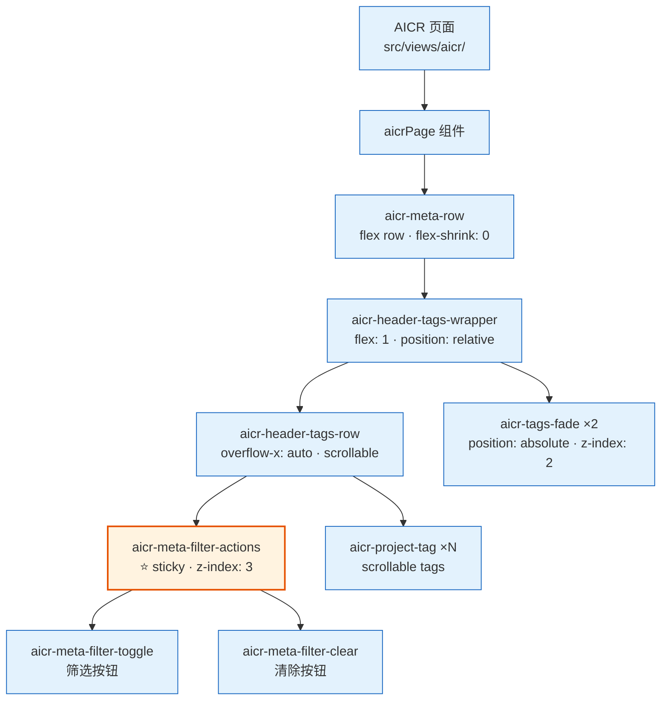
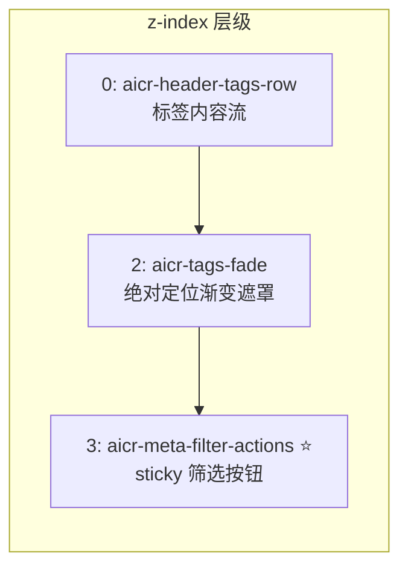
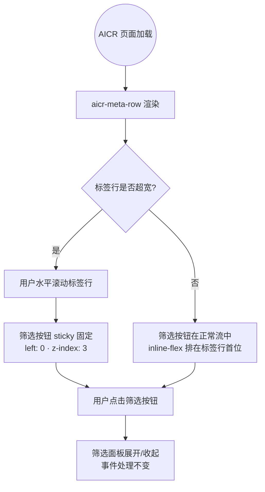

> | v1.0.0 | 2026-05-24 | auto | feat/story-local-data | 73f7839 | [CLAUDE.md](../../../CLAUDE.md) |

> **导航**: [← YiWeb-使用场景](./YiWeb-使用场景.md) · [YiWeb-测试设计 →](./YiWeb-测试设计.md) · [YiWeb-安全审计 →](./YiWeb-安全审计.md)

> **来源引用**: 基于 [YiWeb-故事任务](./YiWeb-故事任务.md) §2 FP1 和 [YiWeb-使用场景](./YiWeb-使用场景.md) §2 场景 A–B 进行技术设计。
>
> **项目类型**: 前端 — 跳过 §2 API 接口、§3 数据模型，后端性能章节合并入 §8。

### 主要价值

- 梳理 `.aicr-meta-filter-actions` 的 sticky 定位层级关系与层叠上下文
- 明确 CSS 属性变更清单：position / left / z-index / background / padding-right / margin-right
- 定义 sticky 定位的父容器依赖与退化行为

---

## §0 设计决策与任务规划

### §0.0 基线溯源

| 本设计章节 | 实现 YiWeb-故事任务 | 服务 YiWeb-使用场景 | 覆盖状态 |
|-----------|-------------------|-------------------|---------|
| §1 系统架构 | FP1 | 场景 A, B | 已覆盖 |
| §5 交互与样式 | FP1 | 场景 A, B | 已覆盖 |
| §6 DOM·事件·依赖 | FP1 | 场景 A | 已覆盖 |
| §7 安全约束 | FP1 | 场景 A, B | 已覆盖 |
| §8 性能与限制 | FP1 | 场景 A, B | 已覆盖 |

### §0.1 设计决策

| 决策领域 | 选定方案 | 选择理由 | 详见 | 实现 FP# |
|---------|---------|---------|------|---------|
| 定位策略 | `position: sticky; left: 0` | 元素在父容器滚动到指定偏移时固定，之前保持正常流位置；是 CSS 原生能力，无需 JS | §5 | FP1 |
| 层级覆盖 | `z-index: 3` | `.aicr-tags-fade` 的 z-index 为 2，筛选按钮需高于 fade 遮罩层才能保持可交互 | §5.1 | FP1 |
| 背景填充 | `background: var(--yi-bg)` | 防止后方滚动标签内容透过 sticky 元素可见；使用项目 CSS 变量保持主题一致性 | §5.1 | FP1 |
| 右侧间距 | `padding-right: 8px; margin-right: 2px` | padding 提供正常间距，margin 提供微调；合计 10px 视觉间距与标签行 gap: 6px 协调 | §5.1 | FP1 |
| 退化策略 | 浏览器原生退化 | 不支持 `position: sticky` 的浏览器自动退化为 static 定位，筛选按钮仍在标签行首位，功能可用 | §8 | FP1 |

### §0.2 任务规划

| ID | 描述 | 工作量 | 依赖 | 交付物 | Agent | 门禁 | 交接下游 | 实现 FP# |
|----|------|--------|------|--------|-------|------|---------|---------|
| T1 | .aicr-meta-filter-actions 新增 sticky 定位 + z-index + background + padding-right | XS | 无（纯 CSS 追加） | `src/views/aicr/components/aicrPage/index.css` | coder | P0 审查 | T2 | FP1 |
| T2 | 自审查：目视验证水平滚动 + DevTools 层级检查 | XS | T1 | — | coder | P0 清零 | tester | FP1 |

---

## §1 系统架构

### 效果示意

**层叠上下文（Z 轴）**:

### 1.1 服务/进程

| 变更类型 | 模块/文件 | 职责 |
|---------|----------|------|
| 修改 | `src/views/aicr/components/aicrPage/index.css` | `.aicr-meta-filter-actions` 新增 sticky 定位及相关属性 |

### 1.2 组件树

> 本故事不涉及组件树变更。`.aicr-meta-filter-actions` 是 `aicrPage` 组件模板中的静态 `
` 元素，不是独立组件。

### 1.3 通信通道

> 本故事不涉及通信通道变更。筛选按钮的点击事件处理逻辑（`aicrPage/index.js` 中已有）不变。

---

## §4 组件与状态

### 4.1 组件接口

> 本故事不新增组件，不修改现有组件接口。`.aicr-meta-filter-actions` 是 HTML 模板中的静态元素，其子元素 `.aicr-meta-filter-toggle` 和 `.aicr-meta-filter-clear` 的事件处理保持不变。

### 4.2 状态定义

> 本故事不涉及状态变更。sticky 定位是纯 CSS 行为，不依赖 JavaScript 状态。

### 4.3 状态流向

> 无状态流向变更。

---

## §5 交互与样式

### 5.1 用户操作流

### 5.2 视图状态矩阵

| 视图 | 正常 | 滚动中 | 退化（不支持 sticky） |
|------|------|--------|---------------------|
| 筛选按钮 | 标签行首位正常显示，inline-flex 布局 | sticky 固定在左侧，背景遮盖后方滚动标签，高于 fade 遮罩层 | 随标签一起滚动（等同于变更前的行为） |

### 5.3 动画

> 本故事不涉及动画。sticky 定位由浏览器原生实现，定位切换无过渡动画。

### 5.4 样式策略

| 场景 | 方案 | 说明 |
|------|------|------|
| 水平固定 | `position: sticky; left: 0` | 相对最近的滚动祖先 `.aicr-header-tags-row`（overflow-x: auto）在左边缘固定 |
| 层级覆盖 | `z-index: 3` | 高于 .aicr-tags-fade (z-index: 2) 的绝对定位渐变遮罩 |
| 背景遮罩 | `background: var(--yi-bg)` | 使用项目全局背景色变量，防止后方滚动标签内容透出 |
| 间距 | `padding-right: 8px; margin-right: 2px` | 合计 10px 视觉间距，与标签行 `gap: 6px` 协调 |

**CSS 属性变更清单**:

| 属性 | 变更前 | 变更后 | 说明 |
|------|--------|--------|------|
| `position` | (未设置，默认 static) | `sticky` | 粘性定位 |
| `left` | (未设置) | `0` | 粘在滚动容器左边缘 |
| `z-index` | (未设置，默认 auto) | `3` | 高于 fade 遮罩层 |
| `background` | (未设置，默认 transparent) | `var(--yi-bg)` | 防止内容透出 |
| `padding-right` | (未设置，默认 0) | `8px` | 与右侧标签间距 |
| `margin-right` | (未设置，默认 0) | `2px` | 额外微调间距 |

**保持不变**:

| 属性 | 值 |
|------|-----|
| `display` | `inline-flex` |
| `align-items` | `center` |
| `gap` | `0` |
| `flex-shrink` | `0` |

**Sticky 定位依赖关系**:

| 依赖元素 | 角色 | 关键属性 |
|---------|------|---------|
| `.aicr-header-tags-row` | 滚动容器（sticky 的最近滚动祖先） | `overflow-x: auto` · `display: flex` |
| `.aicr-header-tags-wrapper` | 相对定位容器（fade 遮罩的定位参考） | `position: relative` |
| `.aicr-meta-row` | 标签行的父容器 | `flex-shrink: 0` · `border-bottom` |

### 5.5 布局规范

> 本故事不涉及布局规范变更。`.aicr-meta-filter-actions` 在标签行中的自然位置不变，仅在其滚动祖先中增加了 sticky 吸附行为。

---

## §6 DOM·事件·依赖

### 6.1 挂载点

> 无变更。`.aicr-meta-filter-actions` 是 `aicrPage/index.html` 中的静态元素，由 Vue 模板渲染，挂载点不变。

### 6.2 事件

> 无事件监听变更。筛选按钮的点击事件处理保持不变。

### 6.3 加载顺序

| 新增文件 | 插入位置 | 依赖上游 |
|---------|---------|---------|
| (无新增文件) | — | — |

> 本故事仅修改 `aicrPage/index.css`，不改变加载顺序。CSS 由 componentLoader 按现有机制动态注入。

### 6.4 命名空间

> 无命名空间变更。`.aicr-meta-filter-actions` 是现有 CSS 类名。

---

## §7 安全约束

| # | 威胁 | 信任边界 | 缓解措施 | 优先级 |
|---|------|---------|---------|--------|
| 1 | CSS 注入修改 sticky 定位导致筛选按钮遮挡关键内容 | 外部样式表 / 浏览器扩展注入 | CSS 特异性由现有选择器控制；sticky 元素不脱离文档流，不影响其他元素布局计算 | P2 |
| 2 | `z-index: 3` 与未来引入的高层级组件冲突 | 全局 z-index 命名空间 | 3 是当前项目中高于所有已知层级（最高 z-index 为 2）的最小可用值；未来新增组件应审查 z-index 范围 | P2 |

> CSS sticky 定位为纯表现层变更，不引入新的安全攻击面。详见 [YiWeb-安全审计](./YiWeb-安全审计.md)。

---

## §8 性能与限制

| 维度 | 约束 | 应对 |
|------|------|------|
| 渲染性能 | sticky 定位由浏览器 GPU 合成层处理 | 现代浏览器对 sticky 有硬件加速支持；不触发 layout thrashing |
| 重绘触发 | 水平滚动触发 sticky 元素重绘 | sticky 元素固定在视口内，浏览器仅重绘标签内容区域；筛选按钮区域无需重绘 |
| 兼容性 | `position: sticky` 在旧浏览器不支持 | caniuse 数据显示全球覆盖率 > 96%；不支持时退化为 static，功能不受影响 |
| 布局影响 | sticky 元素保留其在正常流中的空间 | `left: 0` 限制仅在 overflow 祖先中生效；正常流中与其他 inline-flex 元素并列，不影响标签行宽度计算 |
| 限制 | sticky 定位的有效范围受父容器 `overflow` 属性约束 | 已审查 `.aicr-header-tags-row` 具有 `overflow-x: auto`，`.aicr-meta-row` 无 `overflow: hidden`，sticky 可正常工作 |

---

## §9 评审清单

| # | 检查项 | 状态 |
|---|--------|------|
| 1 | 组件命名空间独立 | ✅ 不涉及新命名空间 |
| 2 | 状态变更走 store | ✅ 无状态变更 |
| 3 | 样式隔离（BEM 前缀 + 组件级 CSS） | ✅ 使用现有 `aicr-` 前缀，CSS 由组件加载器按需注入 |
| 4 | 事件监听在 beforeUnmount 清理 | ✅ 无新增事件监听 |
| 5 | 加载顺序正确 | ✅ 无新增文件，加载顺序不变 |
| 6 | 基线溯源完备 | ✅ §0.0 全部映射 |
| 7 | 效果示意完整 | ✅ §1 含 mermaid 全景图 + z-index 层级图 |
| 8 | 裁剪正确（前端跳过 §2 API, §3 数据模型） | ✅ |
| 9 | 无硬编码密钥 | ✅ 纯 CSS 变更 |
| 10 | 输入校验完整 | ✅ 不涉及用户输入 |

---

| 日期 | 变更 | 触发 | 证据 |
|------|------|------|------|
| 2026-05-24 | 初始生成 — 基于 YiWeb-故事任务 §2 FP1 + 实际 CSS 实现 | `/rui code aicr-filter-sticky` 创建基线文档 | `src/views/aicr/components/aicrPage/index.css` `.aicr-meta-filter-actions` 实际样式 |
