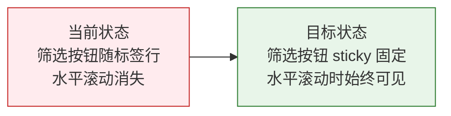

# YiWeb 故事任务 — aicr-filter-sticky

> | v1 | 2026-05-23 | auto | feat/aicr-filter-sticky | -- | [CLAUDE.md](../../../CLAUDE.md) |

> **导航**: [YiWeb-使用场景 →](./YiWeb-使用场景.md)

### 元信息

| 字段 | 值 |
|------|-----|
| 项目 | YiWeb |
| 故事名称 | aicr-filter-sticky |
| 优先级 | P1 |
| 版本 | 1.0.0 |
| 类型 | frontend |

### 需求概述

AICR 页面的筛选按钮在标签行水平滚动时会随标签一起滚走。需要将筛选按钮固定在标签行左侧，使其在水平滚动时保持可见。

### 效果示意

### 主要价值

- 🎯 筛选按钮始终可见，用户无需滚回左侧即可操作筛选
- 🔍 明确筛选入口位置，提升导航效率
- ✅ 纯 CSS 修改，零风险，不影响现有功能
- ⌨️ 改善键盘和鼠标操作的可达性

---

## §0 基线声明

> **问题空间基线 (Problem Space Baseline)**: 本文档定义"做什么(WHAT)"和"为什么(WHY)"。所有后续文档(03-09)的设计、实现、验证、改进决策均必须可追溯至本文档的具体章节。

---

## §1 Story

### Story 1: 筛选按钮 sticky 定位

| 字段 | 内容 |
|------|------|
| 作为 | AICR 用户 |
| 我想要 | 筛选按钮在标签行水平滚动时固定在左侧 |
| 以便 | 无论滚动到哪个标签位置都能快速点击筛选 |
| 优先级 | P1 |
| 范围边界 | 仅修改 aicrPage/index.css 中 .aicr-meta-filter-actions 的定位样式 |
| 依赖 | 浏览器支持 CSS position: sticky |

#### 范围外

- 不涉及 JavaScript 逻辑修改
- 不涉及其他组件或页面的样式变更
- 不修改标签行的水平滚动行为

##### §1.1 User Operations

| # | 操作 | 触发条件 | 操作步骤 | 预期结果 |
|---|------|---------|---------|---------|
| 1 | 水平滚动标签行 | 标签行包含超出视口宽度的标签 | 用户水平滚动标签行 | 筛选按钮保持固定在左侧可见，不被滚走 |
| 2 | 正常使用筛选功能 | 标签宽度在视口范围内 | 用户无需滚动，直接点击筛选按钮 | 筛选按钮正常显示在标签行左侧，功能不受影响 |

---

## §2 Requirements

### 功能点

| FP# | 描述 | 输入 | 输出 | 错误行为 | 优先级 |
|-----|------|------|------|---------|--------|
| FP1 | .aicr-meta-filter-actions 使用 sticky 定位固定在标签行左侧 | CSS `position: sticky; left: 0` | 水平滚动时筛选按钮保持在可视区域左侧 | 不支持 sticky 的旧浏览器退化为静态定位，功能仍可用 | P1 |

### 业务规则

| R# | 描述 | 校验方式 | 证据级别 |
|----|------|---------|---------|
| R1 | 筛选按钮 sticky 定位基准为 left: 0，相对标签行容器左侧固定 | 目视检查 + DevTools 审查 | B |
| R2 | 筛选按钮 z-index 须高于 fade 遮罩层（z-index: 2），防止被遮挡 | DevTools 层级审查 | B |
| R3 | 筛选按钮需设置背景色覆盖后方滚动标签，防止内容透出 | 目视检查水平滚动时的渲染效果 | B |
| R4 | 筛选按钮右侧需保留间距与标签区分，padding-right: 8px | 目视检查筛选按钮与右侧标签的间距 | B |

### 数据约束

| 约束 | 类型 | 范围/格式 | 来源 |
|------|------|----------|------|
| CSS position | string | `sticky` | CSS 规范 |
| left 偏移 | CSS length | `0` | 交互设计 |
| z-index | integer | `3`（高于 fade 遮罩层 z-index: 2） | 层级规范 |
| background | CSS color | `var(--yi-bg)` | 项目 CSS 变量 |
| padding-right | CSS length | `8px` | 间距规范 |
| 目标选择器 | CSS selector | `.aicr-meta-filter-actions` | 现有 DOM 结构 |

---

## §3 成功标准

| SC# | 描述 | 度量方式 | 目标值 | 优先级 | 关联 FP# |
|-----|------|---------|--------|--------|---------|
| SC1 | 标签行水平滚动时筛选按钮始终固定在左侧可见 | 目视检查：拖拽标签行水平滚动条 | 筛选按钮不随标签内容滚动 | P1 | FP1 |
| SC2 | 筛选按钮不被后方滚动标签内容透出 | 目视检查：滚动时筛选按钮区域无重叠内容 | 筛选按钮区域完全遮盖后方标签 | P1 | FP1 |
| SC3 | 筛选按钮不被 fade 遮罩层覆盖 | 目视检查：筛选按钮在遮罩层之上可见 | 筛选按钮可正常点击交互 | P1 | FP1 |

---

## §4 范围边界

### 范围内

| # | 条目 | 关联 FP# | 边界说明 |
|---|------|---------|---------|
| 1 | .aicr-meta-filter-actions 新增 sticky 定位 | FP1 | 水平滚动时固定在标签行左侧 |
| 2 | 新增 z-index: 3 覆盖 fade 遮罩层 | FP1 | 确保筛选按钮在最上层可交互 |
| 3 | 新增背景色防止后方标签透出 | FP1 | 设置 `background: var(--yi-bg)` |
| 4 | 新增右侧内边距与标签区分 | FP1 | `padding-right: 8px` |

### 范围外

| # | 条目 | 排除原因 | 替代方案 |
|---|------|---------|---------|
| 1 | JavaScript 逻辑修改 | 纯 CSS 方案即可满足需求 | — |
| 2 | 其他组件样式变更 | 影响范围仅限筛选按钮 | — |
| 3 | 标签行滚动条行为修改 | 滚动行为不变，仅固定筛选按钮 | — |
| 4 | 移动端适配 | 当前目标设备为桌面端 | 后续按需补充 |

---

## §5 AC

| AC# | Given | When | Then | 门禁 |
|-----|-------|------|------|------|
| AC1 | 标签行包含超出视口宽度的标签 | 用户水平滚动标签行 | 筛选按钮保持固定在左侧可见 | Gate A |

---

## §6 风险与假设

| # | 风险/假设 | 类型 | 可能性 | 影响 | 缓解/验证策略 | 关联 FP# |
|---|----------|------|--------|------|-------------|---------|
| 1 | 旧浏览器不支持 CSS position: sticky | 风险 | L | L | 不支持时退化为静态定位，筛选按钮仍可正常使用，仅不固定 | FP1 |
| 2 | z-index: 3 与现有或未来引入的层级冲突 | 风险 | L | L | 项目中当前最大 z-index 为 2（fade 遮罩），3 已留有空间 | FP1 |
| 3 | CSS 变量 `--yi-bg` 在特定主题下透出效果不佳 | 风险 | L | L | 如发现问题可替换为具体色值 | FP1 |
| 4 | 用户浏览器支持 CSS position: sticky | 假设 | — | — | caniuse 数据显示主流浏览器均支持 | FP1 |
| 5 | .aicr-meta-filter-actions 的父容器具备 overflow 属性但不影响 sticky | 假设 | — | — | DevTools 审查确认父容器无 `overflow: hidden` | FP1 |

---

## §7 跨文档索引

| 本文档章节 | 基线内容 | 下游文档编号 | 预期覆盖 | 状态 |
|-----------|---------|-------------|---------|------|
| §1 Story 1 | 筛选按钮 sticky 定位用户故事 | YiWeb-使用场景 | 筛选按钮固定的用户旅程 | 待对齐 |
| §1 Story 1 | 筛选按钮 sticky 定位用户故事 | YiWeb-技术评审 | CSS sticky 实现方案评审 | 待对齐 |
| §2 FP1 | 功能点清单 | YiWeb-测试设计 | CSS 样式验证测试用例 | 待对齐 |
| §3 SC1–SC3 | 成功标准 | YiWeb-实施报告 | 每项成功标准的达成验证 | 待对齐 |
| §3 SC1–SC3 | 成功标准 | YiWeb-测试报告 | 目视检查与 DevTools 验证结果 | 待对齐 |
| §5 AC1 | 验收标准 | YiWeb-测试设计 | AC1 映射到具体测试用例 | 待对齐 |
| §5 AC1 | 验收标准 | YiWeb-测试报告 | AC1 的执行结果 | 待对齐 |
| §6 R1–R5 | 风险与假设 | YiWeb-自改进复盘 | 风险实际触发情况与缓解效果 | 待对齐 |

---

## §R 关联故事

| 关联故事 | 关系类型 | 说明 |
|---------|---------|------|
| enhance-search-filter | 互补 | AICR 搜索过滤增强；筛选按钮 sticky 确保过滤入口始终可达 |
| rui-story | 上游 | 故事面板为基础能力上游 |

---

## §L 自改进循环

> 待首次管线执行完成后追加。

---

### 实施备注

修改 `/src/views/aicr/components/aicrPage/index.css` 中 `.aicr-meta-filter-actions`：

- 新增 `position: sticky; left: 0;` — 水平滚动时粘在左侧
- 新增 `z-index: 3;` — 覆盖 fade 遮罩层 (z-index: 2)
- 新增 `background: var(--yi-bg);` — 防止后方标签透出
- 新增 `padding-right: 8px;` — 与右侧标签保持间距

---

| 日期 | 变更 | 触发 | 证据 |
|------|------|------|------|
| 2026-05-23 | 初始生成 | aicr-filter-sticky 需求提出 | AICR 页面标签行水平滚动交互问题 |
| 2026-05-24 | 文档标准化 — 补充 §0–§7、§R、§L 自改进循环等标准章节 | formulas.md 标准对齐 | formulas.md + rui-story 模板 |
