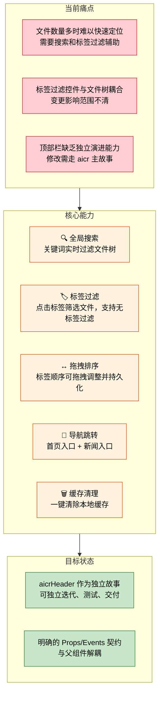
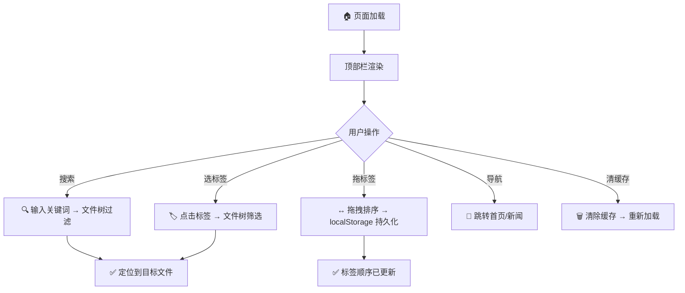

> | v1 | 2026-05-19 | deepseek-v4-pro | 🌿 feat/aicr-header | ⏱️ --:--–--:-- | 📎 [CLAUDE.md](../../../CLAUDE.md) |

> **导航**: [YiWeb-02-用户使用场景 →](./YiWeb-02-用户使用场景.md)

> **来源引用**: 本文档由 `/rui aicrHeader 应该单独拆成一个故事目录` 触发，从 aicr 主故事 `YiWeb-组件架构.md` §7 和 `src/views/aicr/components/aicrHeader/` 源码拆分生成。证据等级 B（可推导，附源码路径）。

---

### §0 基线声明

> **问题空间基线 (Problem Space Baseline)**: 本文档定义"做什么(WHAT)"和"为什么(WHY)"。所有后续文档(04-05)的设计、验证决策均必须可追溯至本文档的具体章节。

---

### 需求概述

`aicr-header` 是 AICR 代码审查页面顶部栏组件，位于页面最上方（56px 高 × 100% 宽），是用户进入页面后最先交互的区域。它集成了**全局搜索**、**标签过滤**、**导航跳转**、**缓存管理**四项核心能力。

当前 aicrHeader 作为 aicr 主视图的内嵌业务组件存在，其功能独立性强、接口契约清晰，适合作为独立故事管理。

### 效果示意

### 主要价值

- 🔍 全局搜索框实时过滤文件树，支持中文输入法
- 🏷️ 标签过滤栏按一级目录展示标签，点击即可筛选
- ↔️ 标签支持 HTML5 原生拖拽重排，排序持久化到 localStorage
- 🧭 首页/新闻入口一键跳转
- 🗑️ 清缓存按钮一键清理本地数据

---

### §1 Story

| 字段 | 内容 |
|------|------|
| 作为 | 开发者 / 代码审查者 |
| 我想要 | 在页面顶部快速搜索文件、按标签过滤文件树、拖拽调整标签顺序 |
| 以便 | 快速定位目标代码文件，减少浏览查找时间 |
| 优先级 | P1 |
| 范围边界 | 顶部栏 UI 组件，不含文件树本身的渲染逻辑，不含 AI 对话逻辑 |
| 依赖 | `SearchHeader` CDN 组件、`sessionListTags` CSS 样式、`vueRef` 响应式状态 |
| 父故事 | [aicr](../aicr/YiWeb-01-故事任务.md) |

**范围外**：

| # | 条目 | 排除原因 | 替代方案 |
|---|------|---------|---------|
| 1 | 文件树本身的渲染与数据加载 | 属于 aicrSidebar/fileTree 组件职责 | — |
| 2 | AI 对话与模型选择 | 属于 aicrCodeArea 组件职责 | — |
| 3 | 会话管理 CRUD | 属于 aicr 主页面 store 职责 | — |
| 4 | 标签过滤逻辑（正向/反向/无标签）的具体实现 | 过滤逻辑在 fileTree computed 中 | aicrHeader 仅传递用户选择 |

#### §1.1 User Operations

| # | 操作 | 触发条件 | 操作步骤 | 预期结果 |
|---|------|---------|---------|---------|
| 1 | 搜索文件 | 在搜索框输入关键词 | 1. 点击搜索框 2. 输入关键词 3. 观察文件树实时过滤 | 文件树仅显示名称匹配的文件和文件夹 |
| 2 | 按标签过滤 | 点击标签按钮 | 1. 点击一个或多个标签 2. 文件树实时过滤 | 文件树仅显示选中标签下的文件 |
| 3 | 清除标签过滤 | 点击清除或再次点击已选标签 | 1. 点击"清除全部"或已选中标签 | 文件树恢复显示全部文件 |
| 4 | 筛选无标签文件 | 点击"没有标签"按钮 | 1. 点击"没有标签"按钮 2. 再次点击取消 | 文件树切换显示/隐藏无标签文件 |
| 5 | 拖拽排序标签 | 按住标签拖拽 | 1. 按住标签 2. 拖到目标位置 3. 释放 | 标签顺序更新，刷新后保持 |
| 6 | 跳转首页 | 点击首页按钮 | 1. 点击🌐图标 | 浏览器跳转到 `/index.html` |
| 7 | 跳转新闻 | 点击新闻按钮 | 1. 点击📰图标 | 浏览器跳转到新闻页面 |
| 8 | 清除缓存 | 点击清缓存按钮 | 1. 点击🔄图标 | 本地缓存被清除，页面数据重新加载 |

---

### §2 Requirements

#### 功能点

| FP# | 描述 | 输入 | 输出 | 错误行为 | 优先级 |
|-----|------|------|------|---------|--------|
| FP1 | 搜索框渲染与事件转发 | 用户键盘输入 | `search-input` / `search-keydown` 事件 | 无（纯 UI 转发） | P0 |
| FP2 | 中文输入法组合处理 | compositionstart/compositionend 事件 | `composition-start` / `composition-end` 事件 | 无 | P0 |
| FP3 | 标签按钮渲染 | `allTags` + `tagCounts` props | 标签按钮列表（含计数） | 无标签时隐藏过滤栏 | P0 |
| FP4 | 标签点击选择/取消 | 点击标签按钮 | `tag-select` 事件（携带新的 selectedTags 数组） | 无 | P0 |
| FP5 | "没有标签"筛选切换 | 点击"没有标签"按钮 | `tag-filter-no-tags` 事件 | 无标签文件数为 0 时隐藏此按钮 | P1 |
| FP6 | 清除全部标签过滤 | 点击清除按钮 | `tag-clear` 事件 | 无选中标签时按钮隐藏 | P1 |
| FP7 | 标签拖拽排序 | HTML5 Drag and Drop | 更新 localStorage `aicr_file_tag_order`，自增 `tagOrderVersion` | 拖拽到自身时跳过 | P1 |
| FP8 | 清除搜索内容 | 点击清除按钮 | `clear-search` 事件 | 搜索框为空时按钮隐藏 | P1 |
| FP9 | 首页导航 | 点击首页图标 | 浏览器跳转到 `/index.html` | 无 | P1 |
| FP10 | 新闻导航 | 点击新闻按钮 | 浏览器跳转到新闻页面 | 无 | P2 |
| FP11 | 缓存清理 | 点击清缓存按钮 | `clear-cache` 事件 | 无 | P2 |

#### 业务规则

| R# | 描述 | 校验方式 | 证据级别 |
|----|------|---------|---------|
| R1 | 标签按选中状态优先、文件数量降序、中文拼音序排列 | 界面检查 | B |
| R2 | 拖拽排序结果持久化到 `localStorage`，键名为 `aicr_file_tag_order` | 功能测试 | B |
| R3 | 搜索框支持中文输入法，compositionstart 期间不触发搜索 | 功能测试 | B |
| R4 | "没有标签"按钮仅在 `tagCounts.noTagsCount > 0` 时显示 | 界面检查 | B |
| R5 | 标签拖拽方向自适应（flexDirection row 为水平拖拽，column 为垂直拖拽） | 界面检查 | B |

#### 数据约束

| 约束 | 类型 | 范围/格式 | 来源 |
|------|------|----------|------|
| 标签名称 | 文本 | 文件树一级目录名 | `allTags` prop |
| 标签计数 | 数字 | ≥ 0 | `tagCounts.counts` prop |
| 无标签文件数 | 数字 | ≥ 0 | `tagCounts.noTagsCount` prop |
| 标签排序 | JSON 数组 | 字符串数组 | localStorage `aicr_file_tag_order` |
| 搜索关键词 | 文本 | 任意字符串 | 用户输入 |

---

### §3 成功标准

| SC# | 描述 | 度量方式 | 目标值 | 优先级 | 关联 FP# |
|-----|------|---------|--------|--------|----------|
| SC1 | 用户可在 3 次点击内通过标签过滤定位到目标文件组 | 点击次数统计 | ≤ 3 次 | P1 | FP3, FP4 |
| SC2 | 标签拖拽排序在 1 秒内完成状态更新和持久化 | 从 drop 到 localStorage 写入耗时 | ≤ 1 秒 | P1 | FP7 |
| SC3 | 搜索输入后 200ms 内文件树响应过滤 | 输入到过滤完成的延迟 | ≤ 200ms | P1 | FP1 |
| SC4 | 中文输入法组合输入期间不产生多余搜索事件 | 事件计数 | compositionstart→compositionend 期间 0 次 search-input | P1 | FP2 |

---

### §4 范围边界

#### 范围内

| # | 条目 | 关联 FP# | 边界说明 |
|---|------|---------|---------|
| 1 | 搜索框事件转发 | FP1, FP2, FP8 | 仅负责事件抛出，搜索逻辑在父组件 |
| 2 | 标签按钮渲染与交互 | FP3, FP4, FP5, FP6 | 点击/拖拽/清除，过滤逻辑在 fileTree |
| 3 | 标签拖拽排序 | FP7 | HTML5 原生 DnD，持久化到 localStorage |
| 4 | 导航按钮 | FP9, FP10 | 首页 + 新闻入口 |
| 5 | 缓存清理 | FP11 | 触发缓存清理事件 |

#### 范围外

| # | 条目 | 排除原因 | 替代方案 |
|---|------|---------|---------|
| 1 | 文件树过滤逻辑 | 属于 fileTree computed | aicrHeader 仅传递用户操作事件 |
| 2 | 搜索去抖/节流 | 属于父组件 `handleSearchInput` | — |
| 3 | 标签数据来源 | 标签列表由父组件 `allTags` prop 传入 | — |
| 4 | 响应式布局适配 | 已通过 CSS 媒体查询处理 | — |

---

### §5 AC

| AC# | Given | When | Then | 门禁 |
|-----|-------|------|------|------|
| AC1 | 页面已加载，存在至少 3 个标签 | 页面完成初始化 | 顶部栏显示标签按钮，每个标签显示文件计数 | Gate A |
| AC2 | 用户点击一个标签 | 点击标签按钮 | 标签变为选中状态（高亮），触发 `tag-select` 事件 | Gate A |
| AC3 | 用户在搜索框输入关键词 | 输入文字 | 触发 `search-input` 事件，文件树实时过滤 | Gate A |
| AC4 | 用户拖拽标签到新位置 | 按住标签拖拽并释放 | 标签顺序变更，localStorage 更新 | Gate A |
| AC5 | 用户点击"没有标签"按钮 | 点击按钮 | 按钮变为激活状态，触发 `tag-filter-no-tags` 事件 | Gate A |
| AC6 | 用户点击首页图标 | 点击🏠图标 | 浏览器跳转到 `/index.html` | Gate B |
| AC7 | 用户使用中文输入法输入 | 输入拼音（compositionstart） | 不触发 `search-input` 事件，直到组合结束 | Gate B |
| AC8 | 用户点击清缓存按钮 | 点击🔄图标 | 触发 `clear-cache` 事件 | Gate B |
| AC9 | 标签列表包含 20+ 个标签 | 页面加载 | 所有标签正确渲染，无溢出或性能问题 | Gate B |

---

### §6 风险与假设

| # | 风险/假设 | 类型 | 可能性 | 影响 | 缓解/验证策略 | 关联 FP# |
|---|----------|------|--------|------|-------------|----------|
| 1 | SearchHeader CDN 组件接口变更 | 风险 | L | H | Props/Events 契约通过 aicrHeader 隔离，仅需适配 aicrHeader 的 props 映射 | FP1, FP8, FP9, FP10, FP11 |
| 2 | 标签数量过多导致顶部栏溢出 | 风险 | M | M | CSS flex-wrap 自动换行；桌面端标签列表居中、最大宽度 1100px | FP3 |
| 3 | 浏览器不支持 HTML5 Drag and Drop | 假设 | L | L | 拖拽降级为仅显示标签，不可排序 | FP7 |
| 4 | 用户使用现代浏览器（Chrome/Firefox/Edge 最新版） | 假设 | — | — | 已满足 | — |

---

### §7 跨文档索引

| 本文档章节 | 基线内容 | 下游文档编号 | 预期覆盖 | 状态 |
|-----------|---------|------------|---------|------|
| §1 Story | aicrHeader 组件独立需求 | 04-前端技术评审 | 组件架构 + Props/Events + 样式方案 | 待生成 |
| §2 FP1-FP11 | 全部 11 个功能点 | 04-前端技术评审 | 状态管理 + 事件流 + 样式 | 待生成 |
| §2 R1-R5 | 5 条业务规则 | 04-前端技术评审 | 实现方案对应 | 待生成 |
| §5 AC1-AC9 | 全部验收标准 | 05-测试用例评审 | 测试用例全覆盖 | 待生成 |

---

| 日期 | 变更 | 触发 | 证据 |
|------|------|------|------|
| 2026-05-19 | 初始文档生成，从 aicr 主故事拆分 | `/rui aicrHeader 应该单独拆成一个故事目录` | `src/views/aicr/components/aicrHeader/` 源码 + aicr `YiWeb-组件架构.md` §7 |
