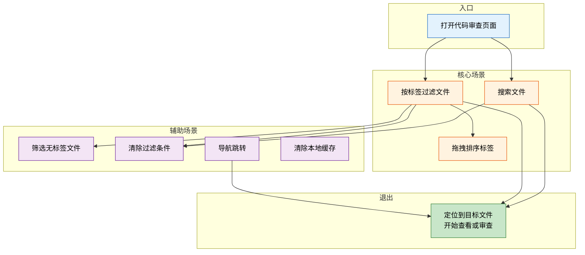
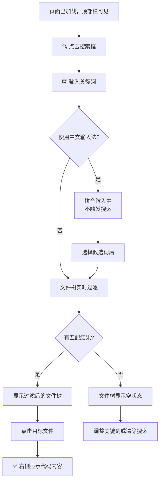
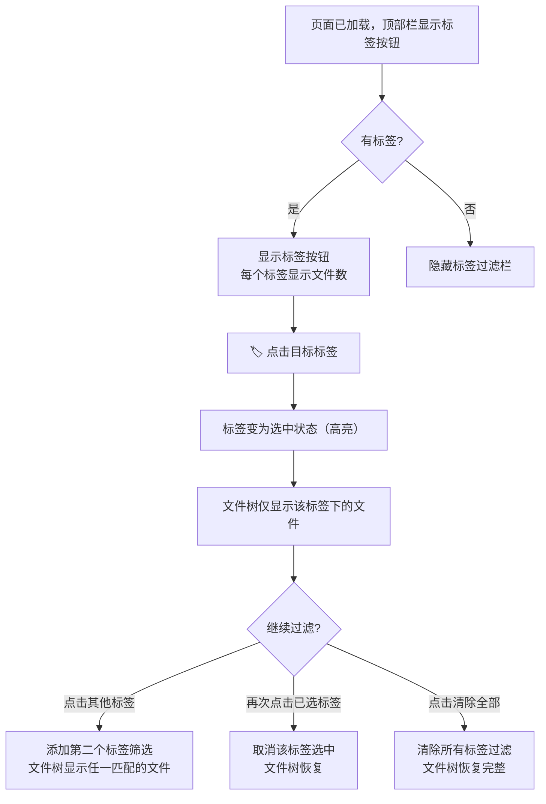
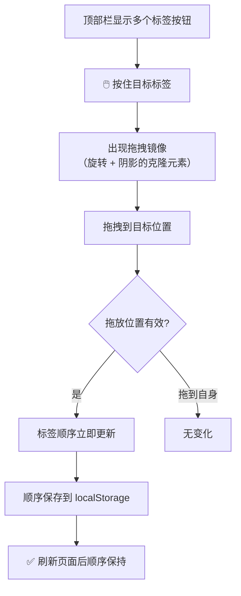
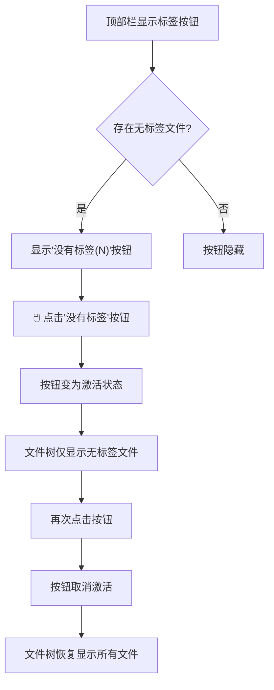
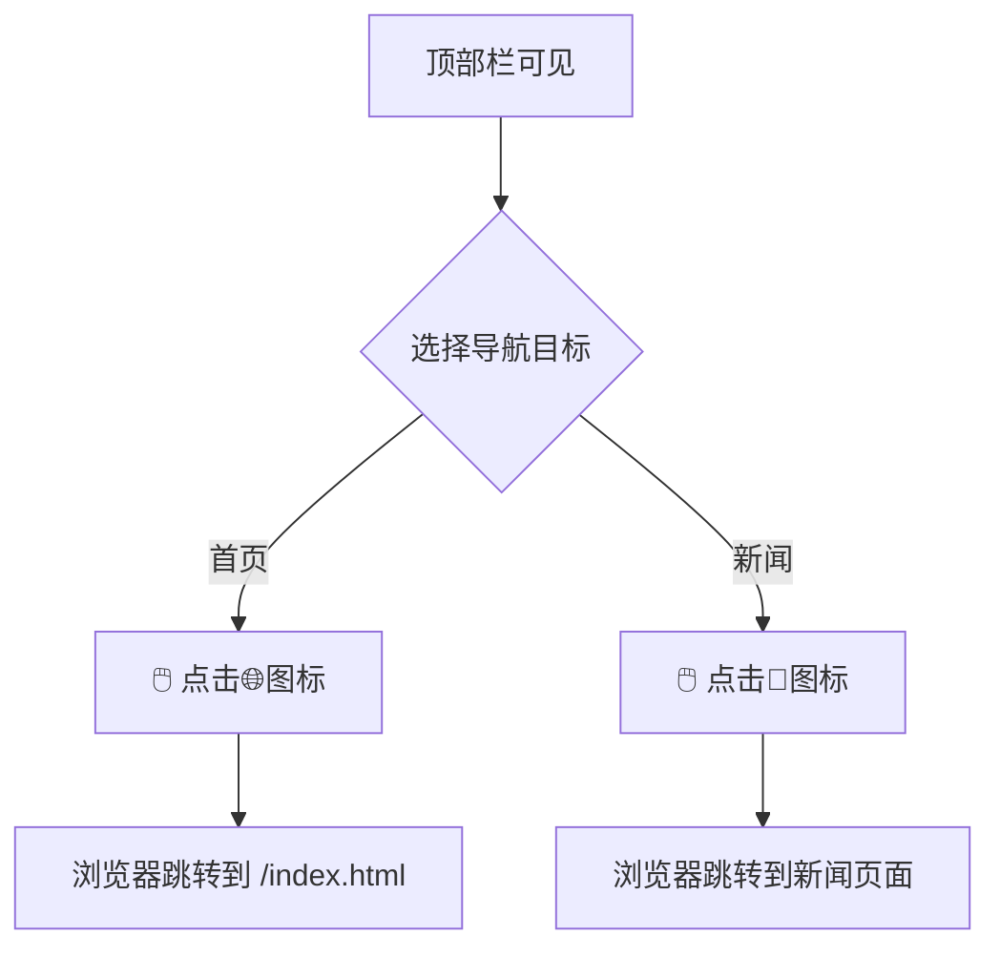
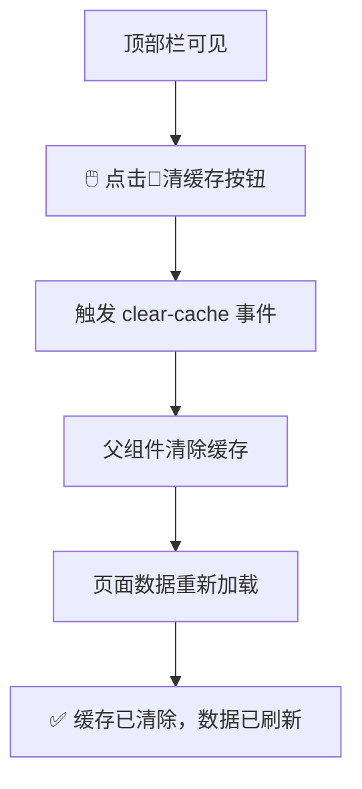

> | v1 | 2026-05-19 | deepseek-v4-pro | 🌿 feat/aicr-header | ⏱️ --:--–--:-- | 📎 [CLAUDE.md](../../../CLAUDE.md) |

> **导航**: [← YiWeb-01-故事任务](./YiWeb-01-故事任务.md) · [YiWeb-04-前端技术评审 →](./YiWeb-04-前端技术评审.md)

> **来源引用**: 本文档由 `/rui aicrHeader 应该单独拆成一个故事目录` 触发，从 `src/views/aicr/components/aicrHeader/` 源码拆分生成。证据等级 B（可推导，附源码路径）。溯源至 [YiWeb-01-故事任务](./YiWeb-01-故事任务.md)。

---

### §0 基线声明

> **用户空间基线 (User Space Baseline)**: 本文档定义"谁使用(WHO)"和"如何体验(HOW EXPERIENCE)"。所有交互设计(04)、测试用例(05)、验收标准(01 §5)均必须覆盖本文档定义的每个场景。

---

### 主要价值

- 👤 围绕开发者的文件定位工作流设计，操作路径最短
- 🗺️ 每个场景覆盖从触发到完成的完整交互路径
- 🛡️ 明确空状态与边界情况，保证组件在各种数据条件下正常渲染
- 🔄 搜索→过滤→排序三种定位方式互补

---

### §1 场景全景

| 模块 | 场景数 | 核心角色 |
|------|--------|---------|
| 搜索 | 1 | 开发者 |
| 标签过滤 | 2 | 开发者 |
| 标签排序 | 1 | 开发者 |
| 导航 | 1 | 开发者 |
| 缓存管理 | 1 | 开发者 |

---

### §2 场景详述

#### 场景 1: 搜索文件

| 角色 | 触发条件 | 核心目标 |
|------|---------|---------|
| 开发者 | 知道目标文件名或关键词，项目中文件数量多 | 通过关键词搜索快速定位到目标文件 |

| # | 步骤 | 输入 | 系统响应 | 异常分支 |
|---|------|------|---------|---------|
| 1 | 点击搜索框 | 鼠标点击 | 搜索框获得焦点，光标显示 | — |
| 2 | 输入关键词 | 键盘输入 | 触发 `search-input` 事件 → 父组件更新 `searchQuery` → 文件树过滤 | — |
| 3 | 中文输入 | 输入拼音 | `compositionstart` 阻止搜索触发，`compositionend` 后才触发 | — |
| 4 | 查看结果 | 浏览过滤后的文件树 | 仅显示名称匹配的文件/文件夹 | 无匹配 → 显示"未找到" |
| 5 | 清除搜索 | 点击搜索框清除按钮 | 搜索框清空，文件树恢复完整显示 | — |

#### 场景 2: 按标签过滤文件

| 角色 | 触发条件 | 核心目标 |
|------|---------|---------|
| 开发者 | 项目中文件按目录组织为标签，需要缩小查看范围 | 通过点击标签按钮筛选文件树，仅显示目标目录下的文件 |

| # | 步骤 | 输入 | 系统响应 | 异常分支 |
|---|------|------|---------|---------|
| 1 | 浏览标签 | 无需操作 | 顶部栏显示所有标签按钮，按文件数量降序排列 | 无标签 → 隐藏标签过滤栏 |
| 2 | 选择标签 | 点击一个标签按钮 | 标签高亮，触发 `tag-select` 事件，文件树过滤 | — |
| 3 | 多选标签 | 点击第二个标签 | 两个标签均高亮，文件树显示属于任意选中标签的文件 | — |
| 4 | 取消标签 | 再次点击已选中标签 | 标签取消高亮，文件树不再包含该标签文件 | — |
| 5 | 清除全部 | 点击清除按钮 | 所有标签取消选中，文件树恢复 | — |

#### 场景 3: 拖拽排序标签

| 角色 | 触发条件 | 核心目标 |
|------|---------|---------|
| 开发者 | 默认标签排列不符合个人习惯，希望自定义顺序 | 通过拖拽调整标签按钮的显示顺序，顺序持久化到本地 |

| # | 步骤 | 输入 | 系统响应 | 异常分支 |
|---|------|------|---------|---------|
| 1 | 开始拖拽 | 按住标签按钮 | 生成拖拽镜像（不透明度 0.8、旋转 3°、阴影），原始元素变半透明 | — |
| 2 | 拖拽经过 | 拖动标签经过其他标签 | 目标标签边缘高亮（水平布局：左/右边缘；垂直布局：上/下边缘） | — |
| 3 | 释放放置 | 在目标位置释放鼠标 | 标签从原位置移动到目标位置，顺序立即更新，写入 localStorage | 拖到自身 → 跳过 |
| 4 | 验证持久化 | 刷新页面 | 标签恢复为自定义顺序 | localStorage 数据损坏 → 回退到默认字母序 |

#### 场景 4: 筛选无标签文件

| 角色 | 触发条件 | 核心目标 |
|------|---------|---------|
| 开发者 | 需要查看不属于任何一级目录的散落文件 | 快速筛选出未归类文件 |

| # | 步骤 | 输入 | 系统响应 | 异常分支 |
|---|------|------|---------|---------|
| 1 | 查看按钮 | 无需操作 | "没有标签"按钮仅在无标签文件数 > 0 时显示，显示文件计数 | 无标签文件数为 0 → 按钮隐藏 |
| 2 | 开启筛选 | 点击"没有标签"按钮 | 按钮激活，触发 `tag-filter-no-tags` 事件 → 文件树仅显示无标签文件 | — |
| 3 | 关闭筛选 | 再次点击按钮 | 按钮取消激活，触发 `tag-filter-no-tags` 事件 → 文件树恢复 | — |

#### 场景 5: 导航跳转

| 角色 | 触发条件 | 核心目标 |
|------|---------|---------|
| 开发者 | 需要返回首页或查看新闻 | 一键跳转到目标页面 |

| # | 步骤 | 输入 | 系统响应 | 异常分支 |
|---|------|------|---------|---------|
| 1 | 跳转首页 | 点击首页图标 | 浏览器导航到 `/index.html` | — |
| 2 | 跳转新闻 | 点击新闻图标 | 浏览器导航到新闻页面 URL | — |

#### 场景 6: 清除本地缓存

| 角色 | 触发条件 | 核心目标 |
|------|---------|---------|
| 开发者 | 缓存数据可能过期，需要刷新 | 一键清除本地缓存并重新加载数据 |

| # | 步骤 | 输入 | 系统响应 | 异常分支 |
|---|------|------|---------|---------|
| 1 | 清除缓存 | 点击清缓存按钮 | 触发 `clear-cache` 事件 → 父组件处理缓存清理 → 页面刷新 | — |

---

### §3 场景覆盖矩阵

| 场景 | FP# | AC# | 实现文档(04) | 测试文档(05) | 覆盖状态 | 备注 |
|------|-----|------|------------|------------|---------|------|
| 场景1: 搜索文件 | FP1, FP2, FP8 | AC3, AC7 | 04-前端技术评审 | 05-测试用例评审 | 待生成 | 含中文输入法处理 |
| 场景2: 按标签过滤文件 | FP3, FP4, FP6 | AC1, AC2 | 04-前端技术评审 | 05-测试用例评审 | 待生成 | 含多选/取消/清除 |
| 场景3: 拖拽排序标签 | FP7 | AC4 | 04-前端技术评审 | 05-测试用例评审 | 待生成 | 含持久化验证 |
| 场景4: 筛选无标签文件 | FP5 | AC5 | 04-前端技术评审 | 05-测试用例评审 | 待生成 | 含按钮显隐逻辑 |
| 场景5: 导航跳转 | FP9, FP10 | AC6 | 04-前端技术评审 | 05-测试用例评审 | 待生成 | — |
| 场景6: 清除本地缓存 | FP11 | AC8 | 04-前端技术评审 | 05-测试用例评审 | 待生成 | — |

---

### §4 评审清单

| # | 检查项 | 状态 |
|---|--------|------|
| 1 | 场景数量 ≥ 2 | ✅ 6 个场景 |
| 2 | 每个场景有 mermaid 流程图 | ✅ |
| 3 | 所有 FP# 已覆盖 | ✅ FP1-FP11 均有场景覆盖 |
| 4 | 异常分支明确 | ✅ 含空状态、错误恢复路径 |
| 5 | 无技术术语 | ✅ 已审查，无代码路径/组件名/API端点 |
| 6 | 每个场景含空状态 | ✅ 场景1/2/4 含空状态路径 |
| 7 | 每个场景含错误恢复 | ✅ 场景3 含数据损坏回退 |
| 8 | 覆盖矩阵下游文档齐全 | ✅ 04/05 已列出 |
| 9 | 基线溯源至 01 | ✅ 每个场景关联 FP# 和 AC# |

---

### §5 体验基线

| 角色 | 核心旅程 | 情感目标 | 痛点解决 | 成功感知 | 关联场景 |
|------|---------|---------|---------|---------|---------|
| 开发者 | 在大量文件中快速定位目标 | 感到掌控和高效 | 减少逐层展开文件夹的繁琐操作 | 看到目标文件出现在筛选结果中 | 场景1, 场景2 |
| 开发者 | 个性化标签排列顺序 | 感到舒适和有条理 | 默认排序不符合个人使用习惯 | 拖拽后标签按自己期望的顺序显示 | 场景3 |
| 开发者 | 清理过期缓存 | 感到安心和掌控 | 不确定数据是否为最新版本 | 点击清缓存后数据重新加载 | 场景6 |

---

| 日期 | 变更 | 触发 | 证据 |
|------|------|------|------|
| 2026-05-19 | 初始文档生成，从 aicr 主故事拆分 | `/rui aicrHeader 应该单独拆成一个故事目录` | `src/views/aicr/components/aicrHeader/` 源码 |
