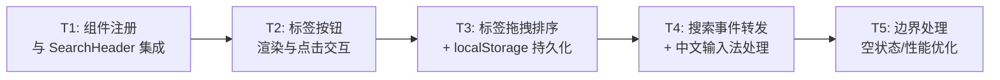
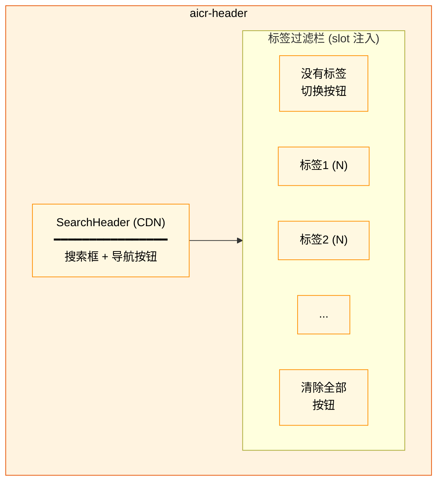
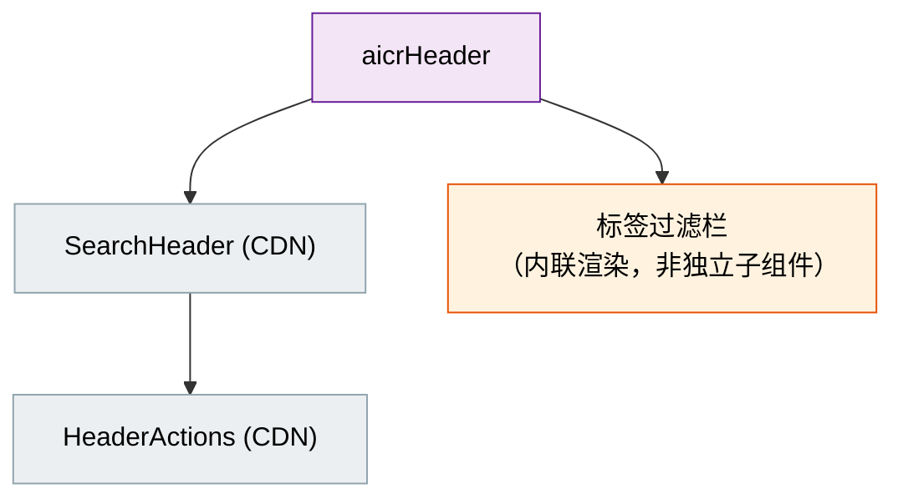
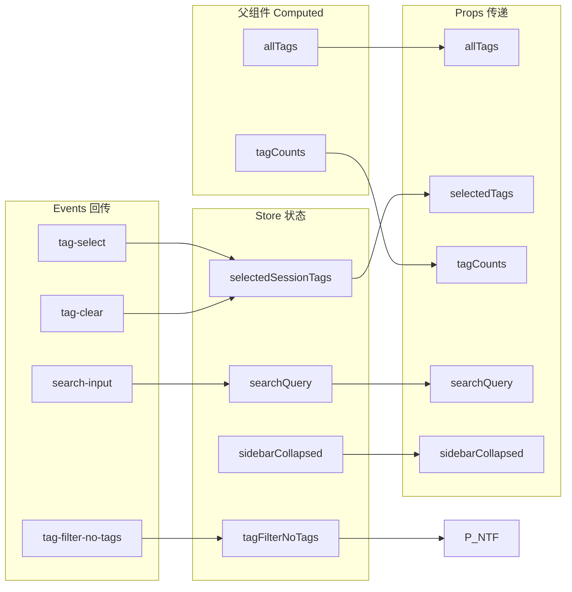
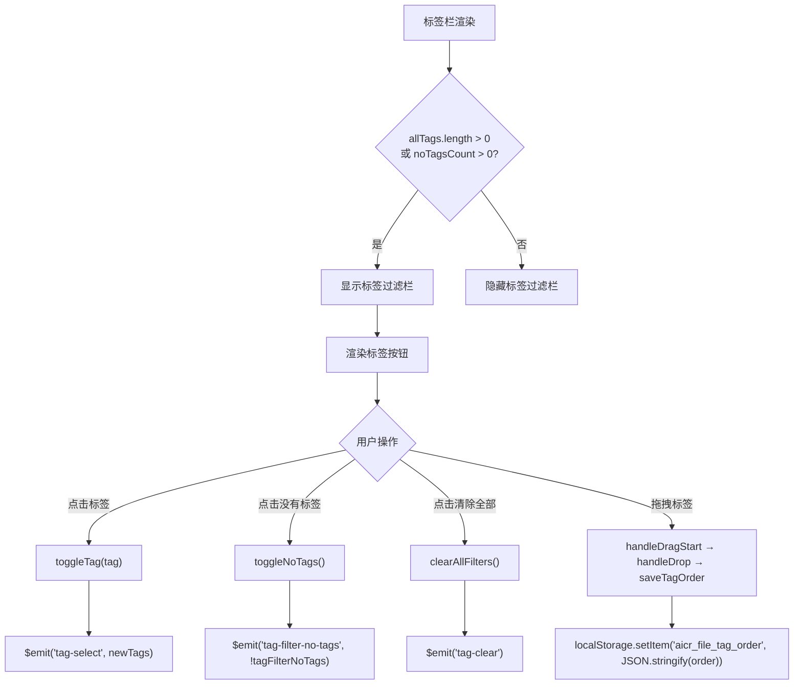
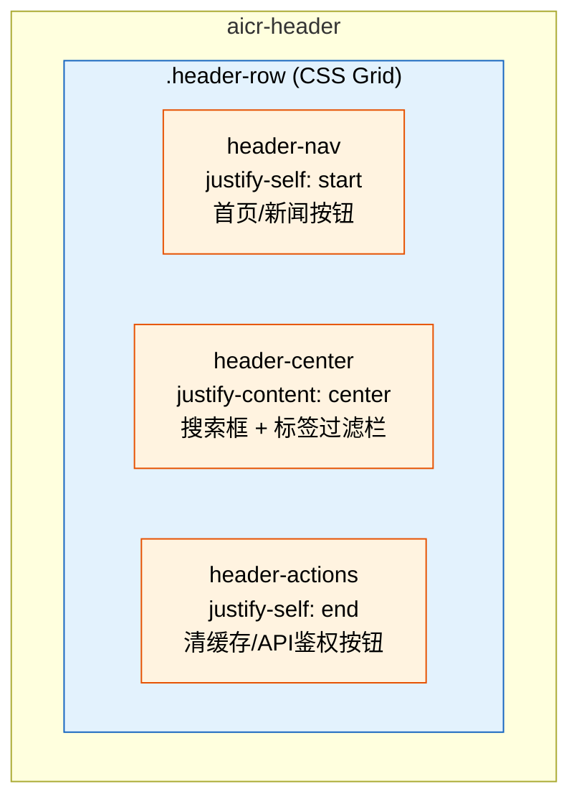

> | v1 | 2026-05-19 | deepseek-v4-pro | 🌿 feat/aicr-header | ⏱️ --:--–--:-- | 📎 [CLAUDE.md](../../../CLAUDE.md) |

> **导航**: [← YiWeb-02-用户使用场景](./YiWeb-02-用户使用场景.md) · [YiWeb-05-测试用例评审 →](./YiWeb-05-测试用例评审.md)

> **来源引用**: 本文档由 `/rui aicrHeader 应该单独拆成一个故事目录` 触发，从 `src/views/aicr/components/aicrHeader/index.js` + `index.html` + `index.css` 源码拆分生成。证据等级 B（可推导，附源码路径）。

---

### 主要价值

- 🧩 明确的组件边界：aicrHeader 包装 SearchHeader CDN 组件，内联渲染标签过滤栏
- 🔌 接口契约清晰：10 个 Props + 12 个 Events，与父组件单向数据流
- 🎨 样式复用：共用 sessionListTags CSS，布局采用 CSS Grid
- ⚡ 零构建链：浏览器原生 ESM，`registerGlobalComponent` 注册

---

### §0 设计决策与任务规划

#### §0.0 基线溯源

| 本设计章节 | 实现 01 需求 | 服务 02 场景 | 覆盖状态 |
|-----------|------------|------------|---------|
| §1 组件架构 | FP1-FP11 | 场景1-6 | 已覆盖 |
| §2 状态管理 | FP1-FP8 | 场景1-4 | 已覆盖 |
| §3 交互设计 | FP4, FP7 | 场景2, 场景3 | 已覆盖 |
| §4 样式方案 | FP3, FP7 | 场景2, 场景3 | 已覆盖 |

#### §0.1 设计决策

| 决策领域 | 选定方案 | 选择理由 | 详见 | 实现 01 FP# |
|---------|---------|---------|------|------------|
| 组件注册 | `registerGlobalComponent` | 全局注册，由 `createBaseView` 的 components 列表引用 | `index.js:207` | FP1-FP11 |
| 模板策略 | SearchHeader 包装 + `<template v-if>` 条件渲染标签栏 | SearchHeader 提供搜索/导航能力，标签栏通过 slot 注入 | `index.html:1-65` | FP1-FP11 |
| 拖拽实现 | HTML5 原生 Drag and Drop API | 零外部依赖，浏览器原生支持 | `index.js:63-204` | FP7 |
| 拖拽方向检测 | 缓存 `_dragDirectionHorizontal` 避免高频布局查询 | `getComputedStyle` 在 dragstart 执行一次，dragover 复用 | `index.js:69` | FP7 |
| 样式复用 | 共用 `sessionListTags/index.css` | 标签按钮样式与侧边栏二级标签一致，仅字重区分 | `index.js:210` | FP3 |

#### §0.2 任务规划

| ID | 描述 | 工作量 | 依赖 | 交付物 | Agent | 门禁 | 交接下游 |
|----|------|--------|------|--------|-------|------|---------|
| T1 | 创建 aicrHeader 组件，集成 SearchHeader CDN 组件，配置 Props/Events | S | — | `index.js` + `index.html` | coder | Gate A | T2 |
| T2 | 实现标签按钮渲染（v-for）、点击选择/取消、清除全部、"没有标签"按钮 | S | T1 | `index.html:27-63` + 事件方法 | coder | Gate A | T3 |
| T3 | 实现标签拖拽排序（dragstart/dragover/drop）、方向自适应、localStorage 持久化 | M | T2 | `index.js:63-204` | coder | Gate A | T4 |
| T4 | 实现搜索事件转发（search-input/search-keydown）、IME composition 处理 | S | T1 | `index.html:1-25` + 事件转发方法 | coder | Gate A | T5 |
| T5 | 处理边界：标签为空、无标签文件数为 0、标签过多换行、减少动画偏好 | S | T2-T4 | `index.html` v-if 条件 + `index.css` 媒体查询 | coder | Gate B | — |

---

### §1 组件架构

#### 效果示意

#### 1.1 子组件关系

#### 1.2 源码清单

| 文件 | 用途 | 行数 |
|------|------|------|
| `src/views/aicr/components/aicrHeader/index.js` | 组件注册、Props/Events 定义、computed、methods | 293 |
| `src/views/aicr/components/aicrHeader/index.html` | 模板：SearchHeader 包装 + 标签过滤栏 slot | 65 |
| `src/views/aicr/components/aicrHeader/index.css` | 布局样式：Grid 三栏 + 标签列表居中 | 101 |
| `src/views/aicr/components/sessionListTags/index.css` | 标签按钮样式（复用） | — |

#### 1.3 Props 契约

| Prop | 类型 | 默认值 | 说明 | 来源 |
|------|------|--------|------|------|
| `allTags` | Array | `[]` | 全部可用标签列表（文件树一级目录名） | 父组件 computed `allTags` |
| `selectedTags` | Array | `[]` | 当前选中的标签 | store `selectedSessionTags` |
| `tagFilterReverse` | Boolean | `false` | 反向过滤模式（已废弃，保留兼容） | store `tagFilterReverse` |
| `tagFilterNoTags` | Boolean | `false` | 仅显示无标签文件 | store `tagFilterNoTags` |
| `tagFilterExpanded` | Boolean | `false` | 标签列表展开状态（已废弃，保留兼容） | — |
| `tagFilterSearchKeyword` | String | `''` | 标签搜索关键词（已废弃，保留兼容） | — |
| `tagCounts` | Object | `{counts:{}, noTagsCount:0}` | 各标签文件计数 + 无标签文件数 | 父组件 computed `tagCounts` |
| `tagFilterVisibleCount` | Number | `8` | 折叠模式可见数（已废弃，保留兼容） | — |
| `searchQuery` | String | `''` | 搜索框当前值（双向绑定） | store `searchQuery` |
| `sidebarCollapsed` | Boolean | `false` | 侧边栏收起状态 | store `sidebarCollapsed` |

#### 1.4 Events 契约

| Event | 参数 | 触发场景 | 消费方 |
|-------|------|---------|--------|
| `tag-select` | `newTags: string[]` | 点击标签切换选中状态 | 父组件 → `handleTagSelect` → store |
| `tag-clear` | — | 清除所有标签选中 | 父组件 → `handleTagClear` → store |
| `tag-filter-reverse` | `reverse: boolean` | 切换反向过滤（已废弃，保留兼容） | 父组件 → `handleTagFilterReverse` |
| `tag-filter-no-tags` | `noTags: boolean` | 切换"仅无标签"模式 | 父组件 → `handleTagFilterNoTags` → store |
| `tag-filter-expand` | `expanded: boolean` | 展开/折叠标签（已废弃，保留兼容） | 父组件 → `handleTagFilterExpand` |
| `tag-filter-search` | `keyword: string` | 标签搜索输入（已废弃，保留兼容） | 父组件 → `handleTagFilterSearch` |
| `search-input` | `event` | 搜索框文本变化 | 父组件 → `handleSearchInput` |
| `search-keydown` | `event` | 搜索框按键事件 | 父组件 → `handleMessageInput` |
| `composition-start` | `event` | 中文输入法开始组合 | 父组件 → `handleCompositionStart` |
| `composition-end` | `event` | 中文输入法结束组合 | 父组件 → `handleCompositionEnd` |
| `clear-search` | — | 清除搜索内容 | 父组件 → `clearSearch` |
| `clear-cache` | — | 点击清缓存按钮 | 父组件 → `handleClearCache` |

---

### §2 状态管理

#### 2.1 数据流

> 注：`tagFilterReverse`、`tagFilterExpanded`、`tagFilterSearchKeyword`、`tagFilterVisibleCount` 四个 Props/Events 已在 2026-05-19 的标签过滤栏简化中标记为废弃。在 aicrHeader 源码中仍保留这些 Props/Events 以维持向后兼容，但实际 UI 已不渲染对应控件。

#### 2.2 标签排序状态

标签顺序不由 Vue 响应式系统管理，而是通过以下机制：

1. **读取**：`allTags` computed 在父组件中合并 `localStorage` 中的 `aicr_file_tag_order`
2. **写入**：拖拽 drop 时调用 `saveTagOrder()` 写入 `localStorage`，并自增 `tagOrderVersion`
3. **触发更新**：`tagOrderVersion` 变化通过响应式系统通知下游重新计算

---

### §3 交互设计

#### 3.1 标签过滤栏交互

#### 3.2 拖拽实现细节

| 环节 | 实现 | 代码位置 |
|------|------|---------|
| 拖拽源 | `dragstart` — 设置 `effectAllowed: 'move'`，生成拖拽镜像（opacity 0.8、rotate 3°、阴影的克隆 DOM），延迟移除镜像 DOM | `index.js:63-85` |
| 方向检测 | `isHorizontalDrag()` — 查询 `.tags-list` 的 `getComputedStyle().flexDirection`，结果缓存到 `_dragDirectionHorizontal` | `index.js:86-94` |
| 放置指示 | `dragover` — 水平模式左/右边缘高亮（`drag-over-left/right`），垂直模式上/下边缘高亮（`drag-over-top/bottom`），跳过拖拽源自身 | `index.js:106-147` |
| 离开清理 | `dragleave` — 仅在鼠标真正离开元素边界时清除高亮 | `index.js:149-157` |
| 放置执行 | `drop` — 计算目标位置（拖拽项 > 目标中点时插入到目标后），从 `currentOrder` 数组移动元素，写入 localStorage | `index.js:158-204` |

#### 3.3 视图状态矩阵

| 状态 | 正常 | 空 | 边界 |
|------|------|-----|------|
| 标签列表 | 显示所有标签按钮 + "没有标签"按钮 | `allTags` 为空且 `noTagsCount` = 0 → 隐藏整个过滤栏 | 标签数量 > 20 → flex-wrap 自动换行 |
| "没有标签"按钮 | 显示文件计数，可点击切换激活状态 | `noTagsCount` = 0 → 隐藏此按钮 | — |
| 搜索框 | 显示 placeholder "搜索网站、标签或描述..." | 输入为空时不显示清除按钮 | 中文输入法组合期间不触发搜索 |
| 清缓存按钮 | 可点击，触发 `clear-cache` 事件 | — | — |

---

### §4 样式方案

#### 4.1 布局结构

Grid 模板: `grid-template-columns: 1fr auto 1fr`（三栏：导航 | 中心内容 | 操作按钮）

#### 4.2 样式文件

| 文件 | 用途 | 加载方式 |
|------|------|---------|
| `aicrHeader/index.css` | 组件布局样式 | `@import` 在 `aicrPage/index.css` 或直接加载 |
| `sessionListTags/index.css` | 标签按钮样式（复用） | 在 `index.js:210` 指定为组件 CSS |

#### 4.3 响应式

| 断点 | 行为 |
|------|------|
| ≥ 1025px（桌面） | 标签列表居中（`justify-content: center`），flex: 1 占据可用空间 |
| ≥ 1440px（超宽） | 最大宽度扩展到 1200px，间距增加到 16px |
| 所有尺寸 | 标签 flex-wrap 自动换行 |
| prefers-reduced-motion | 禁用 header transition |

---

### §5 DOM 与事件

#### 5.1 挂载点

| 组件 | 容器 | 创建方式 | 生命周期 |
|------|------|---------|---------|
| aicr-header | `<aicr-page>` 内 | 模板渲染 `<aicr-header>` | 随父组件 |

#### 5.2 事件绑定

| 事件 | 监听方式 | 处理逻辑 | 清理 |
|------|---------|---------|------|
| `click` (标签) | 模板 `@click="toggleTag(tag)"` | 切换标签选中状态，emit `tag-select` | 组件销毁 |
| `click` (没有标签) | 模板 `@click="toggleNoTags"` | 切换无标签筛选，emit `tag-filter-no-tags` | 组件销毁 |
| `dragstart` | 模板 `@dragstart="handleDragStart($event, tag)"` | 设置拖拽数据与镜像 | 组件销毁 |
| `dragover` | 模板 `@dragover="handleDragOver($event)"` | 更新放置指示高亮 | 组件销毁 |
| `drop` | 模板 `@drop="handleDrop($event, tag)"` | 执行排序与持久化 | 组件销毁 |

#### 5.3 SearchHeader 事件透传

| SearchHeader 事件 | aicrHeader 处理 | 触发 aicrHeader emit |
|--------------------|-----------------|---------------------|
| `@search-input` | `handleSearchInput` → emit | `search-input` |
| `@search-keydown` | `handleMessageInput` → emit | `search-keydown` |
| `@composition-start` | `handleCompositionStart` → emit | `composition-start` |
| `@composition-end` | `handleCompositionEnd` → emit | `composition-end` |
| `@clear-search` | `clearSearch` → emit | `clear-search` |
| `@clear-cache` | `handleClearCache` → emit | `clear-cache` |

---

### §6 与父故事 (aicr) 的集成点

| 集成点 | aicrHeader 侧 | aicr 主页面侧 | 数据方向 |
|--------|-------------|-------------|---------|
| 标签列表 | Props: `allTags`, `tagCounts` | Computed: `allTags`, `tagCounts` | 父 → 子 |
| 选中标签 | Props: `selectedTags` | Store: `selectedSessionTags` | 父 → 子 (双向) |
| 标签过滤模式 | Props: `tagFilterNoTags` | Store: `tagFilterNoTags` | 父 → 子 |
| 搜索关键词 | Props: `searchQuery` (v-model) | Store: `searchQuery` | 双向绑定 |
| 侧边栏状态 | Props: `sidebarCollapsed` | Store: `sidebarCollapsed` | 父 → 子 |
| 标签选择事件 | Events: `tag-select` | `mainPageMethods.handleTagSelect` | 子 → 父 |
| 搜索事件 | Events: `search-input`, `search-keydown` | `mainPageMethods.handleSearchInput` | 子 → 父 |
| 清除事件 | Events: `tag-clear`, `clear-search`, `clear-cache` | 各对应方法 | 子 → 父 |

---

### §7 评审清单

| # | 检查项 | 状态 |
|---|--------|------|
| 1 | 组件命名空间不冲突（aicrHeader 全局唯一） | ✅ |
| 2 | Props 与 Events 类型定义完整 | ✅ 10 Props + 12 Events |
| 3 | 状态变更走 store mutation（不跨组件直接修改 vueRef） | ✅ aicrHeader 仅 emit 事件，不直接修改 store |
| 4 | 样式隔离（组件 CSS 文件独立加载） | ✅ |
| 5 | 事件命名语义化，与父组件方法对应 | ✅ |
| 6 | 模块语法合规（浏览器原生 ESM，无 TS/JSX） | ✅ |
| 7 | 基线溯源完备（每章节映射至 01 FP# 和 02 场景） | ✅ |
| 8 | 效果示意完整（mermaid 组件交互图） | ✅ |

---

| 日期 | 变更 | 触发 | 证据 |
|------|------|------|------|
| 2026-05-19 | 初始文档生成，从 aicr 主故事拆分 | `/rui aicrHeader 应该单独拆成一个故事目录` | `src/views/aicr/components/aicrHeader/` 源码 + aicr `YiWeb-组件架构.md` §7 |
