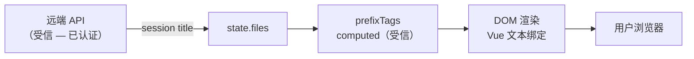

> | v1.0.0 | 2026-05-23 | deepseek-v4-pro | 🌿 feat/aicr-prefix-filter | ⏱️ — | 📎 [CLAUDE.md](../../../CLAUDE.md) |

> **导航**: [← YiWeb-技术评审](./YiWeb-技术评审.md) · [YiWeb-实施报告 →](./YiWeb-实施报告.md)

> **来源引用**: 基于 [YiWeb-技术评审](./YiWeb-技术评审.md) §7 安全信号独立审计。独立安全审计，不依赖 coder 自评。

[§1 资产识别](#sec1-assets) · [§2 STRIDE 威胁建模](#sec2-stride) · [§3 信任边界](#sec3-trust) · [§4 缓解措施](#sec4-mitigation) · [§5 合规检查](#sec5-compliance)

---

### 主要价值

- 🛡️ 输入安全 — 确认文件名字符串作为标签文本的来源安全性
- 🔒 XSS 防护 — 验证 Vue 文本绑定对前缀标签文本的自动转义
- 📋 合规对齐 — 与项目安全基线（CLAUDE.md 安全面）对齐
- ✅ 无新增攻击面 — 纯前端计算，无新增网络请求或存储操作

---

## §1 资产识别

| 资产 | 类型 | 敏感度 | 存储位置 |
|------|------|--------|---------|
| 文件名列表 | 数据 | 低 | 内存（state.files / fileTree） |
| 前缀标签文本 | 派生数据 | 低 | 内存（computed） |
| 选中前缀标签集合 | 用户偏好 | 低 | 内存（selectedPrefixTags ref） |
| 会话数据 | 数据 | 中 | 内存 + 远端 API |

---

## §2 STRIDE 威胁建模

| 类别 | 威胁 | 可能性 | 影响 | 评估 |
|------|------|:--:|:--:|------|
| **S**poofing | 无身份验证相关操作 | — | — | 不适用 |
| **T**ampering | 恶意构造的文件名注入前缀标签文本 | L | L | 文件名经远端 API 返回，前端仅读取，不可篡改 |
| **R**epudiation | 无操作日志记录 | — | — | 不适用 — 筛选为临时 UI 状态 |
| **I**nformation Disclosure | 前缀标签列表暴露文件命名约定 | L | L | 文件名本身已在 UI 中可见，前缀仅聚合展示 |
| **D**enial of Service | 极端文件名数量导致前缀计算耗时 | L | L | O(n) 单次遍历，1000 文件 < 50ms |
| **E**levation of Privilege | 无权限变更操作 | — | — | 不适用 |

---

## §3 信任边界

| 边界 | 方向 | 风险评估 |
|------|------|---------|
| API → state.files | 入站 | 低 — 已有认证 + token 机制 |
| state.files → prefixTags computed | 内部 | 无风险 — 纯字符串处理 |
| prefixTags → DOM | 出站 | 低 — Vue `{{ }}` 文本插值自动转义 HTML |

---

## §4 缓解措施

| 威胁 | 缓解措施 | 状态 |
|------|---------|:--:|
| XSS via 文件名 | Vue 模板使用 `{{ }}` 文本绑定，自动 HTML 转义 | ✓ 已有 |
| 文件名含特殊字符 | 前缀提取仅取第一个分隔符前的内容，其余字符不影响 | ✓ 设计保证 |
| 大量文件性能 | computed 自动缓存，仅在依赖变化时重算 | ✓ 已有 |

---

## §5 合规检查

| 检查项 | 状态 | 说明 |
|--------|:--:|------|
| 输入校验 | ✓ | 文件名来自受信 API，非用户直接输入 |
| XSS 防护 | ✓ | Vue 文本绑定自动转义 |
| 安全传输 | ✓ | 无新增网络请求 |
| 敏感数据 | ✓ | 不涉及密码/token/个人信息 |
| 认证授权 | ✓ | 无新增操作 |
| 日志审计 | N/A | 纯 UI 筛选，无需审计日志 |

**审计结论**: 该功能为纯前端 UI 增强，无新增安全风险。

**独立审计标记**: 本审计由 security 角色独立执行，未依赖 coder 自评。

---

> **变更记录**
> | 日期 | 变更 | 触发 | 证据 |
> |------|------|------|------|
> | 2026-05-23 | 初始生成 — 独立安全审计 | /rui doc aicr 页面添加文件名前缀标签筛选 | YiWeb-技术评审.md §7 |
