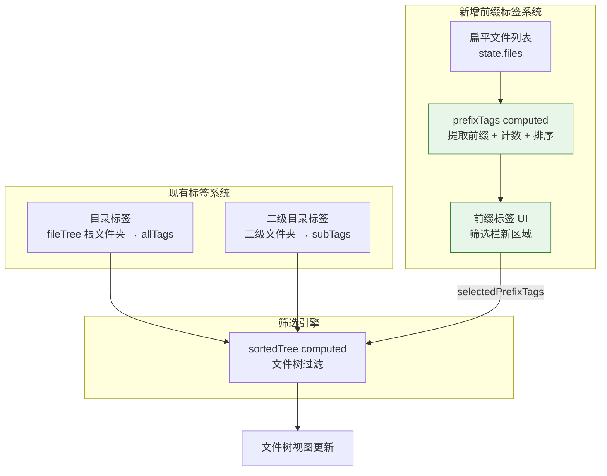
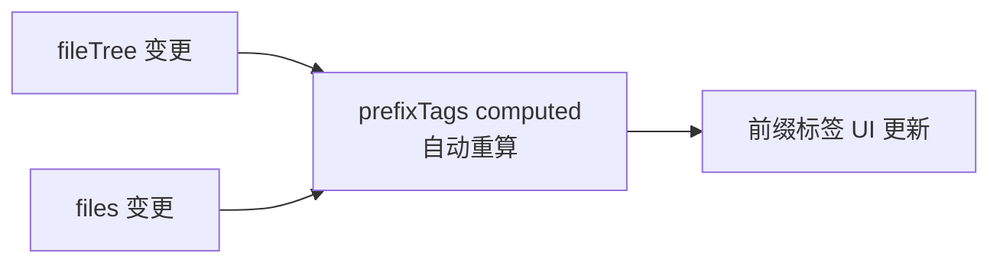
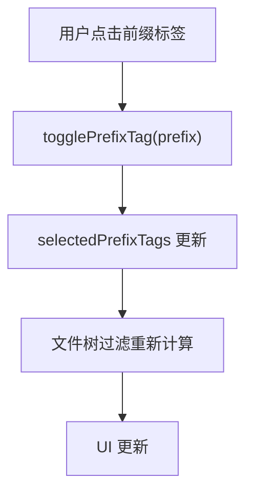

> | v1.0.0 | 2026-05-23 | deepseek-v4-pro | 🌿 feat/aicr-prefix-filter | ⏱️ — | 📎 [CLAUDE.md](../../../CLAUDE.md) |

> **导航**: [← YiWeb-使用场景](./YiWeb-使用场景.md) · [YiWeb-测试设计 →](./YiWeb-测试设计.md) · [YiWeb-安全审计 →](./YiWeb-安全审计.md)

> **来源引用**: 基于 [YiWeb-故事任务](./YiWeb-故事任务.md) Story 1–3 + [YiWeb-使用场景](./YiWeb-使用场景.md) 场景 1–5 生成。源码基线: `src/views/aicr/`。

[§1 架构](#sec1-architecture) · [§4 组件](#sec4-components) · [§5 状态](#sec5-state) · [§6 交互](#sec6-interaction) · [§7 安全](#sec7-security)

---

### §0 基线溯源

| 本文章节 | 溯源至故事任务 | 溯源至使用场景 |
|---------|-------------|-------------|
| §4.1 前缀标签组件 | FP3, FP4 | 场景 1 |
| §5.1 前缀筛选状态 | FP4, FP5 | 场景 1, 2, 3 |
| §6.1 前缀提取数据流 | FP1, FP2 | 场景 1, 4, 5 |
| §6.2 筛选联动 | FP6, FP7 | 场景 2, 3 |

### 主要价值

- 🧩 最小侵入 — 新增 computed + 轻量 UI 组件，不改动现有标签体系
- ⚡ 即时计算 — 基于 Vue computed 缓存，文件树变化自动重算前缀
- 🔗 松耦合 — 前缀标签通过独立 computed 派生，与目录标签互不依赖
- 🎨 视觉区分 — 前缀标签使用不同样式（轮廓/色调），与目录标签明确区分

---

### 效果示意



---

<a id="sec1-architecture"></a>

## §1 架构

### §1.1 整体策略

**最小侵入式新增**：在前缀标签筛选不改变现有标签系统的前提下，新增一个 computed 派生前缀标签列表 + 少量 UI 渲染 + 筛选逻辑扩展。

| 层次 | 改动点 | 性质 |
|------|-------|------|
| 状态 | 新增 `selectedPrefixTags` ref | 新加 |
| 计算 | 新增 `prefixTags` computed | 新加 |
| 计算 | 修改 `sortedTree` / 文件树过滤逻辑 | 扩展 |
| UI | 筛选栏新增前缀标签区域 | 新加 |
| UI | 前缀标签按钮组件 | 新加 |

### §1.2 前缀提取算法

```
输入: fileTree 中所有文件节点的 name 属性
算法:
  1. 遍历所有文件节点
  2. 对每个文件名，查找第一个分隔符 (- . _) 的位置
  3. 截取分隔符之前的部分作为前缀
  4. 忽略无分隔符的文件名
  5. 统计每个前缀的出现次数
  6. 按出现次数降序排列
输出: [{ prefix, count }]
```

> 证据: `src/views/aicr/hooks/state/storeState.js:32` — `files` 数组包含所有文件引用

---

<a id="sec4-components"></a>

## §4 组件

### §4.1 前缀标签 UI（新增）

**位置**: `src/views/aicr/components/aicrPage/index.html` 筛选栏区域（现有 `aicr-filter-bar` 内）

**设计**:

```
┌─ 前缀筛选 ──────────────────────────────┐
│ [use (12)] [api (8)] [index (5)] ... [✕] │
└──────────────────────────────────────────┘
```

- 前缀标签使用轮廓样式（与实心底色目录标签区分）
- 选中态：填充前景色
- 水平滚动，与现有标签栏一致
- 末尾"✕"清除按钮，仅在有选中标签时显示
- 无可提取前缀时整行隐藏

### §4.2 现有组件改动

| 组件 | 改动 | 原因 |
|------|------|------|
| `aicrPage/index.html` | 新增前缀标签区域 | 展示前缀标签 |
| `aicrPage/index.js` | 新增 `prefixTags` computed、传递新 props | 数据绑定 |
| `fileTree/index.js` | 接收 `selectedPrefixTags` prop | 过滤逻辑入参 |
| `index.js` (入口) | data 块暴露 `prefixTags`、`selectedPrefixTags` | Vue 模板绑定 |

---

<a id="sec5-state"></a>

## §5 状态

### §5.1 新增状态

| 变量 | 类型 | 默认值 | 说明 |
|------|------|--------|------|
| `selectedPrefixTags` | `ref([])` | `[]` | 当前选中的前缀标签数组 |

> 证据: 新增状态定义于 `src/views/aicr/hooks/state/storeState.js`

### §5.2 新增 computed

| 变量 | 来源 | 说明 |
|------|------|------|
| `prefixTags` | `files` + `fileTree` | `{ prefix, count }[]` — 按频次降序排列的前缀标签列表 |

**计算逻辑** (`src/views/aicr/index.js` 或 `hooks/useComputed.js`):

```
prefixTags = computed(() => {
  const counts = {}
  遍历文件树提取文件名
  对每个文件名按分隔符取前缀
  累加计数
  转为数组，按 count 降序
  返回
})
```

### §5.3 现有状态改动

| 变量 | 改动 | 说明 |
|------|------|------|
| `sortedTree` / 文件树过滤 | 扩展 | 增加前缀过滤条件 |

---

<a id="sec6-interaction"></a>

## §6 交互

### §6.1 前缀提取数据流



### §6.2 筛选联动



### §6.3 方法

| 方法 | 位置 | 逻辑 |
|------|------|------|
| `togglePrefixTag(prefix)` | `aicrPage/index.js` 或 methods | 在 `selectedPrefixTags` 中切换 prefix |
| `clearPrefixTags()` | 同上 | 重置 `selectedPrefixTags = []` |

### §6.4 文件树过滤扩展

在现有 `sortedTree` computed 中增加前缀过滤分支：

```
if (selectedPrefixTags.length > 0) {
  对每个文件节点:
    提取文件名前缀
    如果前缀不在 selectedPrefixTags 中 → 过滤掉
}
```

---

<a id="sec7-security"></a>

## §7 安全

| 考量 | 评估 |
|------|------|
| 输入源 | 文件名来自远端 API 返回的 session title → 已通过现有安全管道 |
| XSS 风险 | 前缀标签文本来自文件名，文件名已在前端渲染管道中经过 Vue 文本绑定转义 |
| 无新增 API | 纯前端计算，不涉及网络请求 |

---

> **变更记录**
> | 日期 | 变更 | 触发 | 证据 |
> |------|------|------|------|
> | 2026-05-23 | 初始生成 | /rui doc aicr 页面添加文件名前缀标签筛选 | YiWeb-故事任务.md + src/views/aicr/ |
