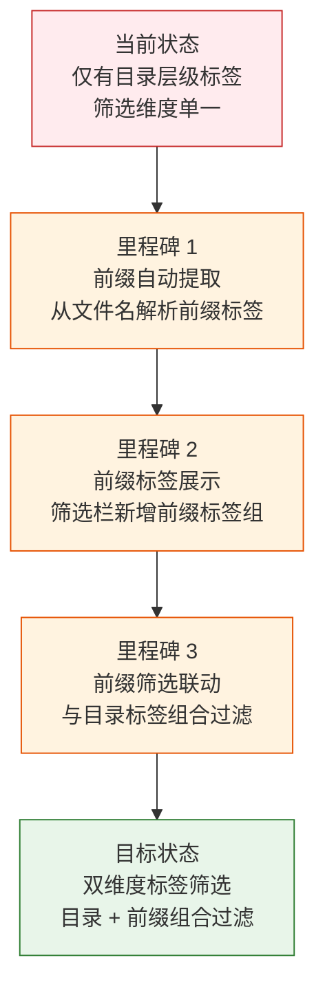

> | v1.0.0 | 2026-05-23 | deepseek-v4-pro | 🌿 feat/aicr-prefix-filter | ⏱️ — | 📎 [CLAUDE.md](../../../CLAUDE.md) |

> **导航**: [YiWeb-使用场景 →](./YiWeb-使用场景.md)

> **来源引用**: 用户需求 `/rui aicr 页面添加文件名前缀标签筛选`，基于 `src/views/aicr/` 源码分析生成。

[§1 Story](#sec1-story) · [§2 Requirements](#sec2-requirements) · [§3 成功标准](#sec3-success) · [§4 范围边界](#sec4-scope) · [§5 AC](#sec5-ac) · [§6 风险与假设](#sec6-risks)

---

### §0 基线声明

> **问题空间基线**: 本文档定义"做什么(WHAT)"和"为什么(WHY)"。所有下游文档的设计、实现、验证决策均必须可追溯至本文档。

---

### 需求概述

在 AICR 代码审查页面中，当前标签筛选完全依赖文件目录结构（文件夹层级 = 标签）。用户希望新增一种筛选维度：根据文件名前缀（如 `use-`、`api-`、`index` 等）自动提取标签，允许用户按文件名命名模式快速过滤文件列表。

### 效果示意

### 主要价值

- 🏷️ 文件名前缀自动识别 — 无需手动标注，系统自动从文件名提取前缀标签
- 🔍 快速定位同类文件 — 按命名约定（use-、api-、index 等）一键过滤
- 🎯 组合筛选更精准 — 目录标签 + 前缀标签双维度 AND 组合
- 📊 前缀出现频次可见 — 每个前缀标签显示匹配文件数量

---

## §1 Story

### Story 1: 文件名前缀标签自动提取

| 字段 | 内容 |
|------|------|
| 作为 | 代码审查者 |
| 我想要 | 系统自动从文件树中所有文件名提取公共前缀并生成标签 |
| 以便 | 无需手动标注即可按文件命名模式筛选文件 |
| 优先级 | P0 |
| 范围边界 | 只读文件树，生成前缀标签列表，不修改文件数据 |
| 依赖 | 文件树已加载（Story 1 of aicr） |

### Story 2: 前缀标签筛选 UI

| 字段 | 内容 |
|------|------|
| 作为 | 代码审查者 |
| 我想要 | 在筛选栏中看到前缀标签，点击即可筛选文件 |
| 以便 | 快速定位具有相同命名前缀的同类文件 |
| 优先级 | P0 |
| 范围边界 | 前缀标签展示 + 点击切换 + 选中状态 + 计数显示 |
| 依赖 | Story 1 |

### Story 3: 前缀与目录标签组合筛选

| 字段 | 内容 |
|------|------|
| 作为 | 代码审查者 |
| 我想要 | 同时使用目录标签和前缀标签进行文件筛选 |
| 以便 | 在特定目录下进一步按文件名模式缩小范围 |
| 优先级 | P1 |
| 范围边界 | 两种标签 AND 逻辑组合，筛选结果实时更新 |
| 依赖 | Story 2，aicr 现有标签系统 |

---

## §2 Requirements

### 功能点

| FP# | 描述 | 输入 | 输出 | 优先级 |
|-----|------|------|------|--------|
| FP1 | 前缀解析 — 从文件名中按分隔符(`-`、`_`、`.`)提取前缀 | 文件名列表 | 前缀出现频次 Map | P0 |
| FP2 | 前缀排序 — 按出现频次降序排列前缀标签 | 前缀频次 Map | 有序前缀标签数组 | P0 |
| FP3 | 前缀标签渲染 — 在筛选栏显示前缀标签按钮，含文件计数 | 前缀标签数组 | DOM 标签按钮 | P0 |
| FP4 | 前缀筛选切换 — 点击前缀标签切换其选中状态 | 点击事件 | 更新选中的前缀标签集合 | P0 |
| FP5 | 文件树过滤 — 根据选中的前缀标签过滤文件树 | 选中前缀集合 | 过滤后的文件树节点 | P0 |
| FP6 | 组合筛选 — 目录标签和前缀标签 AND 逻辑组合过滤 | 目录标签 + 前缀标签 | 同时满足两者的文件树 | P1 |
| FP7 | 前缀筛选清除 — 一键清除所有已选中的前缀标签 | 点击清除按钮 | 前缀筛选重置 | P1 |
| FP8 | 多层级前缀 — 支持识别以第二个分隔符之前的完整前缀（如 `use-methods`） | 文件名 | 多级前缀选项 | P2 |

### 业务规则

| R# | 描述 | 校验方式 | 证据级别 |
|----|------|---------|---------|
| R1 | 前缀标签从文件名字符串中提取，分隔符为 `-`、`_`、`.` | 单元验证 | A |
| R2 | 只有出现 ≥ 1 次的前缀才显示为标签 | 自动过滤 | A |
| R3 | 前缀标签与目录标签互不影响，组合为 AND 逻辑 | 筛选结果验证 | A |
| R4 | 当前缀标签为空（无匹配文件）时不显示前缀筛选区 | UI 检查 | A |
| R5 | 前缀标签选中状态在目录标签切换时保持 | 状态保持验证 | A |

---

## §3 成功标准

| SC# | 描述 | 目标值 | 关联 FP# |
|-----|------|--------|---------|
| SC1 | 前缀标签提取耗时 < 50ms（1000 文件规模） | < 50ms | FP1, FP2 |
| SC2 | 前缀标签点击后 100ms 内文件树更新 | < 100ms | FP4, FP5 |
| SC3 | 前缀标签正确反映文件计数 | 与文件列表一致 | FP3 |
| SC4 | 组合筛选（目录 + 前缀）结果正确 | 100% 准确 | FP6 |

---

## §4 范围边界

**范围内**:
- 从文件名自动提取前缀并生成标签
- 前缀标签在筛选栏中的展示与交互
- 与现有目录标签的组合筛选
- 前缀标签计数显示

**范围外**:
- 手动创建/编辑前缀标签
- 前缀标签的持久化排序（使用默认频次排序）
- 正则表达式自定义前缀匹配
- 前缀标签与 AI 聊天联动

---

## §5 AC

| AC# | Given | When | Then | 门禁 |
|-----|-------|------|------|------|
| AC1 | 文件树已加载，包含多种命名前缀的文件 | 页面渲染完成 | 筛选栏显示前缀标签区域，每个标签含文件名和计数 | Gate A |
| AC2 | 用户点击某个前缀标签（如"use"） | 标签被点击 | 文件树仅显示文件名以该前缀开头的文件，标签高亮 | Gate A |
| AC3 | 用户已选中目录标签"src" | 再点击前缀标签"use" | 文件树仅显示 src 目录下以 use- 开头的文件 | Gate A |
| AC4 | 用户点击已选中的前缀标签 | 标签被再次点击 | 该前缀标签取消选中，文件树恢复不包含该前缀的过滤 | Gate B |
| AC5 | 用户选中多个前缀标签 | 多个前缀标签高亮 | 文件树显示匹配任一前缀的文件（OR 逻辑） | Gate B |
| AC6 | 文件树无任何可提取前缀的文件 | 页面加载完成 | 前缀筛选区不显示 | Gate A |

---

## §6 风险与假设

| # | 风险/假设 | 类型 | 可能性 | 影响 | 缓解 |
|---|----------|------|:--:|:--:|------|
| 1 | 大量文件导致前缀提取计算耗时 | 风险 | L | L | 使用 computed 缓存，O(n) 单次遍历 |
| 2 | 前缀标签过多导致筛选栏溢出 | 风险 | M | L | 水平滚动（与现有标签栏一致）+ 频次阈值过滤 |
| 3 | 无分隔符文件名（如 `indexjs`）无法提取前缀 | 假设 | — | — | 此类文件不计入前缀统计 |
| 4 | 用户理解前缀标签含义无困难 | 假设 | — | — | 标签即文件名中分隔符前的文字，直觉可理解 |

**产出**: `docs/故事任务面板/aicr-prefix-filter/YiWeb-{故事任务,使用场景,技术评审,测试设计,安全审计}.md`

---

> **变更记录**
> | 日期 | 变更 | 触发 | 证据 |
> |------|------|------|------|
> | 2026-05-23 | 初始生成 | /rui aicr 页面添加文件名前缀标签筛选 | src/views/aicr/ 源码分析 |
