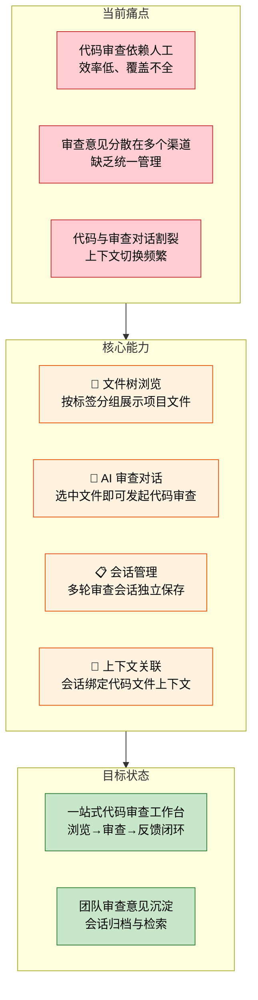
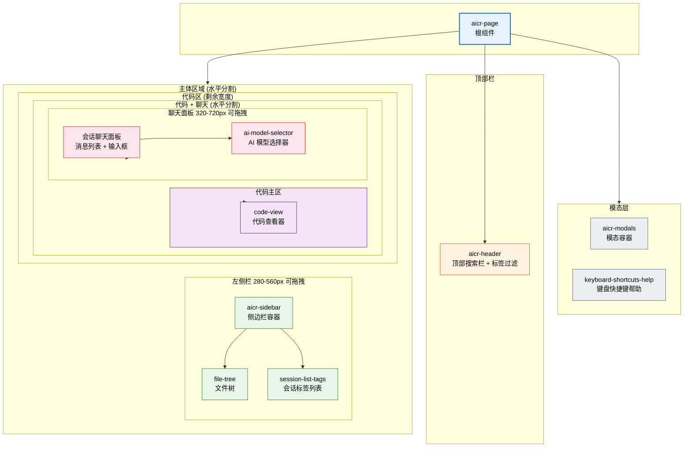
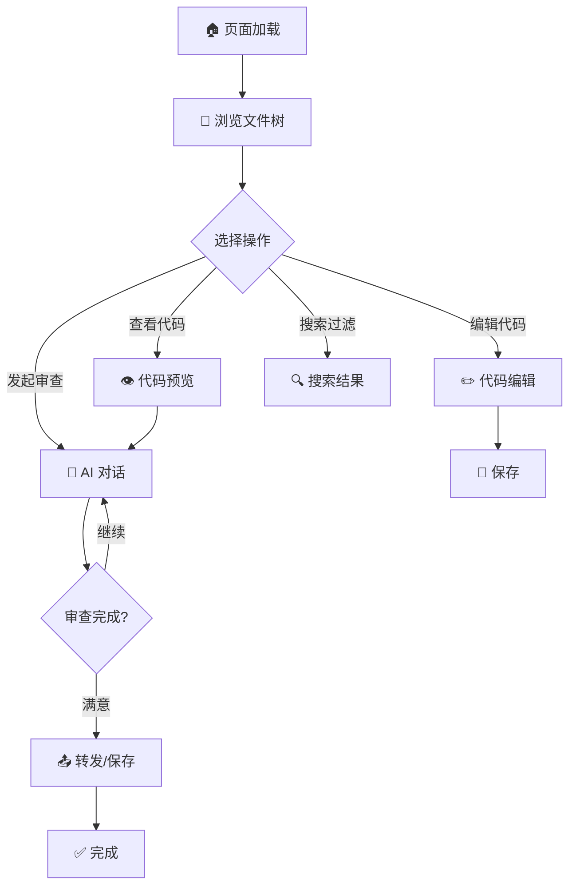

> | v1 | 2026-05-19 | deepseek-v4-pro | 🌿 main | ⏱️ --:--–--:-- | 📎 [CLAUDE.md](../../../CLAUDE.md) |

> **导航**: [aicr-02-用户使用场景 →](./aicr-02-用户使用场景.md)

> **来源引用**: 本文档由 `/rui doc --from-code src/views/aicr/index.html` 触发，从源码反推生成。证据等级 B（可推导，附源码路径）。

---

### §0 基线声明

> **问题空间基线 (Problem Space Baseline)**: 本文档定义"做什么(WHAT)"和"为什么(WHY)"。所有后续文档(04-05)的设计、验证决策均必须可追溯至本文档的具体章节。

---

### 需求概述

代码审查助手（AICR）是一个基于浏览器的 AI 辅助代码审查工具。用户可以在统一的界面中浏览项目文件树、查看代码内容、与 AI 进行代码审查对话，并对代码进行轻量编辑。系统支持多会话管理，每个会话可关联特定文件上下文，AI 模型可灵活切换，审查结果可通过企业微信机器人自动转发。

### 效果示意

### 主要价值

- 🔍 代码浏览与 AI 审查在同一界面完成，减少上下文切换
- 💬 每次审查会话独立保存，支持历史回溯与知识沉淀
- 🏷️ 按标签（目录）组织项目文件，快速定位目标代码
- 🤖 支持多种 AI 模型切换，灵活适配不同审查场景
- 📤 审查结果可通过企业微信机器人自动转发团队

### 页面组件分布

---

### §1 Story

| 字段 | 内容 |
|------|------|
| 作为 | 开发者 / 代码审查者 |
| 我想要 | 在一个统一的 Web 界面中浏览项目代码、发起 AI 代码审查对话、管理审查会话 |
| 以便 | 提高代码审查效率，沉淀审查知识，减少多工具切换成本 |
| 优先级 | P0 |
| 范围边界 | 单页面的代码审查工作台，不含用户登录/注册、不含多项目切换、不含实时协作 |
| 依赖 | AI 对话服务（Ollama 兼容 API）、文件读写服务、企业微信 Webhook 服务 |
| 子项目 | 无 |

**范围外**：

| # | 条目 | 排除原因 | 替代方案 |
|---|------|---------|---------|
| 1 | 用户认证与权限管理 | 当前为单用户使用场景 | Token 简单认证已满足需求 |
| 2 | 多项目/多仓库切换 | 当前仅需审查单项目代码 | 可通过文件树标签分组模拟 |
| 3 | 实时多人协作审查 | 复杂度超出当前需求 | 通过企业微信转发间接协作 |
| 4 | Git 集成（diff/blame） | 当前聚焦文件级审查 | 可后续扩展 |

#### §1.1 User Operations

| # | 操作 | 触发条件 | 操作步骤 | 预期结果 |
|---|------|---------|---------|---------|
| 1 | 浏览文件树 | 页面加载完成 | 1. 页面自动加载会话列表 2. 从会话标签构建文件树 3. 展开/折叠文件夹 4. 点击文件查看内容 | 文件树正确显示，点击文件可在右侧查看代码 |
| 2 | 发起代码审查对话 | 选中文件后 | 1. 选中文件 2. 选择 AI 模型 3. 输入审查问题 4. 发送消息 5. 查看 AI 回复 | AI 返回针对当前文件代码的审查意见 |
| 3 | 管理审查会话 | 侧边栏会话列表 | 1. 查看会话列表 2. 创建新会话 3. 编辑会话标题/描述 4. 收藏/删除会话 | 会话正确创建、编辑、删除 |
| 4 | 编辑代码 | 查看代码文件时 | 1. 点击编辑按钮 2. 修改代码内容 3. 按 Ctrl+S 保存 | 代码保存成功，文件内容更新 |
| 5 | 搜索文件 | 顶部搜索框输入 | 1. 在搜索框输入关键词 2. 文件树实时过滤匹配项 | 仅显示名称匹配的文件和文件夹 |
| 6 | 标签过滤 | 点击标签按钮 | 1. 选择一个或多个标签 2. 文件树仅显示对应标签下的文件 3. 可筛选无标签文件 | 过滤结果正确，支持正向过滤和无标签过滤 |
| 7 | 企业微信转发 | 对话设置中配置 | 1. 打开设置面板 2. 配置 Webhook 地址 3. 开启自动转发 4. AI 回复自动推送 | 团队成员在企业微信收到审查结果 |

---

### §2 Requirements

#### 功能点

| FP# | 描述 | 输入 | 输出 | 错误行为 | 优先级 |
|-----|------|------|------|---------|--------|
| FP1 | 文件树展示与浏览 | 会话标签数据 | 按标签分组的层级文件树 | 加载失败显示错误状态，提供重试 | P0 |
| FP2 | 代码内容查看 | 选中的文件 | 语法高亮的代码内容 | 文件不存在或读取失败显示错误提示 | P0 |
| FP3 | AI 代码审查对话 | 用户输入 + 选中文件上下文 | AI 审查意见（流式输出） | 网络异常显示发送失败，支持重试 | P0 |
| FP4 | 会话管理（CRUD） | 会话标题/描述/标签 | 保存并刷新会话列表 | 保存失败提示用户 | P0 |
| FP5 | 模型选择 | 模型名称 | 切换 AI 对话模型 | 模型列表加载失败可手动输入 | P1 |
| FP6 | 文件搜索 | 搜索关键词 | 过滤后的文件树 | 无匹配时显示空状态 | P1 |
| FP7 | 标签过滤 | 选中标签 | 按标签过滤文件树 | 无标签文件可独立过滤 | P1 |
| FP8 | 代码编辑与保存 | 编辑后的代码内容 | 保存确认 | 保存失败提示并保留编辑内容 | P1 |
| FP9 | 上下文编辑器 | Markdown 上下文内容 | 保存的上下文关联到会话 | 保存失败提示 | P1 |
| FP10 | 企业微信通知 | Webhook URL + AI 回复内容 | 企业微信消息推送 | 发送失败提示但不影响对话 | P2 |
| FP11 | 键盘快捷键 | 按键事件 | 打开帮助面板/关闭面板/保存 | 无 | P2 |
| FP12 | 项目导入导出 | ZIP 文件 | 项目文件打包下载或批量导入 | 文件过大或格式错误提示 | P2 |
| FP13 | 批量操作 | 多选文件/会话 | 批量删除 | 确认后才执行 | P2 |
| FP14 | FAQ 管理 | 问答对内容 | 保存并展示 FAQ 列表 | 保存失败提示 | P2 |

#### 业务规则

| R# | 描述 | 校验方式 | 证据级别 |
|----|------|---------|---------|
| R1 | 文件树节点按文件夹优先、字母序排列 | 界面检查 + 自动化验证 | B |
| R2 | 会话按收藏状态优先、时间倒序排列 | 界面检查 | B |
| R3 | 单次对话支持流式输出，用户可随时中止 | 功能测试 | B |
| R4 | 侧边栏和聊天面板宽度可拖拽调整并持久化 | 功能测试 | B |
| R5 | 标签排序可拖拽调整并持久化到本地 | 功能测试 | B |

#### 数据约束

| 约束 | 类型 | 范围/格式 | 来源 |
|------|------|----------|------|
| 会话标题 | 文本 | 1-200 字符 | 用户输入 |
| AI 模型名称 | 文本 | 非空字符串 | 模型列表或手动输入 |
| 文件内容 | 文本 | 支持任意文本编码 | 文件服务读取 |
| Webhook URL | URL | 合法 HTTPS URL | 用户配置 |
| 标签名称 | 文本 | 文件树一级目录名 | 系统自动提取 |

---

### §3 成功标准

| SC# | 描述 | 度量方式 | 目标值 | 优先级 | 关联 FP# |
|-----|------|---------|--------|--------|----------|
| SC1 | 用户在 10 秒内可定位并查看任意文件内容 | 从页面加载完成到首次文件内容显示的时间 | ≤ 10 秒 | P0 | FP1, FP2 |
| SC2 | 用户发起代码审查对话后，3 秒内收到首条 AI 回复 | 从发送消息到首个流式 token 到达的时间 | ≤ 3 秒 | P0 | FP3 |
| SC3 | 用户可在 30 秒内完成一个完整的审查回合（选文件→提问→阅读回复→保存） | 端到端操作计时 | ≤ 30 秒 | P0 | FP1, FP2, FP3 |
| SC4 | 会话管理操作（创建/编辑/删除）每次完成时间不超过 5 秒 | 单次 CRUD 操作耗时 | ≤ 5 秒 | P1 | FP4 |
| SC5 | 用户通过标签过滤可在 3 次点击内定位到目标文件组 | 点击次数统计 | ≤ 3 次 | P1 | FP7 |

---

### §4 范围边界

#### 范围内

| # | 条目 | 关联 FP# | 边界说明 |
|---|------|---------|---------|
| 1 | 文件树浏览与代码查看 | FP1, FP2 | 支持语法高亮、图片预览、Markdown 渲染 |
| 2 | AI 对话式代码审查 | FP3, FP5 | 流式输出、可中止、多模型切换 |
| 3 | 审查会话全生命周期管理 | FP4 | 创建、编辑、删除、收藏、复制 |
| 4 | 文件搜索与标签过滤 | FP6, FP7 | 实时过滤、正向标签过滤、无标签过滤 |
| 5 | 轻量代码编辑 | FP8 | 文本编辑 + 保存，不支持 diff |
| 6 | 上下文编辑器 | FP9 | Markdown 格式，支持 AI 优化和翻译 |
| 7 | 企业微信通知集成 | FP10 | 可选配置，不影响核心流程 |

#### 范围外

| # | 条目 | 排除原因 | 替代方案 |
|---|------|---------|---------|
| 1 | 用户登录/注册系统 | 当前为单用户工具 | Token 简单认证 |
| 2 | Git diff/blame/历史 | 聚焦文件级审查 | N/A |
| 3 | 多人实时协作 | 单用户场景 | 企业微信转发间接协作 |
| 4 | 代码执行/调试 | 审查工具而非 IDE | N/A |
| 5 | 移动端适配 | 桌面端优先 | N/A |

#### 灰色区域

| # | 条目 | 触发条件 | 决策人 |
|---|------|---------|--------|
| 1 | 是否需要支持非 Markdown 上下文格式 | 用户反馈需要纯文本或富文本上下文时 | 产品负责人 |
| 2 | FAQ 功能是否需要独立的搜索和分类体系 | FAQ 条目超过 50 条时 | 产品负责人 |

---

### §5 AC

| AC# | Given | When | Then | 门禁 |
|-----|-------|------|------|------|
| AC1 | 页面已加载，存在会话数据 | 页面完成初始化 | 文件树按标签分组正确显示，可展开/折叠 | Gate A |
| AC2 | 用户选中一个文件 | 点击文件名 | 右侧代码区域显示语法高亮的代码内容 | Gate A |
| AC3 | 用户输入审查问题并发送 | 点击发送按钮或按 Enter | AI 以流式方式返回审查意见 | Gate A |
| AC4 | 用户在文件树中点击文件夹 | 点击文件夹图标 | 子节点展开/折叠，状态正确切换 | Gate A |
| AC5 | 用户在搜索框输入关键词 | 输入文字 | 文件树实时过滤，仅显示匹配项 | Gate A |
| AC6 | 用户选择一个标签 | 点击标签按钮 | 文件树仅显示该标签下的文件 | Gate A |
| AC8 | 用户编辑代码后按 Ctrl+S | 触发保存 | 代码保存成功，显示保存确认 | Gate B |
| AC9 | 用户配置企业微信 Webhook 并开启转发 | AI 回复生成后 | 企业微信收到审查结果通知 | Gate B |
| AC10 | 用户拖拽侧边栏边缘 | 拖动鼠标 | 侧边栏宽度调整并持久化到本地存储 | Gate B |
| AC11 | 用户按下 ? 键 | 键盘事件触发 | 显示键盘快捷键帮助面板 | Gate B |
| AC12 | 用户上传 ZIP 项目文件 | 选择 ZIP 文件 | 项目文件导入并刷新文件树 | Gate B |

---

### §6 风险与假设

| # | 风险/假设 | 类型 | 可能性 | 影响 | 缓解/验证策略 | 关联 FP# |
|---|----------|------|--------|------|-------------|----------|
| 1 | AI 对话服务不可用 | 风险 | M | H | 显示明确的错误提示和重试入口；本地缓存对话草稿 | FP3 |
| 2 | 文件读取接口响应慢（大文件场景） | 风险 | M | M | 前端添加加载状态；大文件分段加载 | FP2 |
| 3 | 标签命名不规范导致文件树分组混乱 | 风险 | L | M | 提供标签管理功能允许用户整理 | FP1 |
| 4 | 多个会话同时操作导致数据不一致 | 风险 | L | L | 每次操作后从服务端刷新列表 | FP4 |
| 5 | 企业微信 Webhook 配置错误 | 假设 | M | L | 提供测试发送功能验证配置 | FP10 |
| 6 | 用户使用现代浏览器（Chrome/Firefox/Edge 最新版） | 假设 | — | — | 页面加载时检测浏览器兼容性 | — |
| 7 | Ollama 模型列表接口可通过服务代理访问 | 假设 | — | — | 模型列表加载失败时允许手动输入模型名 | FP5 |

---

### §7 跨文档索引

| 本文档章节 | 基线内容 | 下游文档编号 | 预期覆盖 | 状态 |
|-----------|---------|------------|---------|------|
| §1 Story | 代码审查工作台整体需求 | 04-前端技术评审 | 组件架构 + 状态管理 + 交互设计 | 已生成 |
| §1 Story | 组件架构详细设计 | 组件架构 | 页面效果图 + 组件层级 + 组件树 + 布局分布 + 组件清单 + 组件接口 | 已生成 |
| §2 FP1-FP2 | 文件树与代码查看 | 04-前端技术评审 / 组件架构 | 组件树 + 文件加载流程 | 已生成 |
| §2 FP3, FP5 | AI 对话与模型选择 | 04-前端技术评审 / 组件架构 | 聊天模块 + 流式输出 | 已生成 |
| §2 FP4, FP12-FP14 | 会话管理与批量操作 | 04-前端技术评审 | 会话列表 + CRUD 方法 | 已生成 |
| §2 FP6-FP7 | 搜索与标签过滤 | 04-前端技术评审 | 搜索方法 + 标签过滤组件 | 已生成 |
| §5 AC1-AC12 | 全部验收标准 | 05-测试用例评审 | 测试用例全覆盖 | 已生成 |

---

| 日期 | 变更 | 触发 | 证据 |
|------|------|------|------|
| 2026-05-19 | 初始文档生成 | `/rui doc --from-code src/views/aicr/index.html` | 源码反推，Level B |
| 2026-05-19 | §7 跨文档索引更新 | `/rui update aicr` | feat/aicr 分支；新增组件架构独立文档引用 |
| 2026-05-19 | 标签过滤栏简化：移除 AC7（反向过滤），更新 AC6 和 §4 边界说明 | `/rui update aicr SearchHeader 标签过滤栏` | feat/aicr 分支；随代码变更同步文档 |
