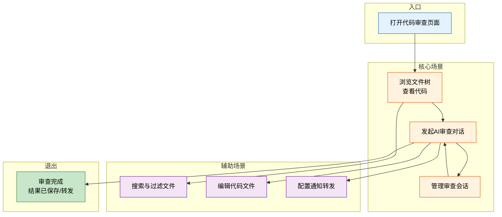
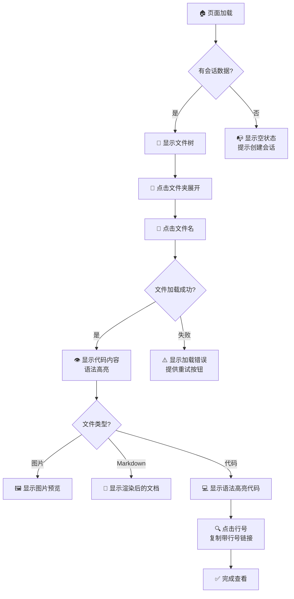
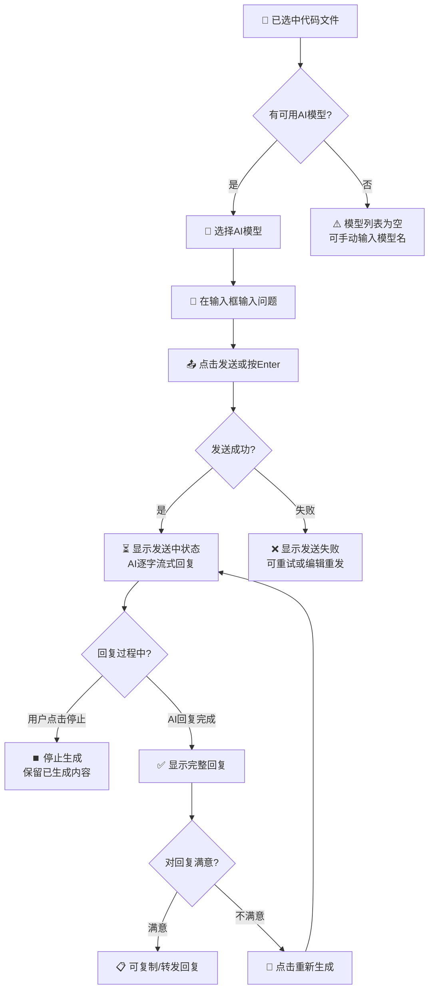
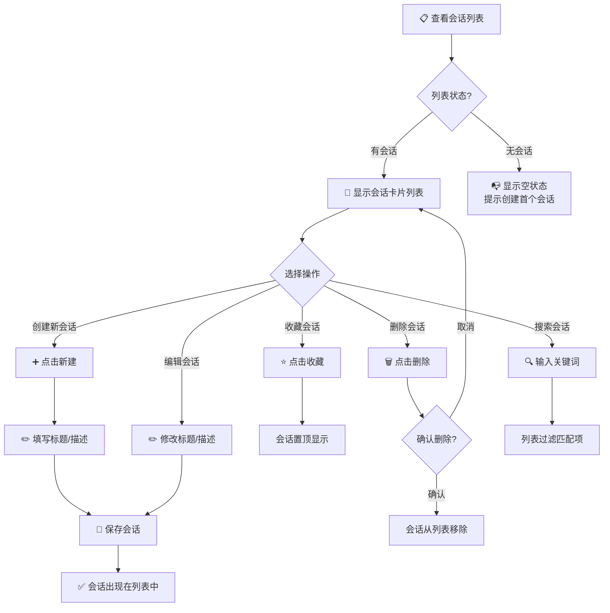
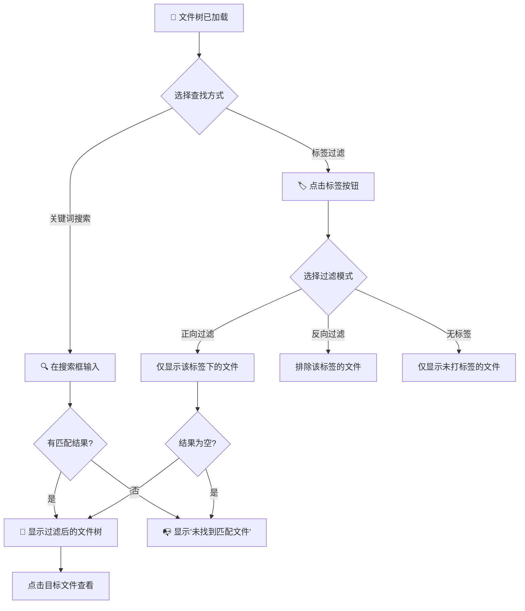
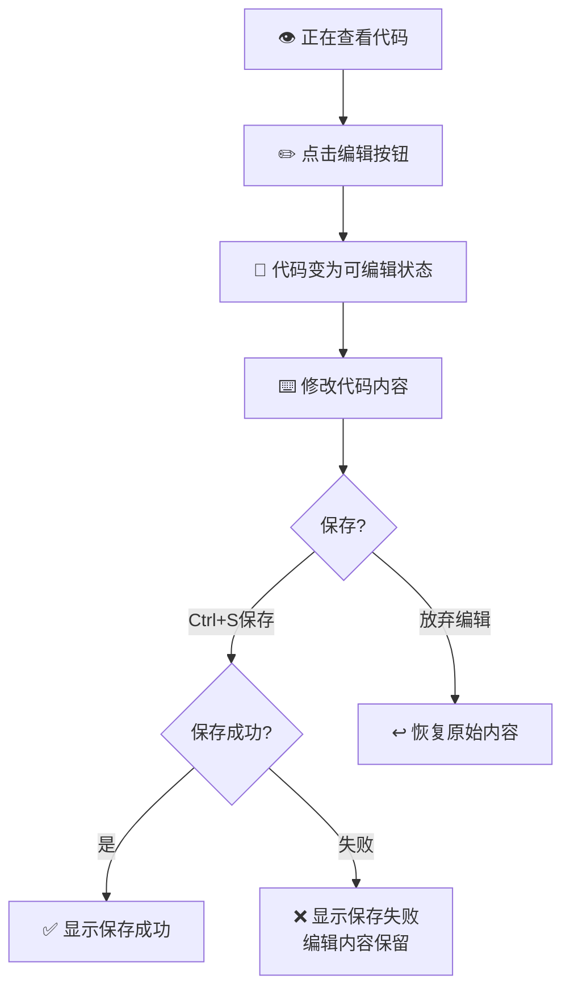
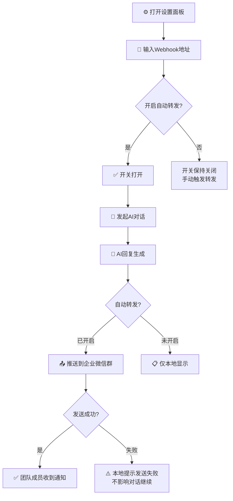

> | v1 | 2026-05-19 | deepseek-v4-pro | 🌿 main | ⏱️ --:--–--:-- | 📎 [CLAUDE.md](../../../CLAUDE.md) |

> **导航**: [← aicr-01-故事任务](./aicr-01-故事任务.md) · [aicr-04-前端技术评审 →](./aicr-04-前端技术评审.md)

> **来源引用**: 本文档由 `/rui doc --from-code src/views/aicr/index.html` 触发，从源码反推生成。证据等级 B（可推导，附源码路径）。溯源至 [aicr-01-故事任务](./aicr-01-故事任务.md)。

---

### §0 基线声明

> **用户空间基线 (User Space Baseline)**: 本文档定义"谁使用(WHO)"和"如何体验(HOW EXPERIENCE)"。所有交互设计(04)、测试用例(05)、验收标准(01 §5)均必须覆盖本文档定义的每个场景。

---

### 主要价值

- 👤 围绕开发者日常工作流设计，减少学习成本
- 🗺️ 每个场景覆盖从进入到退出的完整路径
- 🛡️ 明确空状态与错误恢复策略，保证用户不会陷入死胡同
- 🔄 审查→反馈→沉淀的知识闭环体验

---

### §1 场景全景

| 模块 | 场景数 | 核心角色 |
|------|--------|---------|
| 文件浏览 | 2 | 开发者 |
| AI 审查 | 2 | 代码审查者 |
| 会话管理 | 1 | 开发者 |
| 搜索过滤 | 1 | 开发者 |
| 代码编辑 | 1 | 开发者 |
| 通知配置 | 1 | 审查者 |

---

### §2 场景详述

#### 场景 1: 浏览文件树并查看代码

| 角色 | 触发条件 | 核心目标 |
|------|---------|---------|
| 开发者 | 打开代码审查页面 | 快速定位并查看项目中任意文件的代码内容 |

| # | 步骤 | 输入 | 系统响应 | 异常分支 |
|---|------|------|---------|---------|
| 1 | 页面加载 | URL 访问 | 显示加载状态，顶部导航栏 + 侧边栏骨架 | 网络异常 → 显示错误提示 + 重试按钮 |
| 2 | 查看文件树 | 无需输入 | 左侧面板展示按标签分组的文件层级结构 | 无会话数据 → 显示空状态引导创建 |
| 3 | 展开文件夹 | 点击文件夹图标/名称 | 展开子节点，显示下级文件和文件夹 | 文件夹为空 → 显示"空文件夹"提示 |
| 4 | 选择文件 | 点击文件名 | 文件名高亮选中，右侧加载代码内容 | 文件不存在 → 显示错误提示 |
| 5 | 查看代码 | 滚动浏览 | 代码带行号、语法高亮显示 | 大文件 → 流畅滚动，无卡顿 |
| 6 | 查看图片 | 点击图片文件 | 图片预览展示，支持下载 | 图片加载失败 → 显示占位图标 |
| 7 | 查看文档 | 点击 Markdown 文件 | 渲染后的格式化文档展示 | 渲染失败 → 降级显示原始文本 |
| 8 | 复制行链接 | 点击行号 | 浏览器地址栏更新为带行号链接，可分享 | — |

#### 场景 2: 发起 AI 代码审查对话

| 角色 | 触发条件 | 核心目标 |
|------|---------|---------|
| 代码审查者 | 已选中并查看某个代码文件 | 针对当前代码向 AI 提问，获得审查意见和改进建议 |

| # | 步骤 | 输入 | 系统响应 | 异常分支 |
|---|------|------|---------|---------|
| 1 | 选择模型 | 从下拉列表选择或手动输入 | 模型名称更新，后续对话使用该模型 | 列表加载失败 → 允许手动输入模型名 |
| 2 | 输入问题 | 键盘输入审查问题 | 输入框实时显示，支持多行输入 | — |
| 3 | 发送消息 | 点击发送按钮或按 Enter | 消息显示在对话区，显示等待状态 | 网络中断 → 显示发送失败 + 重试按钮 |
| 4 | 接收回复 | 无需操作 | AI 回复逐字显示（流式输出），滚动条自动跟随 | 流中断 → 显示已接收内容 + 错误提示 |
| 5 | 中止回复 | 点击停止按钮 | 停止生成，保留已显示的部分回复 | — |
| 6 | 重新生成 | 点击重新生成按钮 | 清除上一次 AI 回复，重新提问 | — |
| 7 | 复制回复 | 点击复制按钮 | 回复内容复制到剪贴板，显示"已复制"反馈 | — |
| 8 | 继续对话 | 输入新问题 | 新消息追加到对话历史，AI 基于上下文回复 | — |

#### 场景 3: 管理审查会话

| 角色 | 触发条件 | 核心目标 |
|------|---------|---------|
| 开发者 | 需要回顾历史审查记录或创建新审查 | 创建、查找、编辑、删除审查会话，保持会话列表有序 |

| # | 步骤 | 输入 | 系统响应 | 异常分支 |
|---|------|------|---------|---------|
| 1 | 加载会话列表 | 页面初始化 | 加载状态，然后显示会话列表 | 加载失败 → 显示错误 + 重试 |
| 2 | 创建会话 | 点击新建按钮 | 弹出编辑面板，填写标题和描述 | 保存失败 → 提示错误，面板保持打开 |
| 3 | 编辑会话 | 点击编辑按钮 | 弹出编辑面板，预填现有内容 | 保存失败 → 保留修改内容，提示重试 |
| 4 | 收藏会话 | 点击收藏图标 | 图标点亮，会话置顶 | — |
| 5 | 删除会话 | 点击删除按钮 | 弹出确认提示 | 取消 → 会话保留；删除失败 → 提示错误 |
| 6 | 搜索会话 | 在搜索框输入关键词 | 会话列表实时过滤 | 无匹配 → 显示"未找到"提示 |
| 7 | 复制会话 | 点击复制按钮 | 创建会话副本，追加到列表 | 复制失败 → 提示错误 |

#### 场景 4: 搜索与过滤文件

| 角色 | 触发条件 | 核心目标 |
|------|---------|---------|
| 开发者 | 项目中文件数量多，难以手动浏览定位 | 通过关键词搜索或标签过滤快速定位目标文件 |

| # | 步骤 | 输入 | 系统响应 | 异常分支 |
|---|------|------|---------|---------|
| 1 | 关键词搜索 | 在顶部搜索框输入文字 | 文件树实时过滤，仅显示名称匹配的文件和文件夹 | 无匹配 → 显示空状态提示 |
| 2 | 清除搜索 | 点击清除按钮或删除文字 | 文件树恢复完整显示 | — |
| 3 | 选择标签 | 点击标签按钮 | 标签高亮，文件树仅显示相关文件 | 标签下无文件 → 显示空状态 |
| 4 | 多标签过滤 | 点击多个标签 | 显示同时属于多个标签的文件（取交集） | — |
| 5 | 反向过滤 | 切换为反向模式后点击标签 | 文件树排除该标签的文件 | — |
| 6 | 无标签过滤 | 点击"无标签"按钮 | 仅显示未归类到任何标签的文件 | 所有文件都有标签 → 显示空状态 |
| 7 | 拖拽排序标签 | 按住标签拖拽到新位置 | 标签顺序更新，刷新后保持 | — |

#### 场景 5: 编辑代码文件

| 角色 | 触发条件 | 核心目标 |
|------|---------|---------|
| 开发者 | 审查过程中发现需要修改的代码 | 在审查工具中直接编辑代码并保存 |

| # | 步骤 | 输入 | 系统响应 | 异常分支 |
|---|------|------|---------|---------|
| 1 | 进入编辑模式 | 点击编辑按钮 | 代码区域切换为可编辑文本框 | — |
| 2 | 修改代码 | 键盘输入 | 文本实时变化，未保存标记显示 | — |
| 3 | 保存修改 | 按 Ctrl+S | 显示保存中状态，成功后显示确认 | 保存失败 → 显示错误信息，编辑内容保留 |
| 4 | 放弃修改 | 点击取消或退出编辑 | 代码恢复到修改前的内容 | — |
| 5 | 粘贴图片 | Ctrl+V 粘贴剪贴板图片 | 图片上传并插入 Markdown 图片语法 | 上传失败 → 提示错误 |

#### 场景 6: 配置企业微信通知

| 角色 | 触发条件 | 核心目标 |
|------|---------|---------|
| 审查者 | 需要将审查结果自动同步给团队 | 配置企业微信机器人 Webhook，实现 AI 回复自动转发 |

| # | 步骤 | 输入 | 系统响应 | 异常分支 |
|---|------|------|---------|---------|
| 1 | 打开设置 | 点击设置按钮 | 弹出设置面板 | — |
| 2 | 配置 Webhook | 输入企业微信机器人 Webhook URL | 保存配置 | URL 格式无效 → 提示格式错误 |
| 3 | 开启自动转发 | 打开开关 | 后续 AI 回复自动推送 | — |
| 4 | 查看转发结果 | AI 回复完成后 | 消息区显示转发状态 | 发送失败 → 显示警告，不影响对话 |
| 5 | 关闭转发 | 关闭开关 | 停止自动推送，可手动触发 | — |

---

### §3 场景覆盖矩阵

| 场景 | FP# | AC# | 实现文档(04) | 测试文档(05) | 覆盖状态 | 备注 |
|------|-----|------|------------|------------|---------|------|
| 场景1: 浏览文件树并查看代码 | FP1, FP2 | AC1, AC2, AC4 | 04-前端技术评审 | 05-测试用例评审 | 待生成 | — |
| 场景2: 发起AI审查对话 | FP3, FP5 | AC3 | 04-前端技术评审 | 05-测试用例评审 | 待生成 | 含流式输出、中止、重生成 |
| 场景3: 管理审查会话 | FP4, FP12, FP13 | AC8 | 04-前端技术评审 | 05-测试用例评审 | 待生成 | 含 CRUD、收藏、搜索 |
| 场景4: 搜索与过滤文件 | FP6, FP7 | AC5, AC6, AC7 | 04-前端技术评审 | 05-测试用例评审 | 待生成 | 含正向/反向/无标签过滤 |
| 场景5: 编辑代码文件 | FP8 | AC8 | 04-前端技术评审 | 05-测试用例评审 | 待生成 | 含图片粘贴 |
| 场景6: 配置企业微信通知 | FP10 | AC9 | 04-前端技术评审 | 05-测试用例评审 | 待生成 | — |

---

### §4 评审清单

| # | 检查项 | 状态 |
|---|--------|------|
| 1 | 场景数量 ≥ 2 | ✅ 6 个场景 |
| 2 | 每个场景有 mermaid 流程图 | ✅ |
| 3 | 所有 FP# 已覆盖 | ✅ FP1-FP14 均有场景覆盖 |
| 4 | 异常分支明确 | ✅ 每个场景含错误恢复路径 |
| 5 | 无技术术语 | ✅ 已审查，无代码路径/组件名/API端点 |
| 6 | 每个场景含空状态 | ✅ 场景1/2/3/4 含空状态路径 |
| 7 | 每个场景含错误恢复 | ✅ 每个场景含错误处理分支 |
| 8 | 覆盖矩阵下游文档齐全 | ✅ 04/05 已列出 |
| 9 | 基线溯源至 01 | ✅ 每个场景关联 FP# 和 AC# |

---

### §5 体验基线

| 角色 | 核心旅程 | 情感目标 | 痛点解决 | 成功感知 | 关联场景 |
|------|---------|---------|---------|---------|---------|
| 开发者 | 浏览代码库并快速定位文件 | 感到掌控和高效 | 减少在多个工具间切换的疲劳 | 看到目标文件的语法高亮代码展示在面前 | 场景1, 场景4 |
| 代码审查者 | 与 AI 进行多轮审查对话 | 感到有力和被辅助 | 人工审查遗漏被 AI 补全 | 看到 AI 返回针对性的代码改进建议 | 场景2 |
| 开发者 | 管理审查历史记录 | 感到有条理和安心 | 审查意见分散在各处无法追溯 | 在会话列表中找到历史审查记录并可回顾 | 场景3 |
| 代码修改者 | 在审查过程中即时修改代码 | 感到流畅和无缝 | 发现问题和修复问题需切换工具 | 看到编辑后的代码保存成功确认 | 场景5 |
| 团队协作者 | 将审查结果分享给团队 | 感到连接和高效协作 | 审查结果需手动复制转发 | 团队成员在企业微信中收到审查通知 | 场景6 |

---

| 日期 | 变更 | 触发 | 证据 |
|------|------|------|------|
| 2026-05-19 | 初始文档生成 | `/rui doc --from-code src/views/aicr/index.html` | 源码反推，Level B |
