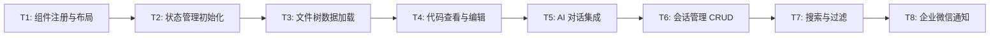
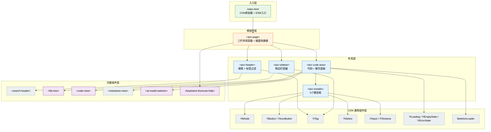
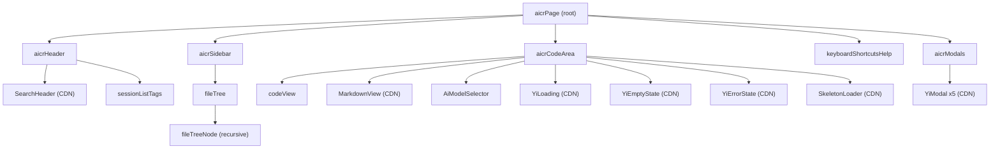
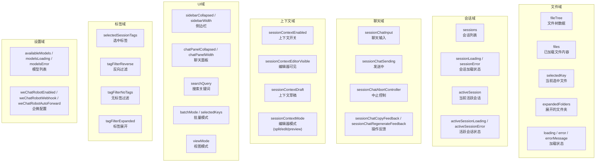
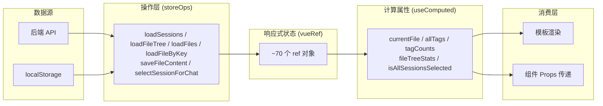
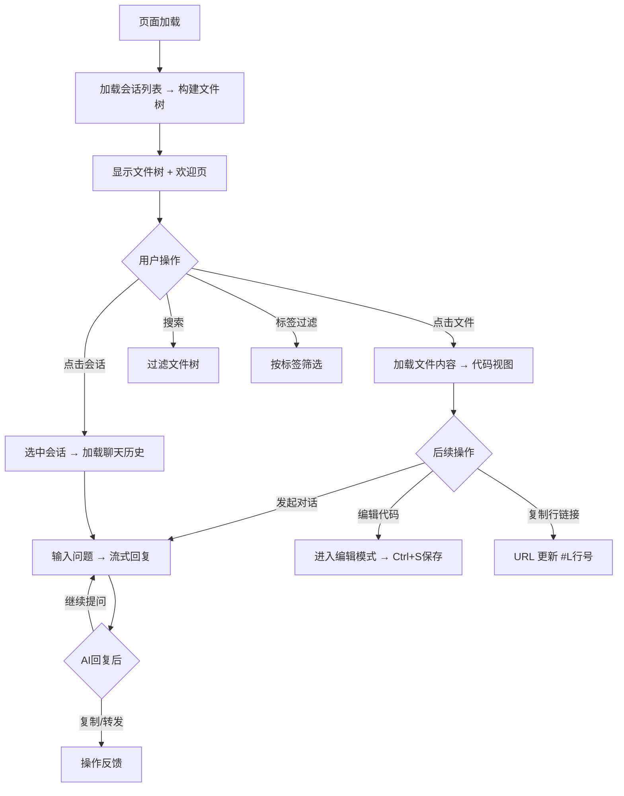

> | v1 | 2026-05-19 | deepseek-v4-pro | 🌿 main | ⏱️ --:--–--:-- | 📎 [CLAUDE.md](../../../CLAUDE.md) |

> **导航**: [← aicr-02-用户使用场景](./aicr-02-用户使用场景.md) · [aicr-05-测试用例评审 →](./aicr-05-测试用例评审.md)

> **来源引用**: 本文档由 `/rui doc --from-code src/views/aicr/index.html` 触发，从源码反推生成。证据等级 B（可推导，附源码路径）。

---

### 主要价值

- 🧩 组件树清晰，22 个组件按业务/通用分层注册
- 🔄 状态管理采用中心化 store + vueRef 响应式，单向数据流
- 🎨 设计系统变量驱动样式（CSS 自定义属性），支持暗色主题
- ⚡ 零构建链，浏览器原生 ESM 加载，无打包开销

---

### §0 设计决策与任务规划

#### §0.0 基线溯源

| 本设计章节 | 实现 01 需求 | 服务 02 场景 | 覆盖状态 |
|-----------|------------|------------|---------|
| §1 组件架构 | FP1, FP2, FP3 | 场景1, 场景2 | 已覆盖 |
| §2 状态管理 | FP1-FP14 | 全场景 | 已覆盖 |
| §3 交互设计 | FP3, FP6, FP7, FP11 | 场景2, 场景4 | 已覆盖 |
| §4 样式方案 | FP1, FP2 | 场景1 | 已覆盖 |
| §5 DOM 与事件 | FP11, FP1 | 场景1, 场景2 | 已覆盖 |
| §6 依赖与加载 | FP1, FP2, FP3 | 场景1 | 已覆盖 |

#### §0.1 设计决策

| 决策领域 | 选定方案 | 选择理由 | 详见 | 实现 01 FP# |
|---------|---------|---------|------|------------|
| 视图框架 | 自研 `createBaseView`（Vue Options API 风格） | 零构建链约束，无需编译；浏览器原生 ESM | `cdn/utils/view/baseView.js` | FP1-FP14 |
| 状态管理 | `vueRef` 响应式 + 中心化 store 工厂 | 兼容 Vue 3 响应式系统，支持 computed/methods 分离 | `hooks/state/storeFactory.js` | FP1-FP14 |
| 模块规范 | ESM (import/export) | 零构建约束，浏览器原生支持 | — | — |
| 组件注册 | `createBaseView` 的 components + componentModules 数组 | 声明式注册，路径即模块标识 | `index.js:25-74` | FP1 |
| 样式方案 | CSS `@import` + 设计系统 CSS 变量 | 零构建下最简样式隔离方案 | `styles/index.css` | FP1, FP2 |
| 第三方库 | CDN 加载 Vue 3.5.26 + marked.js + mermaid | 无需 npm，CDN 提供 ESM/UMD 版本 | `index.html:16-21` | FP2, FP3 |
| API 通信 | 封装 fetch + 统一认证头 + 401 处理 | 满足安全面要求 | `src/core/services/` | FP3, FP4 |

#### §0.2 任务规划



| ID | 描述 | 工作量 | 依赖 | 交付物 | Agent | 门禁 | 交接下游 | 实现 01 FP# |
|----|------|--------|------|--------|-------|------|---------|------------|
| T1 | 创建 `createBaseView` 实例，注册 22 个组件，搭建三栏布局 | M | — | `index.js` + `aicrPage` 组件 | coder | Gate A | T2 | FP1 |
| T2 | 创建 store（~70 个响应式状态），computed/methods 模块挂载 | L | T1 | `hooks/state/` + `hooks/computed/` + `hooks/methods/` | coder | Gate A | T3 | FP1-FP14 |
| T3 | 实现文件树加载、构建、CRUD、搜索过滤 | L | T2 | `storeFileTreeOps.js` + `fileTree` 组件 | coder | Gate A | T4 | FP1, FP6, FP7 |
| T4 | 实现代码查看（语法高亮/图片/Markdown）、编辑保存 | L | T3 | `codeView` 组件 + `storeFileContentOps.js` | coder | Gate A | T5 | FP2, FP8 |
| T5 | 实现 AI 对话（发送/流式接收/中止/重生成）、模型选择 | L | T4 | `sessionChatContext*.js` + `AiModelSelector` | coder | Gate A | T6 | FP3, FP5 |
| T6 | 实现会话列表 CRUD、收藏、复制、导入导出、FAQ | L | T5 | `sessionListMethods.js` + `sessionActionMethods.js` + `sessionFaqMethods.js` | coder | Gate B | T7 | FP4, FP12, FP13, FP14 |
| T7 | 实现关键词搜索、标签过滤（正向/反向/无标签）、拖拽排序 | M | T6 | `searchMethods.js` + `tagFilterMethods.js` + `tagManagerMethods.js` | coder | Gate B | T8 | FP6, FP7 |
| T8 | 实现企业微信 Webhook 配置、自动转发 | S | T7 | `sessionChatContextSettingsMethods.js` + `aicrModals` | coder | Gate B | — | FP10 |

---

### §1 组件架构

#### 效果示意



#### 1.1 组件树



#### 1.2 组件清单

| 组件 | 类型 | 文件 | 注册路径 | 变更 |
|------|------|------|---------|------|
| aicrPage | 业务（新） | `src/views/aicr/components/aicrPage/index.js` | `createBaseView` components | 由源码反推 |
| aicrHeader | 业务（新） | `src/views/aicr/components/aicrHeader/index.js` | `createBaseView` components | 由源码反推 |
| aicrSidebar | 业务（新） | `src/views/aicr/components/aicrSidebar/index.js` | `createBaseView` components | 由源码反推 |
| aicrCodeArea | 业务（新） | `src/views/aicr/components/aicrCodeArea/index.js` | `createBaseView` components | 由源码反推 |
| aicrModals | 业务（新） | `src/views/aicr/components/aicrModals/index.js` | `createBaseView` components | 由源码反推 |
| fileTree | 业务（新） | `src/views/aicr/components/fileTree/index.js` | `createBaseView` components | 由源码反推 |
| codeView | 业务（新） | `src/views/aicr/components/codeView/index.js` | `createBaseView` components | 由源码反推 |
| AiModelSelector | 业务（新） | `src/views/aicr/components/AiModelSelector/index.js` | `createBaseView` components | 由源码反推 |
| keyboardShortcutsHelp | 业务（新） | `src/views/aicr/components/keyboardShortcutsHelp/index.js` | `createBaseView` components | 由源码反推 |
| sessionListTags | 业务（新） | `src/views/aicr/components/sessionListTags/index.js` | `createBaseView` components | 由源码反推 |
| YiModal | CDN 通用 | `cdn/components/common/modals/YiModal/index.js` | `createBaseView` components | 已有 |
| YiLoading | CDN 通用 | `cdn/components/common/loaders/YiLoading/index.js` | `createBaseView` components | 已有 |
| YiEmptyState | CDN 通用 | `cdn/components/common/feedback/YiEmptyState/index.js` | `createBaseView` components | 已有 |
| YiErrorState | CDN 通用 | `cdn/components/common/feedback/YiErrorState/index.js` | `createBaseView` components | 已有 |
| YiIcon | CDN 通用 | `cdn/icons/YiIcon/index.js` | `createBaseView` components | 已有 |
| YiIconButton | CDN 通用 | `cdn/components/common/buttons/YiIconButton/index.js` | `createBaseView` components | 已有 |
| YiButton | CDN 通用 | `cdn/components/common/buttons/YiButton/index.js` | `createBaseView` components | 已有 |
| YiTag | CDN 通用 | `cdn/components/common/tags/YiTag/index.js` | `createBaseView` components | 已有 |
| YiSelect | CDN 通用 | `cdn/components/common/forms/YiSelect/index.js` | `createBaseView` components | 已有 |
| YiInput | CDN 通用 | `cdn/components/common/forms/YiInput/index.js` | `createBaseView` components | 已有 |
| YiTextarea | CDN 通用 | `cdn/components/common/forms/YiTextarea/index.js` | `createBaseView` components | 已有 |
| SearchHeader | CDN 业务 | `cdn/components/business/SearchHeader/index.js` | `createBaseView` components | 已有 |
| MarkdownView | CDN 业务 | `cdn/components/business/MarkdownView/index.js` | `createBaseView` components | 已有 |
| SkeletonLoader | CDN 业务 | `cdn/components/business/SkeletonLoader/index.js` | `createBaseView` components | 已有 |

#### 1.3 组件接口

| 组件 | Props | Events | Expose |
|------|-------|--------|--------|
| aicrHeader | `allTags`, `selectedTags`, `tagFilterReverse`, `tagFilterNoTags`, `tagFilterExpanded`, `tagFilterSearchKeyword`, `tagCounts`, `tagFilterVisibleCount`, `searchQuery`, `sidebarCollapsed` — 详见 [aicr-header 故事 04](../aicr-header/YiWeb-04-前端技术评审.md) | `select-tag`, `remove-tag`, `toggle-reverse`, `toggle-no-tags`, `toggle-expand`, `search-tags`, `load-more-tags`, `update-search-query`, `clear-search`, `reorder-tags` — 详见 [aicr-header 故事 04](../aicr-header/YiWeb-04-前端技术评审.md) | — |
| aicrSidebar | (通过 viewContext) | `file-select`, `folder-toggle`, `batch-select`, `batch-mode-toggle`, `batch-delete`, `create-folder`, `create-file`, `rename-item`, `delete-item`, `file-drop`, `update:collapsed`, `create-faq-from-file`, `create-faq-from-session`, `search-query-change` | — |
| aicrCodeArea | (通过 viewContext) | `send-message`, `stop-generation`, `regenerate-message`, `copy-message`, `delete-message`, `edit-message`, `save-context`, `optimize-context`, `translate-context`, `toggle-context-editor`, `select-model`, `refresh-models`, `toggle-settings`, `toggle-wechat`, `edit-session`, `delete-session`, `toggle-favorite`, `create-session`, `select-session`, `import-sessions`, `export-sessions` | — |
| fileTree | `tree`, `selectedKey`, `expandedFolders`, `loading`, `error`, `collapsed`, `searchQuery`, `batchMode`, `selectedKeys`, `viewMode`, `selectedTags`, `tagFilterReverse`, `tagFilterNoTags`, `tagFilterExpanded`, `tagFilterSearchKeyword`, `tagFilterVisibleCount` | 18 个事件（同 aicrSidebar） | — |
| codeView | (通过 viewContext: `currentFile`, `searchQuery`, `batchMode`, `viewMode`) | `file-save`, `file-edit`, `image-paste`, `line-click`, `open-markdown-file` | — |
| AiModelSelector | `availableModels`, `modelsLoading`, `modelsError` | `select-model`, `refresh-models` | — |
| keyboardShortcutsHelp | `visible` | `close` | — |

---

### §2 状态管理

#### 2.1 状态定义



#### 2.2 状态流向



| 数据流 | 触发源 | 状态变更 | 消费方 |
|--------|--------|---------|--------|
| 会话列表加载 | `onMounted` → `store.loadSessions()` | `sessions`, `sessionLoading`, `sessionError` | `aicrSidebar`（会话列表视图） |
| 文件树构建 | `loadSessions().then()` → `store.loadFileTree()` | `fileTree`, `loading`, `errorMessage` | `fileTree` 组件 |
| 文件内容加载 | 用户点击文件 → `store.loadFileByKey(key)` | `files`, `selectedKey` | `codeView` 组件 |
| 文件保存 | Ctrl+S → `saveFileContent()` | `files`（更新缓存） | `codeView` 组件 |
| AI 对话 | 用户发送消息 → `sendSessionChatMessage()` | `sessionChatSending`, `sessionChatAbortController` | `aicrCodeArea` 模板 |
| 侧边栏宽度 | 拖拽 → `createSidebarResizers()` | `sidebarWidth`, `chatPanelWidth` + localStorage | CSS 变量 `--aicr-chat-width` |
| 标签过滤 | 点击标签 → `toggleTag()` | `selectedSessionTags`, `tagFilterReverse` | `fileTree` 组件 |
| 会话选择 | 点击会话 → `selectSessionForChat()` | `activeSession`, `activeSessionLoading` | `aicrCodeArea`（聊天面板） |

---

### §3 交互设计

#### 3.1 用户操作流



#### 3.2 视图状态矩阵

| 视图 | 正常 | 加载 | 空 | 错误 | 禁用 |
|------|------|------|-----|------|------|
| 文件树 | 显示标签分组的层级树 | SkeletonLoader 骨架屏 | "暂无文件，请创建会话" | "加载失败，点击重试" | — |
| 代码视图 | 语法高亮代码 + 行号 | SkeletonLoader 骨架屏 | "请选择一个文件查看" | "文件加载失败，点击重试" | 编辑模式下控件禁用 |
| 聊天面板 | 对话气泡列表 | 发送中动画（打字指示器） | 欢迎卡片（快捷操作引导） | "消息发送失败，点击重试" | 发送中禁用输入框 |
| 会话列表 | 会话卡片列表 | SkeletonLoader 骨架屏 | "暂无审查会话，点击创建" | "加载失败，点击重试" | — |
| 模型选择器 | 下拉列表 | 加载中状态 | 列表为空时显示手动输入框 | 加载失败提示 + 手动输入 | 对话进行中禁用切换 |
| 标签过滤 | 标签按钮列表 | — | 无标签时隐藏过滤栏 | — | — |
| FAQ 面板 | FAQ 条目列表 | 加载中 | "暂无 FAQ" | 加载失败提示 | — |
| 设置面板 | 表单控件 | 保存中 | — | 保存失败提示 | — |

#### 3.3 动画

| 元素 | 类型 | 时长 | 触发条件 |
|------|------|------|---------|
| 侧边栏宽度变化 | CSS transition | `--yi-duration-fast` | 拖拽调整宽度 |
| 操作按钮 hover | CSS transform + box-shadow | `--yi-duration-fast` | 鼠标悬停 |
| 行复制按钮 | opacity + transform | `--yi-duration-fast` | 鼠标悬停代码行 |
| 未保存指示器 | CSS animation (pulse) | 循环 | 文件未保存 |
| 全屏模式切换 | CSS transition | `--yi-duration-normal` | 进入/退出全屏 |
| 模态框打开/关闭 | CSS transition | `--yi-duration-normal` | 打开/关闭模态框 |

---

### §4 样式方案

#### 4.1 策略

| 场景 | 方案 | 说明 |
|------|------|------|
| 全局样式 | CSS 自定义属性（设计系统） | `var(--yi-*)` 变量定义在 `cdn/styles/theme.css`，统一暗色主题 |
| 视图样式 | `@import` 链式加载 | `styles/index.css` → `layout.css` + `codePage.css` + `welcomeCard.css` + `codePage.contextModals.css` |
| 组件样式 | 每个组件独立 CSS 文件 | 通过 `@import` 在视图样式或组件注册时加载 |
| 布局 | CSS Flexbox + CSS 自定义属性 | 三栏布局：侧边栏(固定) + 代码区(flex) + 聊天面板(固定) |
| 响应式 | 单断点 950px | 侧边栏在小屏幕变为相对定位 |
| 可访问性 | `prefers-reduced-motion` 媒体查询 | 减少动画偏好时禁用 transition/transform |
| 字体 | Google Fonts CDN | Inter (UI) + JetBrains Mono (代码) |
| 图标 | Font Awesome 6.4.0 CDN | 统一图标库 |

#### 4.2 样式文件

| 文件 | 用途 | 加载方式 |
|------|------|---------|
| `cdn/styles/index.css` | 设计系统基础 + reset | `@import` 在 `src/views/aicr/styles/index.css:1` |
| `cdn/styles/theme.css` | CSS 自定义属性定义 | 间接加载 |
| `src/views/aicr/styles/index.css` | 主样式入口（`@import` 聚合） | `<link>` 在 `index.html:11` |
| `src/views/aicr/styles/layout.css` | 三栏布局样式 | `@import` |
| `src/views/aicr/styles/codePage.css` | 代码显示区域样式 | `@import` |
| `src/views/aicr/styles/codePage.contextModals.css` | 上下文编辑器模态框样式 | `@import` |
| `src/views/aicr/styles/welcomeCard.css` | 欢迎卡片样式 | `@import` |
| `src/views/aicr/components/aicrPage/index.css` | 根页面组件样式 | `@import` |
| `src/views/aicr/components/aicrHeader/index.css` | 头部组件样式 | `@import` |
| `src/views/aicr/components/aicrSidebar/index.css` | 侧边栏组件样式 | `@import` |
| `src/views/aicr/components/aicrCodeArea/index.css` | 代码区域样式 | `@import` |
| `src/views/aicr/components/aicrModals/index.css` | 模态框样式 | `@import` |
| `src/views/aicr/components/keyboardShortcutsHelp/index.css` | 快捷键帮助面板样式 | `@import` |

---

### §5 DOM 与事件

#### 5.1 挂载点

| 组件 | 容器 | 创建方式 | 生命周期 |
|------|------|---------|---------|
| aicr-page | `#app` > `<aicr-page>` | `createBaseView` 模板渲染 | 页面级，与 app 同生命周期 |
| aicr-header | `<aicr-page>` 内 | 模板渲染 `<aicr-header>` | 随父组件 |
| aicr-sidebar | `<aicr-page>` 内 | 模板渲染 `<aicr-sidebar>` | 随父组件 |
| aicr-code-area | `<aicr-page>` 内 | 模板渲染 `<aicr-code-area>` | 随父组件 |
| aicr-modals | `<aicr-code-area>` 内 | 模板渲染 `<aicr-modals>` | 随父组件 |
| keyboard-shortcuts-help | `<aicr-page>` 内 | 模板渲染 + `v-if="showKeyboardShortcuts"` | 条件渲染 |
| code-view | `<aicr-code-area>` 内 | 模板渲染 `<code-view>` | 随父组件 |
| file-tree | `<aicr-sidebar>` 内 | 模板渲染 `<file-tree>` | 随父组件 |

#### 5.2 事件

| 事件 | 监听方式 | 处理逻辑 | 清理时机 |
|------|---------|---------|---------|
| `keydown` (?) | `window.addEventListener` 在 `aicrPage.onMounted` | 切换 `showKeyboardShortcuts` | 组件销毁 |
| `mousedown` (拖拽条) | `createSidebarResizers()` 中 DOM 事件 | 计算并更新侧边栏/聊天面板宽度 | 窗口 `mouseup` |
| `beforeunload` | `window.addEventListener` | 清理 welcome-card 事件绑定定时器 | 页面卸载 |
| `keydown` (Ctrl+S) | codeView 组件内 | 触发文件保存 | 组件内生命周期 |
| `compositionstart/compositionend` | 输入框 DOM 事件 | 处理中文输入法组合状态 | 组件内生命周期 |
| `paste` (图片) | codeView 内 | 上传剪贴板图片到 OSS | 组件内生命周期 |
| `click` (行号) | codeView 内事件委托 | 更新 URL hash + 复制链接 | 组件内生命周期 |
| `setupAicrEventListeners` | `listenerManager.js` | 统一注册 AICR 全局事件 | — |

---

### §6 依赖与加载

#### 6.1 加载顺序

```
1. CSS 文件（外链样式）
   ├── index.css → @import 链（设计系统 + 视图样式 + 组件样式）
   ├── Google Fonts (Inter + JetBrains Mono)
   └── Font Awesome 6.4.0

2. CDN JS 库（全局变量）
   ├── Vue 3.5.26 (vue.global.prod.js)
   ├── marked.js 9.1.6
   └── Mermaid.js 10.9.1

3. ESM 入口（type="module"）
   ├── src/core/config.js（配置初始化）
   ├── src/views/aicr/index.js（应用入口）
   └── cdn/utils/core/performance.js（性能监控）
```

#### 6.2 模块注册

| 文件 | 注册到 | 类型 |
|------|--------|------|
| `src/views/aicr/index.js` | `window.aicrApp` + `window.aicrStore` | 全局入口 |
| 22 个组件模块 | `createBaseView` 的 `componentModules` 数组 | 组件注册 |
| `hooks/state/storeFactory.js` | `createStore()` → `window.aicrStore` | Store 工厂 |
| `hooks/computed/useComputed.js` | `createBaseView` 的 `useComputed` | 计算属性 |
| `hooks/useMethods.js` | `createBaseView` 的 `useMethods` | 方法集合 |
| `hooks/mainPageMethods.js` | `createBaseView` 的 `methods` | 事件处理方法 |

---

### §7 评审清单

| # | 检查项 | 状态 |
|---|--------|------|
| 1 | 组件命名空间不冲突（22 个组件的 HTML 标签名唯一） | ✅ |
| 2 | 资源注册路径正确（componentModules 路径可解析） | ✅ |
| 3 | 状态变更走 store mutation（不跨组件直接修改 vueRef） | ✅ |
| 4 | 样式隔离（每个组件独立 CSS 文件，通过 @import 加载） | ✅ |
| 5 | 事件清理（beforeunload 清理定时器，组件内事件有生命周期管理） | ✅ |
| 6 | 加载顺序正确（CSS → CDN JS → ESM 入口） | ✅ |
| 7 | 模块语法合规（浏览器原生 ESM，无 TS/JSX） | ✅ |
| 8 | 样式文件注册完整（7 个 @import + 4 个组件 @import） | ✅ |
| 9 | 基线溯源完备（每章节映射至 01 FP# 和 02 场景） | ✅ |
| 10 | 效果示意完整（mermaid 组件交互全景图） | ✅ |

---

| 日期 | 变更 | 触发 | 证据 |
|------|------|------|------|
| 2026-05-19 | 初始文档生成 | `/rui doc --from-code src/views/aicr/index.html` | 源码反推，Level B |
| 2026-05-19 | aicrHeader 接口添加独立故事交叉引用 → aicr-header | `/rui aicrHeader 应该单独拆成一个故事目录` | feat/aicr-header 分支 |
