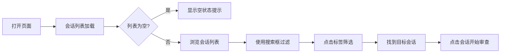
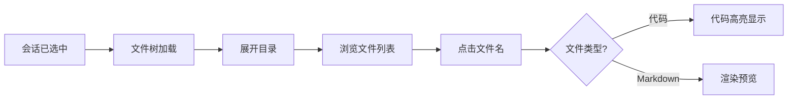
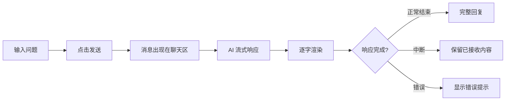
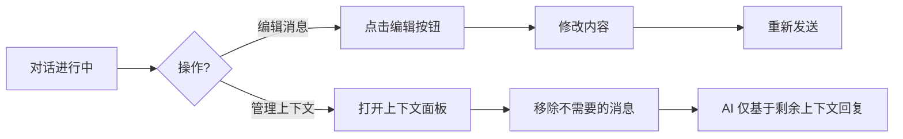

> | v1.0.0 | 2026-05-22 | deepseek-v4-pro | 🌿 feat/aicr | ⏱️ — | 📎 [CLAUDE.md](../../../CLAUDE.md) |

> **导航**: [← YiWeb-故事任务](./YiWeb-故事任务.md) · [YiWeb-技术评审 →](./YiWeb-技术评审.md)

> **来源引用**: 基于 [YiWeb-故事任务](./YiWeb-故事任务.md) §1 Story 1–5。

---

### 主要价值

- 🎯 完整用户旅程 — 从打开页面到完成代码审查的全流程
- 🔒 异常覆盖 — 加载失败/网络中断/空状态/大数据量
- ⚡ 每场景含流程图 — 操作步骤可视化
- 📊 场景覆盖矩阵 — 显式溯源至 FP# 和 AC#

---

## §1 使用场景

### 场景 1: 审查者浏览和查找会话

**角色**: 代码审查者
**目标**: 快速找到需要审查的会话

| 步骤 | 操作 | 预期 |
|------|------|------|
| 1 | 打开代码审查页面 | 会话列表自动加载，显示加载中状态 |
| 2 | 在搜索框输入项目名 | 列表实时过滤，仅显示匹配的会话 |
| 3 | 点击一个标签 | 列表进一步缩小到含该标签的会话 |
| 4 | 点击目标会话 | 会话高亮选中，文件树和聊天面板加载 |

**空状态**: 无会话时显示引导提示
**错误恢复**: 加载失败显示重试按钮和错误原因

---

### 场景 2: 审查者浏览文件并查看代码

**角色**: 代码审查者
**目标**: 浏览项目文件结构，查看具体代码内容

**空状态**: 会话无关联文件时显示"项目为空"
**错误恢复**: 文件内容加载失败时显示错误占位

---

### 场景 3: 审查者与 AI 讨论代码

**角色**: 代码审查者
**目标**: 在聊天面板中向 AI 提问，获得代码审查建议

**空状态**: 新会话无历史消息，显示欢迎卡片
**错误恢复**: 发送失败时消息保留在输入框，可重新发送

---

### 场景 4: 审查者管理上下文和编辑消息

**角色**: 代码审查者
**目标**: 控制 AI 对话的上下文范围，编辑或撤回消息

---

### 场景 5: 审查者导入项目文件

**角色**: 代码审查者
**目标**: 将本地项目 ZIP 包导入到会话中供审查

**错误恢复**: ZIP 格式无效时提示错误；上传中断时可重新选择

---

## §2 场景覆盖矩阵

| 场景 | 关联 FP# | 关联 AC# | 正常 | 空状态 | 异常 |
|------|---------|---------|:--:|:--:|:--:|
| 场景 1: 浏览查找会话 | FP1–FP5 | AC1, AC2, AC3 | ✅ | ✅ | ✅ |
| 场景 2: 浏览文件查看代码 | FP6, FP7 | AC8 | ✅ | ✅ | ✅ |
| 场景 3: AI 讨论代码 | FP8 | AC4, AC5 | ✅ | ✅ | ✅ |
| 场景 4: 上下文管理 | FP9, FP10 | AC5 | ✅ | — | ✅ |
| 场景 5: 导入项目 | FP11, FP12 | AC4 | ✅ | — | ✅ |

---

> **变更记录**
> | 日期 | 变更 | 触发 | 证据 |
> |------|------|------|------|
> | 2026-05-22 | 初始生成 | /rui doc --from-code aicr | YiWeb-故事任务 §1 |
