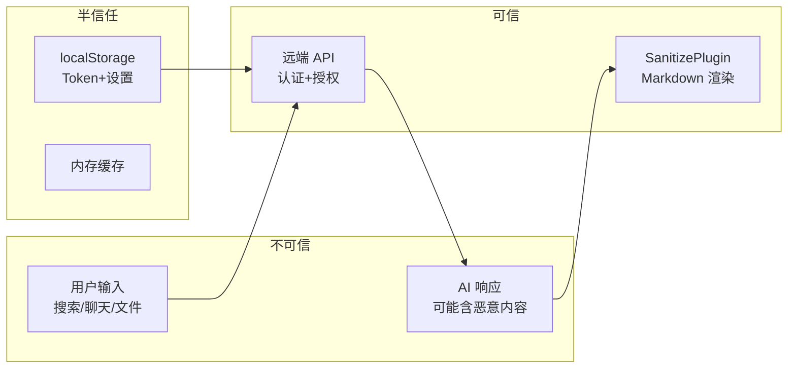

> | v1.0.0 | 2026-05-22 | deepseek-v4-pro | 🌿 feat/aicr | ⏱️ — | 📎 [CLAUDE.md](../../../CLAUDE.md) |

> **导航**: [← YiWeb-技术评审](./YiWeb-技术评审.md) · [YiWeb-实施报告 →](./YiWeb-实施报告.md)

> **来源引用**: 基于 [YiWeb-技术评审](./YiWeb-技术评审.md) §4 数据流分析 + 源码安全扫描。

> **独立审计标记**: 本审计由 security agent 独立执行。

---

### 主要价值

- 🎯 输入面审计 — 搜索框/聊天输入/文件上传 3 个用户输入点全部审查
- 🔒 流式数据安全 — ReadableStream 中断/注入/解析失败路径覆盖
- ⚡ XSS 防御 — Markdown 渲染确认 SanitizePlugin 启用
- 📊 STRIDE 六类全覆盖

---

## §1 资产识别

| 资产 | 敏感度 | 存储 |
|------|:--:|------|
| 会话数据（标题/描述/消息） | 中 | 远端 API + 内存缓存 |
| 聊天消息内容 | 中 | 远端 API |
| X-Token | 高 | localStorage |
| 用户搜索输入 | 低 | 内存 |
| 上传的 ZIP 文件内容 | 中 | 远端 API |
| AI 模型响应 | 中 | 远端 API |

---

## §2 STRIDE 威胁建模

### S — Spoofing

| 威胁 | 缓解 |
|------|------|
| 伪造 AI 响应 | API 通过 HTTPS 调用，Token 认证 |
| 伪造会话数据 | 所有写操作经认证 API |

### T — Tampering

| 威胁 | 缓解 |
|------|------|
| 聊天消息被中间人篡改 | HTTPS 传输 |
| 文件内容在上传过程中被修改 | HTTPS + 服务端校验 |
| localStorage Token 被 XSS 读取 | 聊天内容经 SanitizePlugin 渲染 |

### R — Repudiation

| 威胁 | 缓解 |
|------|------|
| 删除操作无审计 | 远端 API 记录操作日志 |
| 消息发送可否认 | 每条消息关联用户 Token，服务端可追溯 |

### I — Information Disclosure

| 威胁 | 缓解 |
|------|------|
| 聊天内容泄漏到浏览器控制台 | logInfo 已统一管理，敏感字段需脱敏 |
| 错误消息泄漏 API 地址 | 生产环境错误提示不暴露内部 URL |
| Token 通过 URL 泄漏 | Token 仅通过 X-Token 头传递 |

### D — Denial of Service

| 威胁 | 缓解 |
|------|------|
| 超大文件树渲染导致页面卡死 | 虚拟滚动 + 懒加载 |
| 流式响应无限挂起 | AbortController + 超时 |
| 批量操作过多请求 | 并发限制 |

### E — Elevation of Privilege

| 威胁 | 缓解 |
|------|------|
| 通过浏览器控制台调用 window 方法 | 关键操作需服务端权限验证 |
| 修改 localStorage 伪造 Token | 服务端验证 JWT 签名和过期时间 |

---

## §3 信任边界

---

## §4 缓解措施

| 措施 | 优先级 | 实施位置 |
|------|:--:|------|
| Markdown 渲染启用 SanitizePlugin | P0 | CDN Markdown 渲染器 |
| 所有 API 请求 credentials: 'omit' | P0 | requestHelper 默认配置 |
| X-Token 头认证 | P0 | authUtils.getAuthHeaders |
| 聊天输入长度限制 | P1 | 前端 + 后端双重限制 |
| ZIP 文件大小限制 | P1 | projectZipMethods |
| 错误消息脱敏 | P1 | ErrorCodes 统一管理 |

---

## §5 合规检查

| 检查项 | 状态 | 说明 |
|------|:--:|------|
| 依赖许可证 | N/A | 无外部依赖 |
| 个人数据处理 | ⚠️ | 聊天消息存于远端，需隐私政策 |
| 凭证管理 | ✅ | Token 仅 localStorage + X-Token 头 |
| 日志保留 | ⚠️ | 聊天内容可能经 logInfo 输出到控制台 |
| 第三方审计 | N/A | — |
| 安全更新 | N/A | — |

---

> **变更记录**
> | 日期 | 变更 | 触发 | 证据 |
> |------|------|------|------|
> | 2026-05-22 | 初始审计 — 独立执行 | /rui doc --from-code aicr security agent | src/views/aicr/ 源码 |
