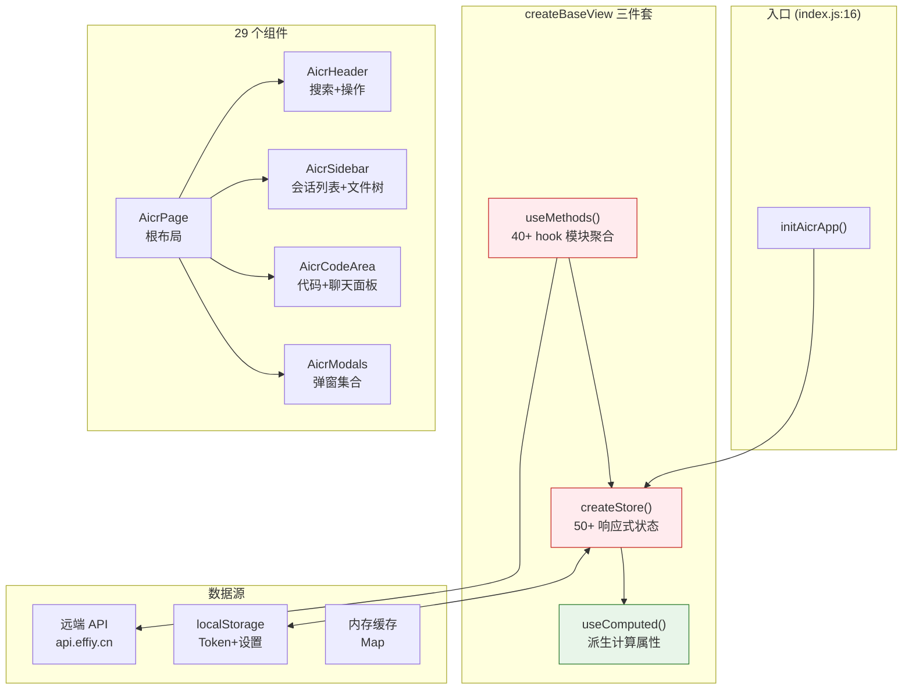
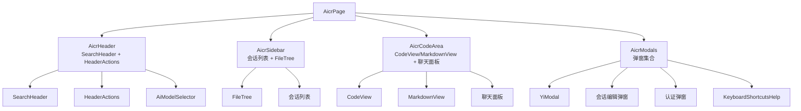
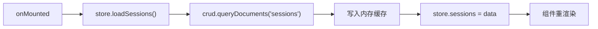
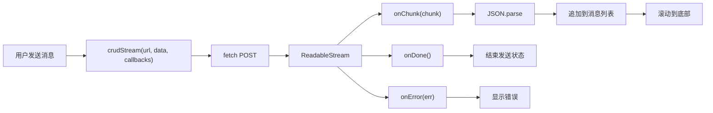
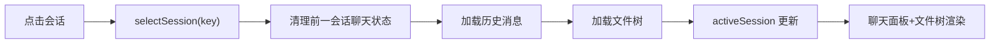
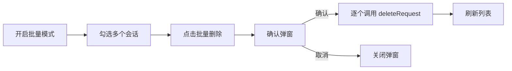

> | v1.0.0 | 2026-05-22 | deepseek-v4-pro | 🌿 feat/aicr | ⏱️ — | 📎 [CLAUDE.md](../../../CLAUDE.md) |

> **导航**: [← YiWeb-使用场景](./YiWeb-使用场景.md) · [YiWeb-测试设计 →](./YiWeb-测试设计.md) · [YiWeb-安全审计 →](./YiWeb-安全审计.md)

> **来源引用**: 从 `src/views/aicr/` 源码只读分析生成，证据 Level B + 源码路径。

[§0 基线溯源](#sec0-baseline) · [§1 架构概览](#sec1-arch) · [§2 组件树](#sec2-components) · [§3 状态管理](#sec3-state) · [§4 数据流](#sec4-dataflow) · [§5 交互流程](#sec5-interaction)

---

### 主要价值

- 🎯 全链路请求流可视化 — 从用户点击到 AI 响应的完整路径
- 🔒 状态管理透明 — store 50+ 状态字段全部枚举
- ⚡ 组件依赖清晰 — 29 个组件 + 40 个 hook 模块的依赖图
- 📊 证据可追溯 — 每个断言附源码行号

---

<a id="sec0-baseline"></a>

## §0 基线溯源

| 溯源目标 | 本文档章节 |
|---------|-----------|
| FP1: 会话列表 | §4 数据流（会话加载链路） |
| FP6: 文件树 | §3 状态管理（文件树状态） |
| FP8: 流式对话 | §4 数据流（流式请求链路）+ §5 交互流程 |
| Story 1–5 | §1 架构概览 + §2 组件树 |

---

<a id="sec1-arch"></a>

## §1 架构概览



> 证据: `src/views/aicr/index.js:19–131`

---

<a id="sec2-components"></a>

## §2 组件树



| 组件 | 来源 | 职责 |
|------|------|------|
| AicrPage | `src/views/aicr/components/aicrPage/` | 四栏根布局 |
| AicrHeader | `src/views/aicr/components/aicrHeader/` | 顶部搜索+操作栏 |
| AicrSidebar | `src/views/aicr/components/aicrSidebar/` | 左侧边栏容器 |
| AicrCodeArea | `src/views/aicr/components/aicrCodeArea/` | 中间代码+右侧聊天 |
| AicrModals | `src/views/aicr/components/aicrModals/` | 弹窗集中管理 |
| FileTree | `src/views/aicr/components/fileTree/` | 文件树渲染 |
| CodeView | `src/views/aicr/components/codeView/` | 代码语法高亮展示 |
| AiModelSelector | `src/views/aicr/components/AiModelSelector/` | AI 模型下拉选择 |

---

<a id="sec3-state"></a>

## §3 状态管理

> 证据: `src/views/aicr/index.js:79–131` data 字段 + `hooks/state/storeState.js`

### 状态分类

| 类别 | 状态字段 | 数量 |
|------|---------|:--:|
| 布局 | sidebarCollapsed, sidebarWidth, chatPanelCollapsed, chatPanelWidth, viewMode | 5 |
| 搜索 | searchQuery, sessionSearchQuery | 2 |
| 会话列表 | sessions, sessionLoading, sessionError, selectedSessionTags | 4 |
| 会话操作 | batchMode, selectedKeys, sessionBatchMode, selectedSessionKeys, externalSelectedSessionKey | 5 |
| 活跃会话 | activeSession, activeSessionLoading, activeSessionError | 3 |
| 聊天 | sessionChatInput, sessionChatSending, sessionContext*, sessionMessageEditor* | 10 |
| 文件树 | (storeFileTreeOps 管理) | — |
| 标签 | tagFilterNoTags | 1 |
| 模型 | availableModels, modelsLoading, modelsError | 3 |
| 编辑 | sessionEdit* | 5 |

### Store 模块架构

```
hooks/store.js → hooks/state/store.js → hooks/state/storeFactory.js
                                       → hooks/state/storeState.js

40+ hook 模块按职责划分:
  hooks/sessionListMethods.js       (833 行) — 会话列表
  hooks/sessionChatContextMethods.js (728 行) — 聊天上下文
  hooks/projectZipMethods.js        (708 行) — 项目导入
  hooks/tagManagerMethods.js        (782 行) — 标签管理
  hooks/storeFileTreeOps.js         (698 行) — 文件树操作
  hooks/sessionFaqMethods.js        (665 行) — FAQ
  ...
```

---

<a id="sec4-dataflow"></a>

## §4 数据流

### 会话加载链路



> 证据: `src/views/aicr/index.js:132–175` + `hooks/sessionListMethods.js`

### 流式请求链路



> 证据: `hooks/sessionChatContextChatMethods.streaming.js`

---

<a id="sec5-interaction"></a>

## §5 交互流程

### 会话切换



### 批量删除



---

> **变更记录**
> | 日期 | 变更 | 触发 | 证据 |
> |------|------|------|------|
> | 2026-05-22 | 初始生成 — 源码只读分析 | /rui doc --from-code aicr | src/views/aicr/ |
