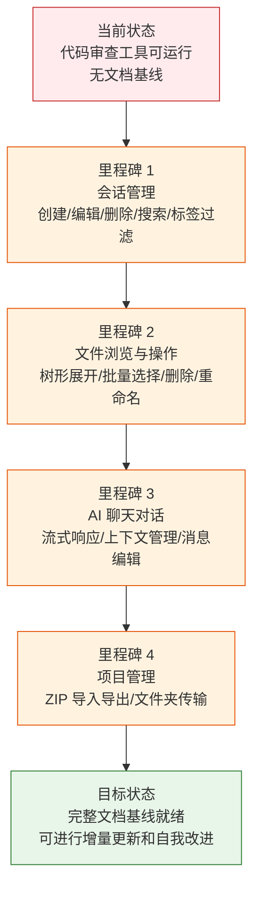

> | v1.0.0 | 2026-05-22 | deepseek-v4-pro | 🌿 feat/aicr | ⏱️ — | 📎 [CLAUDE.md](../../../CLAUDE.md) |

> **导航**: [YiWeb-使用场景 →](./YiWeb-使用场景.md)

> **来源引用**: 从 `src/views/aicr/` 源码反推生成，证据 Level B + 源码路径。`/rui doc --from-code aicr`。

[§1 Story](#sec1-story) · [§2 Requirements](#sec2-requirements) · [§3 成功标准](#sec3-success) · [§4 范围边界](#sec4-scope) · [§5 AC](#sec5-ac) · [§6 风险与假设](#sec6-risks)

---

### §0 基线声明

> **问题空间基线**: 本文档定义"做什么(WHAT)"和"为什么(WHY)"。所有下游文档的设计、实现、验证决策均必须可追溯至本文档的具体章节。

---

### 需求概述

提供一个 AI 辅助的代码审查工作台。用户可以管理审查会话、浏览项目文件结构、在聊天面板中与 AI 讨论代码、对文件执行批量操作。页面采用四栏布局：侧边栏（会话列表+文件树）、代码区域（代码/标记预览）、聊天面板（AI 对话）、顶部导航（搜索+操作）。

### 效果示意

### 主要价值

- 🎯 统一代码审查工作台 — 会话管理、文件浏览、AI 对话三合一
- 🔒 会话数据安全 — 本地缓存 + 远端同步，切换不丢上下文
- ⚡ 实时流式对话 — AI 响应逐字呈现，体验流畅
- 📊 批量操作高效 — 多选删除、标签过滤、关键字搜索快速定位

---

## §1 Story

### Story 1: 会话列表管理

| 字段 | 内容 |
|------|------|
| 作为 | 代码审查者 |
| 我想要 | 浏览、搜索、过滤、创建、编辑、删除审查会话 |
| 以便 | 快速找到目标会话并开始审查工作 |
| 优先级 | P0 |
| 范围边界 | 会话 CRUD + 搜索 + 标签过滤 + 批量选择 |
| 依赖 | 无 |

### Story 2: 文件树浏览与操作

| 字段 | 内容 |
|------|------|
| 作为 | 代码审查者 |
| 我想要 | 浏览项目文件树、展开/折叠目录、选择文件查看内容 |
| 以便 | 理解项目结构并定位需要审查的代码 |
| 优先级 | P0 |
| 范围边界 | 文件树渲染 + 展开/折叠 + 文件选择 + 删除 + 重命名 |
| 依赖 | Story 1（需先有会话） |

### Story 3: AI 聊天对话

| 字段 | 内容 |
|------|------|
| 作为 | 代码审查者 |
| 我想要 | 在聊天面板中与 AI 讨论代码，获得审查建议 |
| 以便 | 提高代码审查效率和质量 |
| 优先级 | P0 |
| 范围边界 | 消息发送/接收/流式渲染/上下文管理/消息编辑 |
| 依赖 | Story 1（需先有活跃会话） |

### Story 4: 项目文件管理

| 字段 | 内容 |
|------|------|
| 作为 | 代码审查者 |
| 我想要 | 导入项目 ZIP 包、在会话间转移文件 |
| 以便 | 灵活管理审查项目的数据源 |
| 优先级 | P1 |
| 范围边界 | ZIP 导入导出 + 文件夹传输 |
| 依赖 | Story 2 |

### Story 5: 模型选择与设置

| 字段 | 内容 |
|------|------|
| 作为 | 代码审查者 |
| 我想要 | 选择不同的 AI 模型进行代码审查 |
| 以便 | 根据任务复杂度选择性价比最优的模型 |
| 优先级 | P1 |
| 范围边界 | 模型列表获取 + 选择切换 |
| 依赖 | Story 3 |

---

## §2 Requirements

### 功能点

| FP# | 描述 | 优先级 |
|-----|------|--------|
| FP1 | 会话列表展示 — 从远端加载审查会话，支持分页和排序 | P0 |
| FP2 | 会话搜索 — 按关键字搜索会话标题/描述 | P0 |
| FP3 | 标签过滤 — 按标签筛选会话，支持多标签组合 | P0 |
| FP4 | 会话编辑 — 修改会话标题、描述、URL、标签 | P0 |
| FP5 | 会话删除 — 单个/批量删除会话 | P0 |
| FP6 | 文件树展示 — 按项目结构渲染可展开的文件树 | P0 |
| FP7 | 文件操作 — 选择/删除/重命名文件，批量操作 | P0 |
| FP8 | 对话消息 — 发送消息到 AI，接收流式响应，渲染 Markdown | P0 |
| FP9 | 上下文管理 — 编辑/撤销对话上下文，控制 AI 记忆范围 | P1 |
| FP10 | 消息编辑 — 编辑已发送的消息重新发送 | P1 |
| FP11 | 项目导入 — 从 ZIP 文件导入项目到会话 | P1 |
| FP12 | 文件夹传输 — 在会话间转移文件目录 | P1 |
| FP13 | 模型切换 — 从可用模型列表中选择 AI 模型 | P1 |
| FP14 | 侧边栏拖拽 — 调整侧边栏和聊天面板宽度 | P2 |
| FP15 | 键盘快捷键 — 常用操作快捷键支持 | P2 |

### 业务规则

| R# | 描述 |
|----|------|
| R1 | 会话数据通过远端 API 加载，本地缓存加速后续访问 |
| R2 | 删除操作需要确认，批量删除需二次确认 |
| R3 | 流式对话中断时保留已接收内容，不清空 |
| R4 | 文件树状态（展开/折叠）在切换会话时保持 |
| R5 | 侧边栏宽度设置持久化到本地存储 |

---

## §3 成功标准

| SC# | 描述 | 目标值 | 关联 FP# |
|-----|------|--------|---------|
| SC1 | 会话列表在页面加载后 3 秒内展示 | < 3 秒 | FP1 |
| SC2 | 搜索和标签过滤响应时间 < 200ms | < 200ms | FP2, FP3 |
| SC3 | 流式对话首字延迟 < 1 秒 | < 1 秒 | FP8 |
| SC4 | 文件树支持 1000+ 文件无卡顿 | 流畅滚动 | FP6 |
| SC5 | 批量操作支持同时选择 50+ 条目 | 50+ | FP5, FP7 |

---

## §4 范围边界

**范围内**: 会话管理 / 文件树 / AI 对话 / 项目导入导出 / 模型选择 / 面板布局
**范围外**: 后端 API 实现 / AI 模型训练 / 用户认证系统（独立模块）

---

## §5 AC

| AC# | Given | When | Then |
|-----|-------|------|------|
| AC1 | 用户打开代码审查页面 | 页面加载完成 | 会话列表从远端加载并展示 |
| AC2 | 用户在搜索框输入关键字 | 输入变化 | 会话列表实时过滤，匹配标题/描述 |
| AC3 | 用户点击标签 | 标签被选中 | 会话列表仅显示含该标签的会话 |
| AC4 | 用户点击会话 | 会话被选中 | 文件树加载，聊天面板显示历史消息 |
| AC5 | 用户在聊天框输入消息并发送 | 消息已发送 | AI 流式响应逐字渲染在聊天面板 |
| AC6 | 用户点击删除按钮 | 确认弹窗显示 | 确认后会话被删除，列表刷新 |
| AC7 | 用户拖拽侧边栏边缘 | 拖拽进行中 | 侧边栏宽度实时变化，释放后持久化 |
| AC8 | 用户在文件树中选择文件 | 文件被选中 | 代码区域展示文件内容（代码高亮或 Markdown 渲染） |

---

## §6 风险与假设

| # | 风险/假设 | 类型 | 可能性 | 影响 | 缓解 |
|---|----------|------|:--:|:--:|------|
| 1 | 流式响应中断导致对话丢失 | 风险 | M | M | 中断时保留已接收内容，支持重试 |
| 2 | 大文件树渲染性能问题 | 风险 | M | M | 虚拟滚动 + 懒加载子节点 |
| 3 | 多会话切换时状态混乱 | 风险 | L | H | 切换会话时清理前一会话的聊天状态 |
| 4 | 用户有稳定的网络连接到远端 API | 假设 | — | — | 网络不可用时显示错误状态和重试按钮 |

**产出**: `docs/故事任务面板/aicr/YiWeb-{故事任务,使用场景,技术评审,测试设计,安全审计}.md`

---

> **变更记录**
> | 日期 | 变更 | 触发 | 证据 |
> |------|------|------|------|
> | 2026-05-22 | 初始生成 — 源码反推 | /rui doc --from-code aicr | src/views/aicr/ 源码 |
