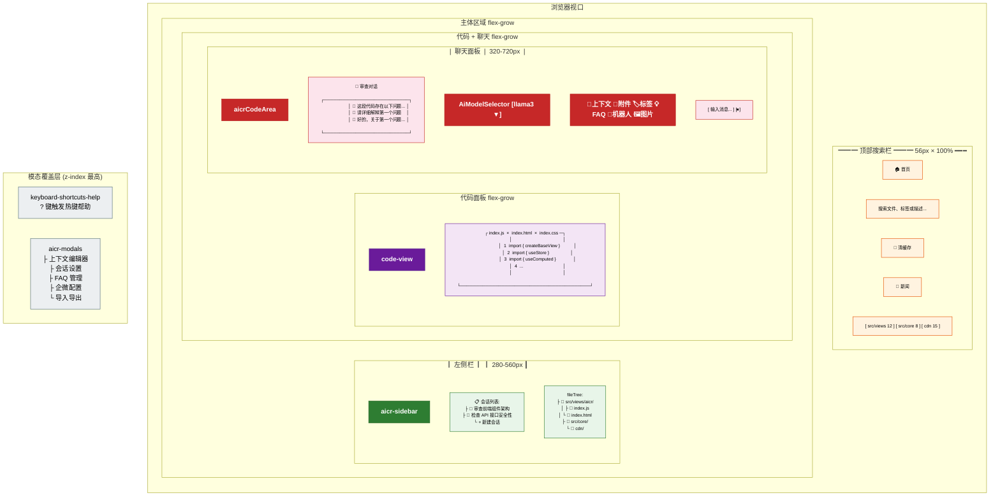
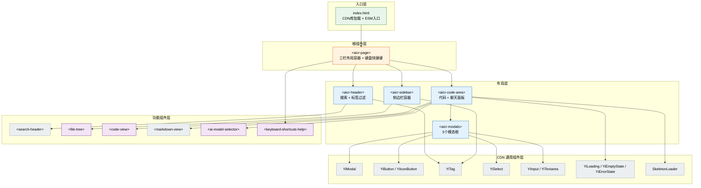
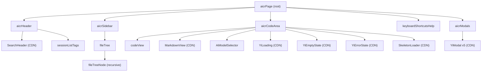
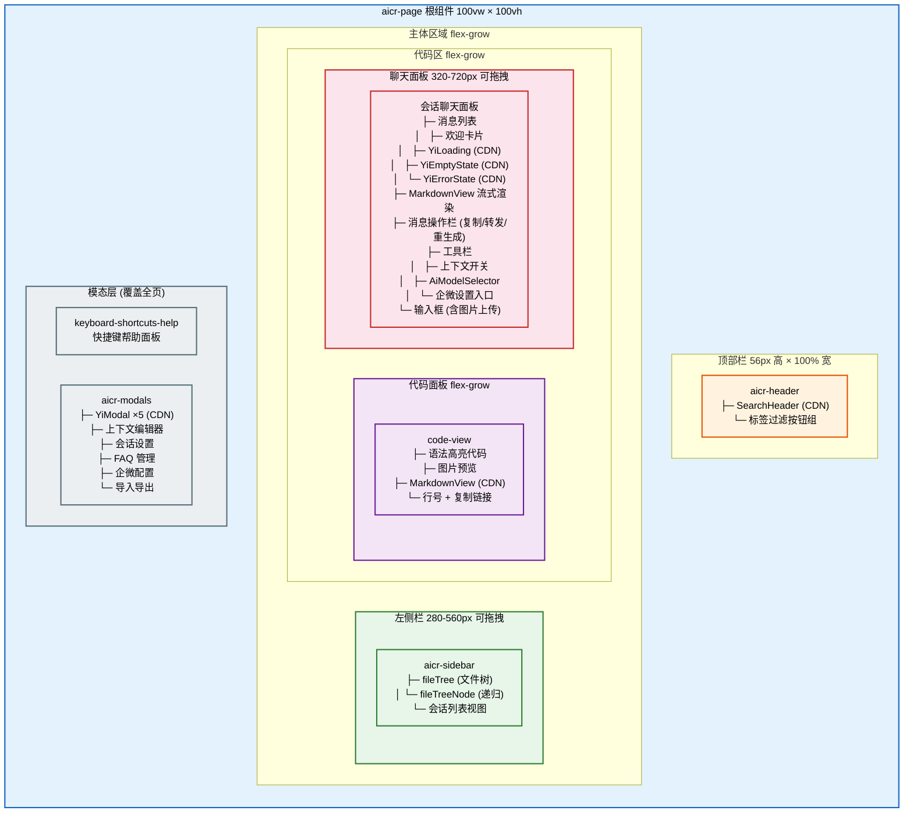
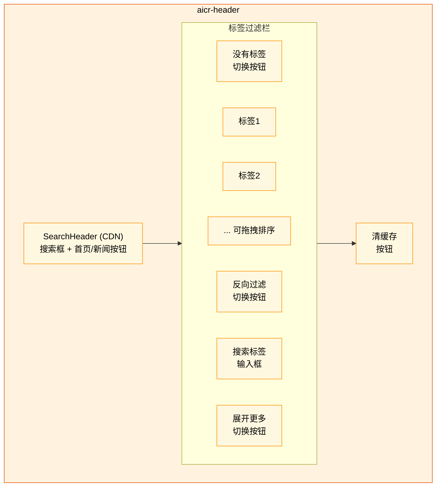
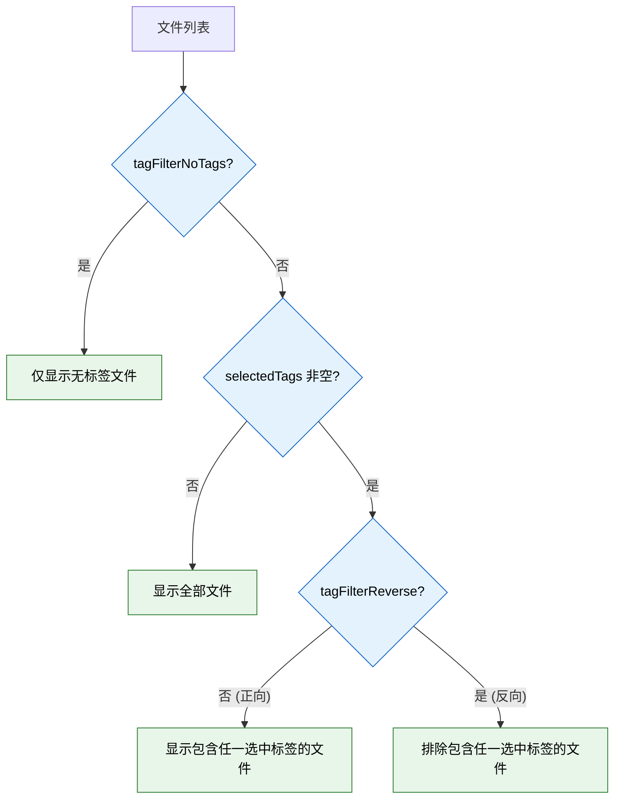

> | v1 | 2026-05-19 | deepseek-v4-pro | 🌿 feat/aicr | ⏱️ --:--–--:-- | 📎 [CLAUDE.md](../../../CLAUDE.md) |

> **导航**: [← YiWeb-04-前端技术评审](./YiWeb-04-前端技术评审.md) · [YiWeb-01-故事任务 →](./YiWeb-01-故事任务.md)

> **来源引用**: 从 `YiWeb-04-前端技术评审.md` §1 抽取独立成文，补充页面效果图。证据等级 B（可推导，附源码路径）。

---

### 主要价值

- 🧩 组件树清晰，10 个业务组件 + 12 个 CDN 组件分层注册
- 🗺️ 页面采用经典三栏布局，组件位置与层级一目了然
- 🔌 组件间通过 Props/Events 通信，接口契约明确
- 🎨 CDN 通用组件统一设计语言（YiModal / YiButton / YiTag 等）

---

### §1 页面组件布局图

页面采用经典三栏布局，以下 mermaid 图按浏览器视口坐标展示各组件的实际位置与尺寸关系：

---

### §2 组件层级结构

---

### §3 组件树

---

### §4 页面布局分布

页面采用经典三栏布局，组件按位置分为顶部栏、左侧栏、代码区、模态层四个区域：

---

### §5 组件清单

| 组件 | 类型 | 文件 | 注册路径 | 变更 |
|------|------|------|---------|------|
| aicrPage | 业务（新） | `src/views/aicr/components/aicrPage/index.js` | `createBaseView` components | 由源码反推 |
| aicrHeader | 业务（新） | `src/views/aicr/components/aicrHeader/index.js` | `createBaseView` components | 由源码反推 |
| aicrSidebar | 业务（新） | `src/views/aicr/components/aicrSidebar/index.js` | `createBaseView` components | 由源码反推 |
| aicrCodeArea | 业务（新） | `src/views/aicr/components/aicrCodeArea/index.js` | `createBaseView` components | 由源码反推 |
| aicrModals | 业务（新） | `src/views/aicr/components/aicrModals/index.js` | `createBaseView` components | 由源码反推 |
| fileTree | 业务（新） | `src/views/aicr/components/fileTree/index.js` | `createBaseView` components | 由源码反推 |
| codeView | 业务（新） | `src/views/aicr/components/codeView/index.js` | `createBaseView` components | 由源码反推 |
| AiModelSelector | 业务（新） | `src/views/aicr/components/AiModelSelector/index.js` | `createBaseView` components | 由源码反推 |
| keyboardShortcutsHelp | 业务（新） | `src/views/aicr/components/keyboardShortcutsHelp/index.js` | `createBaseView` components | 由源码反推 |
| sessionListTags | 业务（新） | `src/views/aicr/components/sessionListTags/index.js` | `createBaseView` components | 由源码反推 |
| YiModal | CDN 通用 | `cdn/components/common/modals/YiModal/index.js` | `createBaseView` components | 已有 |
| YiLoading | CDN 通用 | `cdn/components/common/loaders/YiLoading/index.js` | `createBaseView` components | 已有 |
| YiEmptyState | CDN 通用 | `cdn/components/common/feedback/YiEmptyState/index.js` | `createBaseView` components | 已有 |
| YiErrorState | CDN 通用 | `cdn/components/common/feedback/YiErrorState/index.js` | `createBaseView` components | 已有 |
| YiIcon | CDN 通用 | `cdn/icons/YiIcon/index.js` | `createBaseView` components | 已有 |
| YiIconButton | CDN 通用 | `cdn/components/common/buttons/YiIconButton/index.js` | `createBaseView` components | 已有 |
| YiButton | CDN 通用 | `cdn/components/common/buttons/YiButton/index.js` | `createBaseView` components | 已有 |
| YiTag | CDN 通用 | `cdn/components/common/tags/YiTag/index.js` | `createBaseView` components | 已有 |
| YiSelect | CDN 通用 | `cdn/components/common/forms/YiSelect/index.js` | `createBaseView` components | 已有 |
| YiInput | CDN 通用 | `cdn/components/common/forms/YiInput/index.js` | `createBaseView` components | 已有 |
| YiTextarea | CDN 通用 | `cdn/components/common/forms/YiTextarea/index.js` | `createBaseView` components | 已有 |
| SearchHeader | CDN 业务 | `cdn/components/business/SearchHeader/index.js` | `createBaseView` components | 已有 |
| MarkdownView | CDN 业务 | `cdn/components/business/MarkdownView/index.js` | `createBaseView` components | 已有 |
| SkeletonLoader | CDN 业务 | `cdn/components/business/SkeletonLoader/index.js` | `createBaseView` components | 已有 |

---

### §6 组件接口

| 组件 | Props | Events | Expose |
|------|-------|--------|--------|
| aicrHeader | `allTags`, `selectedTags`, `tagFilterReverse`, `tagFilterNoTags`, `tagFilterExpanded`, `tagFilterSearchKeyword`, `tagCounts`, `tagFilterVisibleCount`, `searchQuery`, `sidebarCollapsed` | `tag-select`, `tag-clear`, `tag-filter-reverse`, `tag-filter-no-tags`, `tag-filter-expand`, `tag-filter-search`, `search-input`, `search-keydown`, `composition-start`, `composition-end`, `clear-search` | — |
| aicrSidebar | (通过 viewContext) | `file-select`, `folder-toggle`, `batch-select`, `batch-mode-toggle`, `batch-delete`, `create-folder`, `create-file`, `rename-item`, `delete-item`, `file-drop`, `update:collapsed`, `create-faq-from-file`, `create-faq-from-session`, `search-query-change` | — |
| aicrCodeArea | (通过 viewContext) | `send-message`, `stop-generation`, `regenerate-message`, `copy-message`, `delete-message`, `edit-message`, `save-context`, `optimize-context`, `translate-context`, `toggle-context-editor`, `select-model`, `refresh-models`, `toggle-settings`, `toggle-wechat`, `edit-session`, `delete-session`, `toggle-favorite`, `create-session`, `select-session`, `import-sessions`, `export-sessions` | — |
| fileTree | `tree`, `selectedKey`, `expandedFolders`, `loading`, `error`, `collapsed`, `searchQuery`, `batchMode`, `selectedKeys`, `viewMode`, `selectedTags`, `tagFilterReverse`, `tagFilterNoTags`, `tagFilterExpanded`, `tagFilterSearchKeyword`, `tagFilterVisibleCount` | 18 个事件（同 aicrSidebar） | — |
| codeView | (通过 viewContext: `currentFile`, `searchQuery`, `batchMode`, `viewMode`) | `file-save`, `file-edit`, `image-paste`, `line-click`, `open-markdown-file` | — |
| AiModelSelector | `availableModels`, `modelsLoading`, `modelsError` | `select-model`, `refresh-models` | — |
| keyboardShortcutsHelp | `visible` | `close` | — |

---

### §7 重点组件详述：aicrHeader

> **📎 独立故事**: aicrHeader 已拆分为独立故事目录，完整的基线文档见 [`../aicr-header/YiWeb-01-故事任务.md`](../aicr-header/YiWeb-01-故事任务.md)。本文档 §7 保留组件架构概览，详细的 Props/Events 契约、用户场景、测试用例参见 aicr-header 故事目录。

#### 7.1 概览

`aicr-header` 位于页面顶部栏（56px 高 × 100% 宽），是用户进入页面后最先交互的区域。它集成了**全局搜索**、**标签过滤**、**缓存管理**三项核心能力。

**源码**: `src/views/aicr/components/aicrHeader/index.js`  
**模板**: `src/views/aicr/components/aicrHeader/index.html`  
**样式**: `src/views/aicr/components/sessionListTags/index.css`（共用 sessionListTags 样式）

#### 7.2 子组件

| 子组件 | 来源 | 用途 |
|--------|------|------|
| `<search-header>` | CDN 业务组件 | 提供搜索输入框、首页跳转、新闻入口、清缓存按钮 |
| 标签过滤按钮组 | 内联渲染 | 按标签筛选文件树：选择/反向/搜索/展开/拖拽排序 |

#### 7.3 Props

| Prop | 类型 | 默认值 | 说明 |
|------|------|--------|------|
| `allTags` | Array | `[]` | 全部可用标签列表 |
| `selectedTags` | Array | `[]` | 当前选中的标签 |
| `tagFilterReverse` | Boolean | `false` | 反向过滤：排除而非包含选中标签的文件 |
| `tagFilterNoTags` | Boolean | `false` | 仅显示无标签文件 |
| `tagFilterExpanded` | Boolean | `false` | 标签列表是否展开（显示更多） |
| `tagFilterSearchKeyword` | String | `''` | 标签搜索关键词 |
| `tagCounts` | Object | `{counts:{}, noTagsCount:0}` | 各标签下的文件数量统计 |
| `tagFilterVisibleCount` | Number | `8` | 折叠模式下可见标签数 |
| `searchQuery` | String | `''` | 搜索输入框当前值 |
| `sidebarCollapsed` | Boolean | `false` | 侧边栏是否已收起 |

#### 7.4 Events

| Event | 参数 | 触发场景 |
|-------|------|---------|
| `tag-select` | `newTags: string[]` | 点击标签切换选中状态 |
| `tag-clear` | — | 清除所有标签过滤 |
| `tag-filter-reverse` | `reverse: boolean` | 切换反向过滤模式 |
| `tag-filter-no-tags` | `noTags: boolean` | 切换"仅无标签文件"模式 |
| `tag-filter-expand` | `expanded: boolean` | 展开/折叠标签列表 |
| `tag-filter-search` | `keyword: string` | 输入标签搜索关键词 |
| `search-input` | `event` | 搜索框文本变化 |
| `search-keydown` | `event` | 搜索框按键事件 |
| `composition-start` | `event` | 中文输入法开始组合 |
| `composition-end` | `event` | 中文输入法结束组合 |
| `clear-search` | — | 清除搜索内容 |
| `clear-cache` | — | 点击清缓存按钮 |

#### 7.5 标签过滤模式

三种过滤模式可独立或组合使用，优先级从高到低：

#### 7.6 标签拖拽排序

标签按钮支持 HTML5 原生拖拽（Drag and Drop），排序结果持久化到 `localStorage`：

| 环节 | 实现 |
|------|------|
| 拖拽源 | `dragstart` — 设置 `effectAllowed: 'move'`，生成拖拽镜像（旋转 + 阴影的克隆 DOM） |
| 拖拽方向 | `_dragDirectionHorizontal` 缓存 — 通过 `getComputedStyle('.tags-list').flexDirection` 判断水平/垂直 |
| 放置指示 | `dragover` — 水平模式左/右边缘高亮，垂直模式上/下边缘高亮 |
| 放置执行 | `drop` — 从 `currentOrder` 数组移动拖拽标签到目标位置，调用 `saveTagOrder()` 写入 `localStorage` |
| 持久化键 | `aicr_file_tag_order`（JSON 数组） |
| 排序同步 | 写入后自增 `tagOrderVersion`，触发下游重新读取标签顺序 |

#### 7.7 搜索集成

`aicr-header` 通过 `<search-header>` CDN 组件提供搜索能力：

- 输入变化 → `search-input` 事件 → 父组件 `handleSearchInput` → 更新 `searchQuery` → 驱动 `fileTree` 实时过滤
- 中文输入法处理：`compositionstart` / `compositionend` 防止拼音中间态触发搜索
- 清除搜索：`clear-search` 事件清空 `searchQuery`

---

| 日期 | 变更 | 触发 | 证据 |
|------|------|------|------|
| 2026-05-19 | 从 04-前端技术评审 §1 抽取独立，新增 §1 页面效果图 | `/rui update aicr` | feat/aicr 分支 |
| 2026-05-19 | §1 页面效果图从 block-beta 改为 flowchart TB（兼容性更好） | `/rui update aicr` | feat/aicr 分支 |
| 2026-05-19 | 新增 §7 重点组件详述：aicrHeader | `/rui update aicr` | feat/aicr 分支；源码反推 |
| 2026-05-19 | §7 添加独立故事交叉引用 → aicr-header | `/rui aicrHeader 应该单独拆成一个故事目录` | feat/aicr-header 分支 |
