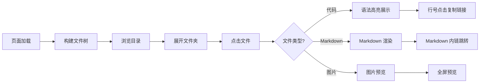
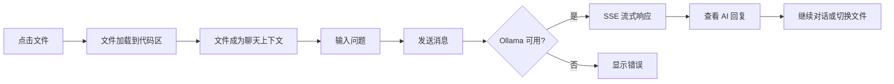
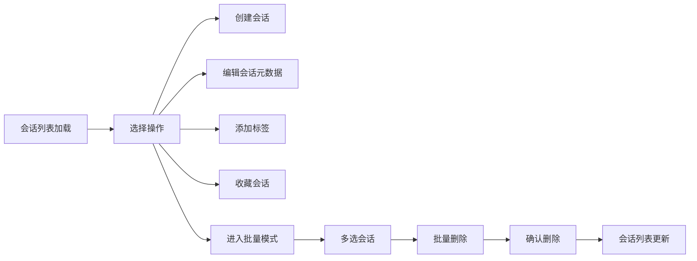
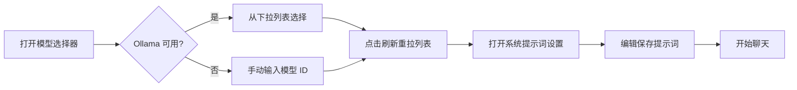
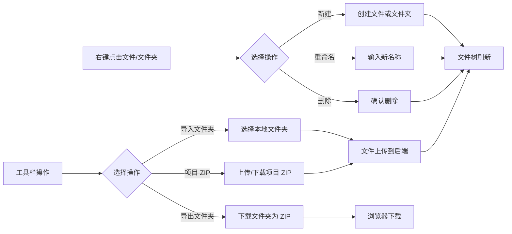

# 使用场景

> | v1.2.0 | 2026-05-26 | deepseek-v4-pro | 📎 [CLAUDE.md](../../../CLAUDE.md) |

> **导航**: [← 故事任务](./故事任务.md) · [技术评审 →](./技术评审.md)
>
> **来源引用**：基于 [故事任务](./故事任务.md) §1 Story 1–5。

---

### 主要价值

- 🎯 覆盖五种用户角色 — 审查者、提问者、管理者、组织者、新成员，六种使用场景
- 🔒 异常路径可见 — 每场景含 API 失败、空状态、错误恢复
- ⚡ 交互链路清晰 — 每场景含 mermaid 流程图

---

## §1 使用场景

### 场景 1: 代码审查者浏览文件

**角色**: 代码审查者
**目标**: 浏览项目文件树并查看文件内容
📊 数据流: [场景 1 数据链路](./数据流设计.md#§1-场景-1--代码审查者浏览文件)
📋 测试用例: [场景 1 测试用例](./测试设计.md#§1-场景-1-代码审查者浏览文件)

| 步骤 | 操作 | 预期结果 |
|------|------|---------|
| 1 | 打开 AICR 面板 | 文件树在左侧加载 |
| 2 | 展开项目文件夹 | 显示子目录和文件 |
| 3 | 切换到卡片视图 | 文件以卡片形式展示 |
| 4 | 点击 `.js` 文件 | 代码区展示带语法高亮的代码 |
| 5 | 点击 `.md` 文件 | 代码区渲染 Markdown |
| 6 | 点击 `.png` 文件 | 图片预览弹窗 |

---

### 场景 2: 开发者 AI 代码分析

**角色**: 开发者
**目标**: 选中文件并让 AI 分析代码逻辑
📊 数据流: [场景 2 数据链路](./数据流设计.md#§2-场景-2--开发者-ai-代码分析)
📋 测试用例: [场景 2 测试用例](./测试设计.md#§2-场景-2-开发者-ai-代码分析)

| 步骤 | 操作 | 预期结果 |
|------|------|---------|
| 1 | 选中目标文件 | 文件内容展示在代码区 |
| 2 | 在聊天框输入"解释这段代码" | 构造带文件上下文的请求 |
| 3 | 发送消息 | SSE 流式展示 AI 回复 |
| 4 | 重新生成回复 | 清除上一条，重新请求 |
| 5 | 复制 AI 回复 | 内容复制到剪贴板 |

---

### 场景 3: 管理者三级联动筛选文件

**角色**: 文档管理者
**目标**: 通过标签系统快速定位特定类型的文档
📊 数据流: [场景 3 数据链路](./数据流设计.md#§3-场景-3--管理者三级联动筛选文件)
📋 测试用例: [场景 3 测试用例](./测试设计.md#§3-场景-3-管理者三级联动筛选文件)

| 步骤 | 操作 | 预期结果 |
|------|------|---------|
| 1 | 点击"YiWeb"项目标签 | 文件树缩减为 YiWeb 根目录 |
| 2 | 点击"aicr"故事标签 | 仅显示 aicr 子目录 |
| 3 | 点击"技术评审"状态标签 | 仅显示技术评审类文件 |
| 4 | 点击"无标签"按钮 | 仅显示根目录下无目录的文件 |
| 5 | 按 Escape | 全部筛选清除，恢复完整列表 |

---

### 场景 4: 组织者管理会话

**角色**: 会话组织者
**目标**: 创建、编辑标签、收藏、批量删除会话
📊 数据流: [场景 4 数据链路](./数据流设计.md#§4-场景-4--组织者管理会话)
📋 测试用例: [场景 4 测试用例](./测试设计.md#§4-场景-4-组织者管理会话)

---

### 场景 5: 新成员接入 API 聊天

**角色**: 新成员
**目标**: 选择 AI 模型并配置系统提示词后开始使用
📊 数据流: [场景 5 数据链路](./数据流设计.md#§5-场景-5--新成员接入-api-聊天)
📋 测试用例: [场景 5 测试用例](./测试设计.md#§5-场景-5-新成员接入-api-聊天)

---

### 场景 6: 组织者管理文件树

**角色**: 组织者
**目标**: 对文件树执行创建、重命名、删除、导入导出操作
📊 数据流: [场景 6 数据链路](./数据流设计.md#§6-场景-6--组织者管理文件树)
📋 测试用例: [场景 6 测试用例](./测试设计.md#§6-场景-6-组织者管理文件树)

| 步骤 | 操作 | 预期结果 |
|------|------|---------|
| 1 | 右键点击文件夹 | 上下文菜单显示新建/重命名/删除选项 |
| 2 | 选择"新建文件" | 弹出名称输入框，确认后文件出现在树中 |
| 3 | 选择"重命名" | 弹出重命名输入框，确认后树节点名称更新 |
| 4 | 选择"删除" | 弹出确认对话框，确认后文件从树中移除 |
| 5 | 点击"导入文件夹" | 选择本地文件夹，文件上传后树中显示 |
| 6 | 点击"导出文件夹" | 下载 ZIP 文件，包含该文件夹全部内容 |
| 7 | 点击"项目 ZIP 下载" | 下载整个项目的 ZIP 包 |

---

> **变更记录**
> | 日期 | 变更 | 触发 | 证据 |
> |------|------|------|------|
> | 2026-05-26 | 基线化 | 源码分析 | src/views/aicr/ |
> | 2026-05-26 | 新增场景 6 文件树操作 + 修正 AC 映射 | /rui update | 故事任务 Story 5 |
> | 2026-05-26 | 去除场景覆盖矩阵，添加数据流设计跳转链接 | /rui update | 数据流设计.md §1–§6 |
