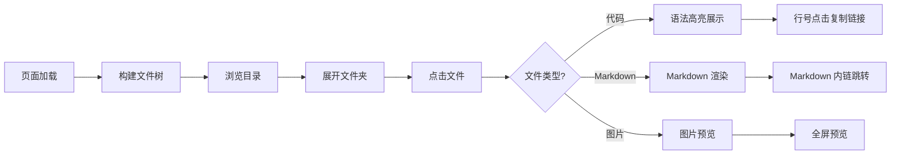
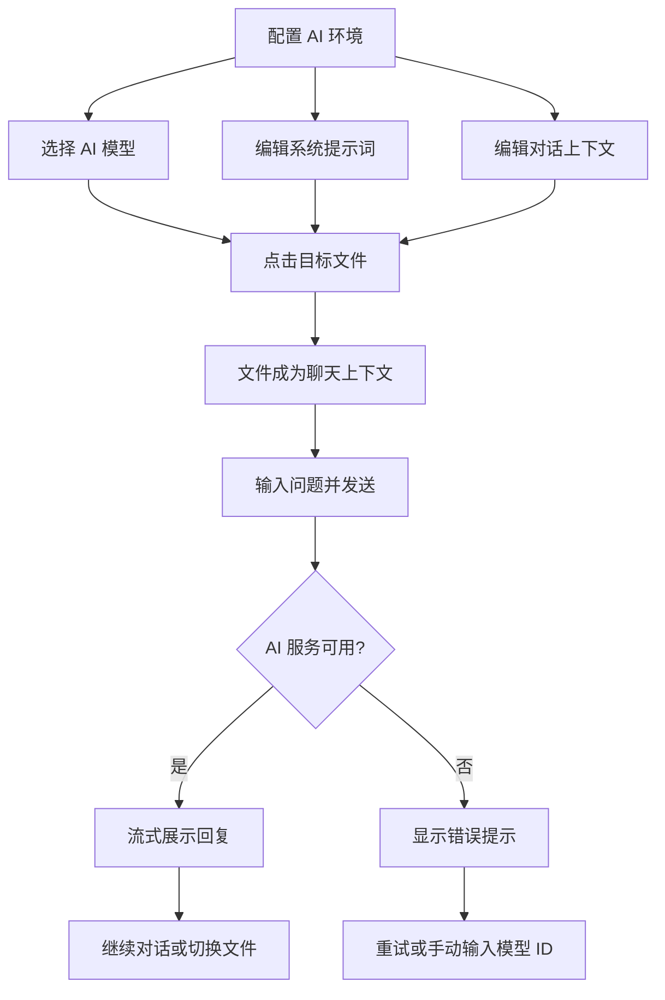
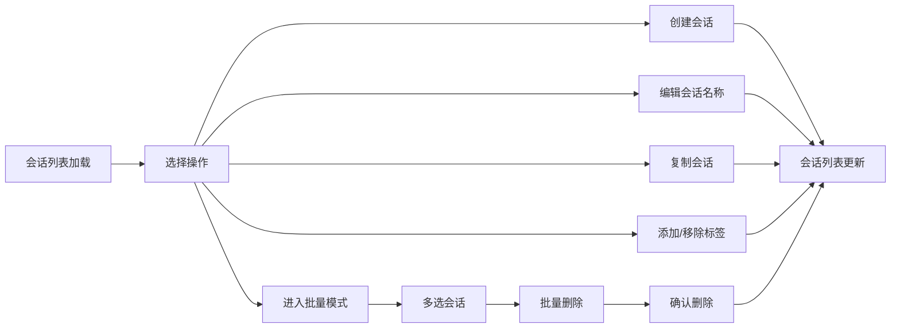
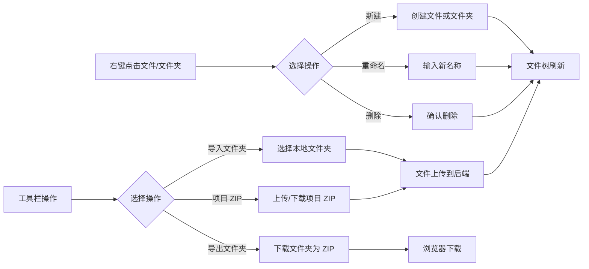

# 使用场景

> | v1.3.0 | 2026-05-27 | deepseek-v4-pro | 📎 [CLAUDE.md](../../../CLAUDE.md) |

> **导航**: [← 故事任务](./故事任务.md) · [技术评审 →](./技术评审.md)
>
> **来源引用**：基于 [故事任务](./故事任务.md) §1 Story 1–5。

---

[§1 使用场景](#s-1-使用场景) · [场景 1](#场景-1-代码审查者浏览文件) · [场景 2](#场景-2-开发者-ai-对话分析) · [场景 3](#场景-3-管理者三级联动筛选文件) · [场景 4](#场景-4-组织者管理会话) · [场景 5](#场景-5-维护者管理文件树)

## 概述

描述五种用户角色在 AICR 面板中的典型使用场景，每场景包含 mermaid 流程图与操作步骤表，覆盖正常路径与异常恢复。

### 主要价值

- 🎯 覆盖五种用户角色 — 审查者、开发者、管理者、组织者、维护者，五种使用场景与故事任务一一对应
- 🔒 异常路径可见 — 每场景含 API 失败、空状态、错误恢复
- ⚡ 交互链路清晰 — 每场景含 mermaid 流程图

---

## §1 使用场景

### 场景 1: 代码审查者浏览文件

**角色**: 代码审查者
**目标**: 浏览项目文件树并查看文件内容
🏗️ 技术评审: [场景 1 全维度技术方案](./技术评审.md#s-1-场景-1-文件浏览与内容查看) — 数据流 · 布局线框 · API 端点 · 测试用例

| 步骤 | 操作 | 预期结果 |
|------|------|---------|
| 1 | 打开 AICR 面板 | 文件树在左侧加载 |
| 2 | 展开项目文件夹 | 显示子目录和文件 |
| 3 | 切换到卡片视图 | 文件以卡片形式展示 |
| 4 | 点击 `.js` 文件 | 代码区展示带语法高亮的代码 |
| 5 | 点击 `.md` 文件 | 代码区渲染 Markdown |
| 6 | 点击 `.png` 文件 | 图片预览弹窗 |

---

### 场景 2: 开发者 AI 对话分析

**角色**: 开发者
**目标**: 配置 AI 模型与系统提示词，选中文件后与 AI 对话分析代码
🏗️ 技术评审: [场景 2 全维度技术方案](./技术评审.md#s-2-场景-2-ai-对话分析) — 数据流 · 布局线框 · API 端点 · 测试用例

| 步骤 | 操作 | 预期结果 |
|------|------|---------|
| 1 | 打开模型选择器，从列表选择模型 | 后续对话使用所选模型 |
| 2 | 模型列表获取失败时手动输入模型 ID | 手动输入的模型标识生效 |
| 3 | 打开系统提示词设置，编辑并保存 | 后续对话注入自定义提示词 |
| 4 | 打开上下文编辑器，编辑并保存对话上下文 | 下一轮对话使用新上下文 |
| 5 | 选中目标文件，在聊天框输入问题并发送 | 构造带文件上下文的请求，AI 流式回复 |
| 6 | AI 服务不可用时发送消息 | 展示清晰的服务状态提示，引导重试 |
| 7 | 重新生成回复 | 清除上一条回复，重新请求 |
| 8 | 复制 AI 回复 | 内容复制到剪贴板 |

---

### 场景 3: 管理者三级联动筛选文件

**角色**: 文档管理者
**目标**: 通过标签系统快速定位特定类型的文档
🏗️ 技术评审: [场景 3 全维度技术方案](./技术评审.md#s-3-场景-3-标签筛选与搜索) — 数据流 · 布局线框 · 三级联动算法 · 测试用例

| 步骤 | 操作 | 预期结果 |
|------|------|---------|
| 1 | 点击项目标签 | 文件树缩减为该项目的文件，模块标签联动更新 |
| 2 | 点击模块标签 | 仅显示该子目录内容，文档类型标签联动更新 |
| 3 | 点击文档类型标签 | 仅显示匹配类型的文件 |
| 4 | 点击"无标签"选项 | 仅显示根目录下无子目录的独立文件 |
| 5 | 在搜索框输入关键词 | 文件名模糊匹配，结果即时过滤 |
| 6 | 同时使用标签筛选和关键词搜索 | 结果同时满足两者（AND 逻辑） |
| 7 | 按 Escape 或点击清除按钮 | 全部筛选重置，恢复完整文件列表 |

---

### 场景 4: 组织者管理会话

**角色**: 会话组织者
**目标**: 创建、编辑、标签化、批量管理 AI 对话会话
🏗️ 技术评审: [场景 4 全维度技术方案](./技术评审.md#s-4-场景-4-会话管理) — 数据流 · 布局线框 · API 端点 · 测试用例

| 步骤 | 操作 | 预期结果 |
|------|------|---------|
| 1 | 点击新建会话按钮，输入名称并确认 | 新会话出现在列表中 |
| 2 | 点击会话的编辑按钮，修改名称并保存 | 会话名称更新 |
| 3 | 点击会话的删除按钮，确认删除 | 会话从列表中移除 |
| 4 | 点击会话的复制按钮 | 副本出现在列表中，内容与原会话一致 |
| 5 | 在会话上添加标签 | 标签关联到会话 |
| 6 | 点击标签的删除图标 | 标签与会话解除关联 |
| 7 | 勾选多个会话的复选框 | 选中会话高亮，批量操作按钮激活 |
| 8 | 选中多个会话后点击批量删除，确认 | 选中会话全部移除 |

---

### 场景 5: 维护者管理文件树

**角色**: 项目维护者
**目标**: 对文件树执行创建、重命名、删除、导入导出操作
🏗️ 技术评审: [场景 5 全维度技术方案](./技术评审.md#s-5-场景-5-文件树管理) — 数据流 · 布局线框 · API 端点 · 测试用例

| 步骤 | 操作 | 预期结果 |
|------|------|---------|
| 1 | 右键点击文件夹 | 上下文菜单显示新建/重命名/删除选项 |
| 2 | 选择"新建文件" | 弹出名称输入框，确认后文件出现在树中 |
| 3 | 选择"重命名" | 弹出重命名输入框，确认后树节点名称更新 |
| 4 | 选择"删除" | 弹出确认对话框，确认后文件从树中移除 |
| 5 | 点击"导入文件夹" | 选择本地文件夹，文件上传后树中显示 |
| 6 | 点击"导出文件夹" | 下载 ZIP 文件，包含该文件夹全部内容 |
| 7 | 点击"项目 ZIP 下载" | 下载整个项目的 ZIP 包 |

---

> **变更记录**
> | 日期 | 变更 | 触发 | 证据 |
> |------|------|------|------|
> | 2026-05-26 | 基线化 | 源码分析 | src/views/aicr/ |
> | 2026-05-26 | 新增场景 6 文件树操作 + 修正 AC 映射 | /rui update | 故事任务 Story 5 |
> | 2026-05-26 | 去除场景覆盖矩阵，添加数据流设计跳转链接 | /rui update | 数据流设计.md §1–§6 |
> | 2026-05-27 | 合并场景 2+5 对齐 Story 2（AI 对话分析），重编号场景 6→5，场景 4 补操作步骤表 | /rui update | 故事任务 Story 1–5 一一对应 |
| 2026-05-27 | 每场景新增 🏗️ 技术评审跳转链接，指向技术评审对应 §1–§5 | /rui update | 技术评审.md §1–§5 |
| 2026-05-27 | 每场景新增 🖼️ 页面设计跳转链接，指向页面设计对应 §1–§5 | /rui update | 页面设计.md §1–§5 |
| 2026-05-27 | 合并页面设计/数据流设计/测试设计入技术评审，交叉引用简化为单一 🏗️ 技术评审链接 | /rui update | 技术评审.md v3.0.0 |
