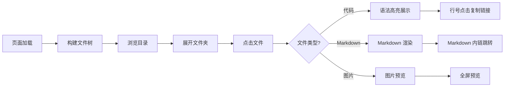
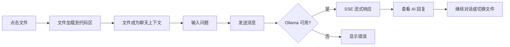
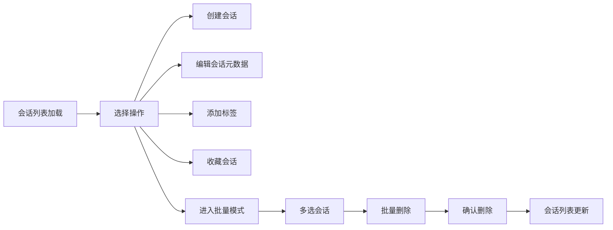
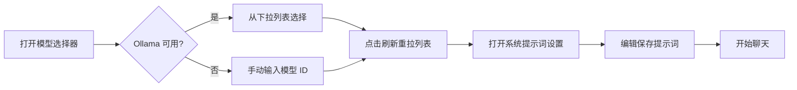

# 使用场景

> | v1.0.0 | 2026-05-26 | deepseek-v4-pro | 📎 [CLAUDE.md](../../../CLAUDE.md) |

> **来源引用**：基于 [故事任务](./故事任务.md) §1 Story 1–5。

---

### 主要价值

- 🎯 覆盖五种用户角色 — 审查者、提问者、管理者、组织者、新成员
- 🔒 异常路径可见 — 每场景含 API 失败、空状态、错误恢复
- ⚡ 交互链路清晰 — 每场景含 mermaid 流程图

---

## §1 使用场景

### 场景 1: 代码审查者浏览文件

**角色**: 代码审查者
**目标**: 浏览项目文件树并查看文件内容

| 步骤 | 操作 | 预期结果 |
|------|------|---------|
| 1 | 打开 AICR 面板 | 文件树在左侧加载 |
| 2 | 展开项目文件夹 | 显示子目录和文件 |
| 3 | 切换到卡片视图 | 文件以卡片形式展示 |
| 4 | 点击 `.js` 文件 | 代码区展示带语法高亮的代码 |
| 5 | 点击 `.md` 文件 | 代码区渲染 Markdown |
| 6 | 点击 `.png` 文件 | 图片预览弹窗 |

---

### 场景 2: 开发者 AI 代码分析

**角色**: 开发者
**目标**: 选中文件并让 AI 分析代码逻辑

| 步骤 | 操作 | 预期结果 |
|------|------|---------|
| 1 | 选中目标文件 | 文件内容展示在代码区 |
| 2 | 在聊天框输入"解释这段代码" | 构造带文件上下文的请求 |
| 3 | 发送消息 | SSE 流式展示 AI 回复 |
| 4 | 重新生成回复 | 清除上一条，重新请求 |
| 5 | 复制 AI 回复 | 内容复制到剪贴板 |

---

### 场景 3: 管理者四级联动筛选文件

**角色**: 文档管理者
**目标**: 通过标签系统快速定位特定类型的文档

| 步骤 | 操作 | 预期结果 |
|------|------|---------|
| 1 | 点击"YiWeb"项目标签 | 文件树缩减为 YiWeb 根目录 |
| 2 | 点击子目录"故事任务面板" | 仅显示该目录下的文件 |
| 3 | 点击"安全审计"后缀标签 | 仅显示安全审计类文件 |
| 4 | 点击"无标签"按钮 | 仅显示根目录下无目录的文件 |
| 5 | 按 Escape | 全部筛选清除，恢复完整列表 |

---

### 场景 4: 组织者管理会话

**角色**: 会话组织者
**目标**: 创建、编辑标签、收藏、批量删除会话

---

### 场景 5: 新成员接入 API 聊天

**角色**: 新成员
**目标**: 选择 AI 模型并配置系统提示词后开始使用

---

## §2 场景覆盖矩阵

| 场景 | 关联 FP# | 关联 AC# | 正常路径 | 空状态 | 错误恢复 |
|------|---------|---------|:--:|:--:|:--:|
| 场景 1: 浏览文件 | FP1, FP2, FP8 | AC2, AC11 | ✅ | ✅ | ✅ |
| 场景 2: AI 分析 | FP3, FP4, FP5 | AC3 | ✅ | — | ✅ |
| 场景 3: 筛选文件 | FP6, FP7 | AC4–AC9 | ✅ | ✅ | ✅ |
| 场景 4: 管理会话 | FP9–FP11 | AC10 | ✅ | ✅ | ✅ |
| 场景 5: 模型配置 | FP5 | AC3 | ✅ | ✅ | ✅ |

---

> **变更记录**
> | 日期 | 变更 | 触发 | 证据 |
> |------|------|------|------|
> | 2026-05-26 | 基线化 | 源码分析 | src/views/aicr/ |
