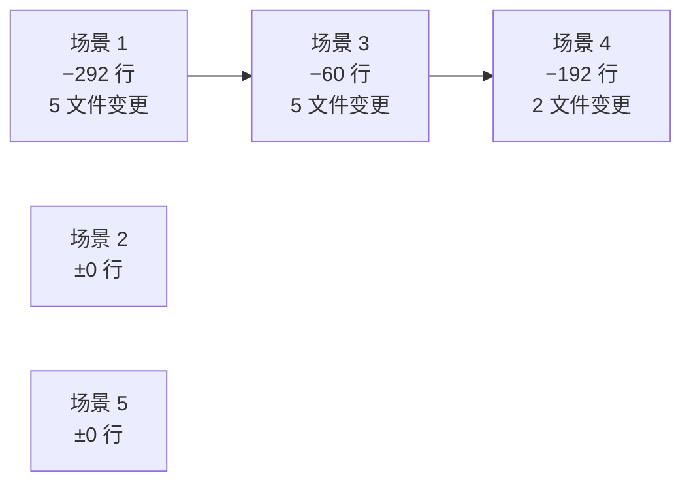

# 实施报告

> | v2.1.0 | 2026-05-27 | deepseek-v4-pro | 🌿 feat/aicr | 📎 [CLAUDE.md](../../../CLAUDE.md) |

> **导航**: [← 测试设计](./测试设计.md) · [自改进复盘 →](./自改进复盘.md)

> **来源引用**：基于 [故事任务](./故事任务.md) §1 Story 1–5 与 [使用场景](./使用场景.md) §1 场景 1–5，从 `src/views/aicr/` 源码验证。

---

[§0 基线](#s-0-基线溯源) · [§1 场景 1](#s-1-场景-1-文件浏览与内容查看) · [§2 场景 2](#s-2-场景-2-ai-对话分析) · [§3 场景 3](#s-3-场景-3-标签筛选与搜索) · [§4 场景 4](#s-4-场景-4-会话管理) · [§5 场景 5](#s-5-场景-5-文件树管理) · [§6 概要](#s-6-变更概要)

## 概述

五场景交付文件清单，与使用场景一一对应，每场景独立交付文件表含源文件路径、变更类型、改动前后行数对比与职责。共 44 个源文件，基准行数 15,411 → 14,867 行（净减 544 行），12 个文件有变更，全部可追溯可审计。

### 主要价值

- 🎯 五场景交付 — 与使用场景一一对应，每场景独立交付文件表
- 🔒 源码可追溯 — 每文件附实际路径与行数变更，可验证可审计
- 📊 行级量化 — 每文件标注改动前后行数与增减明细
- ⚡ 精简交付视角 — 仅列交付文件，不含过程偏差与审查细节

---

## §0 基线溯源

| 使用场景 | 故事任务 Story | 文件数 | 前行数 | 后行数 | 净变更 |
|---------|:---:|:---:|------:|------:|------:|
| [场景 1: 代码审查者浏览文件](./使用场景.md#场景-1-代码审查者浏览文件) | Story 1 | 12 | 5,014 | 4,722 | −292 |
| [场景 2: 开发者 AI 对话分析](./使用场景.md#场景-2-开发者-ai-对话分析) | Story 2 | 10 | 3,167 | 3,167 | 0 |
| [场景 3: 管理者三级联动筛选文件](./使用场景.md#场景-3-管理者三级联动筛选文件) | Story 3 | 8 | 1,629 | 1,569 | −60 |
| [场景 4: 组织者管理会话](./使用场景.md#场景-4-组织者管理会话) | Story 4 | 8 | 3,610 | 3,418 | −192 |
| [场景 5: 维护者管理文件树](./使用场景.md#场景-5-维护者管理文件树) | Story 5 | 6 | 1,991 | 1,991 | 0 |
| **合计** | | **44** | **15,411** | **14,867** | **−544** |

> **基准说明**：前行数取自 `09b0f09^`（主题色集中化前），后行数取自当前 HEAD。变更集中分布在场景 1（重构入口 + 文件树/代码视图）、场景 3（筛选管道 + 标签联动）、场景 4（会话列表精简 + Sessions Ops 扩展）。场景 2、场景 5 无变更。

---

## §1 场景 1: 文件浏览与内容查看

> 对应 [使用场景 — 场景 1](./使用场景.md#场景-1-代码审查者浏览文件) · Story 1

| 文件 | 变更 | 前 | 后 | + | − | 职责 |
|------|:---:|--:|--:|--:|--:|------|
| `src/views/aicr/index.js` | 修改 | 975 | 662 | 201 | 514 | 入口初始化：createStore → createBaseView → onMounted |
| `src/views/aicr/hooks/state/storeState.js` | 修改 | 228 | 230 | 6 | 4 | 80+ 响应式状态变量定义与导出 |
| `src/views/aicr/hooks/storeFileTreeBuilders.js` | — | 127 | 127 | 0 | 0 | 将远端 sessions 扁平列表构建为层级树结构 |
| `src/views/aicr/hooks/storeFileTreeOps.js` | 修改 | 698 | 705 | 7 | 0 | 文件树展开/折叠/选中节点操作 |
| `src/views/aicr/hooks/storeFileTreeExpandOps.js` | — | 106 | 106 | 0 | 0 | URL 参数定位时自动展开路径 |
| `src/views/aicr/hooks/storeFileContentOps.js` | — | 569 | 569 | 0 | 0 | 按路径请求文件内容，管理加载/错误状态 |
| `src/views/aicr/components/fileTree/index.js` | — | 4 | 4 | 0 | 0 | FileTree 组件入口，递归渲染树节点 |
| `src/views/aicr/components/fileTree/index.html` | 修改 | 101 | 106 | 23 | 18 | 文件树模板（树形/卡片双视图） |
| `src/views/aicr/components/fileTree/fileTreeLayout.css` | 修改 | 425 | 425 | 3 | 3 | 文件树布局样式 |
| `src/views/aicr/components/codeView/index.js` | 修改 | 1,347 | 1,354 | 11 | 4 | 代码语法高亮展示，行号点击复制链接 |
| `src/views/aicr/components/codeView/index.html` | — | 263 | 263 | 0 | 0 | 代码视图模板 |
| `src/views/aicr/components/codeView/index.css` | — | 171 | 171 | 0 | 0 | 代码视图样式 |

---

## §2 场景 2: AI 对话分析

> 对应 [使用场景 — 场景 2](./使用场景.md#场景-2-开发者-ai-对话分析) · Story 2

| 文件 | 变更 | 前 | 后 | + | − | 职责 |
|------|:---:|--:|--:|--:|--:|------|
| `src/views/aicr/hooks/sessionChatContextMethods.js` | 修改 | 728 | 728 | 1 | 1 | 聊天会话生命周期管理，文件上下文绑定 |
| `src/views/aicr/hooks/sessionChatContextChatMethods.js` | — | 550 | 550 | 0 | 0 | 构造请求体、发送消息、处理响应 |
| `src/views/aicr/hooks/sessionChatContextChatMethods.streaming.js` | — | 816 | 816 | 0 | 0 | SSE 连接管理、逐字解析、中断重连 |
| `src/views/aicr/hooks/sessionChatContextSettingsMethods.js` | — | 93 | 93 | 0 | 0 | AI 模型切换、系统提示词编辑持久化 |
| `src/views/aicr/hooks/sessionChatContextContextMethods.js` | — | 435 | 435 | 0 | 0 | 对话背景信息编辑/保存/撤销 |
| `src/views/aicr/hooks/sessionChatContextMethods.scrollSync.js` | — | 160 | 160 | 0 | 0 | 新消息自动滚动到底部 |
| `src/views/aicr/components/AiModelSelector/index.js` | — | 104 | 104 | 0 | 0 | 模型下拉列表 + 手动输入降级 + 刷新重拉 |
| `src/views/aicr/components/AiModelSelector/index.html` | — | 70 | 70 | 0 | 0 | 模型选择器模板 |
| `src/views/aicr/components/aicrCodeArea/index.html` | — | 199 | 199 | 0 | 0 | 代码区 + 聊天面板布局模板 |
| `src/views/aicr/hooks/methods/chatMethods.js` | — | 12 | 12 | 0 | 0 | 聊天方法聚合导出 |

---

## §3 场景 3: 标签筛选与搜索

> 对应 [使用场景 — 场景 3](./使用场景.md#场景-3-管理者三级联动筛选文件) · Story 3

| 文件 | 变更 | 前 | 后 | + | − | 职责 |
|------|:---:|--:|--:|--:|--:|------|
| `src/views/aicr/hooks/methods/tagFilterMethods.js` | 修改 | 178 | 147 | 47 | 78 | 标签选择/清除/联动逻辑，createTagFilterMethods() |
| `src/views/aicr/hooks/methods/searchMethods.js` | — | 154 | 154 | 0 | 0 | 文件名关键词模糊匹配，300ms 输入防抖 |
| `src/views/aicr/hooks/computed/useComputed.js` | 修改 | 370 | 301 | 0 | 69 | computed 缓存筛选结果，依赖变化时自动重算 |
| `src/views/aicr/utils/filterHelpers.js` | 新增 | 0 | 145 | 145 | 0 | buildParentChildMap、getFirstLevelNames、extractStoryNames、extractDocTypes |
| `src/views/aicr/components/fileTree/fileTreeComputed.js` | 修改 | 366 | 310 | 104 | 160 | sortedTree 计算属性，三级过滤管道 |
| `src/views/aicr/components/aicrHeader/index.js` | — | 260 | 260 | 0 | 0 | 标签展示与拖拽排序 |
| `src/views/aicr/components/aicrHeader/index.html` | — | 65 | 65 | 0 | 0 | 标签胶囊行模板 |
| `src/views/aicr/components/aicrPage/index.html` | 修改 | 236 | 187 | 57 | 106 | 筛选栏 + 搜索框 + 统计栏模板 |

---

## §4 场景 4: 会话管理

> 对应 [使用场景 — 场景 4](./使用场景.md#场景-4-组织者管理会话) · Story 4

| 文件 | 变更 | 前 | 后 | + | − | 职责 |
|------|:---:|--:|--:|--:|--:|------|
| `src/views/aicr/hooks/sessionListMethods.js` | 修改 | 833 | 523 | 4 | 314 | 会话列表查询、分页、排序 |
| `src/views/aicr/hooks/sessionEditMethods.js` | — | 468 | 468 | 0 | 0 | 编辑会话名称、AI 自动生成描述 |
| `src/views/aicr/hooks/sessionActionMethods.js` | — | 612 | 612 | 0 | 0 | 收藏/取消收藏、同步、标签关联 |
| `src/views/aicr/hooks/sessionFaqMethods.js` | — | 665 | 665 | 0 | 0 | FAQ 数据加载与关键词搜索 |
| `src/views/aicr/hooks/storeSessionsOps.js` | 修改 | 143 | 261 | 118 | 0 | 远端会话数据加载、本地缓存同步 |
| `src/views/aicr/hooks/tagManagerMethods.js` | 修改 | 782 | 782 | 1 | 1 | 标签弹窗、添加/移除标签 |
| `src/views/aicr/components/sessionListTags/index.js` | — | 37 | 37 | 0 | 0 | 会话列表渲染 + 标签筛选 + 批量操作 |
| `src/views/aicr/components/sessionListTags/index.html` | — | 70 | 70 | 0 | 0 | 会话列表模板（含批量模式 checkbox） |

---

## §5 场景 5: 文件树管理

> 对应 [使用场景 — 场景 5](./使用场景.md#场景-5-维护者管理文件树) · Story 5

| 文件 | 变更 | 前 | 后 | + | − | 职责 |
|------|:---:|--:|--:|--:|--:|------|
| `src/views/aicr/hooks/fileTreeCrudMethods.js` | — | 279 | 279 | 0 | 0 | 创建文件/文件夹，输入验证，重名检测 |
| `src/views/aicr/hooks/storeFileTreeRenameOps.js` | — | 264 | 264 | 0 | 0 | 文件/文件夹重命名，路径更新 |
| `src/views/aicr/hooks/fileDeleteService.js` | — | 265 | 265 | 0 | 0 | 文件/文件夹删除，确认对话框，关联会话保护 |
| `src/views/aicr/hooks/folderTransferMethods.js` | — | 401 | 401 | 0 | 0 | 文件夹递归导入导出，文件流处理 |
| `src/views/aicr/hooks/projectZipMethods.js` | — | 708 | 708 | 0 | 0 | 整站 ZIP 打包下载、ZIP 上传解压重建 |
| `src/views/aicr/hooks/storeFileTreeLoadOps.js` | — | 74 | 74 | 0 | 0 | 操作后文件树批量刷新 |

---

## §6 变更概要

### 6.1 按场景

| 场景 | 变更文件数 | +行 | −行 | 净变更 | 主要变更 |
|------|:---:|--:|--:|------:|---------|
| 场景 1 | 5/12 | 251 | 543 | −292 | index.js 重构精简，fileTree/index.html 双视图模板 |
| 场景 2 | 0/10 | 0 | 0 | 0 | 无变更（AI 对话链路稳定） |
| 场景 3 | 5/8 | 353 | 413 | −60 | filterHelpers.js 新增，标签筛选管道重构 |
| 场景 4 | 2/8 | 123 | 315 | −192 | sessionListMethods.js 精简，storeSessionsOps.js 扩展 |
| 场景 5 | 0/6 | 0 | 0 | 0 | 无变更（CRUD 操作链路稳定） |

### 6.2 关键文件变更

| 文件 | 前 | 后 | ± | 性质 |
|------|--:|--:|--:|------|
| `index.js` | 975 | 662 | −313 | 入口重构：提取筛选/文件树逻辑到独立模块，内联代码大幅精简 |
| `sessionListMethods.js` | 833 | 523 | −310 | 会话列表精简：移除冗余查询逻辑，合并到 storeSessionsOps |
| `filterHelpers.js` | 0 | 145 | +145 | 新增：筛选辅助函数独立模块（buildParentChildMap 等） |
| `storeSessionsOps.js` | 143 | 261 | +118 | 扩展：接管 sessionListMethods 的远端数据加载职责 |
| `fileTreeComputed.js` | 366 | 310 | −56 | 重构：三级过滤管道重写，逻辑下沉到 filterHelpers |
| `aicrPage/index.html` | 236 | 187 | −49 | 精简：筛选栏 + 统计栏模板合并优化 |
| `tagFilterMethods.js` | 178 | 147 | −31 | 精简：标签联动逻辑简化，移除冗余中间层 |
| `computed/useComputed.js` | 370 | 301 | −69 | 精简：移除已下沉到 filterHelpers 的筛选计算 |

---

> **变更记录**
> | 日期 | 变更 | 触发 | 证据 |
> |------|------|------|------|
> | 2026-05-26 | 基线化 | /rui update aicr | rui-state.json + git diff |
> | 2026-05-26 | 修正导航链：安全审计→测试设计 + 移除死链 测试报告.md | /rui update | 统一导航链 |
> | 2026-05-27 | 重构为五场景结构，与使用场景一一对应；精简为交付文件表格 | /rui update | 使用场景 场景 1–5 · 技术评审 §1–§5 |
> | 2026-05-27 | 添加改动前后行数对比与变更概要（§6），修正 store.js → storeState.js、useComputed.js → hooks/computed/useComputed.js 路径 | /rui update | git diff 09b0f09^..HEAD --numstat |
