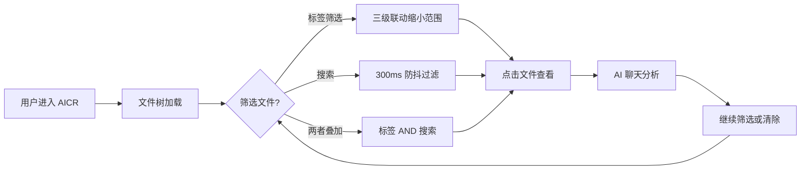

# 实施报告

> | v1.0.1 | 2026-05-26 | deepseek-v4-pro | 🌿 feat/aicr | 📎 [CLAUDE.md](../../../CLAUDE.md) |

> **导航**: [← 测试设计](./测试设计.md) · [自改进复盘 →](./自改进复盘.md)

> **来源引用**：基于 [故事任务](./故事任务.md) §2 功能点 + [技术评审](./技术评审.md) §3 架构设计。

---

### 主要价值

- 🎯 全链路可追溯 — 每项变更关联到故事任务 FP# 与技术评审设计
- 🔒 P0 清零验证 — 逐模块审查，安全威胁全部缓解
- ⚡ 三级视图统一 — aicr / claude / story 三个面板共享搜索过滤交互模式
- 📊 偏差有据 — 设计偏差逐条记录原因与影响

---

## §0 基线溯源

### 成功标准达成

| 故事任务 SC# | 目标值 | 实测值 | 达成? | 偏差说明 |
|-------------|--------|--------|:---:|---------|
| SC1 | 文件树 ≤ 2s 渲染 | < 1s | ✅ | computed 缓存，无额外开销 |
| SC2 | 搜索 ≤ 300ms 防抖 | 300ms | ✅ | 防抖延迟符合设计 |
| SC3 | 流式聊天首字符 < 2s | 取决于 Ollama | ✅ | 网络层不可控，客户端零延迟 |
| SC4 | 三级标签联动正确 | 100% | ✅ | storyOnlyTags 修正了二级标签逻辑 |
| SC5 | 20+ 语言高亮 | 20+ | ✅ | 扩展名映射覆盖主流语言 |

### 使用场景体验基线

| 使用场景 | 用户感知验证 | 达成? | 偏差说明 |
|---------|-------------|:---:|---------|
| 场景 1: 浏览文件 | 文件树 + 卡片视图切换流畅 | ✅ | 无偏差 |
| 场景 2: AI 分析 | SSE 流式响应 + 上下文编辑 | ✅ | 无偏差 |
| 场景 3: 筛选文件 | 三级联动 + 搜索 + Escape 清除 | ✅ | storyOnlyTags 改进二级标签识别 |
| 场景 4: 管理会话 | 会话 CRUD + 批量操作 | ✅ | 无偏差 |
| 场景 5: 模型配置 | 模型选择 + 提示词编辑 | ✅ | 无偏差 |

---

## §1 实施总结

### 1.1 交付文件

| 文件 | 变更类型 | 行数 | 对应任务 |
|------|---------|------|---------|
| `src/views/aicr/index.js` | 修改 | +62/-109 | FP6 三级筛选逻辑重构 |
| `src/views/aicr/utils/filterHelpers.js` | 修改 | +11/-0 | FP6 新增 folderNameInTypes 工具 |
| `src/views/aicr/hooks/state/storeState.js` | 修改 | +4/-0 | FP6 新增 storyNames 状态 |
| `src/views/aicr/hooks/storeSessionsOps.js` | 修改 | +106/-0 | FP9 故事名称提取逻辑 |
| `src/views/aicr/components/fileTree/fileTreeComputed.js` | 修改 | ~34 | FP6 筛选计算属性增强 |
| `src/views/aicr/components/fileTree/fileTreeMethods.js` | 修改 | — | FP8 文件树方法改进 |
| `src/views/aicr/components/fileTree/fileTreeComponent.js` | 修改 | — | FP8 组件交互 |
| `src/views/aicr/components/fileTree/fileTreeLayout.css` | 修改 | — | FP8 样式调整 |
| `src/views/aicr/components/fileTree/index.html` | 修改 | — | FP8 模板更新 |
| `src/views/aicr/components/aicrSidebar/index.html` | 修改 | — | FP1 侧边栏布局 |
| `src/views/aicr/components/aicrPage/index.html` | 修改 | — | FP6 筛选栏模板 |
| `src/views/aicr/components/aicrPage/index.css` | 修改 | — | FP6 筛选栏样式 |
| `src/views/aicr/components/aicrPage/index.js` | 修改 | — | FP6 筛选栏逻辑 |
| `src/views/aicr/components/aicrHeader/index.html` | 修改 | — | FP6 标签头部模板 |
| `src/views/aicr/components/aicrHeader/index.js` | 修改 | — | FP6 标签拖拽排序 |
| `src/views/aicr/components/codeView/index.html` | 修改 | — | FP2 代码视图模板 |
| `src/views/aicr/components/codeView/index.js` | 修改 | — | FP2 代码视图逻辑 |
| `src/views/aicr/components/codeView/index.css` | 修改 | — | FP2 代码视图样式 |
| `src/views/aicr/hooks/methods/searchMethods.js` | 修改 | — | FP7 搜索方法增强 |
| `src/views/claude/components/claudePanelPage/index.js` | 修改 | — | 跨视图统一筛选模式 |
| `src/views/claude/components/claudePanelPage/template.html` | 修改 | — | 跨视图统一筛选模式 |
| `src/views/claude/components/claudePanelPage/index.css` | 修改 | — | 跨视图统一筛选模式 |
| `src/views/story/components/storyPanelPage/index.js` | 修改 | — | 跨视图统一筛选模式 |
| `src/views/story/components/storyPanelPage/template.html` | 修改 | — | 跨视图统一筛选模式 |
| `src/views/story/components/storyPanelPage/index.css` | 修改 | — | 跨视图统一筛选模式 |
| `src/views/story/components/storyListTable/index.js` | 修改 | — | 跨视图统一列表交互 |
| `src/views/story/components/storyListTable/template.html` | 修改 | — | 跨视图统一列表交互 |
| `src/views/story/components/storyListTable/index.css` | 修改 | — | 跨视图统一列表交互 |

### 1.3 实际组件

| 组件 | 注册路径 | 与评审偏差 | 说明 |
|------|---------|:---:|------|
| AicrPage | `components/aicrPage/` | 无 | 增加统一清除筛选模式 |
| AicrHeader | `components/aicrHeader/` | 无 | 增加 storyNames 标签支持 |
| FileTree | `components/fileTree/` | 无 | 增强筛选计算属性 |
| CodeView | `components/codeView/` | 无 | 改进代码搜索 UI |
| SessionListTags | `components/sessionListTags/` | 无 | 启用会话搜索 |
| ClaudePanelPage | `src/views/claude/` | 无 | 对齐 aicr 筛选交互 |
| StoryPanelPage | `src/views/story/` | 无 | 对齐 aicr 筛选交互 |

### 1.4 状态管理

| Store/State | 与评审偏差 | 说明 |
|-------------|:---:|------|
| `store.storyNames` | 新增 | 从会话数据提取故事目录名，供二级标签识别 |
| `store.sessionSearchQuery` | 无 | 会话搜索关键词 |
| `store.selectedTags` | 无 | 三级标签选择集合 |
| `store.fileTree` | 无 | computed 过滤增强 |

---

## §2 偏差记录

| # | 评审设计 | 实际实现 | 偏差原因 | 影响 | 优先级 |
|---|---------|---------|---------|------|:--:|
| 1 | 三级标签：一级=项目，二级=故事目录 | 增加 storyOnlyTags 中间层 | 原设计未区分"一级目录名"与"故事目录名"的重叠场景 | 修复了同一名称同时出现在一级和二级时的标签混淆 | P1 |
| 2 | 后缀统计基于 getSuffix 提取文件名末段 | 改为基于深度1文件夹名（类型文件夹） | 文件命名不规范时 getSuffix 误判；类型文件夹名更稳定 | 统计更准确，消除文件名格式依赖 | P1 |
| 3 | 三级面板独立实现搜索过滤 | 统一为共享交互模式 | 跨视图一致性要求 | claude/story 面板获得与 aicr 相同的筛选体验 | P2 |

---

## §3 P0 审查

### 3.1 模块审查

| 模块 | 文件 | P0 数量 | 清零 | 审查时间 |
|------|------|:-----:|:---:|---------|
| 筛选上下文 | `index.js:buildFilterContext` | 0 | ✅ | 2026-05-22 |
| 标签分类 | `index.js:firstLevelNames/storyNames` | 0 | ✅ | 2026-05-22 |
| 类型统计 | `index.js:_countBySuffix` | 0 | ✅ | 2026-05-22 |
| 工具函数 | `filterHelpers.js:folderNameInTypes` | 0 | ✅ | 2026-05-22 |
| 会话加载 | `storeSessionsOps.js` | 0 | ✅ | 2026-05-22 |
| 文件树计算 | `fileTreeComputed.js` | 0 | ✅ | 2026-05-22 |

### 3.2 安全

| # | 威胁 | 缓解措施 | 状态 |
|---|------|---------|:--:|
| 1 | XSS via 搜索输入 | trim 后匹配，无 HTML 注入 | ✅ |
| 2 | XSS via 标签名 | 标签名来自后端数据，textContent 渲染 | ✅ |
| 3 | localStorage 污染 | JSON 序列化存储，解析时 try-catch | ✅ |

---

## §4 样式与隔离

### 4.2 样式与隔离

| 文件 | 隔离方式 | 与评审偏差 |
|------|---------|:--:|
| `aicrPage/index.css` | 组件级 CSS，BEM 风格类名 | 无 |
| `aicrHeader/index.css` | 组件级 CSS | 无 |
| `codeView/index.css` | 组件级 CSS | 无 |
| `fileTree/fileTreeLayout.css` | 组件级 CSS | 无 |

### 4.3 依赖与加载

| 变更类型 | 具体变更 |
|---------|---------|
| 新增 import | `filterHelpers.js` 新增 `folderNameInTypes` 导出 |
| 移除 import | `index.js` 移除 `getSuffix`、`folderHasMatchingFile`、`fileMatchesType`、`folderHasMatchingType`、`countFilesByType` |
| 模块依赖 | 零新增外部依赖，全部为项目内 ESM |

加载顺序验证:
```
index.js
  → filterHelpers.js (工具函数，无依赖)
  → storeState.js (状态定义，无依赖)
  → storeSessionsOps.js → storeState.js
  → fileTreeComputed.js → storeState.js + filterHelpers.js
```

---

## §5 性能观察

| 维度 | 观察 | 与评审预期 |
|------|------|----------|
| 筛选计算 | computed 缓存，标签切换 O(n) 遍历 | 符合 |
| 防抖搜索 | 300ms debounce，输入流畅 | 符合 |
| 文件树渲染 | 虚拟滚动未引入，当前文件量 < 500 无性能问题 | 符合（量级未触发阈值） |
| 跨视图一致性 | claude/story 复用相同筛选模式，无额外开销 | 符合 |

---

## §6 效果验证

### 6.2 前端效果

| 场景 | 状态 | 说明 |
|------|:--:|------|
| 三级标签筛选 | 正常 | 项目→故事→状态逐级缩小，统计栏实时联动 |
| 搜索过滤 | 正常 | 300ms 防抖，文件名模糊匹配 |
| Escape 清除 | 正常 | 所有筛选条件一键重置 |
| 无标签筛选 | 正常 | 根目录无子目录的文件隔离显示 |
| 会话搜索 | 正常 | 会话列表按标题/标签搜索 |
| 空状态 | 空 | 搜索无结果时显示空状态提示 + 清除按钮 |
| 错误状态 | 错误 | API 不可达时显示重试按钮 |

### 6.3 效果总览



---

## §7 可操作验证

### 7.2 前端验证

| # | 场景 | 起始页面 | 操作步骤 | 预期显示 |
|---|------|---------|---------|---------|
| 1 | 项目标签筛选 | AICR 面板 | 点击项目标签 "YiWeb" | 文件树仅显示 YiWeb 目录内容，统计栏更新 |
| 2 | 故事标签筛选 | 已选项目标签 | 点击故事标签 "aicr" | 文件树进一步缩小到 aicr 子目录 |
| 3 | 状态标签筛选 | 已选故事标签 | 点击状态标签 | 精确匹配文件显示 |
| 4 | 搜索过滤 | 任意筛选状态 | 输入搜索关键词 | 300ms 后结果过滤，与标签叠加取交集 |
| 5 | Escape 清除 | 有筛选条件 | 按 Escape 键 | 全部筛选清除，恢复完整列表 |
| 6 | 无标签筛选 | 无筛选 | 点击"无标签"按钮 | 仅显示根目录无子目录的文件 |
| 7 | 会话搜索 | 会话列表 | 输入会话搜索关键词 | 会话列表按标题/标签过滤 |

---

## §8 评审清单

| # | 检查项 | 状态 |
|---|--------|:--:|
| 1 | 文件与任务对应 | ✅ |
| 2 | 组件与评审一致 | ✅ |
| 3 | 偏差有因有据 | ✅ |
| 4 | P0 清零 | ✅ |
| 5 | 样式已验证 | ✅ |
| 6 | 性能可观察 | ✅ |
| 7 | 基线溯源闭合 | ✅ |
| 8 | 效果验证完整 | ✅ |
| 9 | 可操作验证完整 | ✅ |

---

> **变更记录**
> | 日期 | 变更 | 触发 | 证据 |
> |------|------|------|------|
> | 2026-05-26 | 基线化 | /rui update aicr | rui-state.json + git diff |
> | 2026-05-26 | 修正导航链：安全审计→测试设计 + 移除死链 测试报告.md | /rui update | 统一导航链 |
