# 技术评审

> | v3.0.2 | 2026-05-27 | deepseek-v4-pro | 🌿 feat/aicr | 📎 [CLAUDE.md](../../../CLAUDE.md) |

> **导航**: [← 使用场景](./使用场景.md) · [测试设计 →](./测试设计.md)

> **来源引用**：基于 [故事任务](./故事任务.md) §1 Story 1–5 与 [使用场景](./使用场景.md) §1 场景 1–5，从 `src/views/aicr/` 源码分析生成。

---

[§0 技术栈](#s-0-技术栈与-api-总览) · [§1 场景 1](#s-1-场景-1-文件浏览与内容查看) · [§2 场景 2](#s-2-场景-2-ai-对话分析) · [§3 场景 3](#s-3-场景-3-标签筛选与搜索) · [§4 场景 4](#s-4-场景-4-会话管理) · [§5 场景 5](#s-5-场景-5-文件树管理) · [§6 共享架构](#s-6-跨场景共享架构)

## 概述

五场景全维度技术方案，每场景含布局线框、mermaid 数据流图与序列图、涉及模块与状态、API 端点、UI 微交互及 Given/When/Then 测试用例。§6 覆盖跨场景共享架构（Store 工厂、SSE 流式管道、三级筛选管道等）。

### 主要价值

- 🎯 五场景全维度技术方案 — 与使用场景一一对应，每场景独立可评审
- 🔒 源码证据链 — 每模块附源码路径，可追溯可验证
- ⚡ 架构可视化 — 每场景含 mermaid 数据流图 + 布局线框 + 序列图
- 🧪 测试用例内嵌 — 每场景含 Given/When/Then 可执行用例
- 🎨 设计令牌 + 微交互 — 布局线框、UI 元素、交互动效全覆盖

---

## §0 技术栈与 API 总览

### 0.1 技术栈

| 维度 | 选择 | 原因 |
|------|------|------|
| 视图框架 | createBaseView (Vue 3 CDN) | 零构建，浏览器原生 ESM |
| 状态管理 | vueRef + store 工厂 | 集中式状态，computed 响应式缓存 |
| API 层 | fetch + SSE | 浏览器原生，无外部依赖 |
| Markdown 渲染 | marked + 自定义插件 | Mermaid、Sanitize、TOC |
| 代码高亮 | 自研扩展名匹配 | 零依赖，覆盖 20+ 语言 |
| 文件类型检测 | 自研扩展名→语言映射 | 轻量，无需完整语言包 |

### 0.2 设计令牌

| 令牌 | 取值 | 用途 |
|------|------|------|
| `--sidebar-default-width` | 320px | 侧边栏初始宽度 |
| `--chat-panel-default-width` | 420px | 聊天面板初始宽度 |
| `--sidebar-min-width` | 200px | 侧边栏最小拖拽宽度 |
| `--chat-min-width` | 300px | 聊天面板最小拖拽宽度 |
| `--resizer-width` | 6px | 面板拖拽条宽度 |
| `--header-height` | 48px | 顶部导航栏高度 |
| `--tag-height` | 32px | 标签胶囊高度 |
| `--font-mono` | JetBrains Mono | 代码区等宽字体 |
| `--font-sans` | Inter | 界面无衬线字体 |
| `--color-primary` | #3b82f6 | 主色调（激活态/选中态） |
| `--color-bg` | #0f172a | 页面深色背景 |
| `--color-surface` | #1e293b | 卡片/面板表面色 |
| `--color-border` | #334155 | 边框/分隔线 |
| `--search-debounce` | 300ms | 搜索输入防抖 |
| `--transition-default` | 200ms ease | 默认过渡动画 |

### 0.3 API 接口总览

> AICR 面板所有后端请求统一发送到 `window.API_URL`（默认 `https://api.effiy.cn`）。
> 认证方式：`X-Token` 请求头（`localStorage` 存储），`credentials: 'omit'`。

#### 服务路由

| 路由方式 | 端点 | 用途 |
|---------|------|------|
| `POST ${API_URL}/` + body 路由 | `services.database.data_service` | 会话 CRUD |
| `POST ${API_URL}/` + body 路由 | `services.ai.chat_service` | AI 聊天、模型列表 |
| `POST ${API_URL}/<endpoint>` | `/read-file`, `/write-file`, `/delete-file`, `/delete-folder`, `/rename-file`, `/rename-folder` | 文件操作 |
| `POST ${API_URL}/<endpoint>` | `/upload/upload-image-to-oss` | 图片上传 OSS |
| `POST ${API_URL}/<endpoint>` | `/wework/send-message` | 企业微信通知 |

#### 接口清单

| 接口 | 方法 | 服务模块 | 用途 | 场景 |
|------|------|---------|------|------|
| `query_documents` | GET/POST | `data_service` | 查询会话/文档列表 | [§1](#s-1-场景-1-文件浏览与内容查看) [§4](#s-4-场景-4-会话管理) [§5](#s-5-场景-5-文件树管理) |
| `create_document` | POST | `data_service` | 创建会话/文档记录 | [§4](#s-4-场景-4-会话管理) [§5](#s-5-场景-5-文件树管理) |
| `update_document` | POST | `data_service` | 更新会话元数据/标签/消息 | [§4](#s-4-场景-4-会话管理) |
| `delete_document` | POST | `data_service` | 删除会话/文档记录 | [§4](#s-4-场景-4-会话管理) [§5](#s-5-场景-5-文件树管理) |
| `chat` | POST (SSE) | `ai.chat_service` | AI 对话，流式 SSE 响应 | [§2](#s-2-场景-2-ai-对话分析) |
| `list_ollama_models` | GET | `ai.chat_service` | 获取可用 AI 模型列表 | [§2](#s-2-场景-2-ai-对话分析) |
| `/read-file` | POST | — | 读取文件内容（文本/图片） | [§1](#s-1-场景-1-文件浏览与内容查看) [§5](#s-5-场景-5-文件树管理) |
| `/write-file` | POST | — | 创建或覆盖写入文件 | [§5](#s-5-场景-5-文件树管理) |
| `/delete-file` | POST | — | 删除单个文件 | [§5](#s-5-场景-5-文件树管理) |
| `/delete-folder` | POST | — | 递归删除文件夹 | [§5](#s-5-场景-5-文件树管理) |
| `/rename-file` | POST | — | 重命名文件 | [§5](#s-5-场景-5-文件树管理) |
| `/rename-folder` | POST | — | 重命名文件夹 | [§5](#s-5-场景-5-文件树管理) |
| `/upload/upload-image-to-oss` | POST | — | 上传 base64 图片到阿里云 OSS | [§2](#s-2-场景-2-ai-对话分析) |
| `/wework/send-message` | POST | — | 发送企业微信群机器人消息 | [§2](#s-2-场景-2-ai-对话分析) |

<details>
<summary>curl 示例（展开查看）</summary>

#### 查询会话列表

```bash
curl -X POST 'https://api.effiy.cn/' \
  -H 'Content-Type: application/json' -H 'Accept: application/json' -H 'X-Token: <token>' \
  -d '{"module_name":"services.database.data_service","method_name":"query_documents","parameters":{"cname":"sessions"}}'
```

#### 读取文件

```bash
curl -X POST 'https://api.effiy.cn/read-file' \
  -H 'Content-Type: application/json' -H 'X-Token: <token>' \
  -d '{"target_file":"docs/故事任务面板/aicr/故事任务.md"}'
```

#### AI 聊天 (SSE 流式)

```bash
curl -X POST 'https://api.effiy.cn/' \
  -H 'Content-Type: application/json' -H 'Accept: text/event-stream' -H 'X-Token: <token>' \
  -d '{"module_name":"services.ai.chat_service","method_name":"chat","parameters":{"model":"qwen3.5","system":"You are a helpful assistant.","user":"解释这段代码","stream":true}}'
```

#### 获取模型列表

```bash
curl 'https://api.effiy.cn/?module_name=services.ai.chat_service&method_name=list_ollama_models&parameters=%7B%7D' \
  -H 'X-Token: <token>'
```

#### 创建会话

```bash
curl -X POST 'https://api.effiy.cn/' \
  -H 'Content-Type: application/json' -H 'X-Token: <token>' \
  -d '{"module_name":"services.database.data_service","method_name":"create_document","parameters":{"cname":"sessions","data":{"key":"my-story","url":"aicr-session://1710000000000-abc","title":"My_Story","pageDescription":"","messages":[],"tags":["YiWeb","aicr"],"createdAt":1710000000000,"updatedAt":1710000000000,"lastAccessTime":1710000000000}}}'
```

#### 更新会话

```bash
curl -X POST 'https://api.effiy.cn/' \
  -H 'Content-Type: application/json' -H 'X-Token: <token>' \
  -d '{"module_name":"services.database.data_service","method_name":"update_document","parameters":{"cname":"sessions","key":"my-story","data":{"title":"Updated_Title","tags":["YiWeb","aicr","技术评审"],"isFavorite":true}}}'
```

#### 删除会话

```bash
curl -X POST 'https://api.effiy.cn/' \
  -H 'Content-Type: application/json' -H 'X-Token: <token>' \
  -d '{"module_name":"services.database.data_service","method_name":"delete_document","parameters":{"cname":"sessions","key":"my-story"}}'
```

#### 写入/删除/重命名文件

```bash
curl -X POST 'https://api.effiy.cn/write-file' \
  -H 'Content-Type: application/json' -H 'X-Token: <token>' \
  -d '{"target_file":"docs/new-file.md","content":"# Title\n\nBody","is_base64":false,"overwrite":false}'

curl -X POST 'https://api.effiy.cn/delete-file' \
  -H 'Content-Type: application/json' -H 'X-Token: <token>' \
  -d '{"target_file":"docs/old-file.md"}'

curl -X POST 'https://api.effiy.cn/delete-folder' \
  -H 'Content-Type: application/json' -H 'X-Token: <token>' \
  -d '{"target_dir":"docs/old-folder"}'

curl -X POST 'https://api.effiy.cn/rename-file' \
  -H 'Content-Type: application/json' -H 'X-Token: <token>' \
  -d '{"old_path":"docs/old.md","new_path":"docs/new.md"}'

curl -X POST 'https://api.effiy.cn/rename-folder' \
  -H 'Content-Type: application/json' -H 'X-Token: <token>' \
  -d '{"old_dir":"docs/old","new_dir":"docs/new"}'
```

#### 上传图片 OSS / 企业微信消息

```bash
curl -X POST 'https://api.effiy.cn/upload/upload-image-to-oss' \
  -H 'Content-Type: application/json' -H 'X-Token: <token>' \
  -d '{"data_url":"data:image/png;base64,iVBORw0KGgo...","filename":"screenshot.png","directory":"aicr/images"}'

curl -X POST 'https://api.effiy.cn/wework/send-message' \
  -H 'Content-Type: application/json' -H 'X-Token: <token>' \
  -d '{"webhook_url":"https://qyapi.weixin.qq.com/cgi-bin/webhook/send?key=xxx","content":"## AI 回复\n\n内容..."}'
```

</details>

---

## §1 场景 1: 文件浏览与内容查看

> 对应 [使用场景 — 场景 1](./使用场景.md#场景-1-代码审查者浏览文件)

### 1.1 布局线框

```
┌──────────────────────────────────────────────────────────────────────────┐
│  HEADER  [48px]                                                          │
│  ┌──────────────────────┬────────────────────────────┬──────────────────┐ │
│  │ 代码审查  5个项目      │  🔍 搜索会话和文件...       │  📁树形  🗂卡片   │ │
│  └──────────────────────┴────────────────────────────┴──────────────────┘ │
├──────────────────────────────────────────────────────────────────────────┤
│  META + FILTER BAR  [可折叠]                                              │
│  ┌──────────────────────────────────────────────────────────────────────┐ │
│  │ [筛选 ▾] [全部 320] [YiWeb 45] [.claude 12] [Claude 67]             │ │
│  │ 故事: [aicr 7] [claude 5] [story 6]                                  │ │
│  │ 状态: [故事任务 18] [使用场景 12] [技术评审 8] [安全审计 5]            │ │
│  └──────────────────────────────────────────────────────────────────────┘ │
├──────────────────────────────────────────────────────────────────────────┤
│  MAIN AREA                                                                │
│  ┌──────────────────┬──────────────────────────┬────────────────────────┐ │
│  │ SIDEBAR  320px   │ CODE AREA  flex:1        │ CHAT PANEL  420px      │ │
│  │ 📂 文件树         │ 📄 代码 / Markdown 预览   │ 💬 AI 对话             │ │
│  │ 📁 YiWeb/        │  1 │ /**                 │                        │ │
│  │  📁 docs/        │  2 │  * AICR 入口        │                        │ │
│  │   📁 aicr/       │  3 │  */                 │                        │ │
│  │    📄 故事任务.md  │  4 │ import { ... }     │                        │ │
│  │    📄 使用场景.md  │  5 │                    │                        │ │
│  │  📁 src/views/    │  6 │ ◀ 行号可点击复制    │                        │ │
│  │   📁 aicr/        │     │                    │                        │ │
│  │    📄 index.js    │     │                    │                        │ │
│  │ ▌ 拖拽把手        │     │                    │       拖拽把手 ▌       │ │
│  └──────────────────┴──────────────────────────┴────────────────────────┘ │
└──────────────────────────────────────────────────────────────────────────┘
```

**卡片视图模式:**

```
SIDEBAR                                            📁树形  🗂卡片(激活)
┌──────────────────────────────────────────────────────────────────────┐
│ ┌──────────┐ ┌──────────┐ ┌──────────┐ ┌──────────┐                │
│ │ 📄 故事任务 │ │ 📄 使用场景 │ │ 📄 技术评审 │ │ 📄 安全审计 │                │
│ │ .md  12KB │ │ .md  8KB  │ │ .md  15KB │ │ .md  6KB  │                │
│ └──────────┘ └──────────┘ └──────────┘ └──────────┘                │
└──────────────────────────────────────────────────────────────────────┘
```

**面板折叠态:**

```
侧边栏折叠:                             聊天面板折叠:
┌──────────────────────────────┐        ┌──────────────────────────────┐
│ ▌◀▶▌ CODE AREA    CHAT 420px│        │ SIDEBAR 320px  CODE AREA ▶◀▌│
│ 折叠  📄 全宽代码  💬 对话    │        │ 📂 文件树       📄 沉浸式浏览 │
└──────────────────────────────┘        └──────────────────────────────┘
```

### 1.2 数据流全景

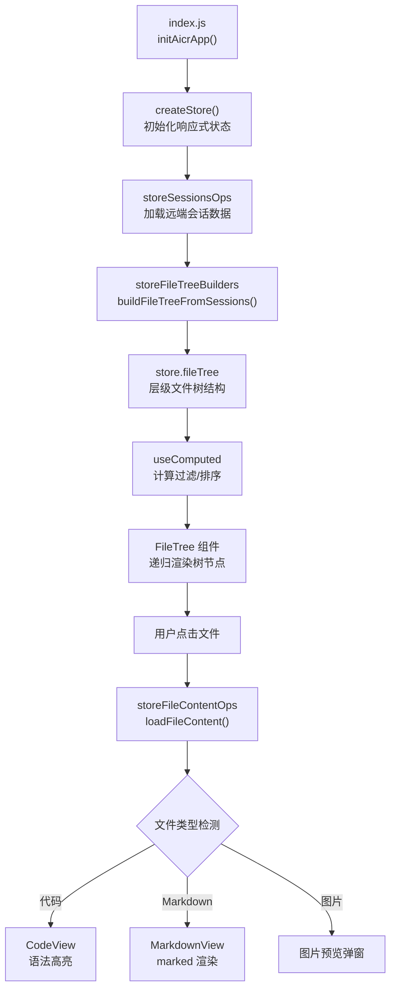

### 1.3 数据流序列

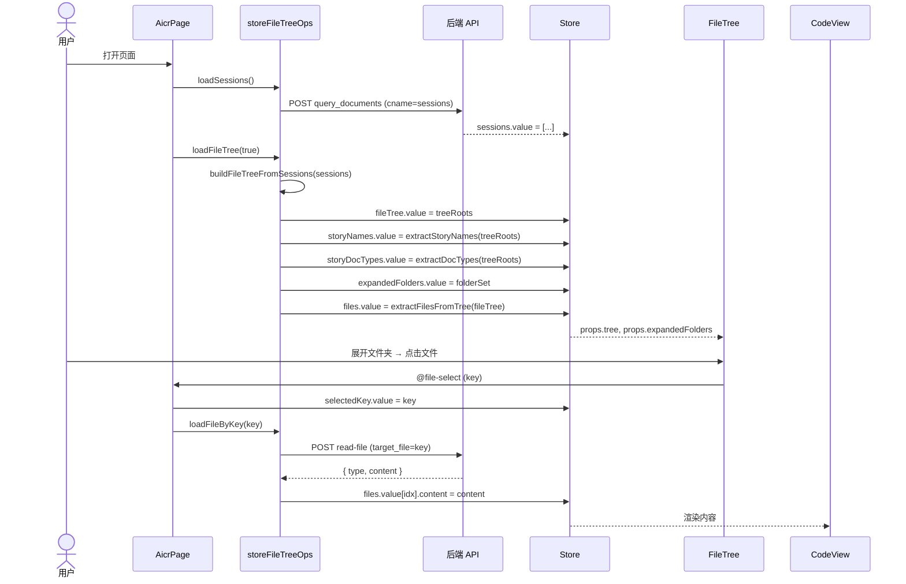

### 1.4 涉及模块

| 模块 | 路径 | 职责 |
|------|------|------|
| 入口初始化 | `src/views/aicr/index.js` | 创建 store、注册组件、启动应用 |
| Store 状态 | `src/views/aicr/hooks/state/` | 80+ 响应式变量（fileTree、fileContent、selectedFile 等） |
| 文件树构建 | `src/views/aicr/hooks/storeFileTreeBuilders.js` | 将远端 sessions 扁平列表构建为层级树结构 |
| 文件树操作 | `src/views/aicr/hooks/storeFileTreeOps.js` | 展开/折叠/选中节点 |
| 文件树展开 | `src/views/aicr/hooks/storeFileTreeExpandOps.js` | URL 参数定位时自动展开路径 |
| 文件内容加载 | `src/views/aicr/hooks/storeFileContentOps.js` | 按路径请求文件内容，管理加载/错误状态 |
| FileTree 组件 | `src/views/aicr/components/fileTree/` | 递归渲染树节点（12 个模块文件），支持树形/卡片双视图 |
| CodeView 组件 | `src/views/aicr/components/codeView/` | 代码语法高亮展示（1355 行），行号点击复制链接 |
| MarkdownView 组件 | `cdn/components/business/MarkdownView/` | Markdown 渲染，含 Mermaid 图表、TOC、内链跳转 |

### 1.5 涉及状态

| 状态变量 | 类型 | 来源 | 消费者 |
|---------|------|------|--------|
| `sessions` | Array | `loadSessions()` → API | `loadFileTree()` |
| `fileTree` | Array | `loadFileTree()` → `buildFileTreeFromSessions()` | FileTree 组件, computed |
| `files` | Array | `loadFiles()` → `extractFilesFromTree()` | CodeView, MarkdownView |
| `selectedKey` | string | FileTree `@file-select` | `loadFileByKey()`, CodeView |
| `expandedFolders` | Set | `loadFileTree()`, `toggleFolder()` | FileTree 折叠/展开 |
| `loading` | boolean | Ops 生命周期 | FileTree 骨架屏 |
| `errorMessage` | string | Ops catch | FileTree 错误提示 |

### 1.6 API 端点

| 接口 | 方法 | 用途 | 触发时机 |
|------|------|------|---------|
| `query_documents` | POST | 获取全量会话列表 | 页面初始化 |
| `/read-file` | POST | 读取单个文件内容 | 点击文件节点 |

### 1.7 关键 UI 元素与微交互

| 元素 | DOM 位置 | 行为 |
|------|---------|------|
| 文件树 | `<file-tree>` 组件 | 展开/折叠目录，单击选中文件，支持拖拽排序 |
| 代码区 | `<code-view>` 组件 | 按扩展名语法高亮，行号可点击复制链接 |
| Markdown 预览 | `<markdown-view>` 组件 | marked 渲染 + Mermaid + TOC + 内链跳转 |
| 图片预览 | 模态弹窗 | 点击图片全屏预览，支持缩放 |
| 视图切换 | `.aicr-view-segmented` 分段按钮 | 树形 ↔ 卡片切换，200ms 过渡 |
| 侧边栏折叠 | `.file-tree-toggle` 按钮 | 面板滑出/滑入 200ms |
| 拖拽把手 | `.resizer` 分隔条 | 拖拽调整面板宽度，localStorage 持久化 |

| 微交互 | 触发 | 反馈 | 时长 |
|------|------|------|:--:|
| 文件节点 | 悬停 | 背景色高亮 | 100ms |
| 文件节点 | 点击 | 展开动画 + spinner → 内容渲染 | 200ms |
| 目录节点 | 点击 | 子节点展开/折叠动画 | 200ms |
| 视图切换 | 点击分段按钮 | 布局切换 + 按钮高亮 | 200ms |
| 拖拽条 | hover/拖拽 | 光标 `col-resize` / 面板宽度实时跟随 | 即时 |
| 行号 | 点击 | 复制链接 + toast "已复制" | 1500ms |

### 1.8 测试用例

> 覆盖 AC: AC1 (文件树加载) · AC2 (文件内容展示) · AC7 (搜索过滤) · AC10 (空状态) · AC11 (API 错误)

**正常路径:**

| Given | When | Then |
|-------|------|------|
| 后端 API 返回会话数据 | 页面加载 | 文件树从 session 数据构建并展示 |
| 文件树已加载，存在 .js 文件 | 点击 .js 文件 | 代码区展示语法高亮代码，行号可点击复制链接 |
| 文件树已加载，存在 .md 文件 | 点击 .md 文件 | 代码区渲染 Markdown，支持内部链接跳转 |
| 文件树已加载，存在 .png 文件 | 点击 .png 文件 | 弹出图片全屏预览弹窗 |
| URL 含 `?key=<path>` 参数 | 页面加载 | 自动展开目录层级，定位并高亮目标文件 |
| 文件树为树形视图 | 点击视图切换按钮 | 切换为卡片视图；再次点击切回树形 |
| 文件树已加载 | 输入搜索关键词 | 300ms 防抖后过滤结果，不匹配文件隐藏 |

**边界/异常:**

| Given | When | Then |
|-------|------|------|
| 网络断开或 API 宕机 | 页面加载 | 错误状态 + 重试按钮，文件树显示空状态 |
| 文件树正常 | 点击文件后 API 返回 500 | 代码区显示错误占位，不影响文件树 |
| 文件树已加载 | 搜索不存在的文件名 | "未找到匹配文件" + 清除搜索按钮 |

> 证据: `src/views/aicr/index.js:18-75` · `src/views/aicr/hooks/storeFileTreeBuilders.js` · `src/views/aicr/hooks/storeFileContentOps.js`

---

## §2 场景 2: AI 对话分析

> 对应 [使用场景 — 场景 2](./使用场景.md#场景-2-开发者-ai-对话分析)

### 2.1 布局线框 — 对话态

```
┌──────────────────────────────────────────────────────────────┐
│  CHAT PANEL  420px                                           │
│  ┌──────────────────────────────────────────────────────────┐ │
│  │ 会话标题: "代码审查分析"                    [⭐] [⋯] [✕]  │ │
│  ├──────────────────────────────────────────────────────────┤ │
│  │ 模型: [deepseek-v4-pro ▾]  ⚙ 提示词  📝 上下文  📎 文件  │ │
│  ├──────────────────────────────────────────────────────────┤ │
│  │  ┌──────────────────────────────────────────────────┐    │ │
│  │  │ 👤 用户                              12:30       │    │ │
│  │  │ 请解释 src/views/aicr/index.js 的整体结构        │    │ │
│  │  │ 📎 当前文件: index.js                            │    │ │
│  │  └──────────────────────────────────────────────────┘    │ │
│  │  ┌──────────────────────────────────────────────────┐    │ │
│  │  │ 🤖 AI                                 12:31      │    │ │
│  │  │ 这个文件是 AICR 的入口，主要做了...              │    │ │
│  │  │ [📋 复制] [🔄 重新生成]                          │    │ │
│  │  └──────────────────────────────────────────────────┘    │ │
│  ├──────────────────────────────────────────────────────────┤ │
│  │  ┌──────────────────────────────────────────────────┐    │ │
│  │  │ 📝 输入消息...                         [📤 发送] │    │ │
│  │  └──────────────────────────────────────────────────┘    │ │
│  └──────────────────────────────────────────────────────────┘ │
└──────────────────────────────────────────────────────────────┘
```

**模型选择器展开 & 模态面板:**

```
模型选择器:                    上下文编辑器:                系统提示词:
┌──────────────────────┐    ┌─────────────────┐    ┌─────────────────┐
│ 模型: [deepseek ▾]   │    │ 编辑对话上下文   │    │ 系统提示词设置   │
│  ┌──────────────────┐│    │ 当前文件: index  │    │ 你是一个专业的..│
│  │ 🔍 搜索模型...   ││    │ 项目: YiWeb      │    │                 │
│  │ ● deepseek-v4    ││    │ 模块: aicr/      │    │                 │
│  │ ○ claude-opus    ││    │ [添加自定义...]  │    │ [取消]  [保存]  │
│  │ ○ gpt-4o         ││    │ [取消]  [保存]   │    └─────────────────┘
│  │ [🔄 刷新列表]    ││    └─────────────────┘
│  └──────────────────┘│
└──────────────────────┘
```

**流式渲染与错误态:**

```
流式 typing 指示器:                    SSE 中断态:
┌──────────────────────────┐        ┌──────────────────────────┐
│ 🤖 AI            12:31   │        │ 🤖 AI                    │
│ 这段代码使用了工厂模式...  │        │ 这段代码...              │
│ ▌  ← 闪烁光标，逐字追加    │        │ ⚠️ 连接中断，回复不完整   │
└──────────────────────────┘        │ [🔄 重新生成]            │
                                    └──────────────────────────┘
```

### 2.2 数据流全景

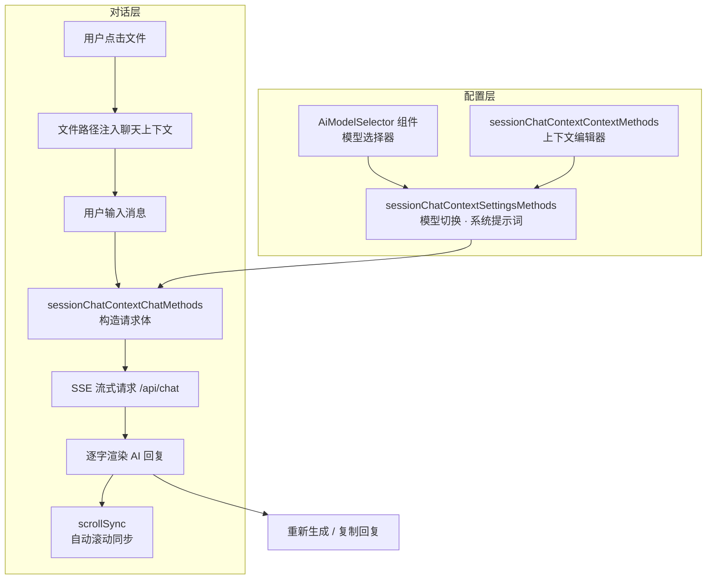

### 2.3 数据流序列

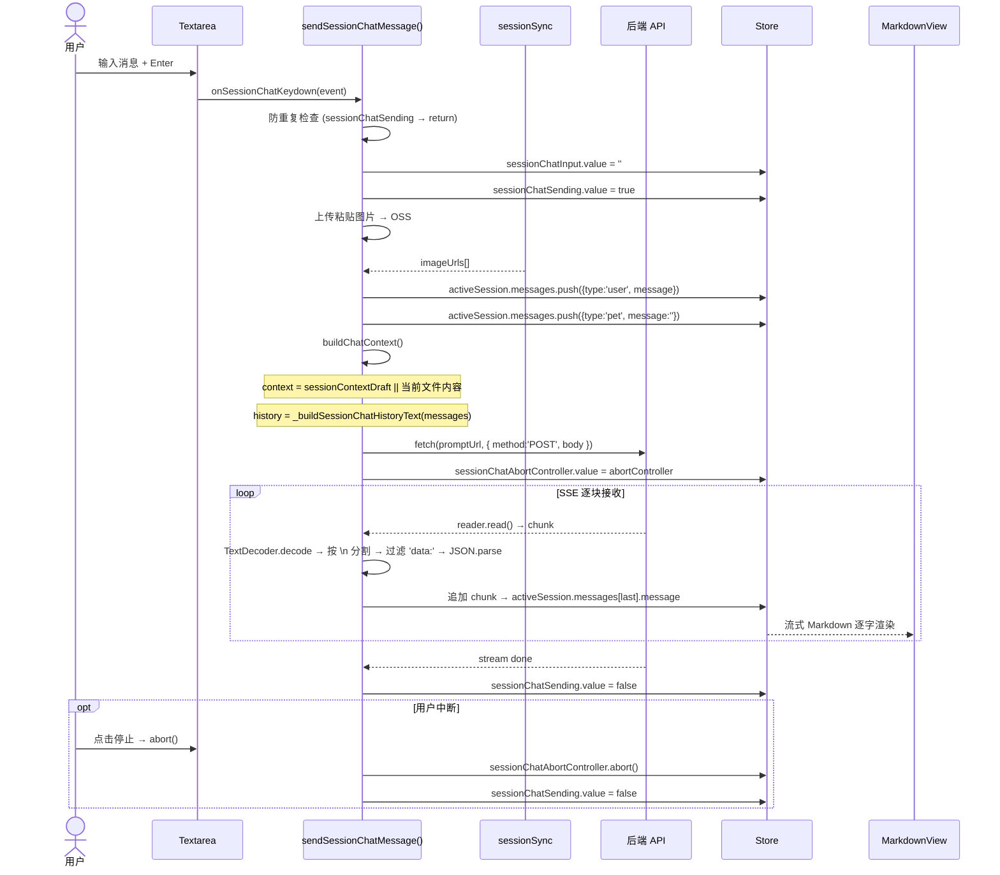

### 2.4 涉及模块

| 模块 | 路径 | 职责 |
|------|------|------|
| 聊天核心 | `src/views/aicr/hooks/sessionChatContextMethods.js` | 管理聊天会话生命周期，文件上下文绑定 |
| 消息收发 | `src/views/aicr/hooks/sessionChatContextChatMethods.js` | 构造请求、发送消息、处理响应 |
| SSE 流式 | `src/views/aicr/hooks/sessionChatContextChatMethods.streaming.js` | SSE 连接管理、逐字解析、中断重连 |
| 模型设置 | `src/views/aicr/hooks/sessionChatContextSettingsMethods.js` | AI 模型切换、系统提示词编辑持久化 |
| 上下文编辑 | `src/views/aicr/hooks/sessionChatContextContextMethods.js` | 对话背景信息编辑/保存/撤销 |
| 滚动同步 | `src/views/aicr/hooks/sessionChatContextMethods.scrollSync.js` | 新消息自动滚动到底部 |
| 模型选择器 | `src/views/aicr/components/AiModelSelector/` | 模型下拉列表 + 手动输入降级 + 刷新重拉 |

### 2.5 涉及状态

| 状态变量 | 类型 | 来源 | 消费者 |
|---------|------|------|--------|
| `activeSession` | Object | `selectSessionForChat()` | 聊天面板、消息列表 |
| `activeSession.messages[]` | Array | 用户发送 + SSE 流式追加 | MarkdownView 渲染 |
| `sessionChatInput` | string | Textarea v-model | `sendSessionChatMessage()` |
| `sessionChatSending` | boolean | 发送时设 true，完成/中断设 false | 防重复、按钮禁用 |
| `sessionChatAbortController` | AbortController | 发送时创建 | 停止按钮 abort() |
| `sessionContextEnabled` | boolean | 用户切换开关 | `buildChatContext()` |
| `sessionContextDraft` | string | 上下文编辑器 | `buildChatContext()` |
| `sessionBotModel` | string | 设置面板保存 | 请求体 model 字段 |
| `sessionBotSystemPrompt` | string | 设置面板保存 | 请求体 systemPrompt 字段 |
| `availableModels` | Array | `fetchModels()` → API | AiModelSelector 下拉 |
| `modelsLoading` | boolean | `fetchModels()` 生命周期 | AiModelSelector 加载态 |
| `modelsError` | string | `fetchModels()` catch | AiModelSelector 错误态 |

### 2.6 关键数据流

```
用户配置:
  模型选择 → store.selectedModel → 请求体 model 字段
  系统提示词 → store.systemPrompt → 请求体 system 字段
  上下文编辑 → store.chatContext → 请求体 context 字段

发送消息:
  用户输入 + 文件路径 + 模型配置 → POST /api/chat (SSE)
  → ReadableStream 逐块读取 → store.chatMessages[] 追加 → 渲染
  → 错误: 展示错误提示，允许重试或切换模型
```

### 2.7 API 端点

| 接口 | 方法 | 用途 | 触发时机 |
|------|------|------|---------|
| `chat` | POST (SSE) | AI 对话流式响应 | 发送消息/重新生成 |
| `list_ollama_models` | GET | 获取可用模型列表 | 打开模型选择器 / 点击刷新 |
| `/upload/upload-image-to-oss` | POST | 粘贴图片上传 OSS | 聊天框粘贴图片 |
| `/wework/send-message` | POST | 发送到企业微信群 | 点击发送到微信 |

> 模型偏好（`sessionBotModel`、`sessionBotSystemPrompt`）保存到 `localStorage`，不通过 API 持久化。

### 2.8 关键 UI 元素与微交互

| 元素 | DOM 位置 | 行为 |
|------|---------|------|
| 聊天面板 | `.pet-chat-right-panel` | 右侧 420px，可拖拽调整宽度 |
| 消息列表 | `#pet-chat-messages` | `role="log"` 实时追加，自动滚动到底部 |
| 输入框 | `.pet-chat-input` 区域 | Enter 发送，Shift+Enter 换行 |
| 模型选择器 | `<ai-model-selector>` 组件 | 下拉列表选择 + 手动输入降级 + 刷新按钮 |
| 系统提示词 | 设置面板模态框 | textarea 编辑，保存后注入后续请求 |
| 上下文编辑器 | 上下文模态面板 | 显示当前文件/项目信息，支持追加自定义文本 |
| 空状态 | `<yi-empty-state>` | 未选会话时展示引导图标 |
| 加载态 | `<yi-loading>` | 加载会话历史时展示 spinner |
| 错误态 | `<yi-error-state>` | 会话加载失败时展示错误信息 |

| 微交互 | 触发 | 反馈 | 时长 |
|------|------|------|:--:|
| 发送 | 点击/Enter | 消息上屏 + typing 指示器 | 即时 |
| AI 回复 | SSE 数据到达 | 逐字追加渲染 | 实时 |
| 复制按钮 | 点击 | "复制" → "已复制" ✓ | 1500ms |
| 重新生成 | 点击 | 清除上条 AI 回复 → 重新请求 | 即时 |
| 模型下拉 | 点击输入框 | 下拉面板展开 + 已选高亮 | 100ms |
| 模型选择 | 点击模型项 | 选中标记切换 + 面板关闭 | 100ms |
| SSE 中断 | 异常断开 | 红色警告条 + 重新生成按钮 | 即时 |

### 2.9 测试用例

> 覆盖 AC: AC3 (AI 流式聊天)

**正常路径:**

| Given | When | Then |
|-------|------|------|
| 已选中文件作为上下文，AI 服务可用 | 输入"解释这段代码"并发送 | SSE 流式响应逐块展示，文件内容作为上下文发送 |
| 上一条 AI 回复已展示 | 点击重新生成按钮 | 清除上一条回复，相同上下文重新请求 |
| AI 回复已完整展示 | 点击复制按钮 | 回复内容复制到剪贴板，显示复制成功提示 |
| 已选中文件 | 打开上下文编辑器，编辑内容，保存 | 下次聊天使用编辑后的上下文 |
| AI 服务可用 | 打开模型选择器 | 从 API 拉取可用模型列表，以下拉选项展示 |
| 模型列表为空或不可达 | 手动输入模型 ID 并确认 | 使用手动输入的模型 ID 发送请求 |
| 用户打开设置面板 | 编辑系统提示词内容，保存 | 下次聊天自动注入该提示词 |

**边界/异常:**

| Given | When | Then |
|-------|------|------|
| AI 服务宕机 | 发送聊天消息 | 错误提示"模型服务不可用"，不展示空白回复 |
| 流式聊天进行中 | 网络断开 | "流式连接中断"提示，已接收部分保留 |
| 未选择任何文件 | 输入消息并发送 | 使用默认上下文正常发送，不报错 |
| AI 服务不可用 | 打开模型选择器或点击刷新 | "无法获取模型列表"提示，允许手动输入 |
| 用户清空系统提示词 | 保存空提示词并发送 | 请求中不注入系统提示词，正常发送 |

> 证据: `src/views/aicr/hooks/sessionChatContextChatMethods.streaming.js` · `src/views/aicr/hooks/sessionChatContextSettingsMethods.js` · `src/views/aicr/components/AiModelSelector/`

---

## §3 场景 3: 标签筛选与搜索

> 对应 [使用场景 — 场景 3](./使用场景.md#场景-3-管理者三级联动筛选文件)

### 3.1 布局线框

**全态 (无筛选):**

```
┌──────────────────────────────────────────────────────────────────────┐
│  META + FILTER BAR                                                    │
│  ┌──────────────────────────────────────────────────────────────────┐ │
│  │ [筛选 ▾]                                                         │ │
│  │ 项目: [● 全部 320] [○ YiWeb 45] [○ .claude 12] [○ Claude 67]    │ │
│  │ 故事: [● 全部] [○ aicr 7] [○ claude 5] [○ story 6]              │ │
│  │ 状态: [● 全部] [○ 故事任务 18] [○ 使用场景 12] [○ 技术评审 8]     │ │
│  │ 📊 筛选统计: 📄320文件  🏷️18故事  📐12场景  ✏️8设计              │ │
│  └──────────────────────────────────────────────────────────────────┘ │
│  SIDEBAR (完整文件树, 320个项目)                                       │
└──────────────────────────────────────────────────────────────────────┘
```

**L1 + L2 筛选 (项目: YiWeb → 故事: aicr):**

```
  META BAR:
  ┌──────────────────────────────────────────────────────────────────┐ │
  │ [筛选 ▾]                                                         │ │
  │ 项目: [○ 全部] [● YiWeb 45] [○ .claude 12] [○ Claude 67] [✕]   │ │
  │ 故事: [● 全部] [● aicr 7] [○ claude 5] [○ story 6]              │ │
  │ 状态: [● 全部] [○ 故事任务 1] [○ 使用场景 1] [○ 技术评审 1]       │ │
  │ 📊 aicr: 📄7文件  🏷️1故事  📐1场景  ✏️1设计                      │ │
  └──────────────────────────────────────────────────────────────────┘ │
  SIDEBAR (仅显示 YiWeb/docs/aicr/):
  📁 YiWeb/ → 📁 docs/ → 📁 aicr/ → [7 files...]
```

**L3 精确筛选 + 搜索 (技术评审 + "设计"):**

```
  META BAR:
  ┌──────────────────────────────────────────────────────────────────┐ │
  │ 项目: [● YiWeb 45]  故事: [● aicr 7]  状态: [● 技术评审 1] [✕]  │ │
  │ 🔍 设计 ×                           📊 1 个结果                   │ │
  └──────────────────────────────────────────────────────────────────┘ │
  SIDEBAR: 📁 YiWeb/ → 📁 docs/ → 📁 aicr/ → 📄 技术评审.md (唯一匹配)
```

### 3.2 数据流全景

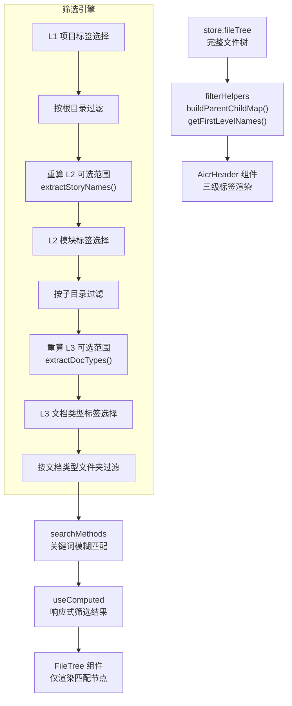

### 3.3 三级联动算法

```
L1 项目标签:
  选中 → 确定根目录范围 → L2/L3 可选值基于此范围重新计算
  未选中 → 展示全部项目

L2 模块标签 (依赖 L1):
  选中 → 在 L1 范围内确定子目录 → L3 可选值基于 L1+L2 重新计算
  未选中 → 展示 L1 下全部模块

L3 文档类型标签 (依赖 L1+L2):
  选中 → 匹配文档类型文件夹名称 → 精确过滤
  未选中 → 展示全部类型

搜索关键词 (独立维度):
  与标签筛选 AND 组合 → 在标签筛选结果上进一步文件名匹配

清除策略:
  Escape / 清除按钮 → 全部重置为空 → 恢复完整文件树
```

### 3.4 双向联动 — `handleTagSelect()` 自动选父/去子

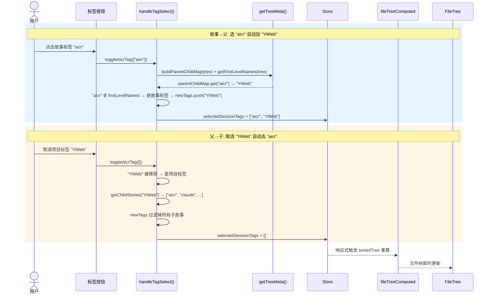

### 3.5 涉及模块

| 模块 | 路径 | 职责 |
|------|------|------|
| 标签筛选 | `src/views/aicr/hooks/methods/tagFilterMethods.js` | 标签选择/清除/联动逻辑 |
| 搜索过滤 | `src/views/aicr/hooks/methods/searchMethods.js` | 文件名关键词模糊匹配，输入防抖 |
| 响应式计算 | `src/views/aicr/hooks/useComputed.js` | computed 缓存筛选结果 |
| 筛选辅助 | `src/views/aicr/utils/filterHelpers.js` | buildParentChildMap、getFirstLevelNames、extractStoryNames、extractDocTypes |
| 标签头部 | `src/views/aicr/components/aicrHeader/` | 标签展示与拖拽排序 |

### 3.6 涉及状态

| 状态变量 | 类型 | 来源 | 消费者 |
|---------|------|------|--------|
| `selectedSessionTags` | string[] | `handleTagSelect()` | `sortedTree` (L1+L2), `allTags`, `tagCounts` |
| `selectedTypeTags` | string[] | `handleTypeTagToggle()` | `sortedTree` (L3), `allTags`, `tagCounts` |
| `sessionSearchQuery` | string | `handleSessionSearchChange()` | `sortedTree` 根节点名过滤 |
| `tagFilterNoTags` | boolean | `handleTagFilterNoTags()` | `sortedTree` 根级文件模式 |
| `storyLevelNoTags` | boolean | `handleStoryLevelNoTags()` | `buildFilterContext()` |
| `storyNames` | string[] | `loadFileTree()` → `extractStoryNames()` | 项目标签组 |
| `storyDocTypes` | string[] | `loadFileTree()` → `extractDocTypes()` | 类型标签行 |
| `tagOrder` | string[] | `localStorage` (`aicr_file_tag_order`) | `allTags` 排序 |

> 三级联动筛选为**纯前端操作**，不触发额外 API 请求。标签数据来自 `loadFileTree()` 阶段的文件树提取。

### 3.7 关键 UI 元素与微交互

| 元素 | DOM 位置 | 行为 |
|------|---------|------|
| 标签胶囊行 | `.aicr-header-tags-row` 横向滚动容器 | 项目/故事/状态三级标签胶囊平铺，超出可横向滚动 |
| 标签胶囊 | `button` 标签按钮 | 选中高亮 `--color-primary`，未选中默认态 |
| 清除按钮 | 标签行尾部 `[✕ 清除]` | 一键清除所有筛选条件 |
| 搜索框 | `.aicr-search-input` | placeholder "搜索会话和文件..."，300ms 防抖触发过滤 |
| 搜索清除 | `.aicr-search-clear` 按钮 | 搜索框有值时出现，点击清除 |
| 统计栏 | `.aicr-meta-row` 底部统计 | 实时显示当前筛选结果的文件/故事/场景/设计数量 |
| 筛选折叠 | `[筛选 ▾]` 按钮 | 折叠/展开筛选栏 |

| 微交互 | 触发 | 反馈 | 时长 |
|------|------|------|:--:|
| 项目标签 | 点击 | 选中高亮 + L2/L3 联动更新 + 文件树收缩动画 | 200ms |
| 故事标签 | 点击 | 选中高亮 + L3 联动更新 + 文件树进一步收缩 | 200ms |
| 状态标签 | 点击 | 选中高亮 + 文件树精确过滤 | 200ms |
| 同级标签 | 点击另一标签 | 同维度单选切换 | 200ms |
| 搜索输入 | 键入 | 300ms 防抖后过滤文件名 | 300ms |
| 清除/Escape | 点击/按键 | 所有标签恢复未选中 + 文件树恢复完整 | 200ms |
| 搜索 × | 点击 | 清空搜索文本 + 恢复标签筛选结果 | 即时 |
| 无匹配 | 筛选结果为空 | 文件树展示空结果提示 | — |

### 3.8 测试用例

> 覆盖 AC: AC4 (项目标签) · AC5 (故事标签) · AC6 (状态标签) · AC8 (清除筛选)

**正常路径:**

| Given | When | Then |
|-------|------|------|
| 文件树包含多个项目目录 | 点击"YiWeb"项目标签 | 文件树仅显示 YiWeb 根目录，故事标签联动更新 |
| 已选择"YiWeb"项目标签 | 点击"aicr"故事标签 | 文件树缩小为 aicr 子目录，状态标签联动更新 |
| 已选择项目和故事标签 | 点击"技术评审"状态标签 | 仅显示匹配"技术评审"类型的文件 |
| 某项目根目录存在孤立文件 | 点击"无标签"筛选按钮 | 仅显示根目录下无子目录的文件 |
| 已应用任意筛选条件 | 按 Escape 键 | 所有筛选清除，文件树恢复完整列表 |
| 已应用任意筛选条件 | 点击清除筛选按钮 | 同 Escape，所有筛选条件重置 |

**边界/异常:**

| Given | When | Then |
|-------|------|------|
| 已选择项目+故事+状态标签 | 组合下无任何匹配文件 | 空状态提示 + "清除筛选"快捷按钮 |
| 已选择"aicr"故事标签 | 快速切换选择"claude"故事标签 | 文件树立即更新，无闪烁或中间态 |

> 证据: `src/views/aicr/hooks/methods/tagFilterMethods.js` · `src/views/aicr/utils/filterHelpers.js` · `src/views/aicr/hooks/useComputed.js`

---

## §4 场景 4: 会话管理

> 对应 [使用场景 — 场景 4](./使用场景.md#场景-4-组织者管理会话)

### 4.1 布局线框

**会话列表:**

```
┌──────────────────────────────────────────────────────────────────────┐
│  SIDEBAR 底部 — 会话列表区                                            │
│  ┌──────────────────────────────────────────────────────────────────┐ │
│  │ 💬 会话列表                            [🏷️ 标签筛选 ▾] [＋ 新建] │ │
│  ├──────────────────────────────────────────────────────────────────┤ │
│  │ ☐ 📝 代码审查分析                                ⭐  🏷️code     │ │
│  │ ☐ 📝 技术方案讨论                                ⭐  🏷️design   │ │
│  │ ☐ 📝 安全审计对话                                   🏷️security  │ │
│  │ ☑ 📝 已废弃的临时对话                             🏷️temp       │ │
│  │ ☑ 📝 旧版 FAQ 测试                                 🏷️old        │ │
│  ├──────────────────────────────────────────────────────────────────┤ │
│  │ 已选 2 项    [🗑️ 批量删除]                                       │ │
│  └──────────────────────────────────────────────────────────────────┘ │
└──────────────────────────────────────────────────────────────────────┘
```

**操作弹窗:**

```
编辑会话名称:              标签管理:                  删除确认:
┌─────────────────┐    ┌─────────────────┐    ┌─────────────────┐
│ 编辑会话名称  [✕]│    │ 管理标签     [✕]│    │ ⚠️ 确认删除  [✕]│
│                 │    │ 已有: [code ×]  │    │ 确定删除会话     │
│ [代码审查分析_] │    │ 添加: [___][＋] │    │ "代码审查分析"?  │
│ [取消]  [保存]  │    │ 建议: design... │    │ 此操作不可撤销。 │
└─────────────────┘    │ [完成]          │    │ [取消]  [删除]   │
                       └─────────────────┘    └─────────────────┘

批量删除确认:
┌──────────────────────────────┐
│ ⚠️ 批量删除              [✕] │
│ 确定删除以下 2 个会话?        │
│ • 已废弃的临时对话             │
│ • 旧版 FAQ 测试               │
│ 此操作不可撤销。              │
│ [取消]  [全部删除]            │
└──────────────────────────────┘
```

### 4.2 数据流全景

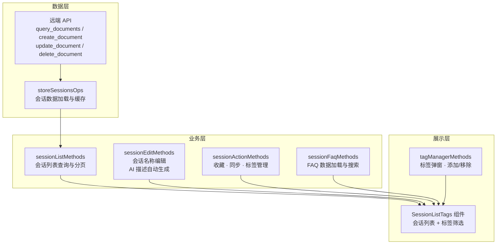

### 4.3 会话 CRUD 序列

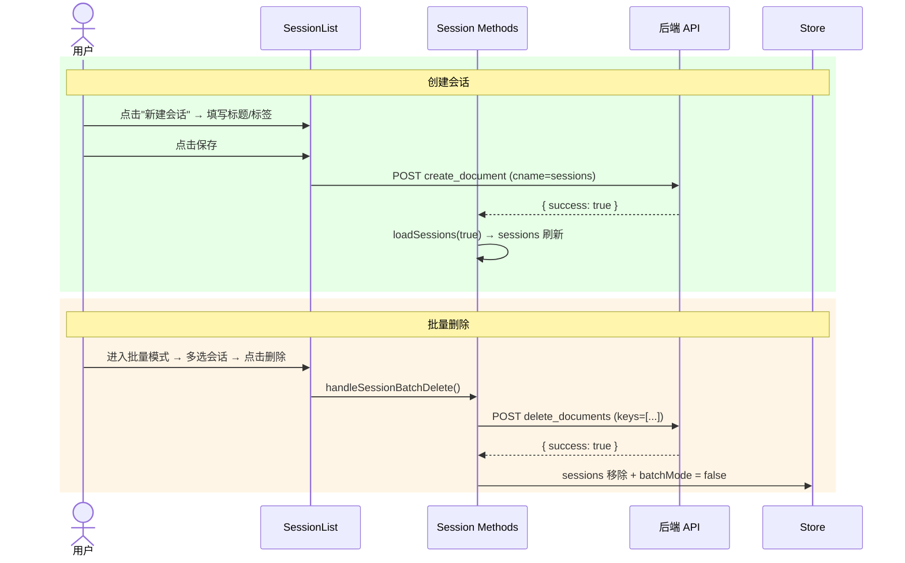

### 4.4 涉及模块

| 模块 | 路径 | 职责 |
|------|------|------|
| 会话列表 | `src/views/aicr/hooks/sessionListMethods.js` | 查询、分页、排序会话列表 |
| 会话编辑 | `src/views/aicr/hooks/sessionEditMethods.js` | 编辑会话名称、AI 自动生成描述 |
| 会话操作 | `src/views/aicr/hooks/sessionActionMethods.js` | 收藏/取消收藏、同步、标签关联 |
| FAQ 管理 | `src/views/aicr/hooks/sessionFaqMethods.js` | 加载 FAQ 数据、关键词搜索 |
| 会话存储 | `src/views/aicr/hooks/storeSessionsOps.js` | 远端数据加载、本地缓存同步 |
| 标签管理 | `src/views/aicr/hooks/tagManagerMethods.js` | 标签弹窗、添加/移除标签 |
| 会话组件 | `src/views/aicr/components/sessionListTags/` | 会话列表渲染、标签筛选、批量操作 UI |

### 4.5 涉及状态

| 状态变量 | 类型 | 来源 | 消费者 |
|---------|------|------|--------|
| `sessions` | Array | `loadSessions()` → API | SessionList, FileTree |
| `sessionLoading` | boolean | `loadSessions()` 生命周期 | SessionList 骨架屏 |
| `sessionError` | string | `loadSessions()` catch | SessionList 错误提示 |
| `sessionBatchMode` | boolean | 用户切换 | SessionList 复选框列 |
| `selectedSessionKeys` | Set | 用户勾选 | 批量操作按钮、全选状态 |
| `sessionEdit*` | 多个 | 编辑弹窗 v-model | YiModal 表单 |

### 4.6 关键数据流

```
会话 CRUD:
  创建 → create_document API → store.sessions[] 追加 → 列表刷新
  编辑 → update_document API → store.sessions[] 更新 → 名称即时生效
  删除 → delete_document API → store.sessions[] 移除 → 列表刷新
  复制 → create_document API (深拷贝) → 副本追加到列表

标签管理:
  添加标签 → tags[] 追加 → update_document API → 标签关联持久化
  移除标签 → tags[] 移除 → update_document API → 标签解除关联

批量操作:
  多选 → 勾选会话 checkbox → store.selectedSessionKeys 更新
  批量删除 → 逐条 delete_document → store.sessions[] 批量移除
  部分失败 → 展示成功/失败明细
```

### 4.7 API 端点

| 接口 | 方法 | 用途 | 触发时机 |
|------|------|------|---------|
| `query_documents` | POST | 查询会话列表 | 页面加载 / CRUD 后刷新 |
| `create_document` | POST | 创建新会话 | 新建会话 → 保存 |
| `update_document` | POST | 更新会话元数据/标签/收藏 | 编辑/收藏/标签操作 |
| `delete_document` | POST | 删除会话 | 删除/批量删除 |

### 4.8 关键 UI 元素与微交互

| 元素 | DOM 位置 | 行为 |
|------|---------|------|
| 会话列表 | `<session-list-tags>` 组件 | 按最后活跃时间排序，展示名称/标签/消息数 |
| 新建按钮 | `[＋ 新建]` 按钮 | 弹出名称输入框 → 确认后创建新会话 |
| 会话行 | 每条会话卡片 | 悬停显示操作按钮（编辑/复制/删除）；收藏切换 ⭐ |
| 批量模式 | checkbox + `[批量删除]` | 勾选多条 → 按钮激活 → 确认后批量删除 |
| 标签筛选 | `[🏷️ 标签筛选 ▾]` | 按标签过滤会话列表 |
| 会话标签 | 标签胶囊 | 点击添加 → 弹出标签管理弹窗 |

| 微交互 | 触发 | 反馈 | 时长 |
|------|------|------|:--:|
| 新建/编辑按钮 | 点击 | 弹出模态框，输入框自动 focus | 100ms |
| 确认删除 | 点击 "删除" | 会话行淡出 → 列表刷新 | 200ms |
| 收藏 ⭐ | 点击 | 星标实心/空心切换 + 颜色变化 | 100ms |
| 复制按钮 | 点击 | 副本出现在列表顶部（名称追加 "副本"） | 即时 |
| 批量勾选 | 点击 checkbox | 会话行高亮 + 计数更新 + 按钮激活 | 即时 |
| 标签添加/移除 | 点击 + 输入/× | 胶囊弹入/淡出 | 200ms |
| 部分失败 | 批量删除后 | toast "已成功删除 X 项，Y 项失败" | 3000ms |

### 4.9 测试用例

> 覆盖 AC: AC9 (会话 CRUD)

**正常路径:**

| Given | When | Then |
|-------|------|------|
| 会话列表已加载 | 点击创建会话按钮 | 新会话出现在列表中，自动获得默认名称 |
| 会话列表中存在会话 | 编辑会话名称或描述，保存 | 会话元数据更新，列表刷新显示新名称 |
| 会话已存在 | 为会话添加标签"review"，再移除该标签 | 标签出现后消失 |
| 会话列表存在多个会话 | 进入批量模式，多选 3 个会话，点击删除并确认 | 3 个会话从列表移除，后端同步删除 |
| 会话列表中存在会话 | 点击会话的收藏按钮 | 标记为已收藏；再次点击取消收藏 |

**边界/异常:**

| Given | When | Then |
|-------|------|------|
| 会话列表正常 | 删除会话时 API 返回 500 | "删除失败"提示，会话仍保留在列表中 |
| 已选中 3 个会话批量删除 | API 返回部分成功 | 成功的移除，失败的保留并提示具体失败项 |

> 证据: `src/views/aicr/hooks/sessionListMethods.js` · `src/views/aicr/hooks/sessionActionMethods.js` · `src/views/aicr/hooks/tagManagerMethods.js`

---

## §5 场景 5: 文件树管理

> 对应 [使用场景 — 场景 5](./使用场景.md#场景-5-维护者管理文件树)

### 5.1 布局线框

**右键上下文菜单:**

```
┌──────────────────────────────────────┐
│  SIDEBAR                             │
│  📁 docs/                            │
│   📁 aicr/                           │
│    📄 故事任务.md                     │
│    📄 使用场景.md                     │
│    📄 技术评审.md  ← 右键点击文件夹    │
│    ┌─────────────────────┐           │
│    │ 📂 新建文件夹        │           │
│    │ 📄 新建文件          │           │
│    │ ✏️ 重命名            │           │
│    │ 🗑️ 删除              │           │
│    │─────────────────────│           │
│    │ 📤 导出此文件夹      │           │
│    └─────────────────────┘           │
└──────────────────────────────────────┘
```

**操作弹窗:**

```
新建文件:                    重命名:                      删除确认:
┌──────────────────┐    ┌──────────────────┐    ┌──────────────────┐
│ 新建文件      [✕]│    │ 重命名        [✕]│    │ ⚠️ 确认删除   [✕]│
│ 位置: docs/aicr/ │    │ 当前: 故事任务.md │    │ 确定删除         │
│ 文件名: [_.md ▾] │    │ 新名称: [_.md]    │    │ "旧版设计.md"?  │
│ ⚠️ 文件名不能为空│    │ ⚠️ 已存在同名文件 │    │ 此操作不可撤销。 │
│ [取消]  [创建]   │    │ [取消]  [保存]    │    │ ℹ️ 关联会话不受影响│
└──────────────────┘    └──────────────────┘    │ [取消]  [删除]   │
                                                 └──────────────────┘
工具栏:
[📤 导入文件夹] [📥 导出文件夹] [📦 下载 ZIP] [📤 上传 ZIP]
```

### 5.2 数据流全景

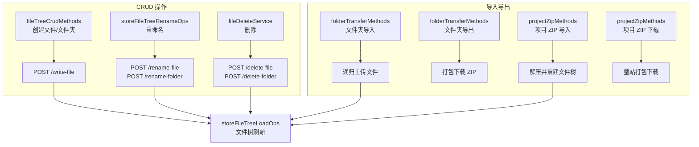

### 5.3 数据流序列 — 创建文件

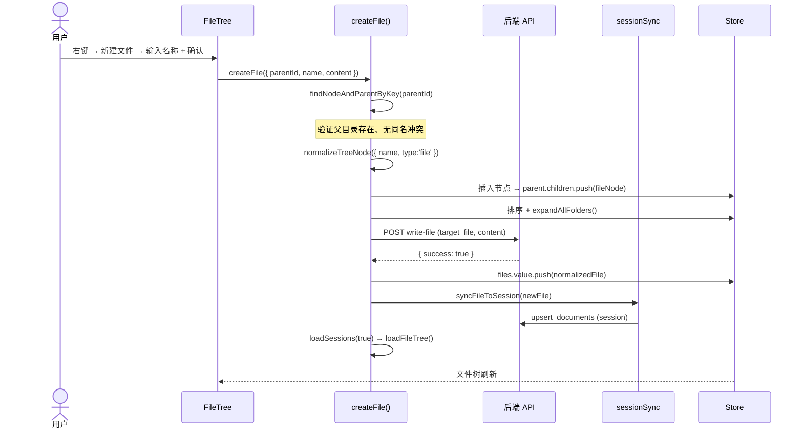

### 5.4 涉及模块

| 模块 | 路径 | 职责 |
|------|------|------|
| 文件树 CRUD | `src/views/aicr/hooks/fileTreeCrudMethods.js` | 创建文件/文件夹，输入验证，重名检测 |
| 重命名操作 | `src/views/aicr/hooks/storeFileTreeRenameOps.js` | 文件/文件夹重命名，路径更新 |
| 删除服务 | `src/views/aicr/hooks/fileDeleteService.js` | 文件/文件夹删除，确认对话框，关联会话保护 |
| 文件夹传输 | `src/views/aicr/hooks/folderTransferMethods.js` | 文件夹递归导入导出，文件流处理 |
| ZIP 操作 | `src/views/aicr/hooks/projectZipMethods.js` | 整站 ZIP 打包下载、ZIP 上传解压重建 |
| 批量加载 | `src/views/aicr/hooks/storeFileTreeLoadOps.js` | 操作后文件树整体刷新 |

### 5.5 关键数据流

```
创建:
  用户输入名称 → 重名检测 → POST /write-file → store.fileTree 更新 → 树刷新

重命名:
  用户输入新名称 → 路径冲突检测 → POST /rename-file 或 /rename-folder
  → store.fileTree 节点路径更新 → 树刷新

删除:
  用户确认 → POST /delete-file 或 /delete-folder
  → store.fileTree 节点移除 → 关联会话保留（仅解除文件引用）

导入文件夹:
  用户选择本地文件夹 → 递归读取文件 → 逐文件 POST /write-file
  → store.fileTree 重建 → 树刷新

导出文件夹:
  用户选择目标文件夹 → 递归收集文件内容 → 客户端打包 ZIP → 浏览器下载

项目 ZIP:
  下载: 全量文件收集 → 客户端打包 ZIP → 浏览器下载
  上传: 选择 ZIP 文件 → 解压解析 → 逐文件 POST /write-file → 树重建
```

### 5.6 API 端点

| 接口 | 方法 | 用途 | 触发时机 |
|------|------|------|---------|
| `/write-file` | POST | 创建/更新文件 | 新建文件、保存内容 |
| `/delete-file` | POST | 删除单个文件 | 右键删除文件 |
| `/delete-folder` | POST | 递归删除文件夹 | 右键删除文件夹 |
| `/rename-file` | POST | 重命名文件 | 右键重命名 |
| `/rename-folder` | POST | 重命名文件夹 | 右键重命名 |
| `create_document` | POST | 同步新建文件 → 会话 | CRUD 后 sessionSync |
| `delete_document` | POST | 删除关联会话 | 删除文件/文件夹后 |
| `query_documents` | POST | 刷新全量会话 | CRUD 后刷新列表 |

### 5.7 关键 UI 元素与微交互

| 元素 | DOM 位置 | 行为 |
|------|---------|------|
| 右键菜单 | 原生 `contextmenu` 事件触发自定义菜单 | 菜单定位在鼠标位置，点击外部或 Esc 关闭 |
| 新建对话框 | 模态框 `YiModal` | 输入文件名，支持扩展名选择，重名检测 |
| 重命名对话框 | 模态框 | 当前名称预填，支持修改扩展名 |
| 删除确认 | 模态框 + 警告文案 | 展示被删对象名称 + "不可撤销" + 关联会话提示 |
| 导入文件夹 | `<input type="file" webkitdirectory>` | 选择本地文件夹 → 递归读取 → 逐文件上传 |
| 导出/ZIP | 工具栏按钮 | 客户端打包 ZIP → 触发浏览器下载 |
| 文件树刷新 | 操作成功后自动触发 `loadFileTree()` | spinner → 树节点重建 |

| 微交互 | 触发 | 反馈 | 时长 |
|------|------|------|:--:|
| 右键菜单 | 右键点击 | 菜单出现在鼠标位置 | 即时 |
| 菜单外点击 | Esc/点击外部 | 菜单关闭 | 即时 |
| 新建输入框 | 对话框打开 | 输入框自动 focus | 100ms |
| 重名提示 | 输入已存在名称 | 红色警告 "已存在同名文件" | 即时 |
| 确认删除 | 点击 "删除" | 节点淡出消失 + 树刷新 | 200ms |
| 导入进度 | 文件上传中 | spinner + "正在导入 N/M..." | 实时 |
| 导出准备 | 点击导出 | "正在打包..." → 浏览器下载触发 | 取决于大小 |

### 5.8 测试用例

**正常路径:**

| Given | When | Then |
|-------|------|------|
| 右键点击文件夹打开上下文菜单 | 选择"新建文件"，输入文件名，确认 | 新文件出现在树中，后端同步创建 |
| 右键点击父目录 | 选择"新建文件夹"，输入名称，确认 | 新文件夹出现在树中 |
| 右键点击文件或文件夹 | 选择"重命名"，输入新名称，确认 | 树节点名称更新，后端同步重命名 |
| 右键点击文件或文件夹 | 选择"删除"，确认 | 节点从文件树中移除，后端同步删除 |
| 点击工具栏"导入文件夹" | 选择本地文件夹并确认 | 文件夹内容上传到后端，文件树显示新内容 |
| 文件树已加载 | 点击"导出文件夹"或"项目 ZIP 下载" | 浏览器下载 ZIP 包 |

**边界/异常:**

| Given | When | Then |
|-------|------|------|
| 文件树中存在文件 A | 将文件 B 重命名为 A 的名称 | "文件名已存在"错误提示，文件 B 保持原名 |
| 选择了本地文件夹 | 上传过程中网络中断 | "导入失败"错误提示，文件树保持不变 |
| 上传项目 ZIP | ZIP 文件格式损坏 | "ZIP 文件无效"错误提示 |

> 证据: `src/views/aicr/hooks/fileTreeCrudMethods.js` · `src/views/aicr/hooks/fileDeleteService.js` · `src/views/aicr/hooks/folderTransferMethods.js` · `src/views/aicr/hooks/projectZipMethods.js`

---

## §6 跨场景共享架构

### 6.0 数据来源与完整数据流

AICR 面板为全功能前端视图，数据全部来自远端 API，不读本地文件系统。

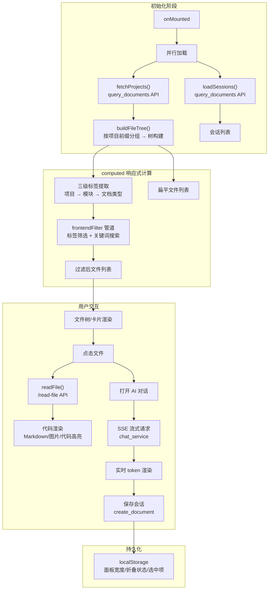

**关键设计决策**：
- **全量加载 + 前端筛选**：一次性拉取全量文档（limit: 10000），筛选和搜索纯前端 computed 管道，不触发后端请求
- **SSE 流式对话**：AI 对话使用 Server-Sent Events 流式传输，前端按 token 粒度实时渲染，提升响应感知速度
- **localStorage 布局持久化**：面板宽度、侧边栏折叠状态、最近选中项持久化到 localStorage，刷新后恢复
- **双数据主干**：文件树数据和会话数据分两条独立 API 并行加载，互不阻塞

### 6.1 Store 工厂模式

```
store.js → state/store.js
  ├── 80+ 响应式状态变量（vueRef）
  ├── storeFileTreeOps.js        — 文件树展开/折叠/选中
  ├── storeFileTreeBuilders.js   — 从 sessions 构建文件树
  ├── storeFileTreeCreateOps.js  — 创建节点
  ├── storeFileTreeLoadOps.js    — 批量加载/刷新
  ├── storeFileTreeRenameOps.js  — 重命名
  ├── storeFileTreeExpandOps.js  — URL 参数自动展开
  ├── storeFileContentOps.js     — 文件内容加载/保存
  ├── storeSessionsOps.js        — 会话数据加载
  └── storeUiOps.js              — UI 状态持久化（面板宽度/折叠）
```

### 6.2 方法模块化

```
useMethods.js 组合出口 → methods/
  ├── chatMethods.js       → 场景 2（聊天核心 + SSE + 设置 + 上下文）
  ├── tagFilterMethods.js  → 场景 3（三级联动标签筛选）
  ├── searchMethods.js     → 场景 3（关键词搜索）
  ├── sessionMethods.js    → 场景 4（会话 CRUD + 标签 + FAQ）
  ├── fileTreeMethods.js   → 场景 5（文件树 CRUD + 导入导出 + ZIP）
  ├── uiMethods.js         → 跨场景（面板布局、视图切换）
  ├── uiEventMethods.js    → 跨场景（键盘快捷键、拖拽事件）
  ├── inputMethods.js      → 跨场景（输入法兼容）
  ├── utilMethods.js       → 跨场景（工具函数）
  ├── guestChatMethods.js  → 跨场景（游客模式聊天）
  └── aiSearchMethods.js   → 跨场景（AI 增强搜索）
```

### 6.3 响应式筛选管道

```
store.fileTree (完整树)
  → useComputed (computed 缓存)
    → 标签筛选 (tagFilterMethods: L1→L2→L3 联动)
    → 关键词搜索 (searchMethods: 文件名模糊匹配)
    → AND 组合
  → FileTree 组件渲染 (仅可见节点)
```

### 6.4 SSE 流式数据管道

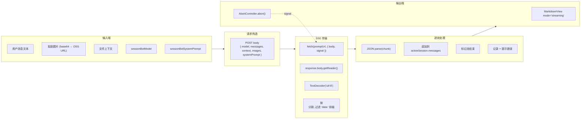

### 6.5 localStorage 持久化

| 键 | 类型 | 用途 | 关联场景 |
|---|------|------|---------|
| `aicrSessionSidebarWidth` | number | 会话侧边栏宽度 | 场景 1 |
| `aicr_file_tag_order` | JSON Array | 项目标签拖拽排序 | 场景 3 |
| `sessionBotSettings` | JSON | 模型 ID + 系统提示词 | 场景 2 |
| `weChatRobotSettings` | JSON | 微信机器人配置 | 场景 2 |

### 6.6 初始化加载序列

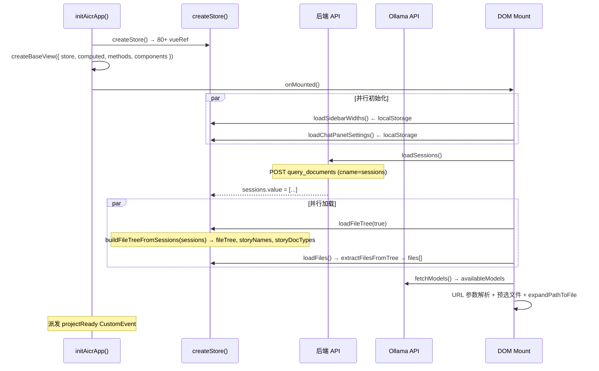

---

> 证据: `src/views/aicr/hooks/store.js` · `src/views/aicr/hooks/useMethods.js` · `src/views/aicr/hooks/useComputed.js`

---

> **变更记录**
> | 日期 | 变更 | 触发 | 证据 |
> |------|------|------|------|
> | 2026-05-26 | 基线化 | 源码分析 | src/views/aicr/ |
> | 2026-05-26 | 新增导航行 + 统一导航链 | /rui update | 统一导航链 |
> | 2026-05-27 | 重构为五场景结构，与使用场景一一对应 | /rui update | 故事任务 Story 1–5 · 使用场景 场景 1–5 |
> | 2026-05-27 | 合并页面设计(布局线框+微交互)、数据流设计(序列图+状态表+API端点)、测试设计(Given/When/Then用例)至各场景 | /rui update | 页面设计.md · 数据流设计.md · 测试设计.md |
> | 2026-05-27 | 去除所有表格的 id 列（接口表 # 列 + 测试用例表 ID 列） | /rui update | sed 批量替换 |
| 2026-05-27 | v3.0.2：§6.0 新增「数据来源与完整数据流」mermaid 图：四阶段（初始化→computed→用户交互→持久化）+ 关键设计决策（全量加载+前端筛选 · SSE 流式对话 · localStorage 布局持久化 · 双数据主干并行加载） | /rui update | store.js · 故事任务 v2.1.2 |
