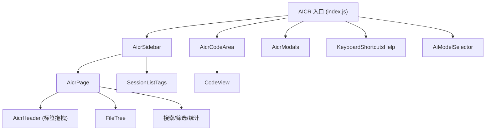
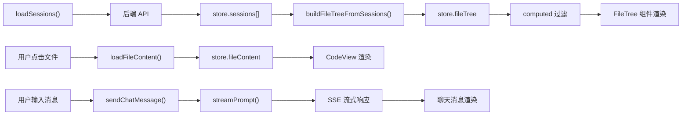

# 技术评审

> | v1.0.0 | 2026-05-26 | deepseek-v4-pro | 📎 [CLAUDE.md](../../../CLAUDE.md) |

> **来源引用**：从 `src/views/aicr/` 源码分析生成。

---

### 主要价值

- 🎯 组件化架构 — 10 个业务组件 + 11 个通用组件
- 🔒 模块化 hooks — 40+ 方法文件，按功能域拆分
- ⚡ 四级联动筛选 — 基于 computed 响应式缓存的高性能过滤

---

## §1 组件树



| 组件 | 来源 | 职责 |
|------|------|------|
| AicrPage | `components/aicrPage/` | 主页面容器，视图切换，筛选栏，统计栏 |
| AicrSidebar | `components/aicrSidebar/` | 左侧边栏布局容器 |
| AicrCodeArea | `components/aicrCodeArea/` | 右侧代码区 + 聊天面板布局 |
| AicrModals | `components/aicrModals/` | 模态框容器 |
| AicrHeader | `components/aicrHeader/` | 标签管理头部，支持拖拽排序 |
| AiModelSelector | `components/AiModelSelector/` | AI 模型选择器 |
| CodeView | `components/codeView/` | 代码查看/编辑器（1355 行） |
| FileTree | `components/fileTree/` | 文件树（12 个模块文件） |
| SessionListTags | `components/sessionListTags/` | 会话列表标签筛选 |
| KeyboardShortcutsHelp | `components/keyboardShortcutsHelp/` | 快捷键帮助面板 |

---

## §2 数据流



> 证据: `src/views/aicr/index.js` · `src/views/aicr/hooks/storeFactory.js` · `src/views/aicr/hooks/useMethods.js`

---

## §3 架构设计

### 3.1 Store 工厂模式

```
storeFactory.js
  ├── storeState.js         — 80+ 响应式状态变量
  ├── storeFileTreeOps.js    — 文件树膨胀/收缩/选中
  ├── storeFileTreeBuilders.js — 从会话构建文件树
  ├── storeFileTreeCreateOps.js — CRUD 操作
  ├── storeFileTreeLoadOps.js   — 批量加载/刷新
  ├── storeFileTreeRenameOps.js — 重命名
  ├── storeFileContentOps.js    — 文件内容加载/保存
  ├── storeSessionsOps.js       — 会话数据加载
  └── storeUiOps.js             — UI 状态持久化
```

### 3.2 方法模块化

```
useMethods.js 组合:
  ├── sessionMethods.js        — 会话 CRUD
  ├── sessionEditMethods.js    — AI 描述生成
  ├── sessionActionMethods.js  — 收藏/同步/标签
  ├── sessionFaqMethods.js     — FAQ 管理
  ├── sessionChatContextMethods.js — 聊天核心
  ├── sessionChatContextChatMethods.js — 消息收发
  ├── sessionChatContextChatMethods.streaming.js — SSE 流式
  ├── sessionChatContextSettingsMethods.js — 模型/提示词
  ├── sessionChatContextContextMethods.js — 上下文编辑器
  ├── searchMethods.js         — 搜索过滤
  ├── tagFilterMethods.js      — 四级联动标签
  ├── tagManagerMethods.js     — 标签弹窗
  ├── uiMethods.js             — UI 操作
  ├── uiEventMethods.js        — 交互事件
  ├── inputMethods.js          — 输入法事件
  ├── utilMethods.js           — 工具方法
  ├── mainPageMethods.js       — 页面胶水层
  ├── authDialogMethods.js     — 认证对话框
  ├── fileTreeCrudMethods.js   — 文件树 CRUD
  ├── projectZipMethods.js     — ZIP 操作
  ├── folderTransferMethods.js — 文件夹导入导出
  ├── aiSearchMethods.js       — AI 增强搜索
  └── guestChatMethods.js      — 游客聊天
```

### 3.3 四级联动筛选算法

```
Level 1: 项目标签  → 选中后确定根目录范围
Level 2: 故事标签  → 在 L1 范围内确定子目录
Level 3: 前缀标签  → 在 L1+L2 范围内，按文件名第一段过滤
Level 4: 后缀标签  → 在 L1+L2+L3 范围内，按文件名末段过滤

联动规则:
- L1 选择 → L2/L3/L4 统计基于 L1 范围重新计算
- L2 选择 → L3/L4 统计基于 L1+L2 范围重新计算
- L3 选择 → L4 统计基于 L1+L2+L3 范围重新计算
- Escape 清除 → 全部重置为空
```

> 证据: `src/views/aicr/hooks/methods/tagFilterMethods.js` · `src/views/aicr/hooks/computed/useComputed.js`

### 3.4 技术栈

| 维度 | 选择 | 原因 |
|------|------|------|
| 视图框架 | createBaseView (Vue 3 CDN) | 零构建，浏览器原生 ESM |
| 状态管理 | vueRef + store 工厂 | 集中式状态 + 工厂可测试 |
| API 层 | fetch + SSE | 无外部依赖，浏览器原生 |
| Markdown 渲染 | marked + 自定义插件 | Mermaid、Sanitize、TOC |
| 代码高亮 | 自研基于扩展名匹配 | 零依赖，支持 20+ 语言 |
| 语法分析 | 自研类型检测 | 文件扩展名 → 语言映射 |

---

> **变更记录**
> | 日期 | 变更 | 触发 | 证据 |
> |------|------|------|------|
> | 2026-05-26 | 基线化 | 源码分析 | src/views/aicr/ |
