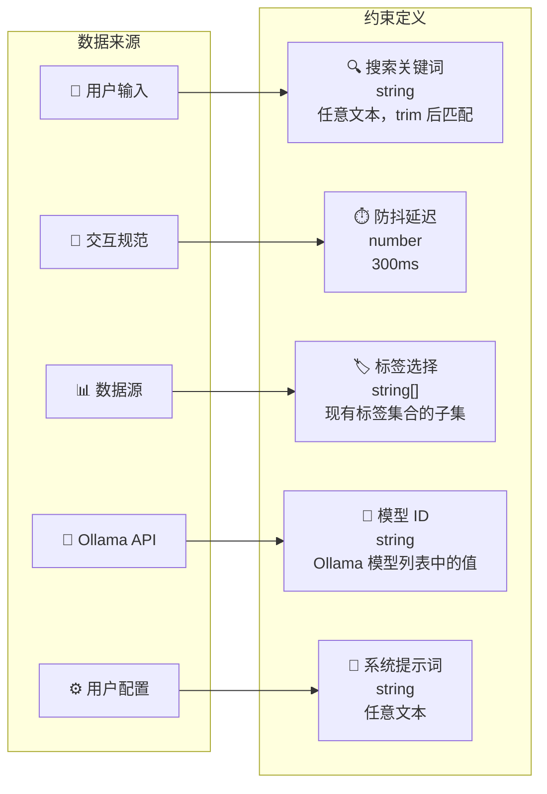
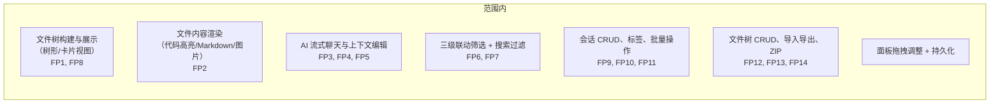
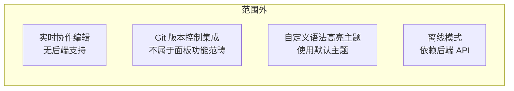

# 故事任务

> **基线类型**：问题空间 · **版本**：1.0.1 · **生成日期**：2026-05-26

## 概述

AICR（AI Code Review）面板是 YiWeb 的核心视图，提供代码审查、文件管理、AI 聊天、会话管理一体化的交互式工作区。用户可在文件树中浏览项目文件结构，通过 AI 聊天面板分析代码，通过三级联动筛选系统精准定位文档，并对会话和文件进行 CRUD 管理。

### 主要价值

- 🔍 **代码审查** — 语法高亮、Markdown 预览、图片预览多格式代码查看
- 💬 **AI 聊天** — 基于会话上下文的流式 AI 响应，支持模型切换和系统提示词配置
- 🏷️ **三级联动筛选** — 项目标签 → 故事标签 → 状态标签，逐级缩小文件范围
- 📁 **文件管理** — 文件树 CRUD、文件夹导入导出、项目 ZIP 下载上传
- 📝 **会话管理** — 会话 CRUD、标签管理、批量操作、收藏、知识同步

---

## §1 Story

### Story 1: 文件树浏览与文件查看

作为代码审查者，我想要浏览项目文件树并查看文件内容，以便审查代码、查看文档和图片。优先级 P0，范围边界为文件树加载与文件内容展示。

#### §1.1 User Operations

| # | 操作 | 触发条件 | 操作步骤 | 预期结果 |
|---|------|---------|---------|---------|
| 1 | 文件树加载 | 页面首次加载 | 从后端加载所有会话 → 构建文件树 | 文件树左侧展示 |
| 2 | 切换视图 | 用户点击视图切换按钮 | 树形视图 ↔ 卡片视图 | 视图切换，文件展示方式变化 |
| 3 | 展开/折叠 | 点击目录节点 | 展开显示子节点，折叠隐藏 | 目录展开/折叠状态正确 |
| 4 | 选择文件 | 点击文件节点 | 加载文件内容到代码区 | 代码/文档/图片正确展示 |
| 5 | URL 定位 | URL 含 `?key=<path>` | 自动定位文件并高亮 | 文件路径展开，内容展示 |

### Story 2: AI 聊天与代码分析

作为代码审查者，我想要在查看文件时与 AI 对话分析代码，以便获得代码建议、理解复杂逻辑。优先级 P0，范围边界为流式聊天、上下文编辑与模型选择。

#### §1.1 User Operations

| # | 操作 | 触发条件 | 操作步骤 | 预期结果 |
|---|------|---------|---------|---------|
| 1 | 发送消息 | 用户在聊天框输入并发送 | 构造上下文 → POST 流式请求 → SSE 逐块响应 | 消息流式展示 |
| 2 | 编辑上下文 | 用户打开上下文编辑器 | 编辑/保存/撤销 → 下次聊天使用新上下文 | 上下文更新 |
| 3 | 切换模型 | 用户选择模型 | 从 Ollama 获取模型列表 → 选择模型 | 后续请求使用新模型 |
| 4 | 配置系统提示词 | 用户打开设置 → 编辑提示词 | 保存提示词 → 下次聊天注入 | 系统提示词生效 |

### Story 3: 三级联动筛选

作为代码审查者，我想要通过项目标签、故事标签、状态标签多级筛选文件，以便在大量文件中快速定位目标。优先级 P0，范围边界为文件树与卡片视图的筛选交互。

#### §1.1 User Operations

| # | 操作 | 触发条件 | 操作步骤 | 预期结果 |
|---|------|---------|---------|---------|
| 1 | 项目标签筛选 | 点击项目标签 | 选择项目目录 → 下级联动更新 | 文件树/卡片仅显示该项目 |
| 2 | 故事标签筛选 | 选择项目后点击故事标签 | 选择子目录 → 前缀后缀联动更新 | 进一步缩小范围 |
| 3 | 状态标签筛选 | 点击状态标签（故事任务/使用场景/技术评审/自改进复盘） | 按文档类型过滤 | 显示匹配状态的文件 |
| 4 | 无标签筛选 | 点击"无标签"按钮 | 仅显示根目录下无子目录的文件 | 隔离孤立文件 |
| 5 | 搜索过滤 | 输入搜索关键词 | 300ms 防抖 → 文件名模糊匹配 | 匹配文件显示，不匹配隐藏 |
| 6 | 清除全部 | 点击清除或按 Escape | 所有筛选条件重置 | 恢复完整文件列表 |

### Story 4: 会话管理

作为代码审查者，我想要管理会话列表及其元数据，以便组织工作内容和历史记录。优先级 P1，范围边界为会话 CRUD、标签管理与批量操作。

### Story 5: 文件树操作

作为代码审查者，我想要对文件树执行创建、重命名、删除、导入导出操作，以便灵活管理项目文件结构。优先级 P1，范围边界为文件树 CRUD 与文件夹/项目级导入导出。

---

## §2 Requirements

### 功能点

| FP# | 描述 | 输入 | 输出 | 错误行为 | 优先级 |
|-----|------|------|------|---------|--------|
| FP1 | 文件树构建 — 从会话数据构建全局文件树 | 会话列表 | 层级文件树 | 无数据时显示空状态 | P0 |
| FP2 | 文件内容加载 — 语法高亮、Markdown 预览、图片预览 | 文件路径 | 渲染内容 | 加载失败显示错误状态 | P0 |
| FP3 | 流式聊天 — SSE 流式 AI 响应 | 聊天消息 + 上下文 | 流式文本 | 网络错误提示重试 | P0 |
| FP4 | 上下文编辑 — 编辑、优化、翻译聊天上下文 | 上下文文本 | 更新后上下文 | 空文本使用默认上下文 | P0 |
| FP5 | 模型选择 — 从 Ollama 获取并选择模型 | 模型列表 | 选中模型 ID | Ollama 不可达时显示错误 | P0 |
| FP6 | 三级标签筛选 — 项目 > 故事 > 状态 | 标签选择 | 过滤后文件列表 | 无标签时显示全部 | P0 |
| FP7 | 搜索过滤 — 文件名模糊搜索 + 300ms 防抖 | 搜索关键词 | 过滤后文件列表 | 空搜索显示全部 | P0 |
| FP8 | 视图切换 — 树形/卡片视图 | 切换操作 | 对应布局 | 默认树形 | P1 |
| FP9 | 会话 CRUD — 创建/编辑/删除/复制会话 | 会话数据 | API 同步 | 操作失败提示错误 | P1 |
| FP10 | 会话标签管理 — 添加/移除标签 | 标签数据 | 标签列表更新 | 重复标签忽略 | P1 |
| FP11 | 会话批量操作 — 批量选择/删除 | 选中项列表 | API 批量处理 | 部分失败回滚提示 | P1 |
| FP12 | 文件树 CRUD — 创建/重命名/删除文件或文件夹 | 文件路径 | 文件树更新 | 重名冲突提示 | P1 |
| FP13 | 文件导入导出 — 文件夹导入导出、文件导入 | 文件/二进制 | 文件树更新或下载 | 格式错误提示 | P2 |
| FP14 | 项目 ZIP — 下载/上传项目 ZIP | ZIP 文件 | 文件树重建 | ZIP 损坏提示 | P2 |
| FP15 | FAQ 管理 — 常见问题加载、搜索、删除 | FAQ 数据 | FAQ 列表 | 加载失败显示空 | P2 |
| FP16 | 会话同步 — 会话与文件双向同步 | 文件/会话变更 | API 同步 | 同步失败静默重试 | P2 |

### 业务规则

| R# | 描述 | 校验方式 | 证据级别 |
|----|------|---------|---------|
| R1 | 搜索防抖 300ms | 检查 searchMethods.js | A |
| R2 | 标签筛选三级联动：上级选择筛掉下级，状态标签联动互筛 | 检查 tagFilterMethods.js | A |
| R3 | 标签筛选 OR 逻辑（选中任一匹配），跨维度 AND 逻辑（搜索 + 标签叠加取交集） | 检查 fileTreeComputed.js | A |
| R4 | 流式聊天使用 SSE，支持 401 自动重试和 422 降级 | 检查 streaming.js | A |
| R5 | 侧边栏和聊天面板宽度拖拽后持久化到 localStorage | 检查 resizer.js + storeUiOps.js | A |
| R6 | 标签排序结果持久化到 localStorage | 检查 aicrHeader/index.js | A |
| R7 | 所有 API 请求携带 X-Token 认证头 | 检查 requestHelper.js | A |

### 数据约束

---

## §3 成功标准

- ⚡ **SC1 · 文件树加载后 2 秒内渲染完成** — 度量：页面加载到文件树渲染时间 · 目标：≤2s · 优先级：P0
- 🔍 **SC2 · 搜索输入后 300ms 内过滤结果展示** — 度量：输入到 UI 更新时间 · 目标：≤300ms · 优先级：P0
- 💬 **SC3 · 流式聊天首字符响应 < 2s** — 度量：发送到首字符时间 · 目标：≤2s · 优先级：P0
- 🏷️ **SC4 · 三级标签联动过滤结果始终正确** — 度量：手动验证 · 目标：100% 正确 · 优先级：P0
- 🌐 **SC5 · 文件内容支持 20+ 语言语法高亮** — 度量：统计支持的语言数 · 目标：≥20 · 优先级：P1

---

## §4 范围边界

### 范围内

### 范围外

---

## §5 AC

| AC# | Given | When | Then | 门禁 |
|-----|-------|------|------|------|
| AC1 | 用户打开 AICR 面板 | 页面加载完成 | 文件树从后端数据加载并展示 | Gate A |
| AC2 | 文件树已加载 | 用户点击文件节点 | 代码区展示文件内容（代码/Markdown/图片） | Gate A |
| AC3 | 代码区展示文件 | 用户输入聊天消息并发送 | AI 流式响应展示在聊天面板 | Gate A |
| AC4 | 文件树有多个项目 | 用户选择项目标签 | 文件树仅显示该项目，统计栏更新 | Gate A |
| AC5 | 已选择项目标签 | 用户选择故事标签 | 文件树进一步缩小，状态标签联动更新 | Gate A |
| AC6 | 已选择故事标签 | 用户选择状态标签 | 显示最终匹配文件 | Gate A |
| AC7 | 文件树已筛选 | 用户输入搜索关键词 | 300ms 后过滤结果显示 | Gate A |
| AC8 | 文件树有筛选 | 用户点击清除或按 Escape | 所有筛选条件清除，恢复完整文件列表 | Gate A |
| AC9 | 会话列表已加载 | 用户创建/编辑/删除会话 | 操作执行，列表更新 | Gate B |
| AC10 | 用户打开无标签文件 | 文件树显示 | 代码区展示内容或显示空状态 | Gate A |
| AC11 | 后端 API 不可达 | 页面加载 | 错误状态 + 重试按钮展示 | Gate A |

---

## §6 风险与假设

- ⚠️ **大量文件（>2000）导致三级筛选计算结果缓慢** — 类型：风险 · 可能性：L · 影响：M · 缓解：使用 computed 缓存；超过阈值提示后端分页
- ⚠️ **Ollama 模型服务不可用影响聊天功能** — 类型：风险 · 可能性：M · 影响：M · 缓解：支持手动输入模型 ID，Mock 流式回退
- ⚠️ **SSE 流式响应断连导致聊天不完整** — 类型：风险 · 可能性：M · 影响：L · 缓解：客户端自动重连 + 显示中断提示
- 💡 **用户期望全文搜索而非仅文件名搜索** — 类型：假设 · 缓解：范围外明确标注；文件名搜索覆盖主要场景

---

> **回溯链**：`src/views/aicr/index.js` · `src/views/aicr/hooks/` · `src/views/aicr/components/`
>
> **变更记录**：2026-05-26 — 基线化 (v1.0.0) · 2026-05-26 — Story 描述从表格改为段落格式 (v1.0.1)
