# 数据流设计

> | v1.3.1 | 2026-05-26 | deepseek-v4-pro | 🌿 feat/aicr | 📎 [CLAUDE.md](../../../CLAUDE.md) |

> **导航**: [← 页面设计](./页面设计.md) · [测试设计 →](./测试设计.md)

> **来源引用**：基于 [使用场景](./使用场景.md) §1 场景 1–6，从 `src/views/aicr/hooks/` 源码逐链路提取。

---

### 主要价值

- 🎯 与使用场景一一对应 — 6 条数据链路完整覆盖 6 个使用场景
- 🔒 端到端可追溯 — 每链路从 API/用户操作 → Store → Computed → Render 闭环
- ⚡ API 接口全量收录 — 14 个后端接口，含请求体、响应格式、curl 示例
- 📊 状态变量显式标注 — 每链路标注涉及的 vueRef 和 API 端点

---

## API 接口总览

> AICR 面板所有后端请求统一发送到 `window.API_URL`（默认 `https://api.effiy.cn`）。
> 认证方式：`X-Token` 请求头（`localStorage` 存储），`credentials: 'omit'`。

### 服务路由

| 路由方式 | 端点 | 用途 |
|---------|------|------|
| `POST ${API_URL}/` + body 路由 | `services.database.data_service` | 会话 CRUD |
| `POST ${API_URL}/` + body 路由 | `services.ai.chat_service` | AI 聊天、模型列表 |
| `POST ${API_URL}/<endpoint>` | `/read-file`, `/write-file`, `/delete-file`, `/delete-folder`, `/rename-file`, `/rename-folder` | 文件操作 |
| `POST ${API_URL}/<endpoint>` | `/upload/upload-image-to-oss` | 图片上传 OSS |
| `POST ${API_URL}/<endpoint>` | `/wework/send-message` | 企业微信通知 |

### 接口清单

| # | 接口 | 方法 | 服务模块 | 用途 | 场景 |
|---|------|------|---------|------|:--:|
| 1 | `query_documents` | GET/POST | `data_service` | 查询会话/文档列表 | 1, 4, 6 |
| 2 | `create_document` | POST | `data_service` | 创建会话/文档记录 | 4, 6 |
| 3 | `update_document` | POST | `data_service` | 更新会话元数据/标签/消息 | 4 |
| 4 | `delete_document` | POST | `data_service` | 删除会话/文档记录 | 4, 6 |
| 5 | `chat` | POST (SSE) | `ai.chat_service` | AI 对话，流式 SSE 响应 | 2 |
| 6 | `list_ollama_models` | GET | `ai.chat_service` | 获取可用 AI 模型列表 | 5 |
| 7 | `/read-file` | POST | — | 读取文件内容（文本/图片） | 1, 6 |
| 8 | `/write-file` | POST | — | 创建或覆盖写入文件 | 6 |
| 9 | `/delete-file` | POST | — | 删除单个文件 | 6 |
| 10 | `/delete-folder` | POST | — | 递归删除文件夹 | 6 |
| 11 | `/rename-file` | POST | — | 重命名文件 | 6 |
| 12 | `/rename-folder` | POST | — | 重命名文件夹 | 6 |
| 13 | `/upload/upload-image-to-oss` | POST | — | 上传 base64 图片到阿里云 OSS | 2 |
| 14 | `/wework/send-message` | POST | — | 发送企业微信群机器人消息 | 2 |

### curl 示例

> 将 `<token>` 替换为实际 `X-Token` 值。以下仅列常用接口。

#### 查询会话列表 — `query_documents`

```bash
curl -X POST 'https://api.effiy.cn/' \
  -H 'Content-Type: application/json' \
  -H 'Accept: application/json' \
  -H 'X-Token: <token>' \
  -d '{"module_name":"services.database.data_service","method_name":"query_documents","parameters":{"cname":"sessions"}}'
```

响应 `data.list[]` 每项含 `_id, key, title, file_path, tags, pageContent, createdAt, updatedAt`。

#### 读取文件 — `/read-file`

```bash
curl -X POST 'https://api.effiy.cn/read-file' \
  -H 'Content-Type: application/json' \
  -H 'X-Token: <token>' \
  -d '{"target_file":"docs/故事任务面板/aicr/故事任务.md"}'
```

响应 `data.content` 含文件正文，`data.type` 为 `"text"` / `"base64"` / `"url"`。

#### AI 聊天 (SSE 流式) — `chat`

```bash
curl -X POST 'https://api.effiy.cn/' \
  -H 'Content-Type: application/json' \
  -H 'Accept: text/event-stream' \
  -H 'X-Token: <token>' \
  -d '{"module_name":"services.ai.chat_service","method_name":"chat","parameters":{"model":"qwen3.5","system":"You are a helpful assistant.","user":"解释这段代码","stream":true}}'
```

响应为 SSE 流：`data: {...}\n\n`，前端逐块拼接 `data.message` 追加到聊天区。

#### 获取模型列表 — `list_ollama_models`

```bash
curl 'https://api.effiy.cn/?module_name=services.ai.chat_service&method_name=list_ollama_models&parameters=%7B%7D' \
  -H 'X-Token: <token>'
```

响应 `data.models[]` 每项含 `model, size, modified_at, details`。

#### 创建会话 — `create_document`

```bash
curl -X POST 'https://api.effiy.cn/' \
  -H 'Content-Type: application/json' \
  -H 'X-Token: <token>' \
  -d '{"module_name":"services.database.data_service","method_name":"create_document","parameters":{"cname":"sessions","data":{"key":"my-story","url":"aicr-session://1710000000000-abc","title":"My_Story","pageDescription":"","messages":[],"tags":["YiWeb","aicr"],"createdAt":1710000000000,"updatedAt":1710000000000,"lastAccessTime":1710000000000}}}'
```

#### 更新会话 — `update_document`

```bash
curl -X POST 'https://api.effiy.cn/' \
  -H 'Content-Type: application/json' \
  -H 'X-Token: <token>' \
  -d '{"module_name":"services.database.data_service","method_name":"update_document","parameters":{"cname":"sessions","key":"my-story","data":{"title":"Updated_Title","tags":["YiWeb","aicr","技术评审"],"isFavorite":true}}}'
```

#### 删除会话 — `delete_document`

```bash
curl -X POST 'https://api.effiy.cn/' \
  -H 'Content-Type: application/json' \
  -H 'X-Token: <token>' \
  -d '{"module_name":"services.database.data_service","method_name":"delete_document","parameters":{"cname":"sessions","key":"my-story"}}'
```

#### 写入文件 — `/write-file`

```bash
curl -X POST 'https://api.effiy.cn/write-file' \
  -H 'Content-Type: application/json' \
  -H 'X-Token: <token>' \
  -d '{"target_file":"docs/new-file.md","content":"# New File\n\nContent","is_base64":false,"overwrite":false}'
```

#### 删除文件/文件夹 — `/delete-file` `/delete-folder`

```bash
curl -X POST 'https://api.effiy.cn/delete-file' \
  -H 'Content-Type: application/json' -H 'X-Token: <token>' \
  -d '{"target_file":"docs/old-file.md"}'

curl -X POST 'https://api.effiy.cn/delete-folder' \
  -H 'Content-Type: application/json' -H 'X-Token: <token>' \
  -d '{"target_dir":"docs/old-folder"}'
```

#### 重命名 — `/rename-file` `/rename-folder`

```bash
curl -X POST 'https://api.effiy.cn/rename-file' \
  -H 'Content-Type: application/json' -H 'X-Token: <token>' \
  -d '{"old_path":"docs/old.md","new_path":"docs/new.md"}'

curl -X POST 'https://api.effiy.cn/rename-folder' \
  -H 'Content-Type: application/json' -H 'X-Token: <token>' \
  -d '{"old_dir":"docs/old","new_dir":"docs/new"}'
```

#### 上传图片 OSS

```bash
curl -X POST 'https://api.effiy.cn/upload/upload-image-to-oss' \
  -H 'Content-Type: application/json' -H 'X-Token: <token>' \
  -d '{"data_url":"data:image/png;base64,iVBORw0KGgo...","filename":"screenshot.png","directory":"aicr/images"}'
```

#### 企业微信消息

```bash
curl -X POST 'https://api.effiy.cn/wework/send-message' \
  -H 'Content-Type: application/json' -H 'X-Token: <token>' \
  -d '{"webhook_url":"https://qyapi.weixin.qq.com/cgi-bin/webhook/send?key=xxx","content":"## AI 回复\n\n内容..."}'
```

---

## §1 场景 1 — 代码审查者浏览文件

> 对应 [使用场景 §1 场景 1](./使用场景.md#场景-1-代码审查者浏览文件)

### 1.1 数据流全景

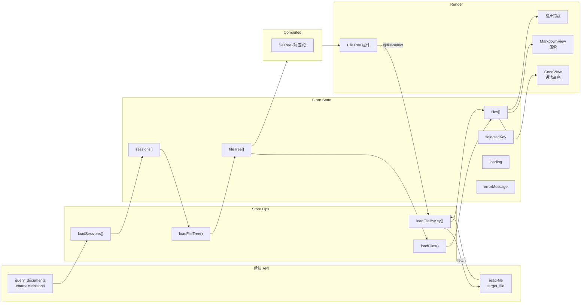

### 1.2 链路序列

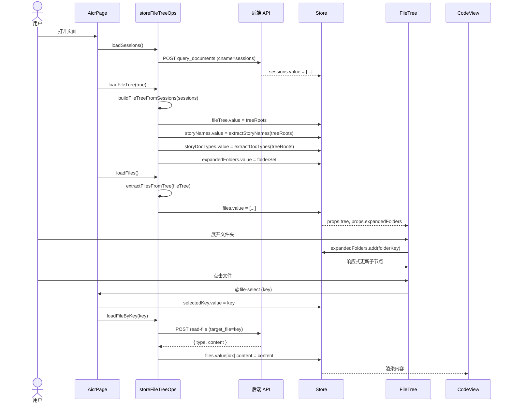

### 1.3 涉及状态

| 状态变量 | 类型 | 来源 | 消费者 |
|---------|------|------|--------|
| `sessions` | Array | `loadSessions()` → API | `loadFileTree()` |
| `fileTree` | Array | `loadFileTree()` → `buildFileTreeFromSessions()` | FileTree 组件, computed |
| `files` | Array | `loadFiles()` → `extractFilesFromTree()` | CodeView, MarkdownView |
| `selectedKey` | string | FileTree `@file-select` | `loadFileByKey()`, CodeView |
| `expandedFolders` | Set | `loadFileTree()`, `toggleFolder()` | FileTree 折叠/展开 |
| `loading` | boolean | Ops 生命周期 | FileTree 骨架屏 |
| `errorMessage` | string | Ops catch | FileTree 错误提示 |

### 1.4 API 端点

| 接口 | 方法 | 请求体 | 用途 | 触发时机 |
|------|------|--------|------|---------|
| `query_documents` | POST | `{"module_name":"services.database.data_service","method_name":"query_documents","parameters":{"cname":"sessions"}}` | 获取全量会话列表 | 页面初始化 |
| `/read-file` | POST | `{"target_file":"<file-path>"}` | 读取单个文件内容 | 点击文件节点 |

**curl 示例**:

```bash
# 查询会话列表
curl -X POST 'https://api.effiy.cn/' \
  -H 'Content-Type: application/json' -H 'X-Token: <token>' \
  -d '{"module_name":"services.database.data_service","method_name":"query_documents","parameters":{"cname":"sessions"}}'

# 读取文件内容
curl -X POST 'https://api.effiy.cn/read-file' \
  -H 'Content-Type: application/json' -H 'X-Token: <token>' \
  -d '{"target_file":"docs/故事任务面板/aicr/故事任务.md"}'
```

---

## §2 场景 2 — 开发者 AI 代码分析

> 对应 [使用场景 §1 场景 2](./使用场景.md#场景-2-开发者-ai-代码分析)

### 2.1 数据流全景

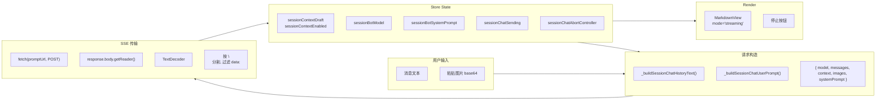

### 2.2 链路序列

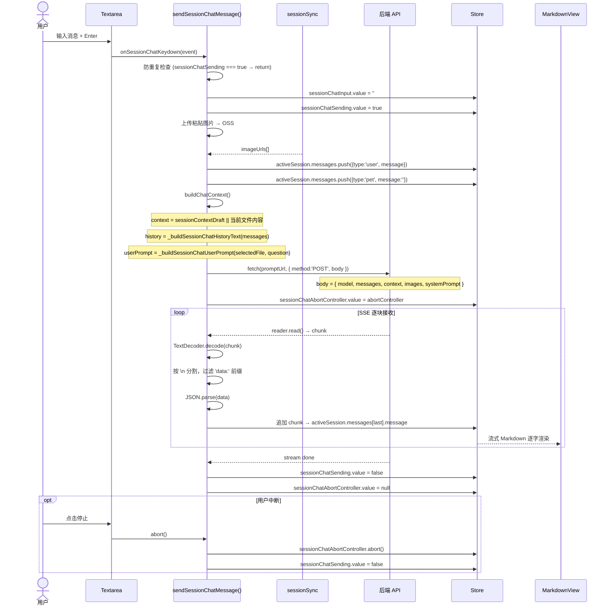

### 2.3 涉及状态

| 状态变量 | 类型 | 来源 | 消费者 |
|---------|------|------|--------|
| `activeSession` | Object | `selectSessionForChat()` | 聊天面板、消息列表 |
| `activeSession.messages[]` | Array | 用户发送 + SSE 流式追加 | MarkdownView 渲染 |
| `sessionChatInput` | string | Textarea v-model | `sendSessionChatMessage()` |
| `sessionChatSending` | boolean | 发送时设 true，完成/中断设 false | 防重复、按钮禁用 |
| `sessionChatAbortController` | AbortController | 发送时创建 | 停止按钮 abort() |
| `sessionContextEnabled` | boolean | 用户切换开关 | `buildChatContext()` |
| `sessionContextDraft` | string | 上下文编辑器 | `buildChatContext()` |
| `sessionBotModel` | string | 设置面板保存 | 请求体 model 字段 |
| `sessionBotSystemPrompt` | string | 设置面板保存 | 请求体 systemPrompt 字段 |

### 2.4 API 端点

| 接口 | 方法 | 请求体 | 用途 | 触发时机 |
|------|------|--------|------|---------|
| `chat` | POST (SSE) | `{"module_name":"services.ai.chat_service","method_name":"chat","parameters":{"model":"qwen3.5","system":"<prompt>","user":"<message>","stream":true,"images":[...]}}` | AI 对话流式响应 | 发送消息/重新生成 |
| `/upload/upload-image-to-oss` | POST | `{"data_url":"data:image/png;base64,...","filename":"<name>","directory":"aicr/images"}` | 粘贴图片上传 OSS | 聊天框粘贴图片 |
| `/wework/send-message` | POST | `{"webhook_url":"<url>","content":"<markdown>"}` | 发送到企业微信群 | 点击发送到微信 |

**curl 示例**:

```bash
# AI 聊天 (SSE 流式)
curl -X POST 'https://api.effiy.cn/' \
  -H 'Content-Type: application/json' -H 'Accept: text/event-stream' \
  -H 'X-Token: <token>' \
  -d '{"module_name":"services.ai.chat_service","method_name":"chat","parameters":{"model":"qwen3.5","system":"You are a helpful assistant.","user":"解释这段代码","stream":true}}'

# 上传图片到 OSS
curl -X POST 'https://api.effiy.cn/upload/upload-image-to-oss' \
  -H 'Content-Type: application/json' -H 'X-Token: <token>' \
  -d '{"data_url":"data:image/png;base64,iVBORw0KGgo...","filename":"screenshot.png","directory":"aicr/images"}'

# 企业微信通知
curl -X POST 'https://api.effiy.cn/wework/send-message' \
  -H 'Content-Type: application/json' -H 'X-Token: <token>' \
  -d '{"webhook_url":"https://qyapi.weixin.qq.com/cgi-bin/webhook/send?key=xxx","content":"## AI 回复\n\n内容..."}'
```

---

## §3 场景 3 — 管理者三级联动筛选文件

> 对应 [使用场景 §1 场景 3](./使用场景.md#场景-3-管理者三级联动筛选文件)

### 3.1 数据源 — 标签体系与文件树映射

筛选标签体系完全派生自文件树，文件树由 `buildFileTreeFromSessions()` 从会话标签构建。

#### 树层级模型

会话的 `tags` 数组（如 `["YiWeb", "aicr"]`）决定其在树中的路径。`buildFileTreeFromSessions()` 将 tags 按序展开为文件夹层级，文件名取自 `session.title`：

```
treeRoots = [
  { key: "YiWeb", name: "YiWeb", type: "folder", children: [
      { key: "YiWeb/aicr", name: "aicr", type: "folder", children: [
          { key: "YiWeb/aicr/故事任务", name: "故事任务", type: "file", ... },
          { key: "YiWeb/aicr/使用场景", name: "使用场景", type: "file", ... }
      ]},
      { key: "YiWeb/claude", name: "claude", type: "folder", children: [...] }
  ]},
  { key: ".claude", name: ".claude", type: "folder", children: [...] }
]
```

> 文件树排序规则：文件夹优先 → 同类按拼音排序。`source: storeFileTreeBuilders.js:101-111`

#### 标签提取

| 函数 | 提取来源 | 产出 | 算法 |
|------|---------|------|------|
| `extractStoryNames(tree)` | 根级文件夹名 + 递归查找「故事任务面板」下的直接子文件夹 | `storyNames[]` | O(n) 遍历，`source: filterHelpers.js:127-157` |
| `extractDocTypes(tree)` | 递归查找「故事任务面板」→ 各故事目录 → 直接子文件夹名 | `storyDocTypes[]` | O(n) 遍历，`source: filterHelpers.js:164-190` |

| 调用时机 | 存储位置 | 用途 |
|---------|---------|------|
| `loadFileTree()` 完成后 | `store.storyNames` | 项目标签组（header 区）+ 故事标签候选集 |
| `loadFileTree()` 完成后 | `store.storyDocTypes` | 类型标签行（筛选栏） |

### 3.2 核心数据结构 — 联动索引

筛选性能依赖两个 O(1) 查询结构，在 `handleTagSelect()` 入口按需从当前 `fileTree` 重建：

```javascript
// source: filterHelpers.js:23-49
const parentChildMap = buildParentChildMap(fileTree);
// Map<string, string> — childFolderName → parentFolderName
// 例: "aicr" → "YiWeb", "claude" → "YiWeb"

const firstLevelNames = getFirstLevelNames(fileTree);
// Set<string> — 根级文件夹名集合
// 例: {"YiWeb", ".claude", "Claude"}
```

| 结构 | 构建方式 | 复杂度 | 用途 |
|------|---------|--------|------|
| `parentChildMap` | 遍历根文件夹 → 枚举直接子文件夹 → `map.set(child, parent)` | 构建 O(n), 查询 O(1) | 故事→父项目自动选中 |
| `firstLevelNames` | 遍历根文件夹 → `set.add(name)` | 构建 O(n), 查询 O(1) | 区分项目标签 vs 故事标签 |
| `getChildStories(project)` | 遍历 `parentChildMap` entries → 匹配 parent | O(m) | 取消项目时批量去除子故事 |

### 3.3 三级筛选链路 — `sortedTree` 计算属性

> 核心入口：`fileTreeComputed.sortedTree`。`source: fileTreeComputed.js:120-233`

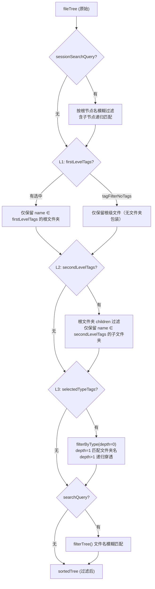

#### L1 项目标签 — 削减根节点

```javascript
// source: fileTreeComputed.js:153-185
// firstLevelTags = selectedTags ∩ firstLevelNames
// 选中 "YiWeb" → 仅保留 name="YiWeb" 的根文件夹
// tagFilterNoTags=true → 仅保留 type='file' 的根节点
```

#### L2 故事标签 — 过滤子文件夹

```javascript
// source: fileTreeComputed.js:187-199
// secondLevelTags = selectedTags - firstLevelNames
// 对每个保留的根文件夹，仅保留 name ∈ secondLevelTags 的直接子文件夹
// 选中 "aicr" → YiWeb.children 仅保留 name="aicr" 的项
```

#### L3 类型标签 — 文件夹名精确匹配

```javascript
// source: fileTreeComputed.js:201-226
// filterByType(items, depth=0):
//   depth=1 → 仅保留 name ∈ selectedTypeTags 的文件夹
//   depth≠1 → 递归过滤 children，有匹配子项的父文件夹保留
// 选中 "技术评审" → 仅保留 name="技术评审" 的深度1文件夹及其内容
```

### 3.4 双向联动 — `handleTagSelect()` 自动选父/去子

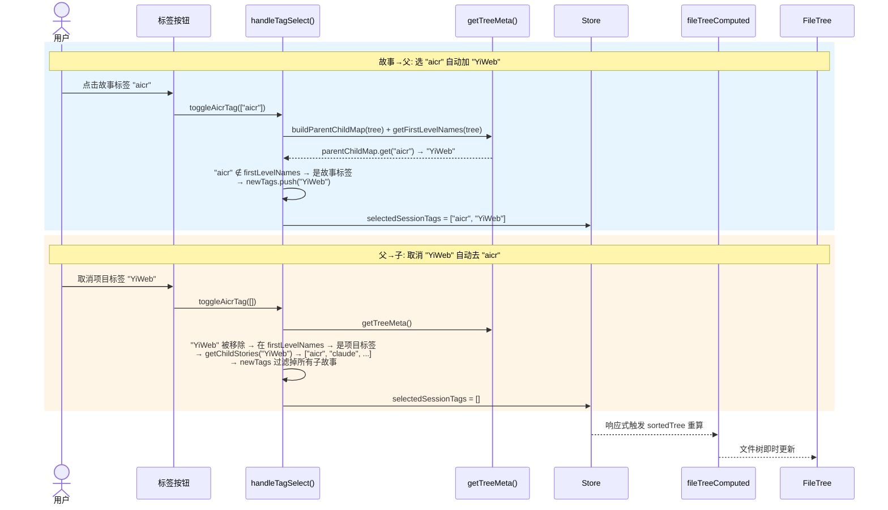

> 联动逻辑位于 `tagFilterMethods.js:44-76`，构建/查询均为 O(n)/O(1)，不遍历文件树。

### 3.5 Computed 派生链 — 标签栏渲染

```mermaid
flowchart LR
    subgraph INPUT["状态输入"]
        ST["selectedSessionTags"]
        TT["selectedTypeTags"]
    end

    subgraph C1["allTags<br/>fileTreeComputed.js:4-49"]
        C1A["遍历根文件夹<br/>仅处理 firstLevelTags 选中项"]
        C1B["收集直接子文件夹名"]
        C1C["selectedTypeTags 非空时<br/>→ folderNameInTypes 过滤"]
        C1D["按 localStorage 拖拽顺序排列<br/>key: aicr_file_tag_order"]
    end

    subgraph C2["tagCounts<br/>fileTreeComputed.js:50-100"]
        C2A["递归统计各子文件夹<br/>内的文件数"]
        C2B["selectedTypeTags 联动<br/>→ countFilesInFolder 跳过非匹配"]
        C2C["根级文件计为 noTagsCount"]
    end

    subgraph C3["filteredTags<br/>fileTreeComputed.js:101-113"]
        C3A["allTags 按 count 降序<br/>同 count 拼音排序"]
    end

    INPUT --> C1 --> C2 --> C3
    C3 --> RENDER["标签栏渲染<br/>故事标签 + 计数徽标"]
```

### 3.6 两种「无标签」模式

| 模式 | 状态变量 | 触发 | 效果 | 来源 |
|------|---------|------|------|------|
| 项目级无标签 | `tagFilterNoTags` | `handleTagFilterNoTags(true)` | 仅显示根级文件（type='file' 的根节点） | `fileTreeComputed.js:170-180` |
| 故事级无故事 | `storyLevelNoTags` | `handleStoryLevelNoTags(true)` | 过滤掉在故事子目录中的文件 | `buildFilterContext()` 消费 |

### 3.7 涉及状态

| 状态变量 | 类型 | 来源 | 消费者 |
|---------|------|------|--------|
| `selectedSessionTags` | string[] | `handleTagSelect()` | `sortedTree` (L1+L2), `allTags`, `tagCounts` |
| `selectedTypeTags` | string[] | `handleTypeTagToggle()` | `sortedTree` (L3), `allTags`, `tagCounts` |
| `sessionSearchQuery` | string | `handleSessionSearchChange()` | `sortedTree` 根节点名过滤 |
| `tagFilterNoTags` | boolean | `handleTagFilterNoTags()` | `sortedTree` 根级文件模式 |
| `storyLevelNoTags` | boolean | `handleStoryLevelNoTags()` | `buildFilterContext()` |
| `storyNames` | string[] | `loadFileTree()` → `extractStoryNames()` | 项目标签组（header） |
| `storyDocTypes` | string[] | `loadFileTree()` → `extractDocTypes()` | 类型标签行（筛选栏） |
| `tagOrder` | string[] | `localStorage` (`aicr_file_tag_order`) | `allTags` 排序 |

### 3.8 localStorage 持久化

| 键 | 类型 | 用途 |
|---|------|------|
| `aicr_file_tag_order` | JSON Array | 故事标签拖拽排序，`allTags` 按此顺序渲染 |

### 3.9 API 端点

> 三级联动筛选为**纯前端操作**，不触发额外 API 请求。标签数据（`storyNames`、`storyDocTypes`）来自 `loadFileTree()` 阶段从已加载的文件树中提取（见 [§1](#§1-场景-1--代码审查者浏览文件) `query_documents`），筛选过程完全在 `fileTreeComputed.sortedTree` 计算属性中完成。

---

## §4 场景 4 — 组织者管理会话

> 对应 [使用场景 §1 场景 4](./使用场景.md#场景-4-组织者管理会话)

### 4.1 数据流全景

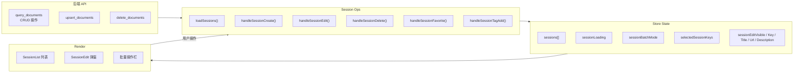

### 4.2 链路序列 — 创建会话

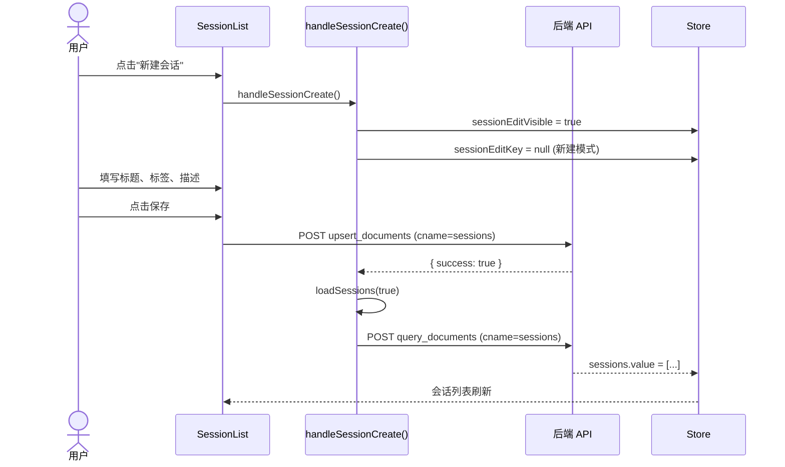

### 4.3 链路序列 — 批量删除

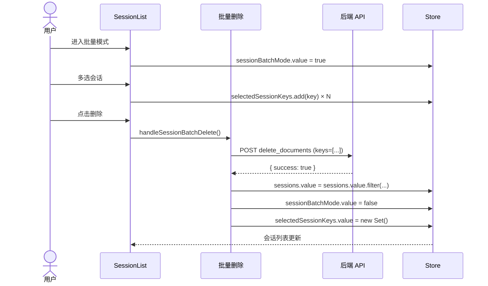

### 4.4 涉及状态

| 状态变量 | 类型 | 来源 | 消费者 |
|---------|------|------|--------|
| `sessions` | Array | `loadSessions()` → API | SessionList, FileTree |
| `sessionLoading` | boolean | `loadSessions()` 生命周期 | SessionList 骨架屏 |
| `sessionError` | string | `loadSessions()` catch | SessionList 错误提示 |
| `sessionBatchMode` | boolean | 用户切换 | SessionList 复选框列 |
| `selectedSessionKeys` | Set | 用户勾选 | 批量操作按钮、全选状态 |
| `sessionEdit*` | 多个 | 编辑弹窗 v-model | YiModal 表单 |

### 4.5 API 端点

| 接口 | 方法 | 请求体关键字段 | 用途 | 触发时机 |
|------|------|-------------|------|---------|
| `query_documents` | POST | `module_name`, `method_name`, `parameters.cname="sessions"` | 查询会话列表 | 页面加载 / CRUD 后刷新 |
| `create_document` | POST | `parameters.cname="sessions"`, `parameters.data` (key, url, title, messages, tags, createdAt...) | 创建新会话 | 新建会话 → 保存 |
| `update_document` | POST | `parameters.cname="sessions"`, `parameters.key`, `parameters.data` (title/tags/isFavorite 等) | 更新会话元数据/标签/收藏 | 编辑/收藏/标签操作 |
| `delete_document` | POST | `parameters.cname="sessions"`, `parameters.key` | 删除会话 | 删除/批量删除 |

**curl 示例**:

```bash
# 创建会话
curl -X POST 'https://api.effiy.cn/' \
  -H 'Content-Type: application/json' -H 'X-Token: <token>' \
  -d '{"module_name":"services.database.data_service","method_name":"create_document","parameters":{"cname":"sessions","data":{"key":"my-session","url":"aicr-session://1710000000000-abc","title":"My_Session","pageDescription":"","messages":[],"tags":["YiWeb"],"createdAt":1710000000000,"updatedAt":1710000000000,"lastAccessTime":1710000000000}}}'

# 更新会话（标签/收藏）
curl -X POST 'https://api.effiy.cn/' \
  -H 'Content-Type: application/json' -H 'X-Token: <token>' \
  -d '{"module_name":"services.database.data_service","method_name":"update_document","parameters":{"cname":"sessions","key":"my-session","data":{"title":"New_Title","tags":["YiWeb","aicr"],"isFavorite":true}}}'

# 删除会话
curl -X POST 'https://api.effiy.cn/' \
  -H 'Content-Type: application/json' -H 'X-Token: <token>' \
  -d '{"module_name":"services.database.data_service","method_name":"delete_document","parameters":{"cname":"sessions","key":"my-session"}}'
```

---

## §5 场景 5 — 新成员接入 API 聊天

> 对应 [使用场景 §1 场景 5](./使用场景.md#场景-5-新成员接入-api-聊天)

### 5.1 数据流全景

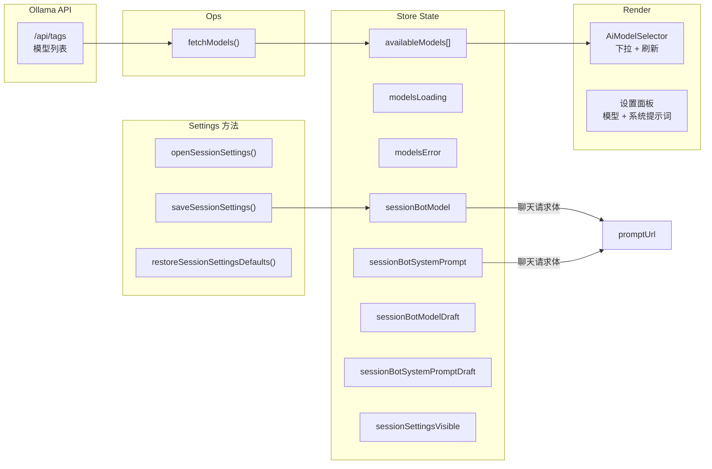

### 5.2 链路序列

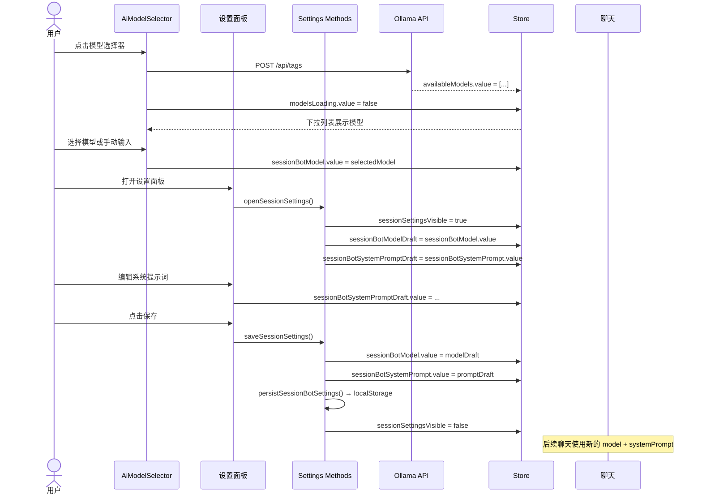

### 5.3 涉及状态

| 状态变量 | 类型 | 来源 | 消费者 |
|---------|------|------|--------|
| `availableModels` | Array | `fetchModels()` → Ollama API | AiModelSelector 下拉 |
| `modelsLoading` | boolean | `fetchModels()` 生命周期 | AiModelSelector 加载态 |
| `modelsError` | string | `fetchModels()` catch | AiModelSelector 错误态 |
| `sessionBotModel` | string | `saveSessionSettings()` | 聊天请求体 model 字段 |
| `sessionBotSystemPrompt` | string | `saveSessionSettings()` | 聊天请求体 systemPrompt |
| `sessionBotModelDraft` | string | `openSessionSettings()` | 设置面板编辑框 |
| `sessionBotSystemPromptDraft` | string | `openSessionSettings()` | 设置面板编辑框 |
| `sessionSettingsVisible` | boolean | `open/closeSessionSettings()` | YiModal 显隐 |

### 5.4 API 端点

| 接口 | 方法 | 请求体 | 用途 | 触发时机 |
|------|------|--------|------|---------|
| `list_ollama_models` | GET | 查询参数: `module_name=services.ai.chat_service&method_name=list_ollama_models&parameters={}` | 获取可用模型列表 | 打开模型选择器 / 点击刷新 |

> 模型偏好（`sessionBotModel`、`sessionBotSystemPrompt`）保存到 `localStorage`，不通过 API 持久化。

**curl 示例**:

```bash
# 获取模型列表
curl 'https://api.effiy.cn/?module_name=services.ai.chat_service&method_name=list_ollama_models&parameters=%7B%7D' \
  -H 'X-Token: <token>'
```

---

## §6 场景 6 — 组织者管理文件树

> 对应 [使用场景 §1 场景 6](./使用场景.md#场景-6-组织者管理文件树)

### 6.1 数据流全景

```mermaid
flowchart LR
    subgraph API["后端 API"]
        WF["write-file"]
        RF["read-file"]
        DF["delete-file / delete-folder"]
        REN["rename-file / rename-folder"]
        QS["query_documents"]
    end

    subgraph OPS["FileTree Ops"]
        CFILE["createFile()"]
        CFOLDER["createFolder()"]
        RENAME["renameItem()"]
        DELETE["deleteItem()"]
        IMP["importFolder()"]
        EXP["exportFolder()"]
        ZIP["projectZip upload/download"]
    end

    subgraph STATE["Store State"]
        FT["fileTree[]"]
        FS["files[]"]
        SES["sessions[]"]
    end

    subgraph SYNC["Session Sync"]
        SYNC1["syncFileToSession()"]
        SYNC2["renameSession()"]
        SYNC3["deleteFiles()"]
    end

    subgraph RENDER["Render"]
        TREE["FileTree 组件"]
        MENU["右键菜单"]
        TOOLBAR["工具栏"]
        MODAL["确认弹窗"]
    end

    API --> OPS --> STATE --> RENDER
    OPS --> SYNC --> SES
    RENDER -->|"用户操作"| OPS
```

### 6.2 链路序列 — 创建文件

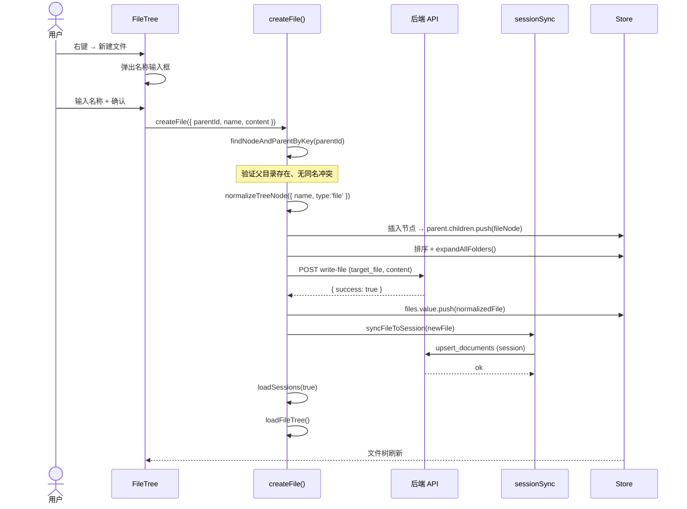

### 6.3 链路序列 — 删除文件夹

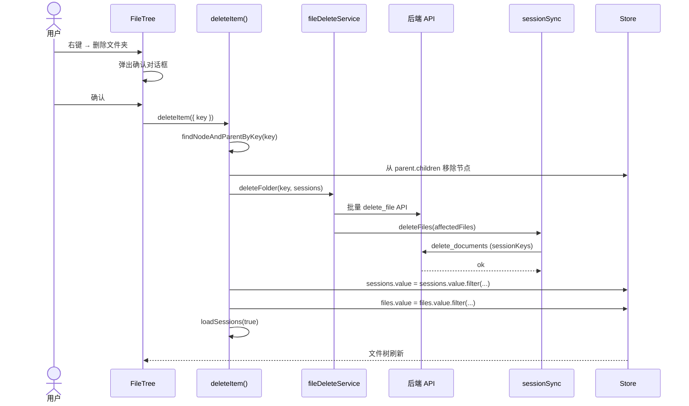

### 6.4 涉及状态

| 状态变量 | 类型 | 来源 | 消费者 |
|---------|------|------|--------|
| `fileTree` | Array | CRUD Ops 直接操作 | FileTree 渲染 |
| `files` | Array | CRUD Ops 同步更新 | CodeView 缓存 |
| `sessions` | Array | `loadSessions(true)` 刷新 | FileTree 重建 |
| `expandedFolders` | Set | `expandAllFolders()` | FileTree 展开态 |

### 6.5 API 端点

| 接口 | 方法 | 请求体 | 用途 | 触发时机 |
|------|------|--------|------|---------|
| `/write-file` | POST | `{"target_file":"<path>","content":"<text>","is_base64":false,"overwrite":false}` | 创建/更新文件 | 新建文件、保存内容 |
| `/read-file` | POST | `{"target_file":"<path>"}` | 读取文件内容 | 点击文件 |
| `/delete-file` | POST | `{"target_file":"<path>"}` | 删除单个文件 | 右键删除文件 |
| `/delete-folder` | POST | `{"target_dir":"<path>"}` | 递归删除文件夹 | 右键删除文件夹 |
| `/rename-file` | POST | `{"old_path":"<old>","new_path":"<new>"}` | 重命名文件 | 右键重命名 |
| `/rename-folder` | POST | `{"old_dir":"<old>","new_dir":"<new>"}` | 重命名文件夹 | 右键重命名 |
| `create_document` | POST | `parameters.cname="sessions"`, `parameters.data` | 同步新建文件 → 会话 | CRUD 后 sessionSync |
| `delete_document` | POST | `parameters.cname="sessions"`, `parameters.key` | 删除关联会话 | 删除文件/文件夹后 |
| `query_documents` | POST | `parameters.cname="sessions"` | 刷新全量会话 | CRUD 后刷新列表 |

**curl 示例**:

```bash
# 写入文件
curl -X POST 'https://api.effiy.cn/write-file' \
  -H 'Content-Type: application/json' -H 'X-Token: <token>' \
  -d '{"target_file":"docs/new-file.md","content":"# Title\n\nBody","is_base64":false,"overwrite":false}'

# 删除文件
curl -X POST 'https://api.effiy.cn/delete-file' \
  -H 'Content-Type: application/json' -H 'X-Token: <token>' \
  -d '{"target_file":"docs/old-file.md"}'

# 删除文件夹
curl -X POST 'https://api.effiy.cn/delete-folder' \
  -H 'Content-Type: application/json' -H 'X-Token: <token>' \
  -d '{"target_dir":"docs/old-folder"}'

# 重命名文件
curl -X POST 'https://api.effiy.cn/rename-file' \
  -H 'Content-Type: application/json' -H 'X-Token: <token>' \
  -d '{"old_path":"docs/old.md","new_path":"docs/new.md"}'

# 重命名文件夹
curl -X POST 'https://api.effiy.cn/rename-folder' \
  -H 'Content-Type: application/json' -H 'X-Token: <token>' \
  -d '{"old_dir":"docs/old","new_dir":"docs/new"}'
```

---

## §7 跨场景共享管道

### 7.1 SSE 流式数据管道

> 被场景 2（AI 代码分析）使用

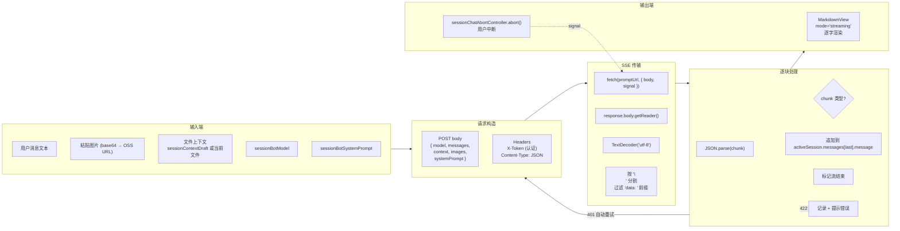

### 7.2 localStorage 持久化

> 被场景 1（面板宽度）、场景 3（标签顺序）、场景 5（模型偏好）使用

| 键 | 类型 | 用途 | 关联场景 |
|---|------|------|---------|
| `aicrSessionSidebarWidth` | number | 会话侧边栏宽度 | 场景 1 |
| `aicr_file_tag_order` | JSON Array | 项目标签拖拽排序 | 场景 3 |
| `sessionBotSettings` | JSON | 模型 ID + 系统提示词 | 场景 5 |
| `weChatRobotSettings` | JSON | 微信机器人配置 | 场景 5 |

---

## §8 初始化加载序列

> 覆盖全部场景的启动阶段

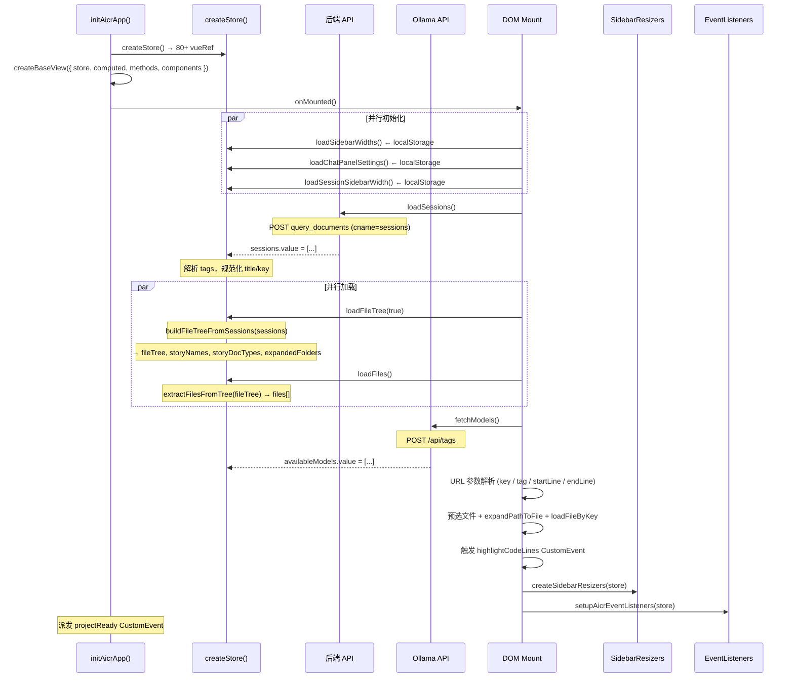

---

## §9 与使用场景对齐

| 使用场景 | 本文位置 | 核心链路 | 涉及 API |
|---------|---------|---------|---------|
| 场景 1: 浏览文件 | §1 | API → sessions → fileTree → files → selectedKey → loadFileByKey → CodeView | `query_documents`, `/read-file` |
| 场景 2: AI 分析 | §2 | 用户输入 → buildChatContext → SSE fetch → activeSession.messages → MarkdownView | `chat`, `/upload/upload-image-to-oss`, `/wework/send-message` |
| 场景 3: 筛选文件 | §3 | 标签点击 → handleTagSelect → selectedSessionTags → buildFilterContext → all computed → FileTree | 无 (纯前端) |
| 场景 4: 管理会话 | §4 | 会话 CRUD → create/update/delete → query_documents → sessions → SessionList | `query_documents`, `create_document`, `update_document`, `delete_document` |
| 场景 5: 模型配置 | §5 | fetchModels → availableModels → AiModelSelector / saveSessionSettings → chat request body | `list_ollama_models` |
| 场景 6: 管理文件树 | §6 | 文件 CRUD → write/delete/rename API → sessionSync → query_documents → loadFileTree → FileTree | `/write-file`, `/delete-file`, `/delete-folder`, `/rename-file`, `/rename-folder`, `create_document`, `delete_document`, `query_documents` |
| 全部场景 | §7 | SSE 管道 + localStorage 持久化 | — |
| 全部场景 | §8 | 初始化序列 | — |
| 全部场景 | API 接口总览 | 14 个接口全量清单 + curl 示例 | 全部 |

---

## §10 评审清单

| # | 检查项 | 状态 |
|---|--------|:--:|
| 1 | 6 条数据链路与 6 个使用场景一一对应 | ✅ |
| 2 | 每链路含 mermaid 序列图 | ✅ |
| 3 | 每链路标注涉及的 vueRef 状态变量 | ✅ |
| 4 | 每链路标注 API 端点及触发时机 | ✅ |
| 5 | API 接口总览收录全部 14 个接口 | ✅ |
| 6 | 每场景 API 表含请求体和 curl 示例 | ✅ |
| 7 | SSE 流式管道独立描述 | ✅ |
| 8 | 初始化序列覆盖全阶段 | ✅ |
| 9 | 对齐矩阵含 API 列 | ✅ |

---

> **变更记录**
> | 日期 | 变更 | 触发 | 证据 |
> |------|------|------|------|
> | 2026-05-26 | 重写 §3 场景 3 数据逻辑：树结构模型→核心数据结构→三级筛选链路→双向联动→computed 派生链→两种无标签模式→状态表→localStorage | /rui update aicr | src/views/aicr/utils/filterHelpers.js + hooks/methods/tagFilterMethods.js + components/fileTree/fileTreeComputed.js + hooks/storeFileTreeBuilders.js + hooks/state/storeState.js + hooks/storeFileTreeOps.js |
> | 2026-05-26 | 新增 API 接口总览 + 每场景 curl 示例 | /rui update aicr | src/views/aicr/hooks/*.js + src/core/services/ |
> | 2026-05-26 | 重写 — 与使用场景一一对应，逐链路从 API 到 Render | /rui update aicr | src/views/aicr/index.js + hooks/*.js |
> | 2026-05-26 | 基线化 | /rui update aicr | src/views/aicr/hooks/ |
> | 2026-05-26 | 修正导航链：实施报告 → 测试设计 | /rui update | 统一导航链 |
