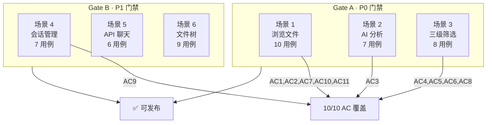
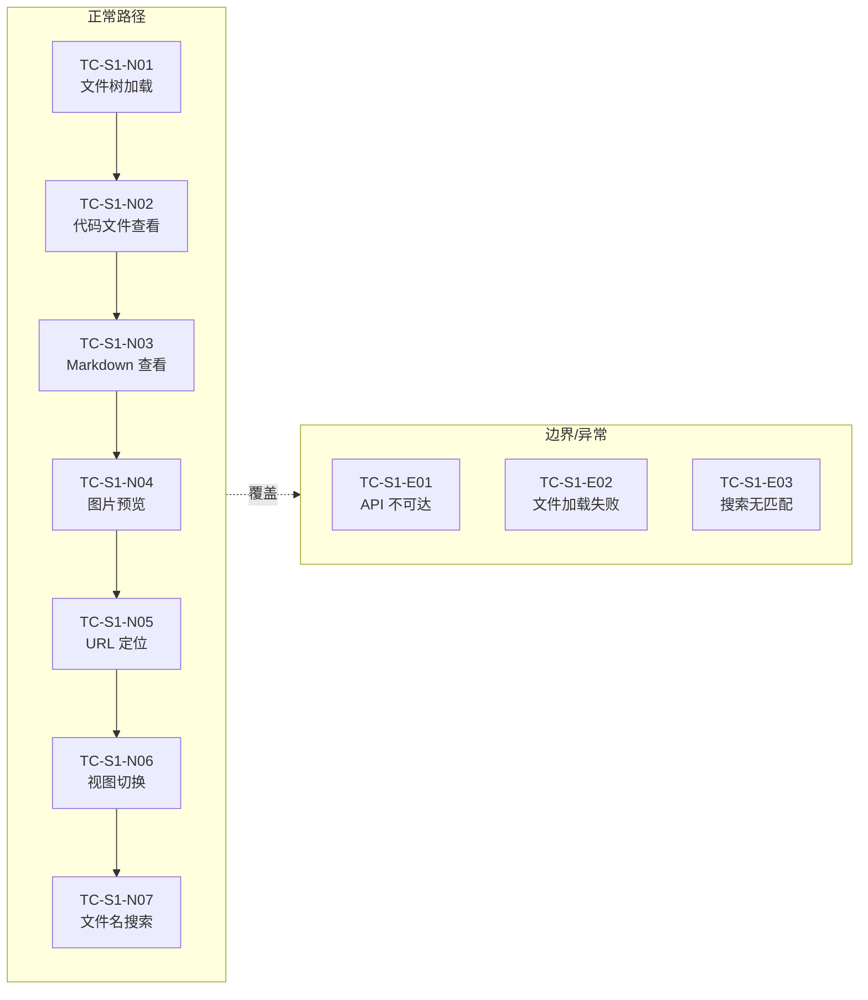
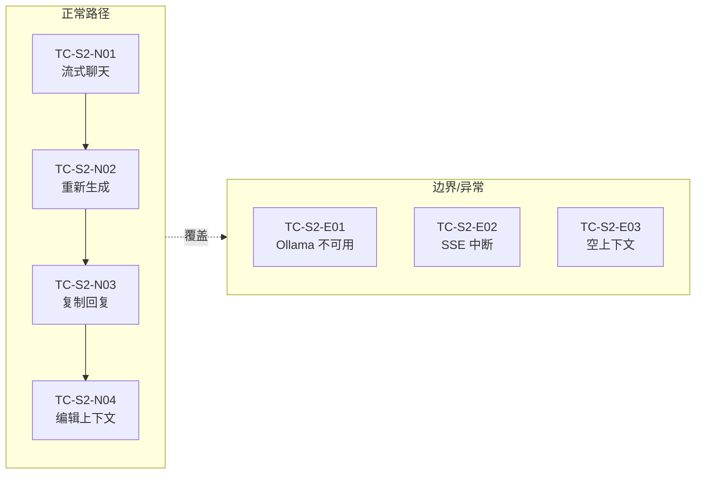
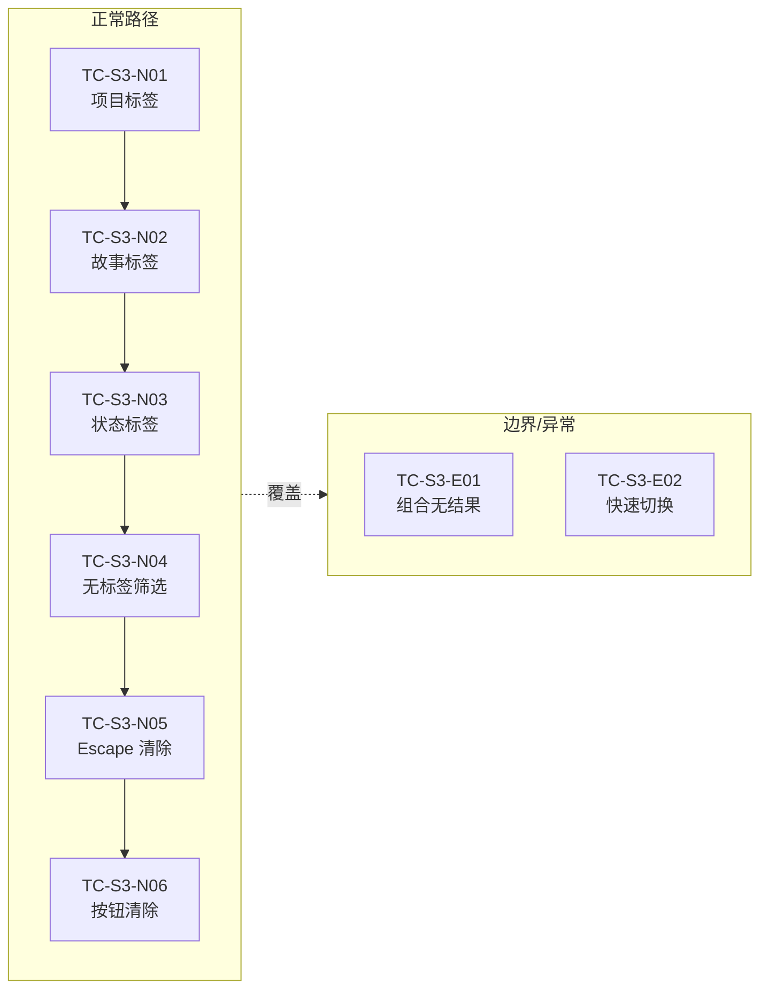
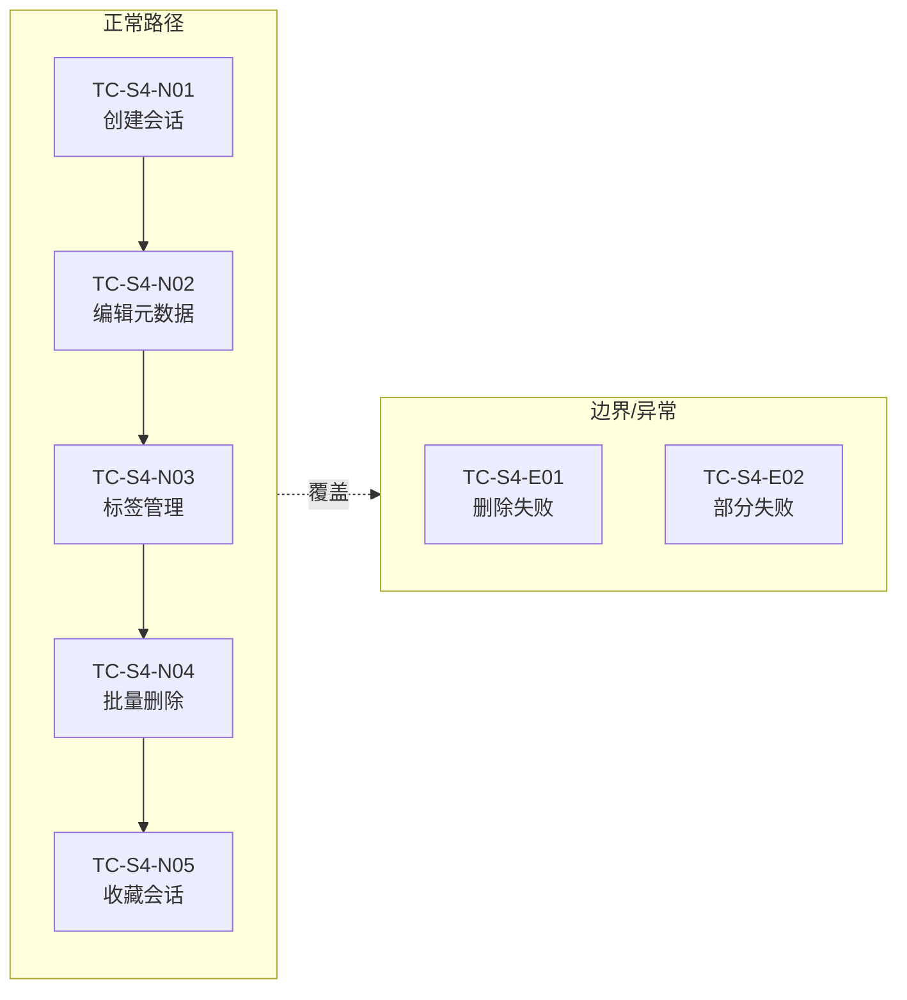
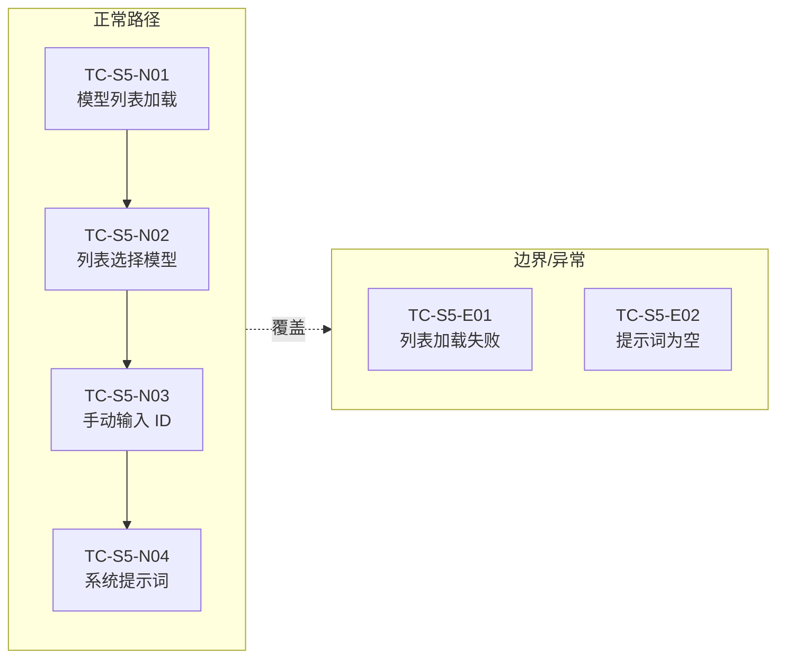
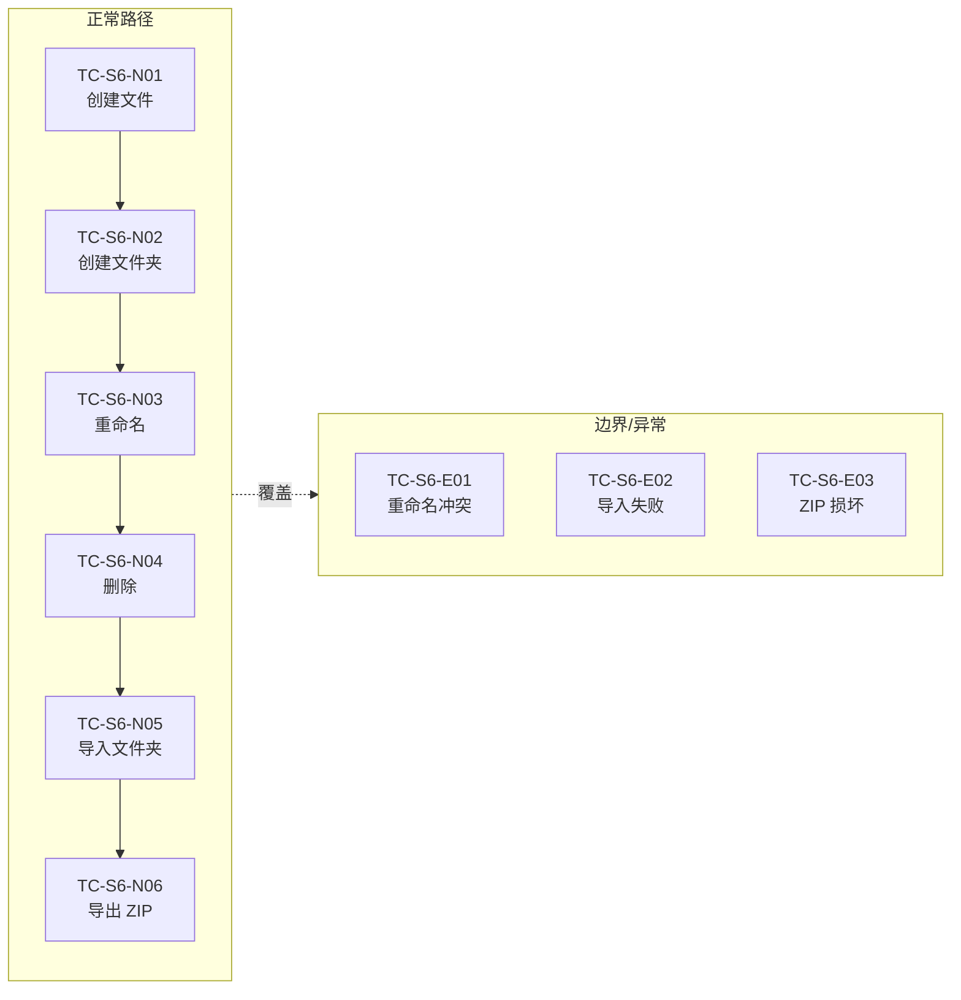
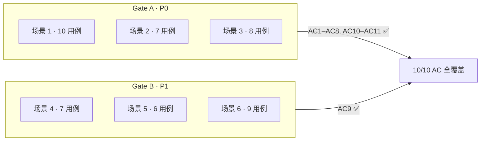

# 测试设计

> | v1.4.0 | 2026-05-26 | deepseek-v4-pro | 📎 [CLAUDE.md](../../../CLAUDE.md) |

> **导航**: [← 技术评审](./技术评审.md) · [实施报告 →](./实施报告.md)
>
> **来源引用**：基于 [故事任务](./故事任务.md) §5 AC# 与 [使用场景](./使用场景.md) §1 场景 1–6，一一对应。

---

[架构总览](#测试架构总览) · [§0 基线](#§0-基线溯源) · [§1 场景 1](#§1-场景-1-代码审查者浏览文件) · [§2 场景 2](#§2-场景-2-开发者-ai-代码分析) · [§3 场景 3](#§3-场景-3-管理者三级联动筛选) · [§4 场景 4](#§4-场景-4-组织者管理会话) · [§5 场景 5](#§5-场景-5-新成员接入-api-聊天) · [§6 场景 6](#§6-场景-6-组织者管理文件树) · [§7 Gate](#§7-gate-交接)

## 概述

基于故事任务 AC 与使用场景的测试用例集，六场景四类用例（正常/边界/异常/回归），每用例 Given/When/Then 可独立执行。§7 定义 Gate A/B 交接信令。

### 主要价值

- 🎯 与使用场景一一对应 — 6 组测试用例完整覆盖 6 个使用场景
- 🔒 异常路径可见 — 每场景含 API 失败、空状态、错误恢复用例
- ⚡ 每用例 Given/When/Then 可独立执行 — 不依赖上下文推断
- 🔗 双向跳转 — 每场景链接回使用场景，使用场景链接到此

---

## 测试架构总览

### 用例分布

| 维度 | Gate A (P0) | Gate B (P1) | 合计 |
|------|:-----------:|:-----------:|:----:|
| 正常路径 | 17 | 15 | **32** |
| 边界/异常 | 8 | 7 | **15** |
| 覆盖 AC | AC1–AC8, AC10–AC11 | AC9 | **10/10** |

---

## §0 基线溯源

| 使用场景 | 测试用例 | 覆盖 AC# |
|---------|---------|----------|
| [场景 1: 代码审查者浏览文件](./使用场景.md#场景-1-代码审查者浏览文件) | TC-S1-N01–N07 · TC-S1-E01–E03 | AC1, AC2, AC7, AC10, AC11 |
| [场景 2: 开发者 AI 代码分析](./使用场景.md#场景-2-开发者-ai-代码分析) | TC-S2-N01–N04 · TC-S2-E01–E03 | AC3 |
| [场景 3: 管理者三级联动筛选](./使用场景.md#场景-3-管理者三级联动筛选文件) | TC-S3-N01–N06 · TC-S3-E01–E02 | AC4, AC5, AC6, AC8 |
| [场景 4: 组织者管理会话](./使用场景.md#场景-4-组织者管理会话) | TC-S4-N01–N05 · TC-S4-E01–E02 | AC9 |
| [场景 5: 新成员接入 API 聊天](./使用场景.md#场景-5-新成员接入-api-聊天) | TC-S5-N01–N04 · TC-S5-E01–E02 | — |
| [场景 6: 组织者管理文件树](./使用场景.md#场景-6-组织者管理文件树) | TC-S6-N01–N06 · TC-S6-E01–E03 | — |

---

## §1 场景 1: 代码审查者浏览文件

> 📋 对应使用场景: [场景 1: 代码审查者浏览文件](./使用场景.md#场景-1-代码审查者浏览文件)
>
> 🎯 覆盖 AC: AC1 (文件树加载) · AC2 (文件内容展示) · AC7 (搜索过滤) · AC10 (空状态) · AC11 (API 错误)

### 正常路径

| ID | Given | When | Then |
|----|-------|------|------|
| TC-S1-N01 | 后端 API 返回会话数据 | 页面加载 | 文件树从 session 数据构建并展示，统计栏显示文件/会话数量 |
| TC-S1-N02 | 文件树已加载，存在 .js 文件 | 点击 .js 文件 | 代码区展示语法高亮代码，行号可点击复制链接 |
| TC-S1-N03 | 文件树已加载，存在 .md 文件 | 点击 .md 文件 | 代码区渲染 Markdown 内容，支持内部链接跳转 |
| TC-S1-N04 | 文件树已加载，存在 .png 文件 | 点击 .png 文件 | 弹出图片全屏预览弹窗 |
| TC-S1-N05 | URL 含 `?key=<path>` 参数 | 页面加载 | 自动展开对应目录层级，定位并高亮目标文件，加载其内容 |
| TC-S1-N06 | 文件树已加载为树形视图 | 点击视图切换按钮 | 切换为卡片视图，文件以卡片形式展示；再次点击切回树形 |
| TC-S1-N07 | 文件树已加载 | 输入搜索关键词 | 300ms 防抖后过滤结果显示匹配文件，不匹配的文件隐藏 |

### 边界/异常

| ID | Given | When | Then |
|----|-------|------|------|
| TC-S1-E01 | 网络断开或 API 服务宕机 | 页面加载 | 错误状态展示 + 重试按钮，文件树显示空状态 |
| TC-S1-E02 | 文件树正常展示 | 点击文件后 API 返回 500 | 代码区显示错误占位提示，不影响左侧文件树状态 |
| TC-S1-E03 | 文件树已加载 | 搜索一个不存在的文件名 | 空状态提示"未找到匹配文件"，提供清除搜索按钮 |

---

## §2 场景 2: 开发者 AI 代码分析

> 📋 对应使用场景: [场景 2: 开发者 AI 代码分析](./使用场景.md#场景-2-开发者-ai-代码分析)
>
> 🎯 覆盖 AC: AC3 (AI 流式聊天)

### 正常路径

| ID | Given | When | Then |
|----|-------|------|------|
| TC-S2-N01 | 已选中文件作为上下文，Ollama 服务可用 | 输入"解释这段代码"并发送 | SSE 流式响应逐块展示在聊天面板，文件内容作为上下文随请求发送 |
| TC-S2-N02 | 上一条 AI 回复已展示 | 点击重新生成按钮 | 清除上一条回复内容，使用相同上下文重新请求，新回复流式展示 |
| TC-S2-N03 | AI 回复已完整展示 | 点击复制按钮 | 回复内容复制到剪贴板，显示复制成功提示 |
| TC-S2-N04 | 已选中文件 | 打开上下文编辑器，编辑文件内容，保存 | 下次聊天使用编辑后的上下文发送请求 |

### 边界/异常

| ID | Given | When | Then |
|----|-------|------|------|
| TC-S2-E01 | Ollama 服务宕机 | 发送聊天消息 | 错误提示"模型服务不可用"，不展示空白回复 |
| TC-S2-E02 | 流式聊天进行中 | 网络断开 | "流式连接中断"提示，已接收的部分内容保留在聊天面板 |
| TC-S2-E03 | 未选择任何文件 | 输入消息并发送 | 使用默认上下文正常发送，不报错 |

---

## §3 场景 3: 管理者三级联动筛选

> 📋 对应使用场景: [场景 3: 管理者三级联动筛选文件](./使用场景.md#场景-3-管理者三级联动筛选文件)
>
> 🎯 覆盖 AC: AC4 (项目标签) · AC5 (故事标签) · AC6 (状态标签) · AC8 (清除筛选)

### 正常路径

| ID | Given | When | Then |
|----|-------|------|------|
| TC-S3-N01 | 文件树包含多个项目目录 | 点击"YiWeb"项目标签 | 文件树仅显示 YiWeb 根目录内容，统计栏更新文件数量，故事标签选项联动更新 |
| TC-S3-N02 | 已选择"YiWeb"项目标签 | 点击"aicr"故事标签 | 文件树进一步缩小为 aicr 子目录，状态标签选项联动更新 |
| TC-S3-N03 | 已选择项目标签和故事标签 | 点击"技术评审"状态标签 | 仅显示匹配"技术评审"类型的文件，其他文件隐藏 |
| TC-S3-N04 | 某项目根目录存在无子目录的孤立文件 | 点击"无标签"筛选按钮 | 仅显示根目录下无子目录的文件，有子目录的文件隐藏 |
| TC-S3-N05 | 已应用任意筛选条件 | 按 Escape 键 | 所有筛选条件清除，文件树恢复完整列表，统计栏恢复全量数字 |
| TC-S3-N06 | 已应用任意筛选条件 | 点击清除筛选按钮 | 同 Escape 清除，所有筛选条件重置 |

### 边界/异常

| ID | Given | When | Then |
|----|-------|------|------|
| TC-S3-E01 | 已选择项目 + 故事 + 状态标签 | 该组合下无任何匹配文件 | 显示空状态提示 + "清除筛选"快捷按钮，不报错 |
| TC-S3-E02 | 已选择"aicr"故事标签 | 快速切换选择"claude"故事标签 | 文件树立即更新为 claude 目录内容，状态标签联动更新，无闪烁或中间态 |

---

## §4 场景 4: 组织者管理会话

> 📋 对应使用场景: [场景 4: 组织者管理会话](./使用场景.md#场景-4-组织者管理会话)
>
> 🎯 覆盖 AC: AC9 (会话 CRUD)

### 正常路径

| ID | Given | When | Then |
|----|-------|------|------|
| TC-S4-N01 | 会话列表已加载 | 点击创建会话按钮 | 新会话出现在列表中，自动获得默认名称，可立即开始编辑 |
| TC-S4-N02 | 会话列表中存在会话 | 编辑会话名称或描述，保存 | 会话元数据更新，列表刷新显示新名称 |
| TC-S4-N03 | 会话已存在 | 为会话添加标签"review"，再移除该标签 | 添加后标签出现在会话标签列表中，移除后标签消失 |
| TC-S4-N04 | 会话列表存在多个会话 | 进入批量模式，多选 3 个会话，点击删除并确认 | 3 个会话从列表中移除，后端同步删除 |
| TC-S4-N05 | 会话列表中存在会话 | 点击会话的收藏按钮 | 会话标记为已收藏，收藏列表中出现该会话；再次点击取消收藏 |

### 边界/异常

| ID | Given | When | Then |
|----|-------|------|------|
| TC-S4-E01 | 会话列表正常 | 删除会话时 API 返回 500 | 错误提示"删除失败"，会话仍保留在列表中不消失 |
| TC-S4-E02 | 已选中 3 个会话进入批量删除 | API 返回部分成功 | 成功的从列表移除，失败的保留并提示具体失败项 |

---

## §5 场景 5: 新成员接入 API 聊天

> 📋 对应使用场景: [场景 5: 新成员接入 API 聊天](./使用场景.md#场景-5-新成员接入-api-聊天)
>
> 🎯 覆盖目标: 模型选择与系统提示词配置

### 正常路径

| ID | Given | When | Then |
|----|-------|------|------|
| TC-S5-N01 | Ollama 服务可用 | 打开模型选择器 | 从 Ollama 拉取可用模型列表，以下拉选项展示 |
| TC-S5-N02 | 模型列表已加载 | 从下拉列表选择一个模型 | 选中模型 ID 更新，后续聊天请求使用该模型 |
| TC-S5-N03 | Ollama 服务不可达或列表为空 | 手动输入模型 ID 并确认 | 使用手动输入的模型 ID 发送请求，不依赖模型列表 |
| TC-S5-N04 | 用户打开设置面板 | 编辑系统提示词内容，保存 | 保存成功，下次聊天请求自动注入该提示词 |

### 边界/异常

| ID | Given | When | Then |
|----|-------|------|------|
| TC-S5-E01 | Ollama 服务不可用 | 打开模型选择器或点击刷新 | 显示"无法获取模型列表"提示，允许手动输入模型 ID 继续使用 |
| TC-S5-E02 | 用户清空系统提示词 | 保存空提示词并发送聊天 | 请求中不注入系统提示词，正常发送，不报错 |

---

## §6 场景 6: 组织者管理文件树

> 📋 对应使用场景: [场景 6: 组织者管理文件树](./使用场景.md#场景-6-组织者管理文件树)
>
> 🎯 覆盖目标: 文件树 CRUD 与导入导出

### 正常路径

| ID | Given | When | Then |
|----|-------|------|------|
| TC-S6-N01 | 右键点击文件夹打开上下文菜单 | 选择"新建文件"，输入文件名，确认 | 新文件出现在树中对应位置，后端同步创建 |
| TC-S6-N02 | 右键点击父目录 | 选择"新建文件夹"，输入名称，确认 | 新文件夹出现在树中，可继续在其中创建文件 |
| TC-S6-N03 | 右键点击文件或文件夹 | 选择"重命名"，输入新名称，确认 | 树节点名称更新，后端同步重命名 |
| TC-S6-N04 | 右键点击文件或文件夹 | 选择"删除"，在确认对话框中确认 | 节点从文件树中移除，后端同步删除 |
| TC-S6-N05 | 点击工具栏"导入文件夹" | 选择本地文件夹并确认 | 文件夹及其内容上传到后端，文件树中显示新内容 |
| TC-S6-N06 | 文件树已加载 | 点击"导出文件夹"选中目录或点击"项目 ZIP 下载" | 浏览器下载 ZIP 包，包含对应目录的全部文件 |

### 边界/异常

| ID | Given | When | Then |
|----|-------|------|------|
| TC-S6-E01 | 文件树中存在文件 A | 将文件 B 重命名为 A 的名称 | "文件名已存在"错误提示，重命名操作取消，文件 B 保持原名 |
| TC-S6-E02 | 选择了本地文件夹 | 上传过程中网络中断或后端返回错误 | 错误提示"导入失败"，文件树保持不变 |
| TC-S6-E03 | 上传项目 ZIP | ZIP 文件格式损坏或内容不合法 | "ZIP 文件无效"错误提示，不更新文件树 |

---

## §7 Gate 交接

### Gate A

| 类别 | 用例 | 覆盖 |
|------|------|------|
| 🟢 P0 正常路径 | TC-S1-N01–N07 · TC-S2-N01–N04 · TC-S3-N01–N06 | AC1–AC8 |
| 🔴 P0 异常 | TC-S1-E01–E03 · TC-S2-E01–E03 · TC-S3-E01–E02 | AC10, AC11 |
| ✅ AC 覆盖 | 10/10 | 无遗漏 |
| 🚫 阻塞问题 | 无 | — |

### Gate B

| 类别 | 用例 | 覆盖 |
|------|------|------|
| 🔵 P1 正常路径 | TC-S4-N01–N05 · TC-S5-N01–N04 · TC-S6-N01–N06 | AC9 |
| 🔵 P1 异常 | TC-S4-E01–E02 · TC-S5-E01–E02 · TC-S6-E01–E03 | 模型/提示词/文件树 CRUD |
| ✅ AC 覆盖 | 1/1 | 无遗漏 |
| 🚫 阻塞问题 | 无 | — |

---

> **变更记录**
> | 日期 | 变更 | 触发 | 证据 |
> |------|------|------|------|
> | 2026-05-26 | 基线生成 | 源码分析 | 故事任务 §5 |
> | 2026-05-26 | 格式升级：基线溯源 + Gate A/B 转分行 emoji | /rui update | 故事任务格式对齐 |
> | 2026-05-26 | 按使用场景 6 场景重构，一一对应 + 双向跳转 | /rui update | 使用场景 §1 场景 1–6 |
> | 2026-05-26 | 图-文-表重构：新增测试架构总览图、每场景流程图、Gate 流转图 | /rui update | 故事任务格式对齐 |
> | 2026-05-26 | 修正 § 编号偏移（§1–§6 对齐场景 1–6）+ 统一导航链顺序 | /rui update | 使用场景 §1 场景 1–6 |
