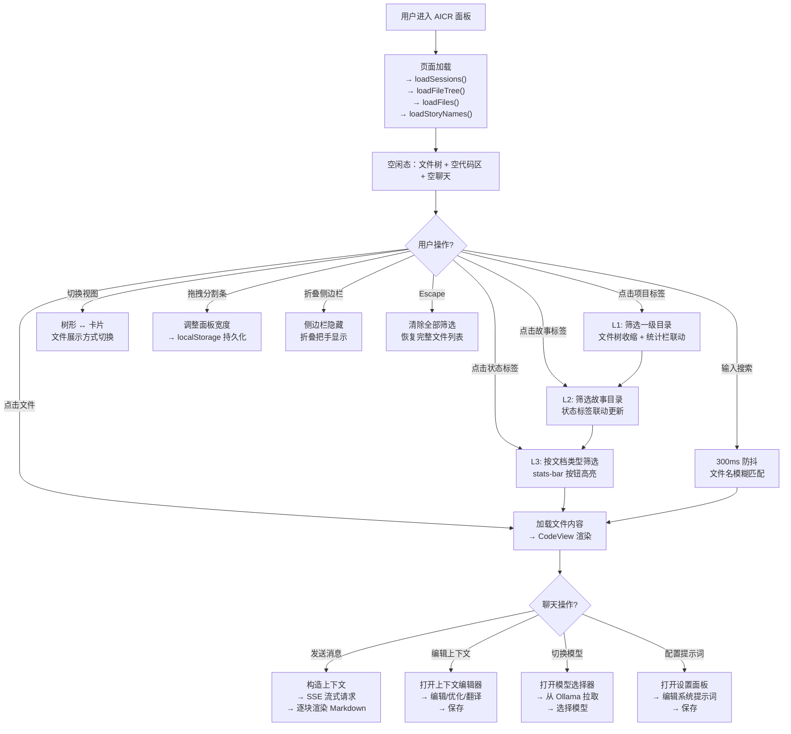
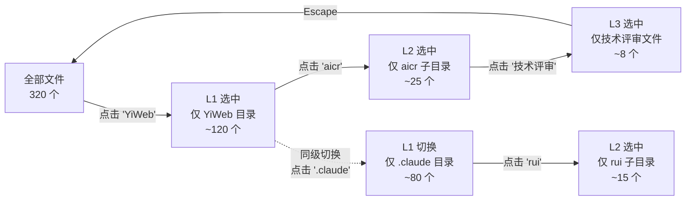

# 页面设计

> | v1.1.1 | 2026-05-26 | deepseek-v4-pro | 🌿 feat/aicr | 📎 [CLAUDE.md](../../../CLAUDE.md) |

> **导航**: [← 安全审计](./安全审计.md) · [数据流设计 →](./数据流设计.md)

> **来源引用**：基于 [技术评审](./技术评审.md) §1 组件树 + §3 架构设计，从 `src/views/aicr/` 源码提取。

---

### 主要价值

- 🎯 布局线框详尽 — 三区布局 + 五态线框（默认/折叠/两侧/模态）
- 🔒 交互细节完整 — 用户操作流 + 微交互反馈
- ⚡ 设计令牌追溯 — 间距、色彩、字号与主题约定一一对应

---

## §1 触发与范围

| 维度 | 内容 |
|------|------|
| 触发条件 | `/rui update aicr 新增页面布局、页面操作数据流、用户操作图等等文档` |
| 涉及页面 | AICR 代码审查面板（`src/views/aicr/`） |
| 涉及组件 | AicrPage · AicrSidebar · AicrCodeArea · FileTree · CodeView · AicrModals · AicrHeader · AiModelSelector · KeyboardShortcutsHelp · SessionListTags |
| 路由 | 无路由 — 通过 `location.href` 切换到 `/aicr` 加载 |
| 关联技术评审 | [技术评审.md](./技术评审.md) §1 组件树 · §3.1 Store 工厂模式 · §3.2 方法模块化 |

---

## §2 视觉规格

### 2.1 布局线框

#### 默认布局（三栏全展开）

```
┌──────────────────────────────────────────────────────────────────┐
│  🔵 HEADER  [48px]                                               │
│  ┌──────────────┬──────────────────────────┬───────────────────┐ │
│  │ 代码审查 2项  │  🔍 搜索会话和文件...     │  📁树形  🗂卡片   │ │
│  └──────────────┴──────────────────────────┴───────────────────┘ │
├──────────────────────────────────────────────────────────────────┤
│  🟡 META + FILTER  [可折叠]                                       │
│  ┌──────────────────────────────────────────────────────────────┐ │
│  │ [筛选 ▾] [全部 320] [YiWeb 45] [.claude 12] [Claude 67]     │ │
│  │ 故事: [aicr 7] [claude 5] [story 6]                          │ │
│  │ 状态: [故事任务 18] [使用场景 12] [技术评审 8]               │ │
│  │ 📄320文件  🏷️18故事  📐12场景  ✏️8设计  🔄5自改进           │ │
│  └──────────────────────────────────────────────────────────────┘ │
├──────────────────────────────────────────────────────────────────┤
│  🔴 MAIN  [flex: 1, 撑满剩余高度]                                   │
│  ┌─────────────┬──────────────────────┬────────────────────────┐ │
│  │ SIDEBAR     │ CODE AREA            │ CHAT PANEL             │ │
│  │ 320px       │ flex: 1              │ 420px                  │ │
│  │             │                      │                        │ │
│  │ 📂 文件树    │ 📄 代码/Markdown/图片  │ 💬 AI 对话             │ │
│  │             │                      │                        │ │
│  │ 📁 .claude/ │  1 │ const x = 1     │  ┌──────────────────┐ │ │
│  │  📁 rui/   │  2 │                  │  │ 用户: 解释这段...  │ │ │
│  │  📁 hook/  │  3 │                  │  ├──────────────────┤ │ │
│  │ 📁 docs/    │  4 │                  │  │ AI: 这段代码...   │ │ │
│  │  📁 aicr/  │     │                  │  └──────────────────┘ │ │
│  │   📄 故事..│     │                  │  ┌──────────────────┐ │ │
│  │             │                      │  │ 📝 输入消息...    │ │ │
│  │             │                      │  └──────────────────┘ │ │
│  │ ▌拖拽把手   │                      │       拖拽把手 ▌       │ │
│  └─────────────┴──────────────────────┴────────────────────────┘ │
│  ◀ 收起侧边栏                                  收起聊天面板 ▶     │
└──────────────────────────────────────────────────────────────────┘
```

#### 侧边栏折叠

```
┌──────────────────────────────────────────────────────────────────┐
│  🔵 HEADER                                                       │
├──────────────────────────────────────────────────────────────────┤
│  🟡 META + FILTER                                                │
├──────────────────────────────────────────────────────────────────┤
│  ┌──┬──────────────────────────────┬───────────────────────────┐ │
│  │◀▶│ CODE AREA (flex: 1)          │ CHAT PANEL (420px)        │ │
│  │  │                              │                           │ │
│  │折│ 📄 全宽代码预览                │ 💬 对话继续                │ │
│  │叠│                              │                           │ │
│  │把│                              │                           │ │
│  │手│                              │                           │ │
│  └──┴──────────────────────────────┴───────────────────────────┘ │
└──────────────────────────────────────────────────────────────────┘
```

#### 聊天面板折叠

```
┌──────────────────────────────────────────────────────────────────┐
│  🔵 HEADER                                                       │
├──────────────────────────────────────────────────────────────────┤
│  🟡 META + FILTER                                                │
├──────────────────────────────────────────────────────────────────┤
│  ┌─────────────┬──────────────────────────────────┬────────────┐ │
│  │ SIDEBAR     │ CODE AREA (flex: 1)              │         ▶◀│ │
│  │ 320px       │                                  │   折叠把手  │ │
│  │             │ 📄 全宽代码预览                    │           │ │
│  │ 📂 文件树    │                                  │           │ │
│  │             │                                  │           │ │
│  └─────────────┴──────────────────────────────────┴────────────┘ │
└──────────────────────────────────────────────────────────────────┘
```

#### 两侧均折叠

```
┌──────────────────────────────────────────────────────────────────┐
│  🔵 HEADER                                                       │
├──────────────────────────────────────────────────────────────────┤
│  🟡 META + FILTER                                                │
├──────────────────────────────────────────────────────────────────┤
│  ┌──┬──────────────────────────────────────────────────────┬───┐ │
│  │◀▶│ CODE AREA (flex: 1, 全宽)                            │▶◀│ │
│  │  │                                                      │   │ │
│  │  │ 📄 沉浸式代码浏览 + Markdown 预览                      │   │ │
│  │  │                                                      │   │ │
│  └──┴──────────────────────────────────────────────────────┴───┘ │
└──────────────────────────────────────────────────────────────────┘
```

#### 模态框覆盖

```
┌──────────────────────────────────────────────────────────────────┐
│  🔵 HEADER  [被半透明遮罩覆盖]                                     │
├──────────────────────────────────────────────────────────────────┤
│  🟡 META + FILTER  [被遮罩]                                       │
├──────────────────────────────────────────────────────────────────┤
│  [████████████████ 半透明遮罩 (opacity: 0.5) ██████████████████] │
│  [█                                                             █]│
│  [█     ┌──────────────────────────────────────────┐            █]│
│  [█     │  MODAL                                    │            █]│
│  [█     │  ┌──────────────────────────────────────┐ │            █]│
│  [█     │  │ 标题                           [✕]   │ │            █]│
│  [█     │  ├──────────────────────────────────────┤ │            █]│
│  [█     │  │                                      │ │            █]│
│  [█     │  │ 模态内容（编辑/设置/FAQ/确认删除）      │ │            █]│
│  [█     │  │                                      │ │            █]│
│  [█     │  ├──────────────────────────────────────┤ │            █]│
│  [█     │  │              [取消]    [确认]         │ │            █]│
│  [█     │  └──────────────────────────────────────┘ │            █]│
│  [█     └──────────────────────────────────────────┘            █]│
│  [████████████████████████████████████████████████████████████████]│
└──────────────────────────────────────────────────────────────────┘
```

### 2.2 设计令牌

| 令牌 | 取值 | 用途 | 来源 |
|------|------|------|------|
| `--sidebar-default-width` | 320px | 侧边栏初始宽度 | 约定 |
| `--chat-panel-default-width` | 420px | 聊天面板初始宽度 | 约定 |
| `--sidebar-min-width` | 200px | 侧边栏最小宽度 | 约定 |
| `--chat-min-width` | 300px | 聊天面板最小宽度 | 约定 |
| `--resizer-width` | 6px | 拖拽条宽度 | 约定 |
| `--header-height` | 48px | 头部栏高度 | 约定 |
| `--tag-height` | 32px | 标签按钮高度 | 约定 |
| `--font-mono` | JetBrains Mono | 代码区等宽字体 | Google Fonts |
| `--font-sans` | Inter | 界面无衬线字体 | Google Fonts |
| `--color-primary` | #3b82f6 | 主色调（激活标签/按钮） | 主题 |
| `--color-bg` | #0f172a | 深色背景 | 主题 |
| `--color-surface` | #1e293b | 卡片/面板背景 | 主题 |
| `--color-border` | #334155 | 边框色 | 主题 |
| `--search-debounce` | 300ms | 搜索输入防抖 | 交互规范 |
| `--transition-default` | 200ms ease | 默认过渡时长 | 约定 |

---

## §3 交互细节

### 3.1 用户操作流

#### 全景操作流



#### 三级联动筛选操作流



### 3.2 微交互

| 元素 | 触发 | 反馈 | 时长 |
|------|------|------|:--:|
| 项目标签 | 点击 | 背景色切换 + 文件树收缩动画 + 统计栏数字更新 | 200ms |
| 搜索输入 | 输入文字 | 300ms 后触发过滤（防抖） | 300ms |
| 文件节点 | 悬停 | 背景色高亮 | 100ms |
| 文件节点 | 点击 | 展开动画 + 文件内容加载 spinner | 200ms |
| 拖拽条 | 拖拽 | 面板宽度实时跟随鼠标 | 实时 |
| 折叠按钮 | 点击 | 面板滑出/滑入 | 200ms |
| 标签胶囊清除 | 点击 × | 标签移除 + 文件树恢复 | 200ms |
| 发送消息 | 点击/Enter | 消息上屏 + typing 指示器 + SSE 流式逐字渲染 | 实时 |
| 复制消息 | 点击 | 按钮文字 "复制" → "已复制" | 1500ms |
| 视图切换 | 点击树形/卡片 | 布局切换 + 图标高亮 | 200ms |
| 筛选栏折叠 | 点击 "筛选 ▾" | 筛选栏收起/展开 + 仅显示胶囊行 | 200ms |
| Escape 键 | 按键 | 所有筛选条件清除 | 即时 |

---

## §4 与主线对齐

| 技术评审章节 | 本文位置 | 关系 |
|-------------|---------|------|
| §1 组件树 | §2.1 布局线框 | 覆盖 — 组件树映射到布局区域 |
| §2 数据流 | — | 补充 — 见 [数据流设计.md](./数据流设计.md) |
| §3.1 Store 工厂 | §2.2 设计令牌 | 补充 — 状态变量对应的 UI 令牌 |
| §3.2 方法模块化 | §3.1 用户操作流 | 覆盖 — 方法映射到用户操作 |
| §3.3 三级联动筛选 | §3.1 筛选操作流 | 覆盖 — 算法映射到交互步骤 |

---

## §5 评审清单

| # | 检查项 | 状态 |
|---|--------|:--:|
| 1 | 与技术评审 §1 组件树一致 | ✅ |
| 2 | 布局线框覆盖五态（默认/侧栏折叠/聊天折叠/两侧折叠/模态） | ✅ |
| 3 | 设计令牌全部命中 | ✅ |
| 4 | 交互操作流覆盖全景 + 筛选 | ✅ |
| 5 | 微交互表覆盖 12 项 | ✅ |
| 6 | 与主线对齐表完整 | ✅ |

---

> **变更记录**
> | 日期 | 变更 | 触发 | 证据 |
> |------|------|------|------|
> | 2026-05-26 | 去除页面骨架、视图状态矩阵、a11y；布局线框扩展为五态线框 | /rui update aicr | 使用场景 §2 布局线框 |
> | 2026-05-26 | 基线化 | /rui update aicr | src/views/aicr/index.html + components/*/index.html |
> | 2026-05-26 | 修正导航链顺序：安全审计 ← 页面设计 → 数据流设计 | /rui update | 统一导航链 |
