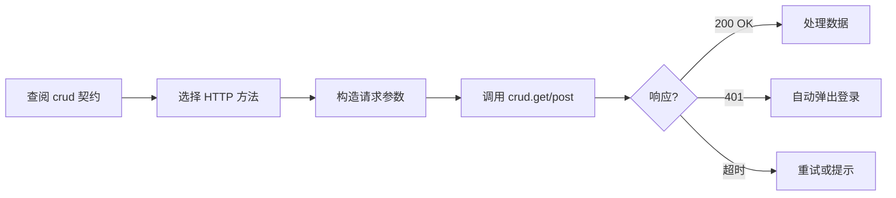
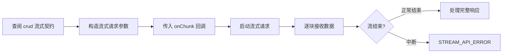
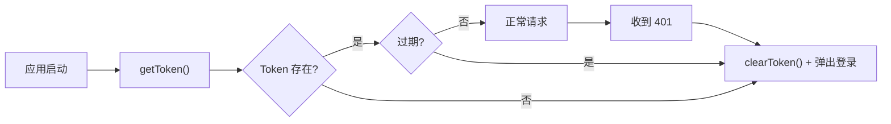
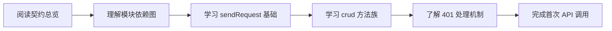

> | v1.0.0 | 2026-05-22 | deepseek-v4-pro | 🌿 feat/api-contract-definition | ⏱️ — | 📎 [CLAUDE.md](../../../CLAUDE.md) |

> **导航**: [← YiWeb-故事任务](./YiWeb-故事任务.md) · [YiWeb-技术评审 →](./YiWeb-技术评审.md)

> **来源引用**: 基于 [YiWeb-故事任务](./YiWeb-故事任务.md) §1 Story 1–4。

---

### 主要价值

- 🎯 覆盖三种调用方角色 — 视图开发者、服务开发者、新成员
- 🔒 异常路径可见 — 每场景含 401/超时/网络错误处理
- ⚡ 契约即参考 — 场景中每个 API 调用可追溯到契约文档
- 📊 场景覆盖矩阵 — 显式溯源至 FP#

---

## §1 使用场景

### 场景 1: 视图开发者调用 CRUD 接口

**角色**: 视图开发者
**目标**: 在 createBaseView methods 中正确调用后端 API

| 步骤 | 操作 | 预期结果 |
|------|------|---------|
| 1 | 查阅 crud 契约文档，找到 `get(url, params, options)` 签名 | 了解 params 序列化为 query string，options 含 cache/timeout/withAuth |
| 2 | 在 methods 中调用 `window.crudGet('/api/sessions', { limit: 10 })` | 返回 `{ data: [...], total: N }` |
| 3 | 处理 401 错误（自动触发登录弹窗） | 用户登录后重试 |

---

### 场景 2: 流式聊天请求

**角色**: 视图开发者
**目标**: 正确调用流式 API 并处理分块响应

---

### 场景 3: Token 过期处理

**角色**: 视图开发者
**目标**: 理解 Token 生命周期，正确处理过期场景

---

### 场景 4: 新成员接入 API 层

**角色**: 新加入项目的开发者
**目标**: 30 分钟内理解 API 层架构并完成首次 API 调用

---

## §2 场景覆盖矩阵

| 场景 | 关联 FP# | 关联 AC# | 正常路径 | 空状态 | 错误恢复 |
|------|---------|---------|:--:|:--:|:--:|
| 场景 1: CRUD 调用 | FP1, FP2 | AC1, AC2 | ✅ | ✅ | ✅ |
| 场景 2: 流式请求 | FP2 | AC2 | ✅ | — | ✅ |
| 场景 3: Token 过期 | FP3, FP4 | AC3 | ✅ | ✅ | ✅ |
| 场景 4: 新成员接入 | FP5, FP6 | AC4 | ✅ | — | — |

---

> **变更记录**
> | 日期 | 变更 | 触发 | 证据 |
> |------|------|------|------|
> | 2026-05-22 | 初始生成 | /rui doc | YiWeb-故事任务 §1 |
