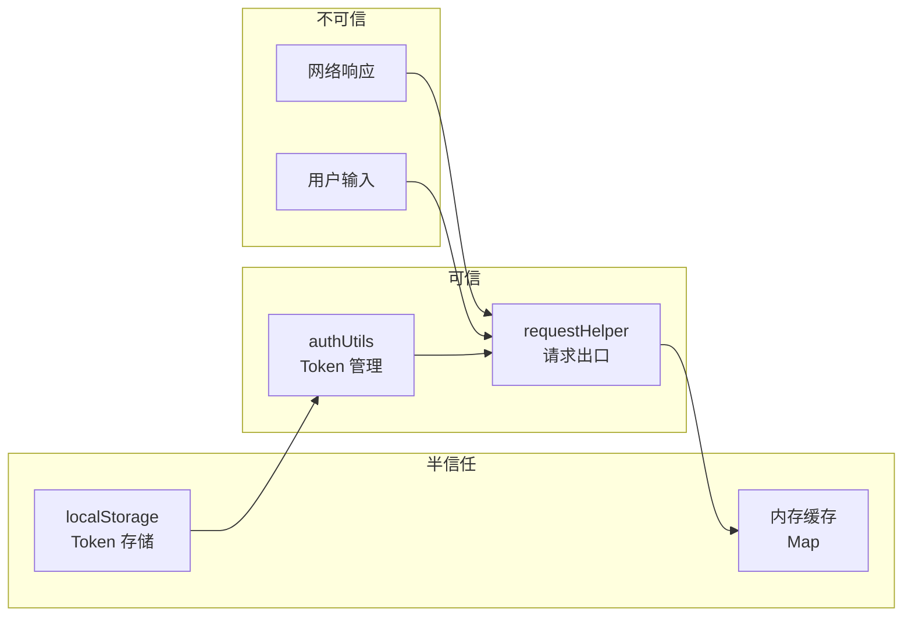

> | v1.0.0 | 2026-05-22 | deepseek-v4-pro | 🌿 feat/api-contract-definition | ⏱️ — | 📎 [CLAUDE.md](../../../CLAUDE.md) |

> **导航**: [← YiWeb-技术评审](./YiWeb-技术评审.md) · [YiWeb-实施报告 →](./YiWeb-实施报告.md)

> **来源引用**: 基于 [YiWeb-技术评审](./YiWeb-技术评审.md) §2–§6 接口契约分析。

> **独立审计标记**: 本审计由 security agent 独立执行，不依赖 coder 自评。

---

### 主要价值

- 🎯 契约安全 — 审计每个公开接口的安全属性（认证/输入/错误处理）
- 🔒 STRIDE 全覆盖 — 六类威胁逐项建模，每项有缓解
- ⚡ 最小权限 — 验证每个方法的最小必要权限
- 📊 合规 6 项全查 — 依赖许可证/数据处理/凭证/日志/第三方/更新

---

## §1 资产识别

| 资产 | 敏感度 | 风险 |
|------|:--:|------|
| X-Token (localStorage) | 高 | 泄漏导致未授权 API 访问 |
| API_URL 配置 | 中 | 篡改导致请求被重定向 |
| 缓存数据 (crud cache) | 中 | 内存缓存含敏感数据时可能泄漏 |
| fetch 请求/响应 | 中 | 中间人攻击可窃听 |
| 流式数据 chunks | 中 | 中断或注入 |

---

## §2 STRIDE 威胁建模

### S — Spoofing（身份伪造）

| 威胁 | 缓解 |
|------|------|
| 伪造 X-Token 头 | Token 由服务端签发和验证，客户端仅传递 |
| 伪造 API 响应 | HTTPS 传输，服务端证书验证 |

### T — Tampering（数据篡改）

| 威胁 | 缓解 |
|------|------|
| 缓存数据被篡改 | 缓存仅存于内存 Map，不可从外部写入 |
| 请求体被中间人篡改 | HTTPS 传输 |
| window 全局方法被覆盖 | 契约文档标注调用方式，敏感方法考虑 Object.freeze |

### R — Repudiation（否认）

| 威胁 | 缓解 |
|------|------|
| API 调用无审计 | 后端记录请求日志，含 X-Token 身份 |
| Token 操作无审计 | clearToken/setToken 可记录到日志 |

### I — Information Disclosure（信息泄漏）

| 威胁 | 缓解 |
|------|------|
| Token 通过 URL 参数泄漏 | Token 仅通过 X-Token 头传递，不放入 URL |
| 缓存含敏感数据驻留内存 | clearCache 提供清空机制；页面关闭时自动释放 |
| 错误响应泄漏后端信息 | 契约约定错误格式，不暴露后端堆栈 |
| console.log 打印 Token | 日志模块 logInfo 使用时应过滤敏感字段 |

### D — Denial of Service（拒绝服务）

| 威胁 | 缓解 |
|------|------|
| 缓存无限增长耗尽内存 | 最大 100 条目 + 5 分钟 TTL 自动淘汰 |
| 无限制重试循环 | requestHelper 不自动重试，由调用方决定 |
| 流式请求无限挂起 | AbortController + timeout 双重保护 |

### E — Elevation of Privilege（权限提升）

| 威胁 | 缓解 |
|------|------|
| withAuth=false 绕过认证 | 仅用于明确标注的公开接口，后端仍需验证 |
| Token 过期后仍可读取 | isTokenExpired 判定 JWT exp，过期返回 true |

---

## §3 信任边界

---

## §4 缓解措施

| 措施 | 优先级 | 实施 |
|------|:--:|------|
| credentials: 'omit' | P0 | 所有请求默认不携带 Cookie |
| X-Token 头传递 | P0 | Token 仅通过自定义头，不放入 Cookie 或 URL |
| HTTPS 传输 | P0 | prod 环境 API_URL 使用 https:// |
| 缓存限制 | P1 | 最大 100 条目 + TTL 5 分钟 |
| 超时保护 | P1 | 默认 5 分钟超时，可配置 |
| 敏感信息不过日志 | P1 | 日志记录时脱敏 X-Token 值 |

---

## §5 合规检查

| 检查项 | 状态 | 说明 |
|------|:--:|------|
| 依赖许可证 | N/A | 无外部依赖 |
| 个人数据处理 | ⚠️ | Token 存于 localStorage，需确认符合隐私政策 |
| 凭证管理 | ✅ | Token 不写入 Cookie，不暴露到 URL |
| 日志保留 | ⚠️ | window.logInfo 输出到浏览器控制台，生产环境应抑制 |
| 第三方审计 | N/A | 无第三方 API 调用 |
| 安全更新 | N/A | 无外部依赖 |

---

> **变更记录**
> | 日期 | 变更 | 触发 | 证据 |
> |------|------|------|------|
> | 2026-05-22 | 初始审计 — 独立执行 | /rui doc security agent | YiWeb-技术评审 §2–§6 |
