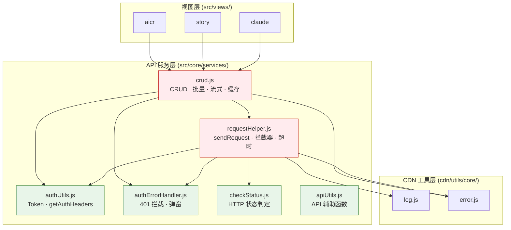
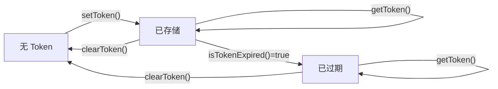
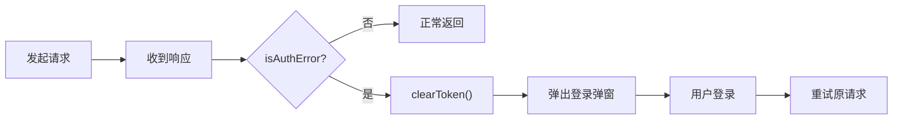

> | v1.0.0 | 2026-05-22 | deepseek-v4-pro | 🌿 feat/api-contract-definition | ⏱️ — | 📎 [CLAUDE.md](../../../CLAUDE.md) |

> **导航**: [← YiWeb-使用场景](./YiWeb-使用场景.md) · [YiWeb-测试设计 →](./YiWeb-测试设计.md) · [YiWeb-安全审计 →](./YiWeb-安全审计.md)

> **来源引用**: 基于 [YiWeb-故事任务](./YiWeb-故事任务.md) §2 + `src/core/services/` 源码只读分析。

[§0 基线溯源](#sec0-baseline) · [§1 模块依赖图](#sec1-deps) · [§2 接口契约: requestHelper](#sec2-request) · [§3 接口契约: crud](#sec3-crud) · [§4 接口契约: authUtils](#sec4-auth) · [§5 接口契约: authErrorHandler](#sec5-error) · [§6 错误码映射表](#sec6-errors)

---

### 主要价值

- 🎯 12+15+8+5 = 40 个公开方法接口契约完整
- 🔒 11 种错误码全部含触发条件和调用方应对
- ⚡ 模块依赖图可视化，修改影响面一目了然
- 📊 每个接口含调用示例，可直接复制使用

---

## §0 基线溯源

| 溯源目标 | 本文档章节 |
|---------|-----------|
| FP1: requestHelper 契约 | §2 |
| FP2: crud 契约 | §3 |
| FP3: authUtils 契约 | §4 |
| FP4: authErrorHandler 契约 | §5 |
| FP5: 模块依赖图 | §1 |

---

## §1 模块依赖图

| 模块 | 角色 | 被依赖数 | 说明 |
|------|:--:|:--:|------|
| requestHelper.js | Hub | 1 (crud) + 视图直接调用 | 所有 HTTP 请求的单一出口 |
| crud.js | Hub | 3+ (所有视图) | 业务层请求封装，含缓存 |
| authUtils.js | Leaf | 2 (requestHelper + crud) | Token 管理 |
| authErrorHandler.js | Leaf | 2 (requestHelper + crud) | 401 统一处理 |

---

## §2 接口契约: requestHelper.js

> 源码: `src/core/services/helper/requestHelper.js:79` | 6 个公开方法

### sendRequest(url, options)

核心请求方法，所有其他方法的基础。

| 字段 | 类型 | 必填 | 说明 |
|------|------|:--:|------|
| url | string | ✅ | 请求 URL（相对或绝对） |
| options.method | string | — | HTTP 方法，默认 GET |
| options.body | object\|string | — | 请求体，对象自动 JSON.stringify |
| options.headers | object | — | 合并到默认头 |
| options.timeout | number | — | 超时毫秒，默认 300000 (5min) |
| options.withAuth | boolean | — | 是否携带 X-Token 头，默认 true |
| options.signal | AbortSignal | — | 外部取消信号 |

**返回值**: `Promise<{ data, status, headers }>`  
**错误码**: AUTH_401 / HTTP_ERROR / REQUEST_TIMEOUT / NETWORK_FETCH_FAILED / CORS_BLOCKED

### 快捷方法

| 方法 | 等价调用 | 说明 |
|------|---------|------|
| `getRequest(url, params, options)` | `sendRequest(url + '?' + qs(params), { method: 'GET', ...options })` | GET 请求 |
| `postRequest(url, data, options)` | `sendRequest(url, { method: 'POST', body: data, ...options })` | POST 请求 |
| `putRequest(url, data, options)` | `sendRequest(url, { method: 'PUT', body: data, ...options })` | PUT 请求 |
| `patchRequest(url, data, options)` | `sendRequest(url, { method: 'PATCH', body: data, ...options })` | PATCH 请求 |
| `deleteRequest(url, options)` | `sendRequest(url, { method: 'DELETE', ...options })` | DELETE 请求 |

**全局可用**: `window.getRequest`, `window.postRequest` 等（通过 window 全局挂载）

---

## §3 接口契约: crud.js

> 源码: `src/core/services/modules/crud.js` | 15 个公开方法

### 基础 CRUD

| 方法 | 签名 | 缓存 |
|------|------|:--:|
| `crudGet(url, params, options)` | `(string, object?, object?) => Promise<object>` | ✅ 5min TTL |
| `crudPost(url, data, options)` | `(string, object, object?) => Promise<object>` | — |
| `crudPut(url, data, options)` | `(string, object, object?) => Promise<object>` | — |
| `crudPatch(url, data, options)` | `(string, object, object?) => Promise<object>` | — |
| `crudDelete(url, options)` | `(string, object?) => Promise<object>` | — |

**options 扩展字段**:

| 字段 | 类型 | 说明 |
|------|------|------|
| cache | boolean | 是否启用缓存，GET 默认 true |
| ttl | number | 缓存 TTL 毫秒，默认 300000 |
| withAuth | boolean | 是否携带认证头，默认 true |

### 批量操作

| 方法 | 签名 | 说明 |
|------|------|------|
| `crudBatch(requests, options)` | `(Array<{method,url,data}>, object?) => Promise<Array>` | 并行批量请求 |
| `crudSerial(requests, options)` | `(Array<{method,url,data}>, object?) => Promise<Array>` | 串行批量请求 |

### 流式请求

| 方法 | 签名 | 说明 |
|------|------|------|
| `crudStream(url, data, callbacks, options)` | 流式 POST | callbacks: `{ onChunk, onDone, onError }` |

### 缓存管理

| 方法 | 签名 | 说明 |
|------|------|------|
| `clearCache(pattern?)` | `(string?) => void` | 清除缓存，pattern 为空则清空全部 |
| `getCacheStats()` | `() => { size, entries }` | 缓存统计 |

### 查询方法

| 方法 | 签名 | 说明 |
|------|------|------|
| `queryDocuments(cname, query, options)` | `(string, object?, object?) => Promise<object>` | POST 查询，封装为统一文档查询接口 |

---

## §4 接口契约: authUtils.js

> 源码: `src/core/services/helper/authUtils.js` | 8 个公开方法

### Token 生命周期状态机

| 方法 | 签名 | 说明 |
|------|------|------|
| `getToken()` | `() => string\|null` | 从 localStorage 读取 Token |
| `setToken(token)` | `(string) => void` | 写入 Token 到 localStorage |
| `clearToken()` | `() => void` | 清除 localStorage 中的 Token |
| `isTokenExpired()` | `() => boolean` | JWT exp 字段判定是否过期 |
| `getAuthHeaders()` | `() => { 'X-Token': string } \| {}` | 返回认证请求头对象 |
| `getStoredModel()` | `() => string\|null` | 读取用户选择的模型 |

---

## §5 接口契约: authErrorHandler.js

> 源码: `src/core/services/helper/authErrorHandler.js`

| 方法 | 签名 | 说明 |
|------|------|------|
| `isAuthError(status, body)` | `(number, object?) => boolean` | 判定是否为认证错误（401 或 body.code === AUTH_401） |
| `handle401Error(response)` | `(Response) => void` | 触发登录弹窗，清除过期 Token |

### 401 处理流程

---

## §6 错误码映射表

| ErrorCode | 触发条件 | HTTP 状态 | 调用方应对 |
|-----------|---------|:--:|------|
| AUTH_401 | Token 过期或无效 | 401 | 等待登录弹窗，用户登录后重试 |
| HTTP_ERROR | 非 2xx 且非 401 | 4xx/5xx | 显示错误提示 |
| REQUEST_TIMEOUT | 请求超过 timeout 配置 | — | 重试或提示用户检查网络 |
| NETWORK_FETCH_FAILED | fetch 抛出 TypeError | — | 提示用户检查网络连接 |
| CORS_BLOCKED | CORS 策略阻止 | — | 检查 API_URL 配置 |
| STREAM_API_ERROR | 流式请求中后端返回错误 | 200 | 显示流式错误消息 |
| STREAM_PARSE_FAILED | 流式数据 JSON 解析失败 | 200 | 忽略该 chunk 或降级处理 |
| COMPONENT_LOAD_TIMEOUT | CDN 组件加载超时 | — | 显示加载失败占位 |
| MODULE_LOAD_FAILED | ESM import 失败 | — | 显示模块加载错误 |
| TEMPLATE_FETCH_FAILED | HTML 模板请求失败 | — | 显示组件加载失败 |

---

> **变更记录**
> | 日期 | 变更 | 触发 | 证据 |
> |------|------|------|------|
> | 2026-05-22 | 初始生成 — 源码只读分析 | /rui doc | src/core/services/ 源码 |
