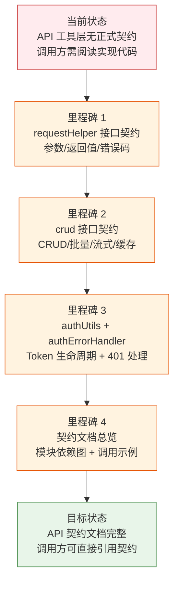

> | v1.0.0 | 2026-05-22 | deepseek-v4-pro | 🌿 feat/api-contract-definition | ⏱️ — | 📎 [CLAUDE.md](../../../CLAUDE.md) |

> **导航**: [YiWeb-使用场景 →](./YiWeb-使用场景.md)

> **来源引用**: 由 L-1 基建完整性检查触发 — I5（API 契约）不完整。API 工具层（requestHelper/crud/authUtils）已存在但无正式契约定义（OpenAPI/Swagger/类型定义）。基于 `/rui doc "API 契约定义"` 生成。

[§1 Story](#sec1-story) · [§2 Requirements](#sec2-requirements) · [§3 成功标准](#sec3-success) · [§4 范围边界](#sec4-scope) · [§5 AC](#sec5-ac) · [§6 风险与假设](#sec6-risks)

---

### §0 基线声明

> **问题空间基线**: 本文档定义"做什么(WHAT)"和"为什么(WHY)"。

---

### 需求概述

为 YiWeb 的 API 服务层建立正式契约定义。当前 `src/core/services/` 下的 requestHelper、crud、authUtils、authErrorHandler、apiUtils 模块已有完整实现但缺乏正式的接口契约文档。需要为每个模块的公开接口建立类型定义、参数约束、返回值约定和错误码映射，使调用方无需阅读实现即可正确使用 API 层。

### 效果示意

### 主要价值

- 🎯 调用方可契约编程 — 不需要阅读实现代码即可正确使用 API 层
- 🔒 错误码可枚举 — 所有可能的错误码和触发条件明确文档化
- ⚡ 契约即文档 — 每个接口的参数/返回值/副作用显式声明
- 📊 依赖图可见 — 模块间调用关系透明，修改影响面可评估

---

## §1 Story

### Story 1: requestHelper 接口契约

| 字段 | 内容 |
|------|------|
| 作为 | API 调用方开发者 |
| 我想要 | 一份 requestHelper 的正式接口契约 |
| 以便 | 知道如何发起请求、配置超时/认证/重试、处理各种错误 |
| 优先级 | P0 |
| 范围边界 | `src/core/services/helper/requestHelper.js` 公开接口 |
| 依赖 | 无 |

### Story 2: crud 接口契约

| 字段 | 内容 |
|------|------|
| 作为 | API 调用方开发者 |
| 我想要 | 一份 crud 模块的正式接口契约 |
| 以便 | 了解 CRUD/批量/流式/缓存操作的参数和返回值 |
| 优先级 | P0 |
| 范围边界 | `src/core/services/modules/crud.js` 公开接口 |
| 依赖 | Story 1 完成 |

### Story 3: authUtils + authErrorHandler 契约

| 字段 | 内容 |
|------|------|
| 作为 | API 调用方开发者 |
| 我想要 | 认证和错误处理模块的正式契约 |
| 以便 | 理解 Token 生命周期管理和 401 拦截行为 |
| 优先级 | P1 |
| 范围边界 | `authUtils.js` + `authErrorHandler.js` + `checkStatus.js` |
| 依赖 | Story 1 完成 |

### Story 4: API 契约文档总览

| 字段 | 内容 |
|------|------|
| 作为 | 新加入项目的开发者 |
| 我想要 | 一份 API 层的总览文档 |
| 以便 | 快速理解模块依赖关系、调用模式和典型用例 |
| 优先级 | P1 |
| 范围边界 | `src/core/services/` 全部模块 |
| 依赖 | Story 1–3 完成 |

---

## §2 Requirements

### 功能点

| FP# | 描述 | 输入 | 输出 | 优先级 |
|-----|------|------|------|--------|
| FP1 | requestHelper 契约 — sendRequest(url, options) 签名/参数约束/返回值类型/错误码表 | 源码 | 契约文档（类型定义 + 错误码表 + 调用示例） | P0 |
| FP2 | crud 契约 — get/post/put/patch/delete 系列方法签名/缓存策略/流式请求/批量操作 | 源码 | 契约文档（方法签名 + 缓存 TTL + 流式接口） | P0 |
| FP3 | authUtils 契约 — Token 存储/读取/清除/过期判定/getAuthHeaders/getStoredModel | 源码 | 契约文档（Token 生命周期状态机 + 方法签名） | P1 |
| FP4 | authErrorHandler 契约 — 401 拦截/isAuthError/handle401Error | 源码 | 契约文档（401 处理流程图 + 接口签名） | P1 |
| FP5 | 模块依赖图 — import 关系 + 数据流向 | 源码 import 语句 | mermaid 依赖图 | P1 |
| FP6 | 契约总览文档 — 模块索引 + 典型调用链 + 新模块接入指南 | 源码 + FP1–FP5 | 总览文档 | P2 |

### 业务规则

| R# | 描述 | 来源 |
|----|------|------|
| R1 | 所有请求默认 `credentials: 'omit'`，不携带 Cookie | CLAUDE.md 安全约束 |
| R2 | 认证通过 `X-Token` 请求头传递，存储于 localStorage | CLAUDE.md 安全约束 |
| R3 | 请求超时默认 5 分钟，可配置覆盖 | requestHelper.js DEFAULT_CONFIG |
| R4 | 缓存默认 TTL 5 分钟，最大 100 条目 | crud.js CACHE_CONFIG |
| R5 | 401 错误统一走 authErrorHandler，触发登录弹窗 | 项目约定 |

---

## §3 成功标准

| SC# | 描述 | 度量方式 | 目标值 | 关联 FP# |
|-----|------|---------|--------|---------|
| SC1 | requestHelper 12 个公开方法的契约完整 | 每个方法含签名/参数/返回值/错误码 | 12/12 | FP1 |
| SC2 | crud 15 个公开方法的契约完整 | 每个方法含签名/参数/返回值/缓存策略 | 15/15 | FP2 |
| SC3 | 认证模块 Token 生命周期状态机完整 | 含存储/读取/过期/清除 4 状态 + 转移条件 | 4 状态全覆盖 | FP3 |
| SC4 | 错误码表覆盖全部 ErrorCodes 枚举 | 每个 ErrorCode 含触发条件和调用方应对 | 11/11 | FP1, FP4 |
| SC5 | 模块依赖图覆盖全部 services 模块 | mermaid flowchart 含 import 方向 | 100% 覆盖 | FP5 |

---

## §4 范围边界

**范围内**: `src/core/services/` 全部模块的公开接口契约文档
**范围外**: 后端 API 实现（那是另一个项目）、CDN 组件接口、视图层 API

---

## §5 AC

| AC# | Given | When | Then | 门禁 |
|-----|-------|------|------|------|
| AC1 | 开发者需要调用 requestHelper | 查阅契约文档 | 可找到 sendRequest 签名/参数表/返回值/错误码，无需读源码 | Gate A |
| AC2 | 开发者需要调用 crud | 查阅契约文档 | 可找到全部 CRUD 方法签名，含缓存行为和流式接口参数 | Gate A |
| AC3 | 开发者需理解 Token 管理 | 查阅契约文档 | 可找到 Token 生命周期状态机和 getAuthHeaders 用法 | Gate A |
| AC4 | 新人加入项目 | 查阅契约总览 | 可理解 API 层模块依赖关系和典型调用链 | Gate B |

---

## §6 风险与假设

| # | 风险/假设 | 类型 | 可能性 | 影响 | 缓解 |
|---|----------|------|:--:|:--:|------|
| 1 | API 实现变更导致契约过时 | 风险 | M | M | 契约文档标注对应源码行号，code review 时检查契约同步 |
| 2 | 契约文档不完整遗漏边缘方法 | 风险 | L | L | 逐方法检查 exports，交叉验证 |
| 3 | requestHelper/crud 的 window 全局挂载模式与标准 ESM 不一致 | 假设 | — | — | 文档标注 window 全局可用 + import 两种调用方式 |

**产出**: `docs/故事任务面板/api-contract-definition/YiWeb-{故事任务,使用场景,技术评审,测试设计,安全审计}.md`

---

> **变更记录**
> | 日期 | 变更 | 触发 | 证据 |
> |------|------|------|------|
> | 2026-05-22 | 初始生成 — L-1 基建补齐推荐 | /rui doc "API 契约定义" | CLAUDE.md + L-1 I5 检查 |
