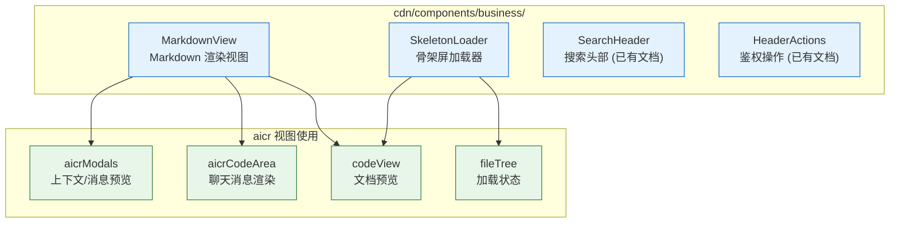

> | v1 | 2026-05-19 | deepseek-v4-pro | 🌿 feat/cdn-components | ⏱️ --:--–--:-- | 📎 [CLAUDE.md](../../../CLAUDE.md) |

> **来源引用**: 本文档由 `/rui doc --from-code cdn/components/business/` 触发，从源码反推生成。证据等级 B（可推导，附源码路径）。

---

### §0 基线声明

> **问题空间基线 (Problem Space Baseline)**: 本文档定义"做什么(WHAT)"和"为什么(WHY)"。所有后续文档(04-05)的设计、验证决策均必须可追溯至本文档的具体章节。

---

### 需求概述

`cdn/components/business/` 下的 CDN 业务组件是跨视图共享的基础设施。本次覆盖两个零文档覆盖的组件：

- **MarkdownView** — AI 对话消息与文档预览的 Markdown 渲染组件，封装 10 插件渲染管线
- **SkeletonLoader** — 页面加载占位组件，提供文件树/代码视图/聊天面板三种骨架屏变体

### 页面组件分布

---

### §1 Story

| 字段 | 内容 |
|------|------|
| 作为 | 开发者 / 组件使用者 |
| 我想要 | MarkdownView 提供一致的 Markdown 渲染能力，SkeletonLoader 提供统一的加载占位体验 |
| 以便 | 不同视图下 Markdown 渲染行为一致，加载状态过渡自然 |
| 优先级 | P1 |
| 范围边界 | 仅 MarkdownView 和 SkeletonLoader 两个 CDN 业务组件，不涉及 SearchHeader 和 HeaderActions |
| 依赖 | `/cdn/markdown/index.js` 渲染器（MarkdownView） |

#### §1.1 User Operations

| # | 操作 | 触发条件 | 操作步骤 | 预期结果 |
|---|------|---------|---------|---------|
| 1 | 渲染 Markdown 内容 | 传入 content prop | 1. 组件接收 content 字符串 2. 根据 mode 选择渲染策略 3. 输出 HTML | 内容正确渲染为 HTML，支持 GFM/换行 |
| 2 | 流式渲染 AI 回复 | mode='streaming' | 1. content 持续更新 2. 流式渲染函数实时输出 | 增量内容实时显示，无闪烁 |
| 3 | 显示文件树骨架屏 | variant='file-tree' | 1. 传入 item-count 2. 组件渲染搜索框+树项骨架 | 显示随机宽度的文件树占位 |
| 4 | 显示代码视图骨架屏 | variant='code-view' | 1. 传入 line-count 2. 组件渲染代码行骨架 | 显示行号+代码行占位 |
| 5 | 显示聊天面板骨架屏 | variant='chat-panel' | 1. 传入 message-count 2. 组件渲染消息列表骨架 | 显示头像+消息气泡占位 |

---

### §2 Requirements

#### 功能点

| FP# | 描述 | 输入 | 输出 | 错误行为 | 优先级 |
|-----|------|------|------|---------|--------|
| FP1 | Markdown 静态渲染 | content 字符串 | 完整 HTML | 空 content 返回空字符串 | P0 |
| FP2 | Markdown 流式渲染 | content 字符串 + mode='streaming' | 增量 HTML | 同 FP1 | P1 |
| FP3 | GFM 支持 | gfm=true | 表格/任务列表/删除线 | — | P1 |
| FP4 | 换行支持 | breaks=true | 单换行转 ` ` | — | P2 |
| FP5 | TOC 生成 | showToc=true | 自动生成目录 | — | P2 |
| FP6 | 文件树骨架屏 | variant='file-tree' + item-count | 搜索框 + N 个树项骨架 | 无 item-count 时显示默认数量 | P1 |
| FP7 | 代码视图骨架屏 | variant='code-view' + line-count | 代码头部 + N 个代码行骨架 | 无 line-count 时显示默认数量 | P1 |
| FP8 | 聊天面板骨架屏 | variant='chat-panel' + message-count | 消息列表 + 输入框骨架 | 无 message-count 时显示默认数量 | P2 |

#### 业务规则

| R# | 描述 | 校验方式 | 证据级别 |
|----|------|---------|---------|
| R1 | MarkdownView 在 mode='streaming' 时调用 renderStreamingHtml，否则调用 renderMarkdownHtml | 代码审查 | B |
| R2 | SkeletonLoader 通过 variant prop 切换三种布局，未匹配时显示空白 | 界面检查 | B |
| R3 | 骨架屏项的宽/缩进使用随机值，模拟真实内容的不规则性 | 界面检查 | B |

#### 数据约束

| 约束 | 类型 | 范围/格式 | 来源 |
|------|------|----------|------|
| content | String/Number/Object/Array | 任意值，null 转空字符串 | 父组件传入 |
| mode | String | 'markdown' 或 'streaming' | 父组件传入 |
| variant | String | 'file-tree' / 'code-view' / 'chat-panel' | 父组件传入 |
| item-count | Number | 正整数 | 父组件传入 |
| line-count | Number | 正整数 | 父组件传入 |
| message-count | Number | 正整数 | 父组件传入 |

---

### §3 成功标准

| SC# | 描述 | 度量方式 | 目标值 | 优先级 | 关联 FP# |
|-----|------|---------|--------|--------|----------|
| SC1 | Markdown 渲染在 500ms 内完成（10KB 内容） | 渲染耗时测量 | ≤ 500ms | P0 | FP1 |
| SC2 | 流式渲染增量更新无全量重绘 | 视觉观察 + DOM 变更记录 | 仅变更部分更新 | P1 | FP2 |
| SC3 | 骨架屏在组件挂载后立即显示，无闪烁 | 视觉观察 | 0 闪烁 | P1 | FP6, FP7 |

---

### §4 范围边界

#### 范围内

| # | 条目 | 关联 FP# | 边界说明 |
|---|------|---------|---------|
| 1 | Markdown 静态与流式渲染 | FP1, FP2 | 封装 cdn/markdown 渲染器 |
| 2 | 三种骨架屏变体 | FP6, FP7, FP8 | 文件树/代码视图/聊天面板 |
| 3 | GFM、换行、TOC 选项 | FP3, FP4, FP5 | 通过 props 控制 |

#### 范围外

| # | 条目 | 排除原因 |
|---|------|---------|
| 1 | Markdown 渲染器核心逻辑 | 属于 `/cdn/markdown/` 模块，非组件职责 |
| 2 | SearchHeader / HeaderActions 文档化 | 已有独立文档 |
| 3 | 骨架屏动画/颜色定制 | 当前无此需求 |

---

### §5 AC

| AC# | Given | When | Then | 门禁 |
|-----|-------|------|------|------|
| AC1 | content 为有效 Markdown 字符串 | 传入 MarkdownView | 渲染为正确 HTML | Gate A |
| AC2 | content 持续追加（模拟流式） | mode='streaming' | 内容增量更新 | Gate A |
| AC3 | content 为空或 null | 传入 MarkdownView | 渲染空字符串，无报错 | Gate A |
| AC4 | variant='file-tree', item-count=10 | 挂载 SkeletonLoader | 显示 10 个树项骨架 | Gate A |
| AC5 | variant='code-view', line-count=25 | 挂载 SkeletonLoader | 显示 25 行代码骨架 | Gate A |
| AC6 | variant='chat-panel', message-count=5 | 挂载 SkeletonLoader | 显示 5 条消息骨架 | Gate A |
| AC7 | variant 为未定义值 | 挂载 SkeletonLoader | 显示空白，无报错 | Gate B |

---

### §6 风险与假设

| # | 风险/假设 | 类型 | 可能性 | 影响 | 缓解/验证策略 | 关联 FP# |
|---|----------|------|--------|------|-------------|----------|
| 1 | Markdown 渲染器插件变更影响组件行为 | 风险 | L | M | 组件仅做薄封装，插件变更由渲染器模块管理 | FP1 |
| 2 | 骨架屏随机宽/缩进在不同视口下视觉效果不一致 | 风险 | L | L | CSS 约束最大/最小宽度 | FP6, FP7 |
| 3 | 两个组件仅被 aicr 视图使用 | 假设 | — | — | 按需扩展到其他视图 | — |

---

### §7 跨文档索引

| 本文档章节 | 基线内容 | 下游文档编号 | 预期覆盖 | 状态 |
|-----------|---------|------------|---------|------|
| §1 Story | CDN 业务组件文档基线 | 04-前端技术评审 | 组件接口 + 数据流 | 待生成 |
| §2 FP1-FP5 | MarkdownView 功能点 | 04-前端技术评审 | Props + 渲染策略 | 待生成 |
| §2 FP6-FP8 | SkeletonLoader 功能点 | 04-前端技术评审 | Variant + 布局 | 待生成 |
| §5 AC1-AC7 | 全部验收标准 | 05-测试用例评审 | 测试用例全覆盖 | 待生成 |

---

| 日期 | 变更 | 触发 | 证据 |
|------|------|------|------|
| 2026-05-19 | 初始文档生成 | `/rui doc --from-code cdn/components/business/` | 源码反推，Level B |
