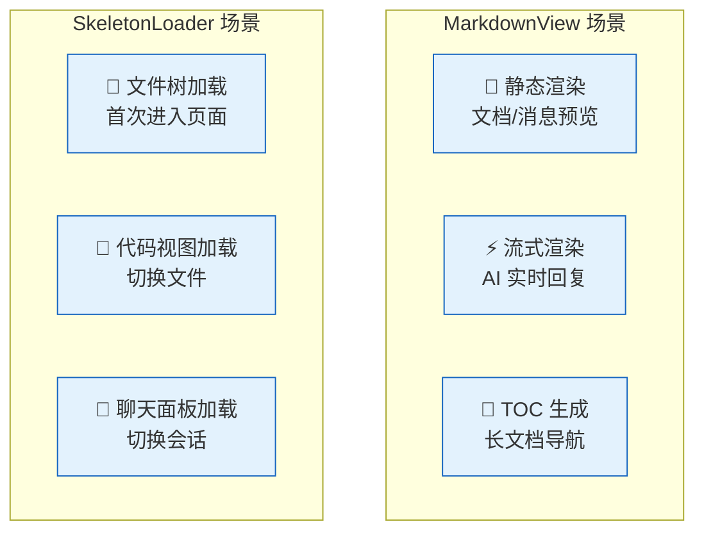
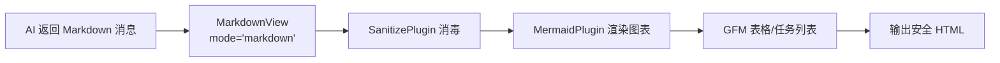
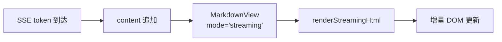
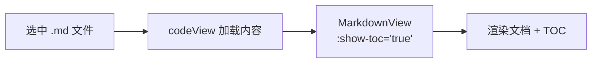
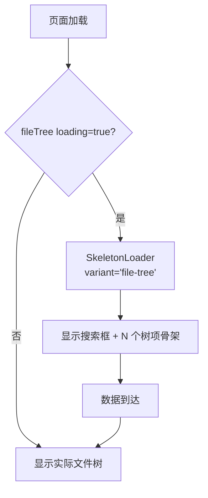
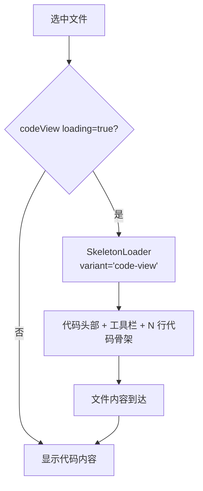
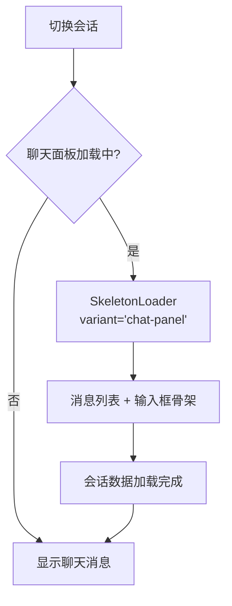

> | v1 | 2026-05-19 | deepseek-v4-pro | 🌿 feat/cdn-components |

> **来源引用**: 从 `cdn/components/business/MarkdownView/` 和 `cdn/components/business/SkeletonLoader/` 源码反推。证据等级 B。

---

### §1 用户场景总览

---

### §2 MarkdownView 用户场景

#### 场景 1：渲染聊天消息

| 步骤 | 操作 | 预期 |
|------|------|------|
| 1 | AI 返回含代码块/表格/链接的 Markdown | 消息通过 MarkdownView 渲染 |
| 2 | mode='markdown'（默认） | 调用 renderMarkdownHtml，启用 GFM |
| 3 | 内容含 Mermaid 代码块 | MermaidPlugin 渲染为 SVG 图表 |
| 4 | 内容含 HTML 标签 | SanitizePlugin 过滤危险标签 |

#### 场景 2：流式渲染 AI 回复

| 步骤 | 操作 | 预期 |
|------|------|------|
| 1 | AI 开始流式返回 | mode='streaming' 激活 |
| 2 | content prop 每收到新 token 更新 | 仅增量部分重新渲染 |
| 3 | 流式完成 | 最终内容与静态渲染一致 |

#### 场景 3：预览 Markdown 文档

| 步骤 | 操作 | 预期 |
|------|------|------|
| 1 | 用户在文件树选中 .md 文件 | codeView 获取文件内容 |
| 2 | MarkdownView 渲染，showToc=true | 显示目录导航 |
| 3 | 文档含 GFM 表格/任务列表 | gfm=true 正确渲染 |

---

### §3 SkeletonLoader 用户场景

#### 场景 4：文件树首次加载

| 步骤 | 操作 | 预期 |
|------|------|------|
| 1 | 页面初始化，文件树数据未就绪 | loading=true |
| 2 | SkeletonLoader 渲染 file-tree 变体 | 搜索框骨架 + 10 个树项（随机缩进/宽度） |
| 3 | 文件树数据加载完成 | loading=false，骨架屏替换为真实文件树 |

#### 场景 5：代码视图加载

| 步骤 | 操作 | 预期 |
|------|------|------|
| 1 | 用户点击文件名 | 触发文件内容加载 |
| 2 | 加载期间 SkeletonLoader 渲染 code-view 变体 | 文件名栏 + 工具栏 + 25 行代码骨架（行号 + 随机宽度内容） |
| 3 | 文件内容返回 | 骨架屏替换为语法高亮代码 |

#### 场景 6：切换会话聊天面板

| 步骤 | 操作 | 预期 |
|------|------|------|
| 1 | 用户点击会话标签 | 触发会话加载 |
| 2 | 加载期间 SkeletonLoader 渲染 chat-panel 变体 | 标题 + 用户/助手消息骨架（交替布局）+ 输入框骨架 |
| 3 | 会话消息加载完成 | 骨架屏替换为实际消息列表 |
