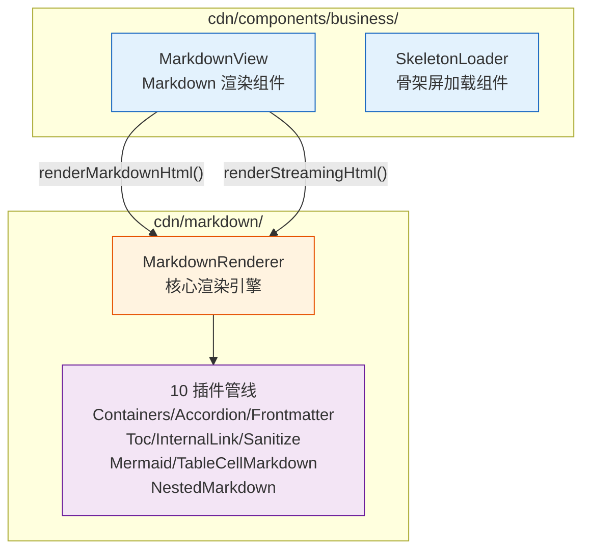
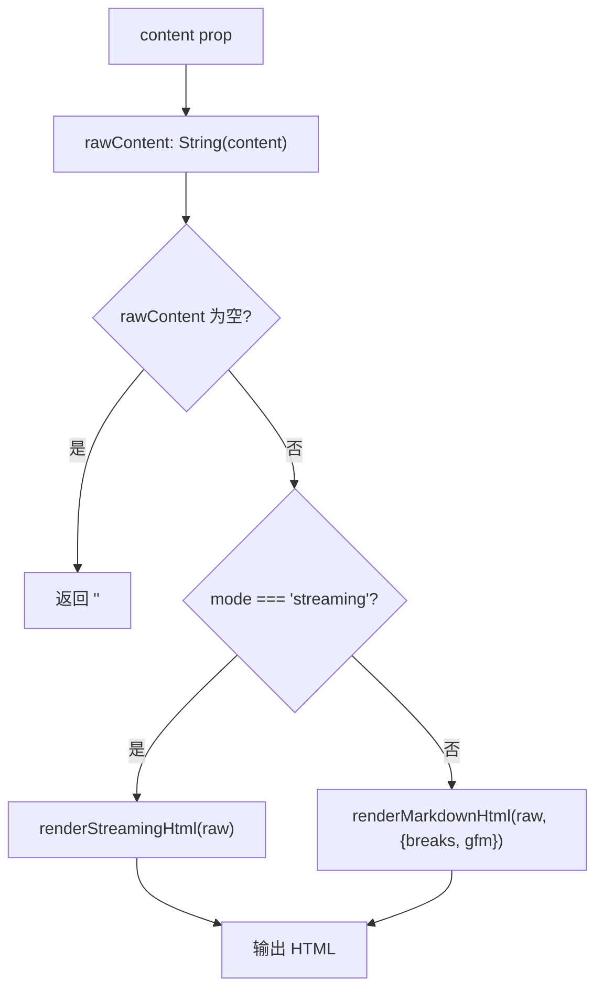
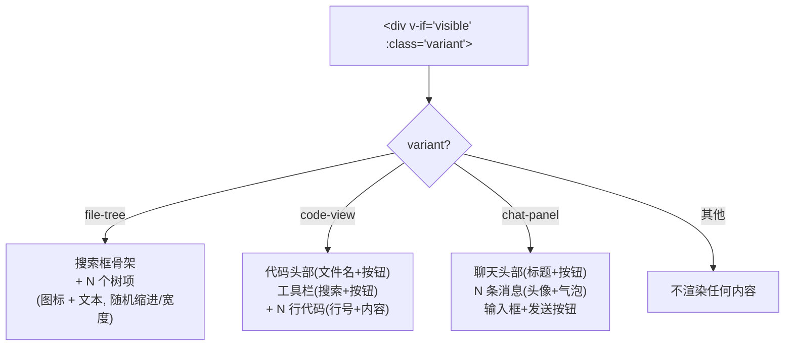
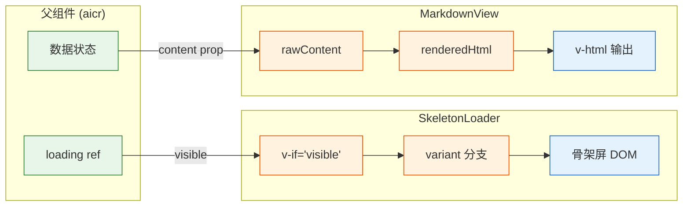

> | v1 | 2026-05-19 | deepseek-v4-pro | 🌿 feat/cdn-components |

> **来源引用**: 从 `cdn/components/business/MarkdownView/index.js`、`cdn/components/business/SkeletonLoader/` 源码反推。证据等级 B。

---

### §1 组件架构

#### §1.1 组件层级



#### §1.2 组件清单

| 组件 | 类型 | 文件数 | 来源 |
|------|------|:------:|------|
| MarkdownView | CDN 业务组件 | 1 (`index.js`) | `/cdn/components/business/MarkdownView/` |
| SkeletonLoader | CDN 业务组件 | 3 (`index.js` + `template.html` + `index.css`) | `/cdn/components/business/SkeletonLoader/` |

---

### §2 MarkdownView 接口

#### §2.1 Props

| Prop | 类型 | 默认值 | 说明 |
|------|------|--------|------|
| content | String\|Number\|Object\|Array | `''` | Markdown 原始内容，null 自动转空字符串 |
| mode | String | `'markdown'` | 渲染模式：`'markdown'`（静态）或 `'streaming'`（流式） |
| breaks | Boolean | `true` | 单换行是否转换为 `<br>` |
| gfm | Boolean | `true` | 是否启用 GitHub Flavored Markdown |
| showToc | Boolean | `false` | 是否显示目录（当前未在 template 中实现，通过 prop 传递） |

#### §2.2 Computed

| Computed | 依赖 | 返回 | 说明 |
|----------|------|------|------|
| rawContent | content | String | 将 content 安全转为字符串，null → `''` |
| renderedHtml | rawContent, mode, breaks, gfm | String | 根据 mode 选择 renderMarkdownHtml 或 renderStreamingHtml |

#### §2.3 渲染策略



#### §2.4 Template

```html
<div class="md-view">
    <div v-html="renderedHtml"></div>
</div>
```

内联模板，无外部 HTML/CSS 文件。通过 `v-html` 直接输出渲染结果。

#### §2.5 使用位置

| 父组件 | 用途 | mode | 特殊配置 |
|--------|------|------|---------|
| aicrModals | 会话上下文预览 | markdown | — |
| aicrModals | 消息编辑器预览 | markdown | — |
| aicrCodeArea | 聊天消息渲染 | markdown / streaming | 流式消息使用 streaming 模式 |
| codeView | Markdown 文件预览 | markdown | showToc=true |

---

### §3 SkeletonLoader 接口

#### §3.1 组件注册

```js
registerGlobalComponent({
    name: 'SkeletonLoader',
    html: '/cdn/components/business/SkeletonLoader/template.html',
    css: '/cdn/components/business/SkeletonLoader/index.css',
    props: {},
    emits: []
});
```

组件为空 Props 声明，所有属性通过 HTML attribute 自动绑定。

#### §3.2 隐式 Props（通过 Template 使用推断）

| Prop | 类型 | 说明 | 使用位置 |
|------|------|------|---------|
| variant | String | 骨架屏变体：`'file-tree'` / `'code-view'` / `'chat-panel'` | 根元素 `:class` |
| visible | Boolean | 是否显示骨架屏 | 根元素 `v-if` |
| itemCount | Number | file-tree 变体的骨架项数量 | `v-for="i in itemCount"` |
| lineCount | Number | code-view 变体的代码行数量 | `v-for="i in lineCount"` |
| messageCount | Number | chat-panel 变体的消息数量 | `v-for="i in messageCount"` |

#### §3.3 三种变体布局



#### §3.4 随机宽度算法

骨架屏使用随机值模拟真实内容的不规则性，方法由组件框架的 methods 提供（非 props）：

- `getRandomWidth()` — 返回 30–90% 的随机宽度
- `getRandomIndent()` — 返回 0–40px 的随机缩进（file-tree 变体）
- `getRandomLineWidth()` — 返回 40–100% 的随机宽度（code-view 变体）
- `getRandomMessageLines()` — 返回 2–5 的随机行数（chat-panel 变体）

#### §3.5 使用位置

| 父组件 | variant | Props |
|--------|---------|-------|
| codeView | code-view | `:line-count="25"` |
| fileTree | file-tree | `:item-count="10"` |

---

### §4 数据流



---

| 日期 | 变更 | 触发 | 证据 |
|------|------|------|------|
| 2026-05-19 | 初始文档生成 | `/rui doc --from-code cdn/components/business/` | 源码反推，Level B |
