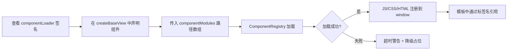
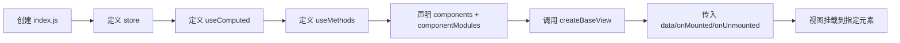
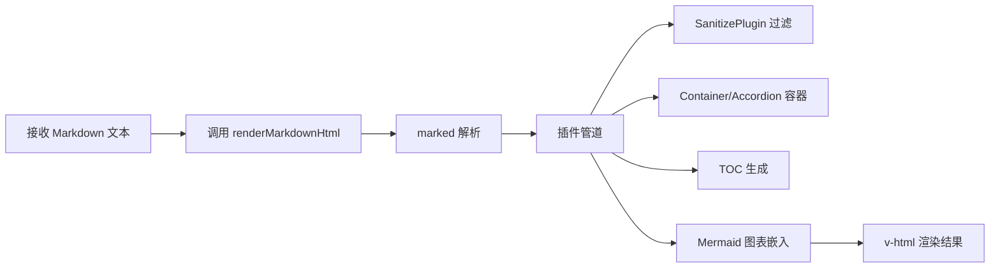
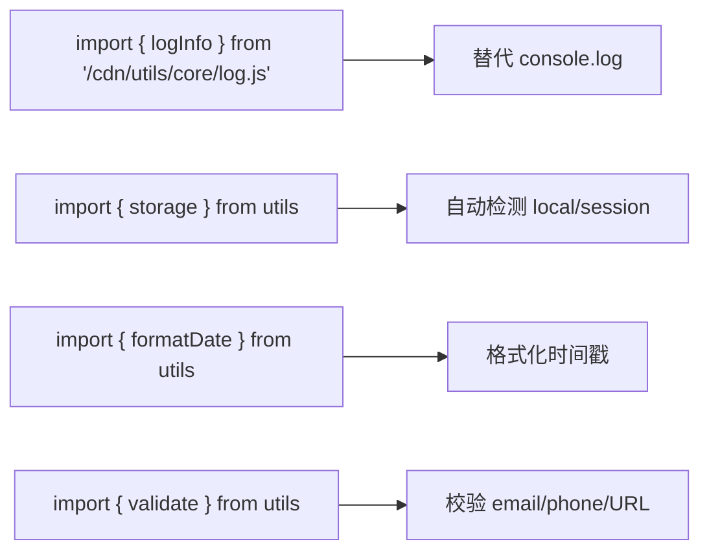

# 使用场景

> | v1.0.0 | 2026-05-26 | deepseek-v4-pro | 📎 [CLAUDE.md](../../../CLAUDE.md) |

> **来源引用**：基于 [故事任务](./故事任务.md) §2 功能点。

---

### 主要价值

- 🎯 覆盖三种角色 — 组件消费者、视图创建者、工具库使用者
- 🔒 异常路径可见 — 加载失败、注册冲突、渲染错误

---

## §1 使用场景

### 场景 1: 视图开发者引用通用组件

**角色**: 视图开发者
**目标**: 在新视图中引入 YiModal、YiTag、YiLoading 等组件

| 步骤 | 操作 | 预期结果 |
|------|------|---------|
| 1 | 在 components 数组声明 `'YiModal', 'YiButton'` | 组件名称注册 |
| 2 | 在 componentModules 数组写 CDN 路径 | 组件文件加载 |
| 3 | 在 template.html 中写 `<yi-modal ...>` | 组件渲染 |
| 4 | 查看组件 props | props 绑定生效 |

---

### 场景 2: 创建新视图

**角色**: 视图创建者
**目标**: 使用 createBaseView 创建符合规范的新视图

| 步骤 | 操作 | 预期结果 |
|------|------|---------|
| 1 | import createBaseView | 模块正常加载 |
| 2 | 定义 store = createStore() | vueRef 响应式数据 |
| 3 | 实现 useComputed(store) | computed 属性就绪 |
| 4 | 实现 useMethods(store) | methods 方法就绪 |
| 5 | createBaseView(...) | 视图初始化完成 |

---

### 场景 3: 渲染 Markdown 文档

**角色**: 组件开发者
**目标**: 使用 Markdown 引擎渲染内容，自动处理 Mermaid 图表和 XSS 过滤

---

### 场景 4: 使用工具库

**角色**: 任意开发者
**目标**: 使用日志、存储、时间、验证等工具函数

---

## §2 场景覆盖矩阵

| 场景 | 关联 FP# | 正常路径 | 错误恢复 |
|------|---------|:--:|:--:|
| 场景 1: 引用组件 | FP1, FP3–FP7 | ✅ | ✅ |
| 场景 2: 创建视图 | FP1, FP2 | ✅ | ✅ |
| 场景 3: 渲染 Markdown | FP8, FP9 | ✅ | ✅ |
| 场景 4: 使用工具 | FP12 | ✅ | — |

---

> **变更记录**
> | 日期 | 变更 | 触发 | 证据 |
> |------|------|------|------|
> | 2026-05-26 | 基线化 | 源码分析 | cdn/ |
