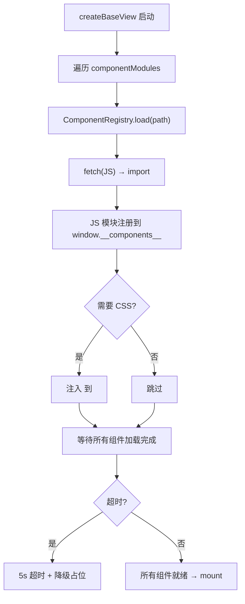

# 技术评审

> | v1.0.0 | 2026-05-26 | deepseek-v4-pro | 📎 [CLAUDE.md](../../../CLAUDE.md) |

> **来源引用**：从 `cdn/` 源码分析生成。

---

### 主要价值

- 🎯 零依赖基础设施 — 所有组件和工具自研，无 npm 包
- 🔒 组件注册系统 — ComponentRegistry 支持异步加载 + 超时/降级
- ⚡ 插件化 Markdown 引擎 — 可扩展的渲染管道

---

## §1 ComponentRegistry 注册流程



> 证据: `cdn/utils/view/componentLoader.js` · `cdn/utils/view/registry.js`

---

## §2 Markdown 引擎架构

```
renderMarkdownHtml(input, options)
  │
  ├── marked.lexer(input)           — 词法分析
  ├── plugin: FrontMatterPlugin     — 解析 YAML 头
  ├── plugin: ContainerPlugin       — tip/warning/danger/note/info/success
  ├── plugin: AccordionPlugin       — 折叠面板
  ├── plugin: TocPlugin             — 目录生成 + 滚动高亮
  ├── plugin: MermaidEmbedPlugin    — Mermaid 代码块 → 图表
  ├── plugin: InternalLinkPlugin    — 内部链接解析（相对路径）
  ├── plugin: TableMarkdownPlugin   — 表格内联 Markdown
  ├── plugin: NestMarkdownPlugin    — 嵌套代码块
  ├── marked.parser(tokens)         — 语法分析
  └── plugin: SanitizePlugin        — HTML 净化（最后执行）
```

---

## §3 组件设计模式

### 3.1 通用组件模式

```
每个组件:
  ├── index.js     — Vue 组件定义（props/emits/template/computed/methods）
  ├── index.css    — 组件样式（BEM 命名）
  └── template.html — 模板片段
```

### 3.2 组件汇总

| 类别 | 组件 | 变体 | 核心特性 |
|------|------|------|---------|
| 按钮 | YiButton | 6 variant, 2 size | button/a 双标签, loading/disabled/block |
| 按钮 | YiIconButton | 2 variant, 2 size | 图标按钮 |
| 标签 | YiTag | 6 color, 2 size | closable/clickable/active/unstyled |
| 模态框 | YiModal | 3 size | Esc关闭, 遮罩关闭, 滚动锁定 |
| 加载 | YiLoading | 4 type, 2 size | fullscreen/overlay |
| 反馈 | YiEmptyState | — | title/subtitle/hint, cardless |
| 反馈 | YiErrorState | — | message, retry按钮 |
| 表单 | YiInput | 2 size, error variant | v-model, ARIA |
| 表单 | YiSelect | 2 size, searchable | 键盘导航, click-outside |
| 表单 | YiTextarea | 2 size, resize | v-model, ARIA |

---

## §4 工具库分类

| 领域 | 文件数 | 核心能力 |
|------|--------|---------|
| browser | 2 | DOM操作, 事件处理, SearchHandler |
| core | 17 | HTTP, Error, EventBus, Log, Storage, Validation, Animation, Performance |
| data | 2 | 数据脱敏/分页/排序/CSV导出, 领域逻辑 |
| io | 1 | JSZip 导出 |
| time | 3 | 日期格式化, 时间参数, 选择器 |
| ui | 4 | Dialog, Loading, Message, Template |
| view | 3 | BaseView, ComponentLoader, Registry |

---

## §5 技术决策

| 决策 | 选择 | 原因 |
|------|------|------|
| 组件定义 | Vue Options API | 与 createBaseView 一致 |
| 组件加载 | 动态 import + fetch | ESM 原生支持，零构建 |
| 样式隔离 | BEM 类名 | 无 CSS-in-JS 运行时开销 |
| Markdown 引擎 | marked + 自研插件 | 可扩展管道 |
| Mermaid 引擎 | mermaid + 自研插件 | 主题适配 + 工具栏 |
| 图标 | Font Awesome CDN | 开箱即用 |

---

> **变更记录**
> | 日期 | 变更 | 触发 | 证据 |
> |------|------|------|------|
> | 2026-05-26 | 基线化 | 源码分析 | cdn/ |
