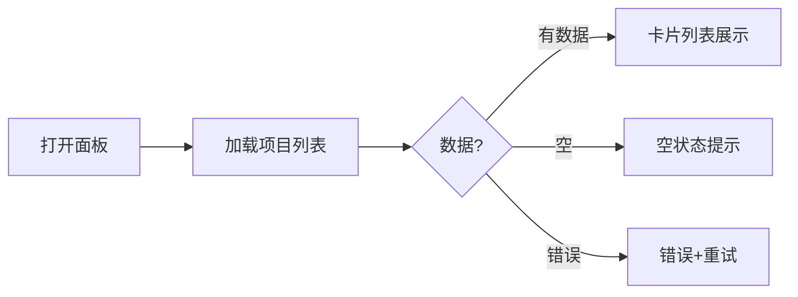
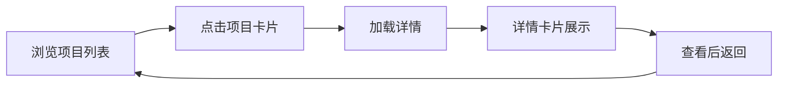

> | v1.0.0 | 2026-05-22 | deepseek-v4-pro | 🌿 feat/claude | ⏱️ — | 📎 [CLAUDE.md](../../../CLAUDE.md) |

> **导航**: [← YiWeb-故事任务](./YiWeb-故事任务.md) · [YiWeb-技术评审 →](./YiWeb-技术评审.md)

> **来源引用**: 基于 [YiWeb-故事任务](./YiWeb-故事任务.md) §1 Story 1–2。

---

### 主要价值

- 🎯 项目管理概览 — 查看所有 Claude 项目状态
- 🔒 异常覆盖 — 加载失败/空数据/详情错误
- ⚡ 操作简单 — 列表 → 详情 → 返回 三步流程
- 📊 场景覆盖矩阵溯源至 FP#

---

## §1 使用场景

### 场景 1: 查看 Claude 项目概览

**角色**: Claude 使用者
**目标**: 打开面板，浏览所有项目

### 场景 2: 查看项目详情

**角色**: Claude 使用者
**目标**: 点击项目查看详细信息

---

## §2 场景覆盖矩阵

| 场景 | 关联 FP# | 关联 AC# | 正常 | 空 | 异常 |
|------|---------|---------|:--:|:--:|:--:|
| 场景 1: 项目概览 | FP1, FP2 | AC1 | ✅ | ✅ | ✅ |
| 场景 2: 项目详情 | FP3, FP4, FP5 | AC2, AC3 | ✅ | ✅ | ✅ |

---

> **变更记录**
> | 日期 | 变更 | 触发 | 证据 |
> |------|------|------|------|
> | 2026-05-22 | 初始生成 | /rui doc --from-code claude | YiWeb-故事任务 §1 |
