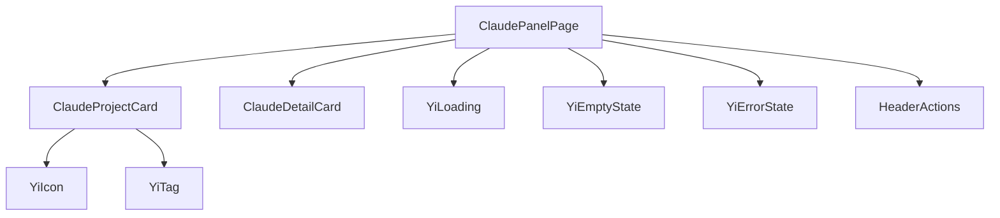
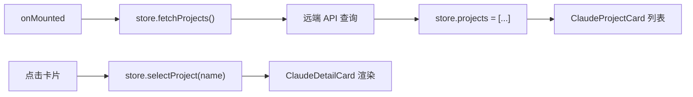

> | v1.0.0 | 2026-05-22 | deepseek-v4-pro | 🌿 feat/claude | ⏱️ — | 📎 [CLAUDE.md](../../../CLAUDE.md) |

> **导航**: [← YiWeb-使用场景](./YiWeb-使用场景.md) · [YiWeb-测试设计 →](./YiWeb-测试设计.md) · [YiWeb-安全审计 →](./YiWeb-安全审计.md)

> **来源引用**: 从 `src/views/claude/` 源码只读分析生成。

---

### 主要价值

- 🎯 架构复用 story 面板模式 — createBaseView + store + computed + methods
- 🔒 组件依赖清晰 — 3 个业务组件 + 7 个通用组件
- ⚡ 与 story 面板镜像架构 — 降低维护成本

---

## §1 组件树

| 组件 | 来源 | 职责 |
|------|------|------|
| ClaudePanelPage | `components/claudePanelPage/` | 根页面，列表/详情切换 |
| ClaudeProjectCard | `components/claudeProjectCard/` | 项目卡片 |
| ClaudeDetailCard | `components/claudeDetailCard/` | 项目详情卡片 |

---

## §2 数据流

> 证据: `src/views/claude/index.js:48–55`

---

## §3 架构对比

| 维度 | story 面板 | claude 面板 |
|------|-----------|------------|
| 入口模式 | createBaseView | createBaseView |
| 核心组件 | StoryPanelPage/StoryCard/StoryStatusBadge | ClaudePanelPage/ClaudeProjectCard/ClaudeDetailCard |
| 状态管理 | store.js + useComputed + useMethods | store.js + useComputed + useMethods |
| 数据流 | fetchStories → 状态判定 → 列表渲染 | fetchProjects → 列表渲染 |
| 通用组件 | YiIcon/YiButton/YiTag/YiLoading/YiEmptyState/YiErrorState/HeaderActions | 同左 |

---

> **变更记录**
> | 日期 | 变更 | 触发 | 证据 |
> |------|------|------|------|
> | 2026-05-22 | 初始生成 | /rui doc --from-code claude | src/views/claude/ |
