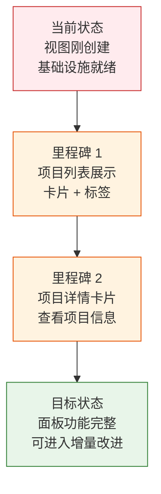

> | v1.0.0 | 2026-05-22 | deepseek-v4-pro | 🌿 feat/claude | ⏱️ — | 📎 [CLAUDE.md](../../../CLAUDE.md) |

> **导航**: [YiWeb-使用场景 →](./YiWeb-使用场景.md)

> **来源引用**: 从 `src/views/claude/` 源码反推生成，证据 Level B + 源码路径。`/rui doc --from-code claude`。

---

### §0 基线声明

> **问题空间基线**: 本文档定义"做什么(WHAT)"和"为什么(WHY)"。

---

### 需求概述

提供一个 Claude 项目管理面板。用户可以查看所有 Claude 项目的状态概览、点击项目查看详细信息。面板通过远端 API 获取项目数据，以卡片列表形式展示。

### 效果示意

### 主要价值

- 🎯 Claude 项目概览 — 统一管理入口
- 🔒 只读面板 — 查看项目状态，不修改数据
- ⚡ 与 story 面板同架构 — 复用 createBaseView 模式
- 📊 可扩展 — 预留详情卡片和操作入口

---

## §1 Story

### Story 1: 项目列表展示

| 字段 | 内容 |
|------|------|
| 作为 | Claude 使用者 |
| 我想要 | 查看所有 Claude 项目的列表 |
| 以便 | 了解项目概览 |
| 优先级 | P1 |
| 范围边界 | 项目查询 + 卡片列表渲染 |

### Story 2: 项目详情查看

| 字段 | 内容 |
|------|------|
| 作为 | Claude 使用者 |
| 我想要 | 点击项目查看详细信息 |
| 以便 | 了解特定项目的配置和状态 |
| 优先级 | P1 |
| 范围边界 | 详情卡片展示 |
| 依赖 | Story 1 |

---

## §2 Requirements

### 功能点

| FP# | 描述 | 优先级 |
|-----|------|--------|
| FP1 | 远端项目查询 — 从 API 获取项目列表数据 | P1 |
| FP2 | 项目卡片渲染 — 卡片形式展示项目信息 | P1 |
| FP3 | 项目选择 — 点击卡片选中项目 | P1 |
| FP4 | 详情展示 — 选中项目的详细信息卡片 | P1 |
| FP5 | 返回导航 — 从详情返回列表 | P2 |

### 业务规则

| R# | 描述 |
|----|------|
| R1 | 数据源为远端 API，不读本地文件系统 |
| R2 | 面板仅展示，不修改项目数据 |

---

## §3 成功标准

| SC# | 描述 | 目标值 |
|-----|------|--------|
| SC1 | 项目列表在页面加载后 3 秒内展示 | < 3 秒 |
| SC2 | 项目详情切换响应 < 200ms | < 200ms |

---

## §4 范围边界

**范围内**: 项目列表展示 / 项目详情卡片
**范围外**: 项目创建/编辑/删除（那是其他工具的功能）

---

## §5 AC

| AC# | Given | When | Then |
|-----|-------|------|------|
| AC1 | 用户打开 Claude 面板 | 页面加载完成 | 项目列表从远端加载并展示 |
| AC2 | 用户点击项目 | 项目被选中 | 详情卡片展示 |
| AC3 | 用户在详情页 | 点击返回 | 返回列表视图 |

---

## §6 风险与假设

| # | 风险 | 缓解 |
|---|------|------|
| 1 | 视图刚创建，功能不完整 | P3 优先级，待稳定后再深度文档化 |
| 2 | 依赖远端 API 数据结构 | API 变更时需同步更新面板 |

**产出**: `docs/故事任务面板/claude/YiWeb-{故事任务,使用场景,技术评审,测试设计,安全审计}.md`

---

> **变更记录**
> | 日期 | 变更 | 触发 | 证据 |
> |------|------|------|------|
> | 2026-05-22 | 初始生成 — 源码反推 | /rui doc --from-code claude | src/views/claude/ |
