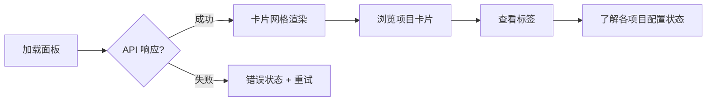
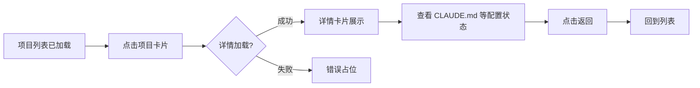

# 使用场景

> | v1.0.0 | 2026-05-26 | deepseek-v4-pro | 📎 [CLAUDE.md](../../../CLAUDE.md) |

> **来源引用**：基于 [故事任务](./故事任务.md) §1 Story 1–3。

---

### 主要价值

- 🎯 覆盖两种用户角色 — Claude 使用者、项目管理者
- 🔒 异常路径可见 — API 失败、空状态、加载超时
- ⚡ 与 story 面板同步的交互模式

---

## §1 使用场景

### 场景 1: 项目概览浏览

**角色**: Claude 使用者
**目标**: 查看所有 Claude 项目及其配置完备度

| 步骤 | 操作 | 预期结果 |
|------|------|---------|
| 1 | 打开 Claude 面板 | 加载动画 → 卡片网格展示 |
| 2 | 浏览卡片 | 每个卡片展示项目名和配置状态标签 |
| 3 | 查看空状态 | 无项目时显示空状态引导 |

---

### 场景 2: 查看项目详情

**角色**: Claude 使用者
**目标**: 深入了解特定项目的配置详情

| 步骤 | 操作 | 预期结果 |
|------|------|---------|
| 1 | 点击项目卡片 | 选中高亮，详情卡片弹出/展开 |
| 2 | 查看详情 | 展示 CLAUDE.md、settings、skills、agents、memory 状态 |
| 3 | 点击返回 | 详情关闭，列表恢复 |

---

### 场景 3: 筛选与排序查找

**角色**: Claude 管理者
**目标**: 按配置完备度筛选和排序，定位需要关注的项目

---

## §2 场景覆盖矩阵

| 场景 | 关联 FP# | 关联 AC# | 正常路径 | 空状态 | 错误恢复 |
|------|---------|---------|:--:|:--:|:--:|
| 场景 1: 项目概览 | FP1, FP2 | AC1 | ✅ | ✅ | ✅ |
| 场景 2: 项目详情 | FP3, FP4 | AC2, AC3 | ✅ | — | ✅ |
| 场景 3: 筛选排序 | FP5, FP6, FP7 | AC4, AC5, AC6 | ✅ | ✅ | — |

---

> **变更记录**
> | 日期 | 变更 | 触发 | 证据 |
> |------|------|------|------|
> | 2026-05-26 | 基线化 | 源码分析 | src/views/claude/ |
