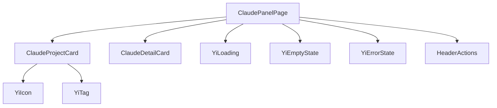
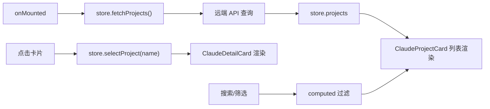

# 技术评审

> | v1.0.0 | 2026-05-26 | deepseek-v4-pro | 📎 [CLAUDE.md](../../../CLAUDE.md) |

> **来源引用**：从 `src/views/claude/` 源码分析生成。

---

### 主要价值

- 🎯 架构复用 story 面板模式 — createBaseView + store + computed + methods
- 🔒 组件依赖清晰 — 3 个业务组件 + 7 个通用组件
- ⚡ 与 story 面板镜像架构 — 降低维护成本

---

## §1 组件树

| 组件 | 来源 | 职责 |
|------|------|------|
| ClaudePanelPage | `components/claudePanelPage/` | 根页面，列表/详情切换 |
| ClaudeProjectCard | `components/claudeProjectCard/` | 项目卡片展示 |
| ClaudeDetailCard | `components/claudeDetailCard/` | 项目详情卡片 |

---

## §2 数据流

> 证据: `src/views/claude/index.js` · `src/views/claude/hooks/store.js`

---

## §3 架构对比

| 维度 | story 面板 | claude 面板 |
|------|-----------|------------|
| 入口模式 | createBaseView | createBaseView |
| 核心组件 | StoryPanelPage / StoryCard / StoryStatusBadge | ClaudePanelPage / ClaudeProjectCard / ClaudeDetailCard |
| 状态管理 | store.js + useComputed + useMethods | store.js + useComputed + useMethods |
| 数据流 | fetchStories → 状态判定 → 列表渲染 | fetchProjects → 列表渲染 |
| 通用组件 | YiIcon / YiButton / YiTag / YiLoading / YiEmptyState / YiErrorState / HeaderActions | 同左 |

---

## §4 技术决策

| 决策 | 选择 | 原因 |
|------|------|------|
| 架构模式 | 镜像 story 面板 | 降低认知负担和维护成本 |
| 数据加载 | 远端 API only | 不依赖本地文件系统 |
| 组件粒度 | 卡片 + 详情分离 | 列表和详情不同渲染路径 |
| 状态管理 | 单一 store | 项目数据量小，无需分片 |

---

> **变更记录**
> | 日期 | 变更 | 触发 | 证据 |
> |------|------|------|------|
> | 2026-05-26 | 基线化 | 源码分析 | src/views/claude/ |
