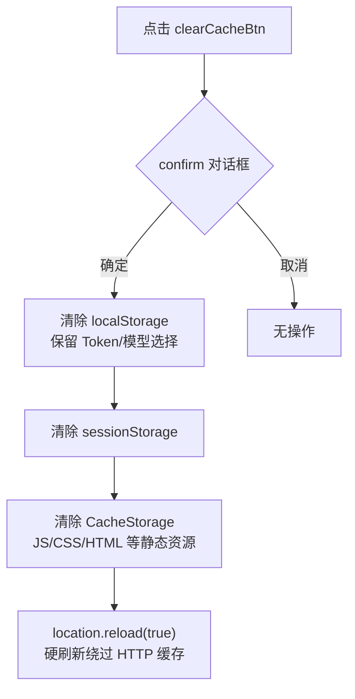

# clear-cache-refresh

> | v2 | 2026-05-11 | — | — | — | — |

> **证据标准**: A=已验证(附路径) · B=可推导(附规则) · C=未验证(标注 `> 待补充`) · D=禁止(视为幻觉)

> **技术评审**: 详见 [02-后端技术评审.md](./02-后端技术评审.md) 和 [03-前端技术评审.md](./03-前端技术评审.md) 和 [04-测试用例评审.md](./04-测试用例评审.md)

---

## §1 Story

**角色**: YiWeb 终端用户

**价值**: 当应用出现数据异常或缓存陈旧时，用户可一键清除本地缓存并刷新页面，同时保留 API Token 避免重新鉴权。

**范围边界**:
- 包含：清除 localStorage 缓存（保留 Token/模型选择）、sessionStorage 全部清除、CacheStorage 清除（Service Worker 缓存的 JS/CSS/HTML 等静态资源）、硬刷新绕过浏览器 HTTP 缓存
- 不包含：服务端缓存清理、IndexedDB 清理、Token 失效处理

**依赖**: `STORAGE_KEYS.API_TOKEN`（C: YiWeb 项目需定义此常量）

---

## §1.1 User Operations

| 步骤 | 用户操作 | 系统响应 | 视图状态 |
|------|---------|---------|---------|
| 1 | 点击工具栏「清缓存并刷新」按钮 | 弹出 confirm 确认框 | 对话框阻断 |
| 2 | 点击「确定」 | 清除 localStorage（保留 Token），页面 reload | 页面白屏刷新 |
| 2a | 点击「取消」 | 无操作，关闭对话框 | 保持当前视图 |



---

## §2 Requirements

### 功能点

1. **确认对话框**（C: `src/views/aicr/index.js` 或全局入口）
   - 文案：`"确定要清空缓存并刷新页面？Token 将被保留。"`
   - 用户取消则中断流程

2. **localStorage 清除**（`src/views/aicr/hooks/clearCacheMethods.js`）
   - 遍历全部 localStorage 键
   - 保留 `YiWeb.apiToken.v1` 和 `YiWeb.apiModel.v1`
   - 其余键全部 `localStorage.removeItem()`
   - 单键移除失败静默忽略（try/catch）

3. **sessionStorage 清除**（`src/views/aicr/hooks/clearCacheMethods.js`）
   - 调用 `sessionStorage.clear()` 全量清除

4. **CacheStorage 清除**（`src/views/aicr/hooks/clearCacheMethods.js`）
   - 检测 `'caches' in window` 能力
   - 遍历并删除所有 Service Worker 缓存命名空间
   - 清除浏览器缓存的 JS/CSS/HTML 等静态资源
   - 操作失败静默忽略

5. **硬刷新**（`src/views/aicr/hooks/clearCacheMethods.js`）
   - 调用 `location.reload(true)` 绕过浏览器 HTTP 缓存
   - 强制从服务器重新请求所有资源

### 输入/输出

| 输入 | 类型 | 说明 |
|------|------|------|
| 用户点击 | Event | 按钮 `data-action="clearCacheAndRefresh"` |
| localStorage | Browser API | 当前域名下的全部键值对 |
| sessionStorage | Browser API | 当前域名下的会话存储 |
| CacheStorage | Browser API | Service Worker 缓存（JS/CSS/HTML 等静态资源） |

| 输出 | 类型 | 说明 |
|------|------|------|
| 确认对话框 | boolean | `confirm()` 返回值 |
| localStorage 变更 | side effect | 非 Token/模型选择键被移除 |
| sessionStorage 变更 | side effect | 全量清除 |
| CacheStorage 变更 | side effect | 所有缓存命名空间被删除 |
| 页面硬刷新 | navigation | `location.reload(true)` |

### 业务规则

- 必须保留 API Token 和模型选择，避免用户重新配置
- 所有缓存层（localStorage/sessionStorage/CacheStorage）的清理异常相互独立，任一层失败不阻断其他层
- 硬刷新确保浏览器不从 HTTP 缓存加载 JS/CSS/HTML 等静态资源
- 页面刷新不保留表单状态

### 数据约束

| 字段 | 类型 | 范围 | 说明 |
|------|------|------|------|
| preserveKeys | Set\<string\> | 常量 | `YiWeb.apiToken.v1` / `YiWeb.apiModel.v1` |
| keysToRemove | string[] | 动态 | 运行时遍历 localStorage 得出 |
| cacheNames | string[] | 动态 | 运行时遍历 `caches.keys()` 得出 |

---

## §3 Design

### 技术方案

```
按钮触发层 (AICR Header)
  ↓ action === "clearCacheAndRefresh"
clearCacheAndRefresh()
  ├─ confirm() 用户确认
  ├─ 1. 遍历 localStorage.key(i) → 过滤 preserveKeys → removeItem(k)
  ├─ 2. sessionStorage.clear()
  ├─ 3. caches.keys() → caches.delete(name) 逐个清除
  └─ 4. location.reload(true) 硬刷新
```

**核心逻辑**（`src/views/aicr/hooks/clearCacheMethods.js`）:
- 纯前端实现，无后端交互
- 四层缓存清理：localStorage（保留 Token/模型）→ sessionStorage → CacheStorage → 硬刷新
- CacheStorage 清除为异步操作，在刷新前触发（浏览器刷新时自然等待微任务完成）
- 使用原生 ES Modules 导出函数

### 安全约束

- 仅操作当前域名存储，受同源策略保护
- Token 和模型选择保留逻辑硬编码为 `PRESERVE_KEYS` Set，避免误删
- 所有缓存层移除异常均静默处理，防止单一异常阻断后续清理
- CacheStorage 操作需要 `caches` API 可用性检测

### 影响链

- **正向影响**: 用户可自助解决缓存导致的数据异常
- **反向影响**: 清除所有业务缓存，需重新加载
- **无服务端影响**: 纯客户端操作

---

## §4 Tasks

| # | 任务 | 负责人 | 交付物 | 依赖 |
|---|------|--------|--------|------|
| 1 | 确认对话框文案 | pm | 文案定稿 | — |
| 2 | 按钮 HTML 结构 | coder | `src/views/aicr/index.html` 按钮节点 | — |
| 3 | `STORAGE_KEYS` 常量定义 | coder | `src/core/config.js` 或全局常量 | — |
| 4 | 事件处理函数 | coder | `src/views/aicr/index.js` 或独立模块 | `STORAGE_KEYS` |
| 5 | 事件委托/绑定 | coder | 按钮 click 绑定 | 任务 4 |
| 6 | 功能验证 | tester | 通过 §5 AC | 任务 5 |

---

## §5 Acceptance Criteria

| # | 验收项 | 测试方法 | 预期结果 |
|---|--------|---------|---------|
| 1 | 点击按钮弹出确认 | 手动点击 | 出现浏览器原生 confirm 对话框 |
| 2 | 取消后不操作 | 点击取消 + 检查 localStorage/sessionStorage/CacheStorage | 所有存储保留，页面不刷新 |
| 3 | 确认后清除 localStorage | 点击确定 + 检查 localStorage | 仅 `YiWeb.apiToken.v1` 和 `YiWeb.apiModel.v1` 保留，其余键消失 |
| 4 | 确认后清除 sessionStorage | 点击确定 + 检查 sessionStorage | sessionStorage 完全清空 |
| 5 | 确认后清除 CacheStorage | 点击确定 + 检查 DevTools Application > Cache Storage | 所有缓存命名空间被删除 |
| 6 | 确认后硬刷新 | 点击确定 + 检查 Network 面板 | 资源未被浏览器缓存命中（200 非 304/from disk cache） |
| 7 | 异常键不阻断 | 构造不可移除键（如被监听） | 其余键仍被清除，无报错，后续清理层正常执行 |

---

## §6 .claude 改进清单

> 待 rui code 完成后由 pm 静态分析填充

---

## §7 系统架构演进任务

> 待 rui code 完成后由 pm 结构规划填充
