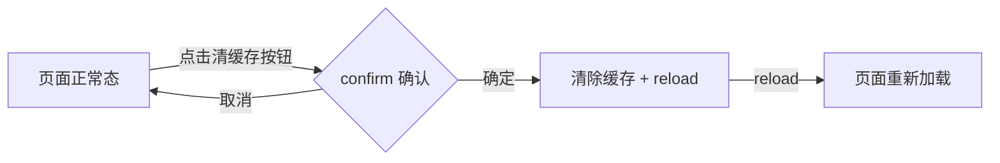

# 前端技术评审: clear-cache-refresh

> | v1 | 2026-05-10 | kimi-k2.6 | 🌿 feat/clear-cache-refresh |
> 关联: [01-故事任务.md](./01-故事任务.md) · [02-后端技术评审.md](./02-后端技术评审.md)

---

## 1. 组件架构

### 1.1 组件树

```
aicr-page (Vue)
  └─ aicr-sidebar
  └─ aicr-code-area
  └─ aicr-chat-panel
  └─ ...existing components

全局工具函数（新增）
  └─ clearCacheAndRefresh()  ← 独立工具函数
```

> `clearCacheAndRefresh` 为纯工具函数，不挂载到 Vue 组件树，通过事件绑定在按钮上调用。

### 1.2 新增/变更文件

| 文件 | 类型 | 变更 | 说明 |
|------|------|------|------|
| `src/views/aicr/index.html` | HTML | 修改 | 在工具栏添加「清缓存并刷新」按钮 |
| `src/views/aicr/index.js` | JS | 修改 | 导入工具函数并绑定事件 |
| `src/views/aicr/hooks/clearCacheMethods.js` | JS | **新增** | `clearCacheAndRefresh` 工具函数 |
| `src/views/aicr/styles/index.css` | CSS | 修改 | 按钮样式（如需） |

### 1.3 组件接口

| 组件/函数 | 输入 | 输出 | 副作用 |
|-----------|------|------|--------|
| `clearCacheAndRefresh()` | 无 | 无 | 清除 localStorage（保留 Token/Model）、页面刷新 |

---

## 2. 状态管理

### 2.1 Hooks 模式

| Store | 文件 | 状态 | 使用组件 |
|-------|------|------|---------|
| — | — | — | — |

> 本功能**无状态管理需求**。`clearCacheAndRefresh` 为纯命令式工具函数，不读写 Vue 响应式状态。

### 2.2 数据流

```
用户点击按钮
  ↓
clearCacheAndRefresh() 调用
  ├─ confirm() → 用户确认
  ├─ 遍历 localStorage
  ├─ 移除非保留键
  └─ location.reload()
```

---

## 3. 交互设计

### 3.1 用户操作流



### 3.2 视图状态矩阵

| 视图 | 正常 | 加载 | 空 | 错误 | 禁用 |
|------|------|------|----|------|------|
| 清缓存按钮 | 可点击 | — | — | — | — |
| confirm 对话框 | 弹出中 | — | — | — | 页面阻断 |

---

## 4. 样式方案

### 4.1 按钮样式

| 场景 | 方案 | 说明 |
|------|------|------|
| 按钮位置 | 工具栏右侧或设置区域 | 与现有工具按钮并列 |
| 按钮样式 | 复用现有工具按钮样式类 | 保持视觉一致性 |
| 图标 | Font Awesome `fa-trash-can` 或 `fa-rotate-right` | 语义清晰 |

### 4.2 新增样式

| 文件 | 用途 | 加载方式 |
|------|------|---------|
| 无新增 CSS 文件 | 复用现有工具按钮样式 | — |

> 优先复用 AICR 现有工具按钮样式，避免新增样式文件。如需微调，在 `src/views/aicr/styles/index.css` 中追加作用域类。

---

## 5. DOM 与事件

### 5.1 DOM 挂载点

| 元素 | 挂载容器 | 创建方式 | 生命周期 |
|------|---------|---------|---------|
| 清缓存按钮 | AICR 页面工具栏 | HTML 模板静态写入 | 页面生命周期 |

### 5.2 事件处理

| 事件 | 监听方式 | 处理逻辑 | 清理时机 |
|------|---------|---------|---------|
| `click` | 按钮 `@click` 或 `addEventListener` | 调用 `clearCacheAndRefresh()` | 页面卸载时自动清理（无持久监听器） |

---

## 6. 模块依赖

### 6.1 加载顺序

```
<!-- 现有依赖 -->
<script type="module" src="../../core/config.js"></script>
<script type="module" src="../../views/aicr/index.js"></script>
```

| 新增文件 | 导入位置 | 依赖上游 |
|----------|---------|---------|
| `src/views/aicr/hooks/clearCacheMethods.js` | `src/views/aicr/index.js` | `cdn/utils/core/constants.js`（STORAGE_KEYS） |

### 6.2 命名空间

| 文件 | 暴露方式 | 类型 |
|------|---------|------|
| `clearCacheMethods.js` | ESM `export` + `window.clearCacheAndRefresh` | 工具函数 |

---

## 7. 评审清单

| # | 检查项 | 结果 |
|---|--------|------|
| 1 | 函数使用 ESM `export` + `window.*` 暴露（向后兼容） | ✅ |
| 2 | 无新增复杂组件，仅工具函数 + 按钮 | ✅ |
| 3 | 无状态管理需求，不涉及 Store | ✅ |
| 4 | 样式复用现有工具按钮类，无全局污染 | ✅ |
| 5 | 事件绑定在按钮上，页面卸载自动清理 | ✅ |
| 6 | 模块按依赖顺序导入 | ✅ |
| 7 | 使用原生 ES Modules（import/export） | ✅ |
| 8 | 无新增 CSS 文件（复用现有） | ✅ |
