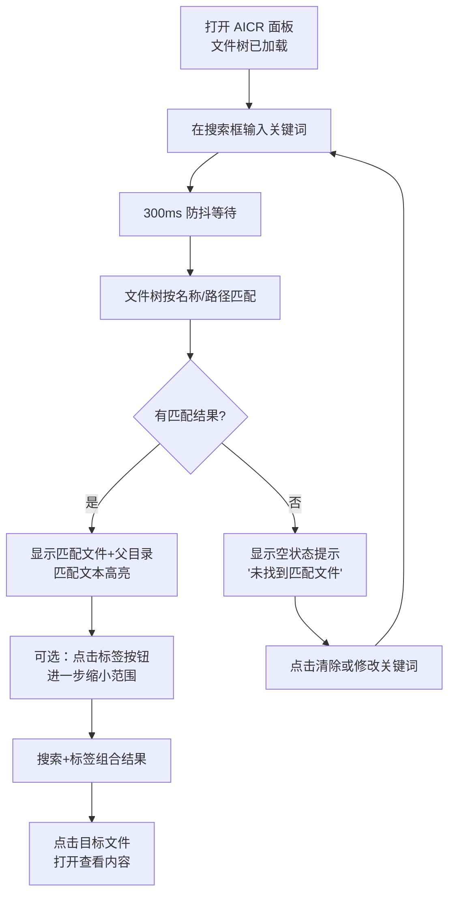
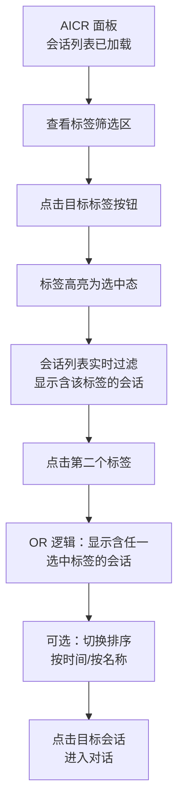
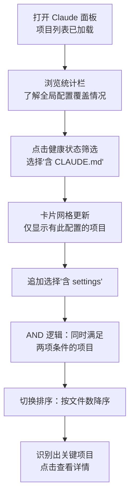
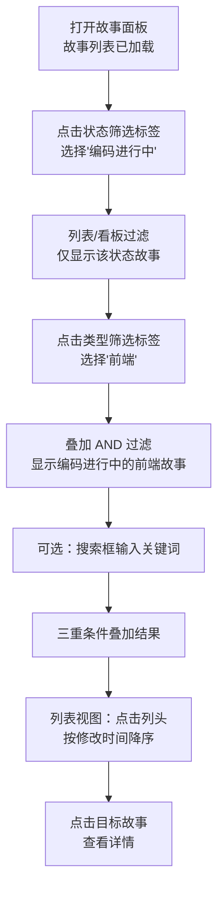
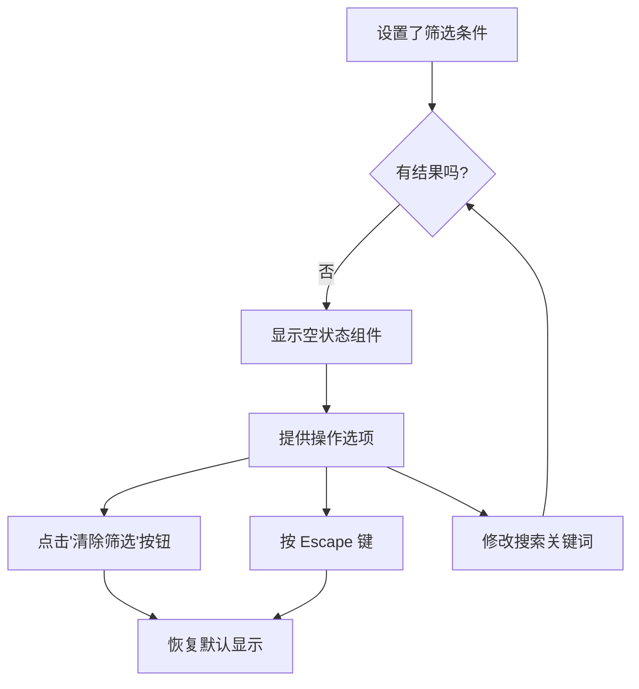

# YiWeb-使用场景

> **基线类型**：用户空间 · **版本**：1.0.0 · **生成日期**：2026-05-22

## 概述

描述用户如何使用搜索与过滤功能在三个面板中快速定位目标数据。覆盖正常路径、空状态路径、错误恢复路径。

### 主要价值

- 🧭 **导航效率** — 用户无需逐条翻页或滚动，通过搜索+筛选直达目标
- 🔬 **精准定位** — 多条件组合筛选在大量数据中缩小范围至个位数结果
- 🔄 **即时恢复** — 一键清除所有条件回到初始状态，无迷失风险
- 📋 **灵活排序** — 按时间/名称/数量等维度切换视角，满足不同查找意图

---

## §1 场景

### 场景 1：AICR 面板中查找特定文件

**用户角色**：代码审查者  
**目标**：在数百个文件组成的目录树中找到包含特定关键词的文件

| 路径 | 触发 | 预期 |
|------|------|------|
| 正常 | 输入匹配关键词 | 树实时过滤，匹配高亮，点击文件打开 |
| 空状态 | 输入无匹配关键词 | 显示"未找到匹配文件"提示 + 建议修改关键词 |
| 错误恢复 | 输入错误关键词 → 修改 | 每次输入重新过滤，实时反映 |

---

### 场景 2：AICR 面板中按标签筛选会话

**用户角色**：代码审查者  
**目标**：快速定位属于特定项目/模块的会话记录

| 路径 | 触发 | 预期 |
|------|------|------|
| 正常 | 选中标签 → 结果过滤 | 列表仅显示匹配会话，标签计数实时更新 |
| 空状态 | 标签无对应会话 | 显示"无匹配会话"提示 |
| 多标签 | 选中多个标签 | OR 逻辑，结果范围扩大 |
| 清除 | 点击清除按钮 | 所有标签取消选中，列表恢复完整 |

---

### 场景 3：Claude 面板中查找配置完备度不足的项目

**用户角色**：项目管理者  
**目标**：找出缺少 CLAUDE.md 或 settings 等关键配置的项目

| 路径 | 触发 | 预期 |
|------|------|------|
| 正常 | 筛选条件匹配 | 卡片网格实时过滤 |
| 空状态 | 无项目满足组合条件 | "没有匹配的项目" + 建议调整筛选 |
| 多维度 | 叠加多个筛选 | AND 逻辑，结果逐级缩小 |
| 清除 | 点击清除或取消勾选 | 返回全量项目列表 |

---

### 场景 4：故事面板中按状态和类型定位故事

**用户角色**：项目参与者  
**目标**：快速查看"进行中的前端故事"以了解开发进度

| 路径 | 触发 | 预期 |
|------|------|------|
| 正常 | 状态+类型+搜索组合 | 精确匹配目标故事集 |
| 空状态 | 组合条件无匹配 | "没有匹配的故事" + 清除筛选按钮 |
| 切换视图 | 看板→卡片→列表切换 | 筛选条件跨视图保持 |
| 清除 | Escape 或清除按钮 | 所有条件重置 |

---

### 场景 5：空状态恢复

**用户角色**：任意面板使用者  
**目标**：筛选无结果后快速恢复

---

## §2 场景覆盖矩阵

| 场景# | 描述 | 关联 FP# | 正常路径 | 空状态路径 | 错误恢复路径 |
|-------|------|---------|---------|-----------|------------|
| 1 | AICR 文件搜索 | FP1, FP12 | ✓ | ✓ | ✓ |
| 2 | AICR 标签筛选会话 | FP2, FP3, FP4 | ✓ | ✓ | ✓ |
| 3 | Claude 健康状态筛选 | FP5, FP6, FP7 | ✓ | ✓ | ✓ |
| 4 | 故事面板组合筛选 | FP8, FP9, FP10, FP11 | ✓ | ✓ | ✓ |
| 5 | 空状态恢复 | FP13, FP14 | ✓ | ✓ | ✓ |

---

> **回溯链**：需求 "加强所有的页面的搜索及过滤交互和功能" → YiWeb-故事任务.md §1 Story 1–3
>
> **变更记录**：2026-05-22 — 初始生成 (v1.0.0)
