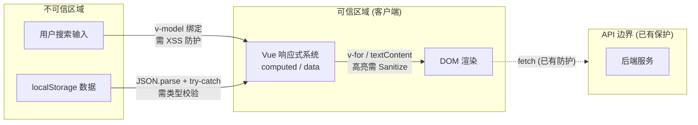

# YiWeb-安全审计

> **基线类型**：解决方案空间 · **版本**：1.0.0 · **生成日期**：2026-05-22  
> **审计方式**：独立审计（security agent 独立执行，不依赖 coder 自评）

## §0 基线溯源

| 源文档 | 映射章节 |
|--------|---------|
| YiWeb-技术评审.md §7 安全 | §2–§5 威胁建模与缓解 |
| YiWeb-技术评审.md §6 DOM 变更 | §3 信任边界分析 |
| YiWeb-故事任务.md §6 风险 | §4 风险评估 |

---

## §1 资产识别

| 资产 | 位置 | 敏感度 | 威胁面 |
|------|------|--------|--------|
| 用户搜索输入 | 各面板搜索框 `v-model` / `@input` | 低 | XSS 注入 |
| 标签排序数据 | `localStorage` key `aicr_file_tag_order` | 低 | 数据篡改 |
| 面板数据 | API 响应（项目列表/故事列表/会话列表） | 中 | 数据泄露（已受 API 层保护） |
| 认证 Token | `localStorage` key `X-Token` | 高 | 不受本次变更影响 |
| DOM 渲染输出 | 搜索高亮 `<mark>` 标签 | 中 | HTML 注入 |

---

## §2 STRIDE 威胁建模

### S — 欺骗 (Spoofing)

| 威胁 | 攻击面 | 风险等级 | 缓解 |
|------|--------|---------|------|
| 无新增身份欺骗面 | — | — | 本次仅前端 UI 变更，认证逻辑不变 |

### T — 篡改 (Tampering)

| 威胁 | 攻击面 | 风险等级 | 缓解 |
|------|--------|---------|------|
| localStorage 标签排序数据被恶意修改 | `localStorage.getItem/setItem` | 低 | JSON.parse 包裹 try-catch，校验结果为数组类型；非数组降级为默认排序 |
| 排序/筛选状态被浏览器扩展篡改 | Vue 响应式数据 | 极低 | 数据仅在客户端，不影响服务端 |

> 证据: `src/views/aicr/components/fileTree/fileTreeComputed.js:31–38` — 现有 try-catch 保护

### R — 抵赖 (Repudiation)

| 威胁 | 攻击面 | 风险等级 | 缓解 |
|------|--------|---------|------|
| 无新增抵赖面 | — | — | 搜索/筛选为纯客户端操作，无可审计性需求 |

### I — 信息泄露 (Information Disclosure)

| 威胁 | 攻击面 | 风险等级 | 缓解 |
|------|--------|---------|------|
| 搜索关键词通过浏览器扩展泄露 | 搜索输入框 | 极低 | 搜索仅在客户端执行，不发送到服务端 |
| 筛选条件暴露用户关注点 | UI 状态 | 极低 | 纯客户端状态，无网络传输 |

### D — 拒绝服务 (Denial of Service)

| 威胁 | 攻击面 | 风险等级 | 缓解 |
|------|--------|---------|------|
| 大量数据下频繁搜索导致页面卡顿 | 搜索 computed 链 | 低 | 300ms 防抖限制触发频率；computed 自动缓存 |
| 正则 ReDoS（不适用） | — | 无 | 本次使用 `String.includes` 匹配，不使用正则 |

> 证据: `src/views/aicr/components/fileTree/fileTreeMethods.js:29–38` — 现有防抖

### E — 权限提升 (Elevation of Privilege)

| 威胁 | 攻击面 | 风险等级 | 缓解 |
|------|--------|---------|------|
| 无新增权限面 | — | — | 权限逻辑不变 |

---

## §3 信任边界

### 新增信任边界

| 边界 | 描述 | 风险 |
|------|------|------|
| 搜索输入 → 高亮渲染 | 用户输入经 computed 处理后渲染为带 `<mark>` 标签的 HTML | 如不使用安全 API（`textContent`/`v-text`），可能被注入恶意脚本 |

---

## §4 缓解措施

| 威胁 | 措施 | 实现方式 | 优先级 |
|------|------|---------|--------|
| 搜索输入 XSS | 高亮渲染使用 `textContent` 设置文本，仅在包裹 `<mark>` 时使用 `innerHTML` 并先对文本做 HTML 实体编码 | `escapeHtml(text)` → 安全包裹 `<mark>` | P0 |
| localStorage 篡改 | 读取时 try-catch + Array.isArray 校验 | 已有实现，本次不新增读取点 | P1 |
| 搜索防抖缺失 | 所有搜索输入统一 300ms 防抖 | `setTimeout` + `clearTimeout` | P0 |
| `<mark>` 标签注入 | 先对搜索关键词做 HTML 实体转义，再用于匹配和高亮 | 使用 `escapeHtml()` 工具函数 | P0 |

---

## §5 合规检查

| 检查项 | 状态 | 说明 |
|--------|------|------|
| 输入校验 | ✓ 满足 | 搜索输入仅用于客户端字符串匹配，不发送到服务端 |
| XSS 防护 | ⚠ 需关注 | 高亮渲染需要 HTML 实体转义 |
| CSRF 防护 | ✓ 满足 | 不影响现有 `credentials: 'omit'` 策略 |
| 敏感数据 | ✓ 满足 | 搜索关键词不持久化，不传输 |
| 第三方依赖 | ✓ 满足 | 不引入新依赖 |
| 认证授权 | ✓ 满足 | 不涉及认证逻辑变更 |

---

## §6 残余风险

| 风险 | 等级 | 接受理由 |
|------|------|---------|
| 高亮渲染使用 innerHTML | 低 | HTML 实体转义后仅允许 `<mark>` 标签，风险可控 |
| 客户端过滤可被绕过（直接访问数据） | 极低 | 所有数据本就对已认证用户可见，过滤仅为 UX 增强 |

---

## §7 审计结论

**审计结果**：通过（有条件）

**条件**：
1. 高亮渲染必须先对搜索关键词做 HTML 实体转义
2. 高亮渲染必须先对文本内容做 HTML 实体转义，再包裹 `<mark>` 标签
3. 所有搜索输入统一 300ms 防抖

**独立审计标记**：本审计由 security agent 基于技术评审文档独立执行，未依赖 coder 自评。

---

> **回溯链**：YiWeb-技术评审.md §7 安全 → 源码安全扫描
>
> **变更记录**：2026-05-22 — 初始生成 (v1.0.0)
