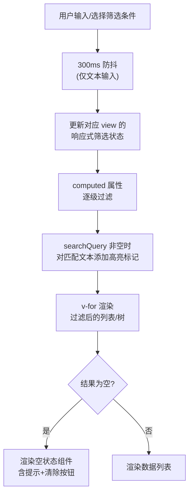
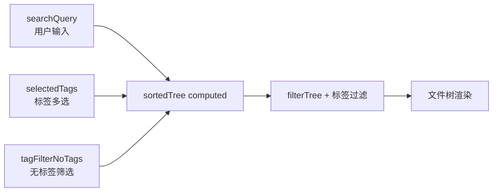
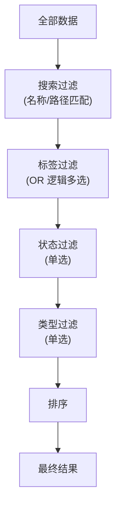

# YiWeb-技术评审

> **基线类型**：解决方案空间 · **版本**：1.0.0 · **生成日期**：2026-05-22

## §0 基线溯源

| 源文档 | 映射章节 | 关联 FP# |
|--------|---------|---------|
| YiWeb-故事任务.md §1 Story 1 | §4.1 AICR 文件树搜索增强 | FP1, FP2, FP12 |
| YiWeb-故事任务.md §1 Story 1 | §4.2 AICR 会话搜索增强 | FP3, FP4 |
| YiWeb-故事任务.md §1 Story 2 | §4.3 Claude 面板筛选增强 | FP5, FP6, FP7 |
| YiWeb-故事任务.md §1 Story 3 | §4.4 故事面板筛选增强 | FP8, FP9, FP10 |
| YiWeb-故事任务.md §2 FP11–FP14 | §4.5 通用交互增强 | FP11, FP13, FP14 |

---

## §1 效果示意



### AICR 文件树搜索+标签筛选数据流



### 组合筛选 AND 逻辑示意



---

## §2 架构

### 当前架构

YiWeb 采用 `createBaseView` + `vueRef` 响应式架构，每个 view 自包含。搜索/过滤逻辑分散在各 view 的 computed/methods 中，无共享抽象。

### 变更架构

在现有架构基础上增强，不引入新的架构模式：

| 层级 | 现有 | 变更 |
|------|------|------|
| State | `searchQuery`, `selectedSessionTags`, `sessionSearchQuery` 等已存在 | 新增排序状态、状态筛选状态；统一命名 |
| Computed | 各 view 有 `filteredXxx` computed | 增强为多级 AND 链式过滤 |
| Methods | `handleSearchInput`, `handleTagSelect` 等已存在 | 补充 `handleSortChange`, `handleStatusFilter`, `clearAllFilters` |
| Template | 搜索框、标签按钮已存在 | 新增排序控件、状态筛选标签组、高亮渲染、空状态组件 |

> 证据: `src/views/aicr/hooks/state/storeState.js:18–34` — 现有搜索/筛选状态定义  
> 证据: `src/views/aicr/components/fileTree/fileTreeComputed.js:109–177` — sortedTree 现有过滤逻辑  
> 证据: `src/views/claude/components/claudePanelPage/index.js:29–35` — filteredProjects 现有实现  
> 证据: `src/views/story/components/storyPanelPage/index.js:34–49` — filteredStories 现有实现

---

## §3 组件

### 变更范围

| View | 组件 | 变更类型 | 说明 |
|------|------|---------|------|
| aicr | FileTree | 增强 | 搜索高亮渲染、空状态、清除按钮优化 |
| aicr | SessionListTags | 增强 | 新增搜索框、排序切换、状态筛选标签 |
| aicr | AICR 主视图 | 增强 | 新增排序/筛选状态 + computed |
| claude | ClaudePanelPage | 增强 | 新增状态筛选标签组、排序下拉 |
| story | StoryPanelPage | 增强 | 新增状态筛选标签组、类型筛选标签、列表排序 |
| story | StoryListTable | 增强 | 列头点击排序、排序箭头指示器 |

### 新增组件

| 组件 | 位置 | 说明 |
|------|------|------|
| SearchHighlight | `cdn/components/SearchHighlight/` | 通用搜索高亮渲染组件：接收 text + query，输出带 `<mark>` 标签的 HTML |
| FilterTagGroup | `cdn/components/FilterTagGroup/` | 通用筛选标签组：接收 options + selected，渲染可点击标签按钮组 |
| SortControl | `cdn/components/SortControl/` | 通用排序控件：渲染排序下拉或按钮组 |

> 证据: `src/views/aicr/components/fileTree/fileTreeComponent.js` — FileTree 组件 props 定义  
> 证据: `src/views/aicr/components/sessionListTags/index.html` — SessionListTags 模板

---

## §4 状态管理

### AICR 新增状态

```javascript
// 排序状态
sessionSortField: vueRef('updatedAt'),   // 'updatedAt' | 'title'
sessionSortDirection: vueRef('desc'),     // 'asc' | 'desc'

// 会话状态筛选
sessionStatusFilter: vueRef(null),        // null | 'active' | 'archived'
```

### Claude 新增状态

```javascript
// 组件本地 data 增强
sortField: 'lastModified',    // 'name' | 'lastModified' | 'fileCount' | 'skillCount'
sortDirection: 'desc',        // 'asc' | 'desc'
healthFilters: {              // 健康状态多选
    hasClaudeMd: false,
    hasSettings: false,
    hasSkills: false,
    hasAgents: false,
    hasMemory: false,
},
```

### Story 新增状态

```javascript
// 组件本地 data 增强
selectedStatus: null,         // null | 'not_started' | 'docs_in_progress' | ...
selectedType: null,           // null | 'frontend' | 'backend' | 'fullstack' | 'meta'
sortField: 'lastModified',    // 'name' | 'lastModified' | 'status' | 'type'
sortDirection: 'desc',
```

> 证据: `src/views/aicr/hooks/state/storeState.js:18–34` — aicr store 现有搜索状态  
> 证据: `src/views/claude/components/claudePanelPage/index.js:20–24` — claude data 现有状态  
> 证据: `src/views/story/components/storyPanelPage/index.js:20–26` — story data 现有状态

---

## §5 交互设计

### 搜索交互

| 交互 | 行为 |
|------|------|
| 输入 | 300ms 防抖后触发过滤 |
| 清除 | 点击 X 按钮或按 Escape → 清空 → 聚焦输入框 |
| 高亮 | 匹配文本包裹 `<mark class="search-highlight">` 渲染黄色背景 |
| 空状态 | 无匹配时显示空状态组件 |

### 筛选标签交互

| 交互 | 行为 |
|------|------|
| 点击 | 切换选中/取消，即时生效（无防抖） |
| 多选 | 同类标签 OR 逻辑，跨类标签 AND 逻辑 |
| 清除 | 点击清除按钮取消所有选中 |

### 排序交互

| 交互 | 行为 |
|------|------|
| 下拉选择 | Claude/Story 面板使用下拉选择排序字段+方向 |
| 列头点击 | Story 列表视图点击列头切换该列升降序 |
| 指示器 | 当前排序字段显示箭头 (↑/↓) |
| 默认 | 按修改时间降序 (最近在前) |

---

## §6 DOM 变更

### AICR 文件树搜索框增强

当前 `fileTree/index.html:11–29` 已有搜索框 + 清除按钮，需增加：
- 搜索框空状态提示文本优化
- 匹配高亮渲染逻辑

### AICR 会话列表增强

`sessionListTags/index.html` 增加：
- 会话搜索输入框
- 排序切换按钮
- 会话状态筛选标签

### Claude 面板筛选增强

`claudePanelPage/template.html:8–17` 搜索框旁增加：
- 健康状态筛选标签组
- 排序下拉选择器

### Story 面板筛选增强

`storyPanelPage/template.html:8–30` 增加：
- 状态快捷筛选标签组（在搜索框旁）
- 类型筛选标签组
- 列表列头排序

---

## §7 安全

| 信号 | 来源 | 风险 | 缓解 |
|------|------|------|------|
| 用户输入 | 搜索框 | XSS（输入反射到 DOM） | 使用 `textContent` 或 `v-text`，高亮渲染使用 DOMPurify 或白名单标签 |
| localStorage | 标签排序 | 数据篡改 | JSON.parse 包裹 try-catch，校验数据类型 |
| 渲染 | 匹配高亮 | HTML 注入 | 仅允许 `<mark>` 标签，禁止其他 HTML |

---

## §8 性能

| 场景 | 策略 |
|------|------|
| 搜索输入 | 300ms 防抖，减少 computed 触发频率 |
| 大列表过滤 | computed 自动缓存，依赖不变时不重新计算 |
| 树过滤 | 递归 filterTree 保持 O(n) 复杂度 |
| 高亮渲染 | 仅在 `searchQuery` 非空时执行包裹逻辑 |

> 证据: `src/views/aicr/components/fileTree/fileTreeMethods.js:29–38` — 现有 200ms 防抖，统一为 300ms

---

> **回溯链**：YiWeb-故事任务.md → YiWeb-使用场景.md → AICR 源码 `src/views/aicr/` · Claude 源码 `src/views/claude/` · Story 源码 `src/views/story/`
>
> **变更记录**：2026-05-22 — 初始生成 (v1.0.0)
