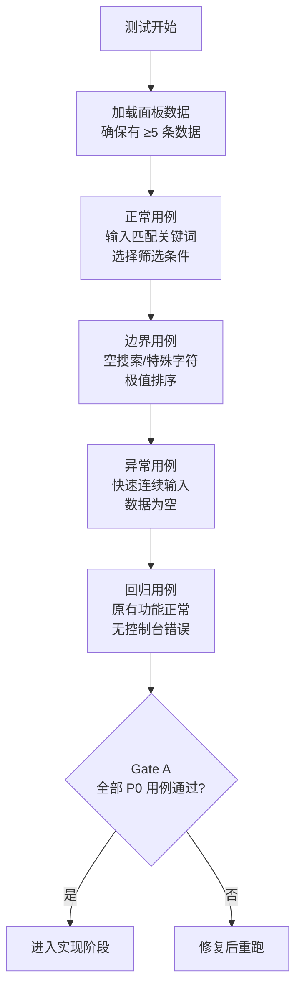

# YiWeb-测试设计

> **基线类型**：解决方案空间 · **版本**：1.0.0 · **生成日期**：2026-05-22

## §0 基线溯源

| 源文档 | 映射章节 | 覆盖 AC# |
|--------|---------|---------|
| YiWeb-故事任务.md §5 AC1–AC3 | §2.1 AICR 文件树搜索 | AC1, AC2 |
| YiWeb-故事任务.md §5 AC4 | §2.2 AICR 会话列表 | AC3, AC4 |
| YiWeb-故事任务.md §5 AC5–AC6 | §2.3 Claude 面板 | AC5, AC6 |
| YiWeb-故事任务.md §5 AC7–AC9 | §2.4 故事面板 | AC7, AC8, AC9 |
| YiWeb-故事任务.md §5 AC10–AC11 | §2.5 通用交互 | AC10, AC11 |
| YiWeb-使用场景.md 场景 1–5 | §2 全部 | 全部 AC# |

---

## §1 测试范围

| 范围 | 说明 |
|------|------|
| 测试对象 | AICR / Claude / Story 三个面板的搜索、筛选、排序功能 |
| 测试类型 | 手动功能测试（当前无自动化测试框架） |
| 测试环境 | 浏览器（Chrome/Firefox/Edge 最新版），local & prod 配置 |
| 不测试 | 后端 API 搜索性能、跨浏览器兼容性细节 |

---

## §1.1 效果示意

---

## §2 测试用例

### §2.1 AICR 文件树搜索 (AC1, AC2)

#### 正常用例

| ID | Given | When | Then | 类型 |
|----|-------|------|------|------|
| AICR-S01 | 文件树已加载，含 50+ 文件 | 搜索框输入"config" | 文件树仅显示名称/路径含"config"的文件及父目录 | 正常 |
| AICR-S02 | 文件树搜索结果为 3 个文件 | 检查渲染结果 | 匹配文本以黄色背景高亮显示 | 正常 |
| AICR-S03 | 搜索框有内容 | 点击清除(X)按钮 | 搜索框清空，文件树恢复完整，高亮移除 | 正常 |
| AICR-S04 | 搜索框有内容 | 按 Escape 键 | 同 S03，搜索框聚焦 | 正常 |
| AICR-S05 | 文件树已加载，标签区可见 | 点击标签A | 标签A高亮，文件树仅显示含标签A的文件 | 正常 |
| AICR-S06 | 标签A已选中 | 点击标签B | 标签B也高亮，文件树显示含标签A或B的文件（OR） | 正常 |
| AICR-S07 | 标签A已选中 | 再次点击标签A | 标签A取消选中，文件树恢复 | 正常 |
| AICR-S08 | 有标签选中 | 点击"没有标签"按钮 | 筛选无标签文件 | 正常 |
| AICR-S09 | 搜索+标签同时应用 | 检查结果 | 两种条件取交集（AND） | 正常 |

#### 边界用例

| ID | Given | When | Then | 类型 |
|----|-------|------|------|------|
| AICR-E01 | 搜索框为空 | 文件树正常渲染 | 显示全部文件，无高亮 | 边界 |
| AICR-E02 | 搜索框输入单个字符 | 300ms 防抖后 | 过滤仅匹配该字符的文件 | 边界 |
| AICR-E03 | 搜索框输入特殊字符 `.*+?^$` | 过滤 | 按字面量匹配，不报错 | 边界 |
| AICR-E04 | 搜索框输入后快速删除 | 防抖正确取消 | 最终显示与当前输入一致 | 边界 |
| AICR-E05 | 所有标签取消选中 | 筛选清除 | 显示全部文件 | 边界 |

#### 异常用例

| ID | Given | When | Then | 类型 |
|----|-------|------|------|------|
| AICR-ERR01 | 文件树数据为空 | 搜索框输入关键词 | 不报错，显示空状态 | 异常 |
| AICR-ERR02 | 快速连续输入 10 次 | 每次输入触发防抖 | 仅最后一次生效，无闪烁 | 异常 |
| AICR-ERR03 | 标签拖拽排序中点击 | 拖拽事件优先 | 不触发标签选中切换 | 异常 |
| AICR-ERR04 | localStorage 标签排序数据损坏 | 加载时 try-catch | 降级为默认排序，不报错 | 异常 |

---

### §2.2 AICR 会话列表 (AC3, AC4)

#### 正常用例

| ID | Given | When | Then | 类型 |
|----|-------|------|------|------|
| AICR-SL01 | 会话列表已加载 | 搜索框输入关键词 | 列表按标题/描述过滤，300ms 防抖 | 正常 |
| AICR-SL02 | 会话列表有 20+ 条 | 点击排序按钮切换"按名称" | 列表按名称字母序排列，指示器更新 | 正常 |
| AICR-SL03 | 会话列表有 20+ 条 | 点击排序切换"按时间" | 列表按修改时间降序，指示器更新 | 正常 |
| AICR-SL04 | 应用了搜索+排序 | 清除搜索 | 仅保留排序，搜索清空 | 正常 |

#### 边界用例

| ID | Given | When | Then | 类型 |
|----|-------|------|------|------|
| AICR-SL-E01 | 会话列表为空 | 搜索框输入 | 显示空状态，不报错 | 边界 |
| AICR-SL-E02 | 搜索无匹配结果 | 检查 UI | 显示"无匹配会话"空状态+清除按钮 | 边界 |

---

### §2.3 Claude 面板 (AC5, AC6)

#### 正常用例

| ID | Given | When | Then | 类型 |
|----|-------|------|------|------|
| CLD-S01 | 项目列表已加载 | 搜索框输入项目名 | 卡片网格实时过滤 | 正常 |
| CLD-S02 | 项目列表已加载 | 点击"含 CLAUDE.md"筛选 | 仅显示配置了 CLAUDE.md 的项目 | 正常 |
| CLD-S03 | "含 CLAUDE.md"已选中 | 再选"含 settings" | 同时满足两个条件的项目（AND） | 正常 |
| CLD-S04 | 项目列表已加载 | 切换排序为"按 skills 数" | 项目卡片按 skills 数量降序排列 | 正常 |
| CLD-S05 | 有筛选条件 | 点击清除按钮 | 所有筛选+搜索清空，排序恢复默认 | 正常 |

#### 边界用例

| ID | Given | When | Then | 类型 |
|----|-------|------|------|------|
| CLD-E01 | 项目列表为空 | 尝试所有筛选操作 | 不报错，显示空列表 | 边界 |
| CLD-E02 | 所有健康状态都未选中 | 等同无筛选 | 显示全部项目 | 边界 |

---

### §2.4 故事面板 (AC7, AC8, AC9)

#### 正常用例

| ID | Given | When | Then | 类型 |
|----|-------|------|------|------|
| STY-S01 | 故事列表已加载 | 点击状态筛选"编码进行中" | 三个视图均仅显示该状态故事 | 正常 |
| STY-S02 | 故事列表已加载 | 点击类型筛选"前端" | 仅显示前端类型故事 | 正常 |
| STY-S03 | 状态+类型+搜索同时应用 | 检查结果 | 三重 AND 交集 | 正常 |
| STY-S04 | 列表视图 | 点击"名称"列头 | 按名称升序，列头显示↑，再点切换↓ | 正常 |
| STY-S05 | 列表视图 | 点击"修改时间"列头 | 按时间降序，列头显示↓ | 正常 |
| STY-S06 | 看板视图 | 应用状态筛选 | 仅显示对应状态列（或高亮该列） | 正常 |

#### 边界用例

| ID | Given | When | Then | 类型 |
|----|-------|------|------|------|
| STY-E01 | 故事列表为空 | 应用筛选 | 显示空状态，不报错 | 边界 |
| STY-E02 | 切换视图（看板→卡片→列表） | 筛选条件保持 | 新视图仍应用相同筛选 | 边界 |

---

### §2.5 通用交互 (AC10, AC11)

#### 正常用例

| ID | Given | When | Then | 类型 |
|----|-------|------|------|------|
| GEN-S01 | 任一筛选激活 | 点击清除按钮 | 所有筛选重置，恢复默认 | 正常 |
| GEN-S02 | 任一筛选激活 | 按 Escape | 搜索框清空，标签筛选保留（仅清除搜索） | 正常 |
| GEN-S03 | 筛选结果为空 | 检查空状态组件 | 显示提示文字 + "清除筛选"操作按钮 | 正常 |
| GEN-S04 | 筛选结果为空 | 点击空状态中的"清除筛选" | 所有条件重置，显示全部数据 | 正常 |
| GEN-S05 | 无筛选条件 | 检查清除按钮 | 清除按钮禁用/隐藏 | 正常 |

---

## §3 Gate A 交接信号

| 信号 | 值 | 说明 |
|------|-----|------|
| 测试设计文档 | `YiWeb-测试设计.md` | 本文件 |
| P0 用例 ID 列表 | AICR-S01–S09, AICR-SL01–SL04, CLD-S01–S05, STY-S01–S06, GEN-S01–S05 | 实现前必须全部可执行 |
| 验证命令 | 浏览器打开各面板 → 手动执行用例 | 无自动化测试框架 |
| 阻断条件 | 任一 P0 用例设计覆盖不到对应的 AC# | `skip-gate-a` |

---

> **回溯链**：YiWeb-故事任务.md §5 → YiWeb-使用场景.md §2 → YiWeb-技术评审.md §5
>
> **变更记录**：2026-05-22 — 初始生成 (v1.0.0)
