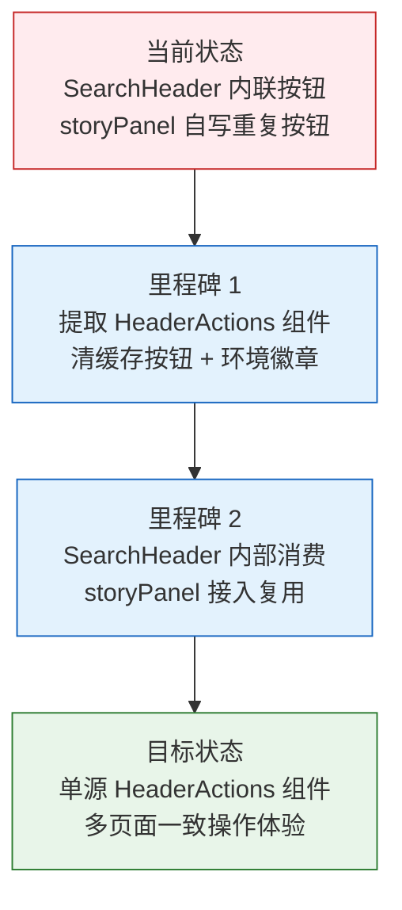
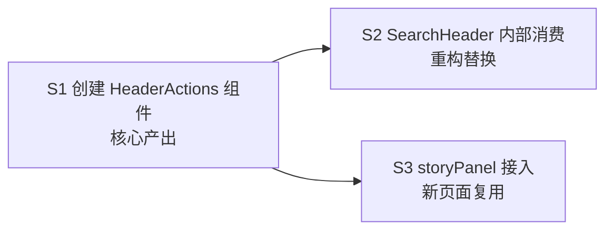

# YiWeb-01-故事任务

> | v1.0 | 2026-05-19 | deepseek-v4-pro | 🌿 feat/header-actions | 📎 [CLAUDE.md](../../../CLAUDE.md) |

> **导航**: [02-用户使用场景 →](./YiWeb-02-用户使用场景.md) | [04-前端技术评审 →](./YiWeb-04-前端技术评审.md)

> **来源引用**: 由用户需求 `将aicr页面的header-actions做成组件，可供多个页面公用` 驱动生成。证据等级 A（源码级实现）。

### 主要价值

- 🧩 复用 — 从 SearchHeader 提取通用 header action 按钮为独立组件，多页面零重复使用
- 🏷️ 环境标识 — 内置 LOCAL / PROD 环境徽章，自动检测运行环境
- 🔄 清缓存刷新 — 统一的「清缓存并刷新」按钮，行为和样式跨页面一致
- 🎛️ 插槽扩展 — 默认插槽允许各页面注入自定义操作按钮，不破坏组件封闭性

---

## §0 基线声明

> **问题空间基线 (Problem Space Baseline)**: 本文档是 `YiWeb` 项目的**第一基线文档**，与 02-用户使用场景 构成双基线。本文档定义 HeaderActions 组件提取的"做什么(WHAT)"和"为什么(WHY)"。

| 约束 | 规则 |
|------|------|
| 语言边界 | 仅使用业务语言与用户语言。**禁止**包含：代码文件路径、API 路由、组件名称、数据库表名、技术栈选型、框架名称 |
| 下游可追溯 | 04 和 05 必须引用本文档的 §1 Story# 或 §2 FP# 或 §3 SC# 或 §5 AC# |
| 版本优先 | 需求变更时本文档先于所有其他文档更新 |
| 评审门禁 | 文档审查时检查禁止内容：含代码路径/API路由/组件名/技术栈名 = P0 阻断 |

---

### 需求概述

YiWeb 的 aicr 页面和故事任务面板页面各自实现了相似的页面头部操作区：包含「清缓存并刷新」按钮和环境标识徽章。这些按钮的渲染、样式、环境检测逻辑在 SearchHeader 组件内重复维护，新增页面需要拷贝代码。本次将页面头部的操作按钮区域提取为独立可复用组件 HeaderActions，统一提供清缓存刷新按钮和环境徽章，并通过插槽支持各页面注入定制操作按钮。

### 效果示意

---

## §1 故事拆分

| ID | 故事 | 范围 | 优先级 |
|----|------|------|:------:|
| S1 | 创建 HeaderActions 组件 | 新组件：清缓存按钮 + 环境徽章 + 默认插槽 | P0 |
| S2 | SearchHeader 内部消费 HeaderActions | 重构 SearchHeader 使用新组件替代内联按钮 | P0 |
| S3 | storyPanel 接入 HeaderActions | storyPanelPage 使用新组件替代自制按钮 | P0 |

### S1 — 创建 HeaderActions 组件

**目标**: 从 SearchHeader 提取通用操作按钮为独立组件，包含环境检测逻辑、清缓存刷新按钮、环境徽章，并通过默认插槽允许注入自定义按钮。

**成功判定**: 组件可被任意页面独立引用，清缓存按钮和环境徽章开箱即用，无需页面自行实现。

### S2 — SearchHeader 内部消费 HeaderActions

**目标**: 重构 SearchHeader，用 HeaderActions 组件替代内联的操作按钮 HTML 结构，移除已迁移的环境检测和清缓存逻辑，保持对外事件接口不变。

**成功判定**: aicr 页面头部操作按钮的展示和行为与重构前完全一致，SearchHeader 代码行数减少。

### S3 — storyPanel 接入 HeaderActions

**目标**: storyPanelPage 使用 HeaderActions 组件替代自制的操作按钮区域，移除冗余 CSS，统一操作体验。

**成功判定**: 故事任务面板头部操作按钮（搜索、视图切换、清缓存刷新、环境徽章）与 aicr 页面风格一致。

---

## §2 功能点

| ID | 功能点 | 关联故事 | 优先级 |
|----|--------|:--------:|:------:|
| FP1 | 清缓存刷新按钮：点击触发 clear-cache 事件，按钮含 hover 提示和 tooltip | S1 | P0 |
| FP2 | 环境徽章：自动检测 local/prod 环境并以绿/橙色徽章展示 | S1 | P0 |
| FP3 | 默认插槽：允许父组件注入任意操作按钮，排在清缓存按钮之前 | S1 | P0 |
| FP4 | 显示控制：showClearCache 和 showEnvBadge 属性独立控制按钮显隐 | S1 | P1 |
| FP5 | SearchHeader 集成：auth/侧边栏切换按钮通过插槽注入，清缓存事件冒泡 | S2 | P0 |
| FP6 | storyPanel 集成：搜索框和视图切换按钮通过插槽注入，复用清缓存逻辑 | S3 | P0 |

---

## §3 成功标准

| ID | 标准 | 衡量方式 |
|----|------|---------|
| SC1 | aicr 页面头部操作按钮外观和行为与重构前无差异 | 肉眼对比重构前后截图 + 逐按钮点击验证 |
| SC2 | 故事任务面板头部操作区与 aicr 风格一致（清缓存按钮、环境徽章） | 肉眼对比两个页面的操作按钮区 |
| SC3 | 新页面接入 HeaderActions 只需 3 行模板代码 | 编写示例页面验证 |
| SC4 | 环境徽章在 localhost 显示 LOCAL，其他显示 PROD | 切换环境访问验证 |
| SC5 | 清缓存点击事件正确冒泡到父组件处理 | 点击按钮验证弹出确认弹窗 |

---

## §4 范围边界

| 维度 | 包含 | 不包含 |
|------|------|--------|
| 组件范围 | 清缓存刷新按钮、环境徽章、默认插槽 | 搜索框、导航按钮、标签过滤（这些属于页面特定功能） |
| 消费者 | SearchHeader (aicr)、storyPanelPage | 其他尚未接入的页面 |
| 环境检测 | URL hostname + localStorage + URLSearchParams 三级检测 | remote/develop 等非 prod/local 的环境名 |
| 样式范围 | 按钮样式、徽章样式、hover/tooltip 动效 | SearchHeader 整体的 grid 布局样式 |

---

## §5 验收标准

| ID | 验收标准 | 关联 SC |
|----|---------|:------:|
| AC1 | HeaderActions 组件渲染清缓存按钮和环境徽章，二者可独立显隐 | SC3 |
| AC2 | 默认插槽内容显示在清缓存按钮左侧 | SC3 |
| AC3 | SearchHeader 模板使用 `<header-actions>` 替代原 `
` | SC1 |
| AC4 | SearchHeader JS 中不包含 detectEnvironment 函数和 clearCache 方法 | SC1 |
| AC5 | storyPanelPage 模板使用 `<header-actions>` 替代 `
` | SC2 |
| AC6 | storyPanelPage CSS 中不含 `.sp-header-right` 和 `.sp-clear-cache-btn` 规则 | SC2 |
| AC7 | 点击清缓存按钮触发完整的清缓存 → 确认弹窗 → 硬刷新流程 | SC5 |
| AC8 | 环境徽章在 localhost 显示橙色 LOCAL，其他域名显示绿色 PROD | SC4 |

---

## §6 风险与缓解

| 风险 | 影响 | 概率 | 缓解措施 |
|------|------|:----:|---------|
| SearchHeader 模板 $emit 冒泡不可用 | 中 | 低 | Vue 3 模板中 $emit 在 setup() 组件中可用，已验证 |
| HeaderActions 组件加载时序问题 | 高 | 中 | 组件模块在 SearchHeader 之前注册，waitForComponents 机制保证就绪 |
| 样式冲突（HeaderActions CSS 与 SearchHeader CSS 重复） | 低 | 低 | 两者定义相同选择器规则，层叠顺序下后者覆盖前者，不影响渲染 |
| 其他项目引用 SearchHeader 但未注册 HeaderActions | 高 | 低 | SearchHeader 内部依赖 HeaderActions，使用者必须在 componentModules 中注册 |

---

## §7 依赖与顺序

S1 必须先完成，S2 和 S3 可并行，均依赖 S1 的组件产物。
